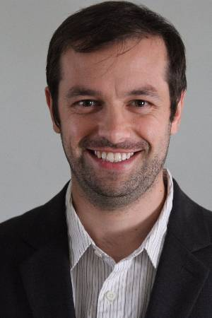

### Biosketch

  

  

Gheorghi Guzun has been a faculty member in the Department of <a href="https://sjsu.edu/cmpe">Computer Engineering at San Jose State University</a> since 2017. 

  

Gheorghi obtained his Ph.D. in Electrical and Computer Engineering from University of Iowa being guided and supervised by <a href="https://engineering.uiowa.edu/people/guadalupe-canahuate">Guadalupe Canahuate</a>. His Ph.D. work was in the area of data mining and large-scale distributed data systems, with a focus on indexing technologies for fast query processing.  
His current research interests are at the intersection of data management and machine learning, and include topics such as, algorithm optimization for machine learning, energy efficiency in data intensive applications, data compression and quantization, large-scale indexing, data analysis and exploration. Many of the research projects are focused on scalability and performance of large data management systems, with a special interest in hardware-driven software design for data analytics, machine learning, and distributed systems. Our work has addressed critical applications such as improving compute infrastructure monitoring systems, energy efficient data centers, and fast modeling of possible flood events to improve intervention response times. Dr. Guzun is a recipient of the <a href="https://www.nsf.gov/awardsearch/showAward?AWD_ID=2238291">CAREER</a> award from the National Science Foundation. 
  
  

  

  

    
  

Here's a link to his [curriculum vitae](CV.pdf).

<!--### Recent Activities
- (10/2023) Our paper, "Workload-Aware Cache Management of Bitmap Indices" has been accepted for publication at BDCAT 2023. Congratulations to my student co-author Julia Kaeppel!
- (8/2023) Appointed to serve on the Total Compensation and Benefits Project, University of Puget Sound.
- (7/2023) Serving on the PC for [BDCAT 2023](https://bdcat-conference.org/).
- (4/2023) Congrats to Julia Kaeppel on receiving a McCormick Student Research Award.
- (2/2023) Appointed to serve as the inaugural Advisor to Student of Color Residential Community (SCRC), University of Puget Sound.
- (1/2023) Featured in the ["Five Questions Series"](https://www.pugetsound.edu/stories/five-questions-university-puget-sound-professor-computer-science-david-chiu) in [Arches](https://www.pugetsound.edu/arches-magazine) magazine.
- (8/2022) Received an NSF grant to provide travel scholarships to students attending IEEE/ACM UCC 2022 and BDCAT 2022 conferences. I am also chairing the student travel awards committee.
- (8/2022) Received the President's Award for Excellence in Teaching.
- (5/2022) Co-chairing the Poster Program at IEEE/ACM [UCC 2022](https://ucc-conference.org/) and [BDCAT 2022](https://bdcat-conference.org/), both to be held in Portland, Oregon in December.
- (4/2022) Promoted to Full Professor, effective July 2022.
- (4/2022) Serving as a PC member for IDEAS 2022.
- (8/2021) Faculty Panelist (with Monica DeHart and Melvin Rouse) for the "I Am Puget Sound" student orientation program.
- (7/2021) Chairing the Demo/Short Paper Session at SSDBM 2021, and I'm also giving a talk, "Caching Support for Range Query Processing on Bitmap Indices."
- (5/2021) Our paper on bitmap caching has been accepted to SSDBM 2021 as a long paper. Congrats to Sarah McClain (BS'20), Manya Mutschler-Aldine (BS'21), and Colin Monaghan (BS'22).
- (6/2020) Elevation to IEEE Senior Member grade.
- (4/2020) Congrats to Colin Monaghan on receiving a summer research grant to study replacement policies in bitmap index caching.
- (2/2020) Our paper on optimizing GPU processing of bitmaps has been accepted for publication at DASFAA 2020.
- (10/2019) Our paper on GPU processing of bitmap-range queries has been accepted for publication at BDCAT 2019. It was nominated for the Best Paper award.
- (4/2019) Our paper on geo-diversification has been accepted for publication at IEEE CLOUD 2019 in Milan, Italy. Congrats to Jared Polonitza on his first publication.
- (4/2019) Congrats to Sarah McClain on receiving a summer research grant to work on semantic caching of bitmap indices.
- (3/2019) Serving on the PC for HiPC'19. Please consider submitting a paper.
- (10/2018) Our paper on distributed bitmap indexing has been accepted for publication at BDCAT'18. It was nominated for the Best Paper award. -->

### Quick Links

- Leave the CS department [some feedback](https://forms.gle/Ltassc7BQkNfnnXB7).
