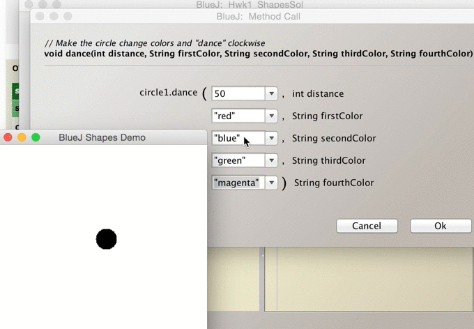

## CS 161 - Intro to Computer Science

### Hwk: A Better Circle

This first assignment will give you a chance to explore the shape classes in more detail, and gain additional experience with BlueJ. It requires modifying and extending Java source code, but all of the exercises below can be solved by copying and pasting from the original, running code — you don't need to know how to create any new lines of code from scratch yet.

#### Student Outcomes

- To practice writing methods and constructors.

#### Required Files

The following file(s) have been provided for this assignment.

- [Hwk1_BetterCircle.zip](Hwk1_BetterCircle.zip)

#### Instructions

Start by downloading a fresh copy of the starter file from the above link. The contents of the file are the same as the ones you worked on in Lab 1. Extract `Hwk1_BetterCircle.zip`, and open the project in BlueJ, and double-click the Circle class (orange box icon) to open the source code editor.

- First, it's slightly irritating that when you create new Circles, they're not automatically shown on the canvas. Modify the code so that Circles are visible (on the screen) when they're created. That is, you have to change their initial state when they are created. This isn't as easy as simply assigning `true` to the `this.isVisible` field. Is there a method you can call (use) instead that will make the Circle appear on the canvas as well as setting `this.isVisible` to `true`? Also ensure that new circles are yellow instead of blue. Make sure you test our your code before moving on!

- Modify the `moveUp()`, `moveDown()`, `moveLeft()`, and `moveRight()` methods so that they each move the Circle 30 pixels instead of 20. Make sure you test them afterwards so you know they're working!

- Add a new method called `public void moveNorthEast()` to the Circle class. It requires to input parameters, and when called, it should move the circle up by a distance of 30 units and then to the right by a distance of 30 units. Then add a block comment to the code describing your new method. Can you write this method by calling a couple of the methods you just modified?

- Add a new method called `public void shuffleHorizontal(int distance)`. When called, this method causes the circle to do a slow movement to the right by the distance that was given, then back to the left, leaving the circle exactly where it started. (That's assuming the input is positive — if the input is negative, the circle will shuffle left, then right.) Add another block comment describing your new method. If your method is more than a couple of lines, you're going down the wrong track. Again, you do not need to copy-and-paste anything from within the `slowMoveHorizontal` algorithm to write this method. (You should simply re-use, or _call_, `slowMoveHorizontal` to help you do what you want).

- Add a method called `public void shuffleVertical(int distance)`. The method, like `shuffleHorizontal`, will cause the Circle to do a slow movement to the north, and then back to its original position.

- Add a method called `public void dance()` that inputs an integer named `distance` followed by four String arguments: `firstColor`, `secondColor`, `thirdColor`, and `fourthColor`. It will first change the color's color to `firstColor`, then shuffle the circle to the right by the given distance. Then it circle's color will change to `secondColor` before shuffling to the south by the given distance, and so on, in clockwise fashion for the remaining two colors. Again, you should simply _call_ methods that's already been written.

  

#### Extending the Homework (Optional)

Doing these will not fetch you any more extra credit, but you will obtain enlightenment (no guarantees).

- Take a the code for the `changeColor()` method, and read the block comment above it to get a gist of the valid colors. What happens if you try to change the color of a shape to a color not listed? What if you capitalized some letters? What do you think is going on?

- Write a new constructor for `Circle` that lets the user decide where circle objects are placed initially.

#### Grading

```
This assignment will be graded out of a total of 30pts.

[2pts] The move methods now move by 30 instead of 20.

[5pts] The moveNortheast() method is implemented.

[5pts] The shuffleHorizontal() method and shuffleVertical() have been implemented.

[5pts] The dance() method and is implemented in Circle.

[5pts] Circles are now yellow and visible when they are created. They are also visible when created.

[5pts] When possible, you reuse methods by calling them where appropriate.

[3pts] You include sufficient block comments to explain any new methods you created.
```

#### Submitting Your Assignment

After you have completed the assignment, use the following to submit your work.
Exit BlueJ

- Open your computer's File Finder (some times called File Explorer). Locate the project folder.

- Right-click on the project folder, then:

  - If using Windows, select Send to then Zip file
  - If using MacOS, select Compress ... items
  - This step takes your selected creates a .zip file that you will submit to me.

  It's really important you got this right. If you have doubts, ask one of us to check for you! I recommend that you double-check by opening the zip file, and investigating the contents to ensure that all the files are in there.

- Navigate to our course page on Canvas and click on the assignment to which you are submitting.

- Click on Submit Assignment, and you should be able to "browse" for your file

- Select the `.zip` you just created, and click Submit Assignment again to upload it.

- You may submit as often as you'd like before the deadline. I will grade the most recent copy.

#### Credits

Adapted for use from a previous assignment by Brad Richards. Shape classes provided by BlueJ.
