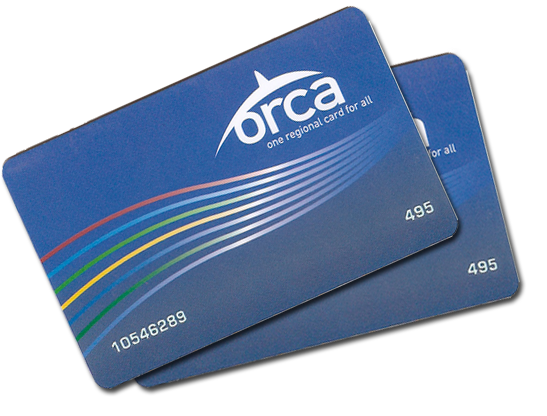

## CS 161 - Intro to Computer Science

### Homework: Orca Card

This week you'll build a class that simulates an ORCA Card, which is used to pay for
bus, train, and ferry trips in Pierce and King counties. When using the real card,
you add funds to it and can then swipe the card to charge rides on the various
services. In addition to keeping track of the balance and paying for rides, "our"
ORCA card will also keep track of things like the number of trips that have been
taken and the amount of tax that has been collected. This assignment will give
you some additional practice with fields, methods, constructors, conditionals,
and output.



#### Student Outcomes

- Practice writing classes from scratch.
- Understanding and putting the concept of defensive programming into practice.
- More if-then-else statements.

#### Instructions

For full credit, your class should contain all of the methods described below. They should have exactly the same name as shown, take the correct arguments, and return the correct information. (I will run a program that creates instances of your class and tests them, and if your names or other details differ, my testing code won't compile.) The assignment is less specific about the instance variables (fields) you'll need — you'll have to figure out what you need to store in order to implement the methods below.

- Start by creating a new BlueJ project, called `Hwk3_OrcaCard`. Inside, create a new class called `OrcaCard`.

- Your class needs to be able to keep track of how much money is currently stored on the card.

- Implement and document the following constructors or methods. Remember to write-a-little and test (repeat)!

- You need to implement two constructors:

  - A default constructor should set the sales tax rate to 6.5% (input as a double: 0.065). Set all other counters (keep reading) to zero.

  - A second constructor should take a single argument as input (the sales tax rate). Your code should ensure that a valid rate was entered (i.e., can't be negative). If a rate is detected as being invalid, you should default the rate to 6.5%.

  - Know this: This thinking-ahead, anticipating possible errors, then writing code to prevent them, is called **Defensive Programming**. This is an extremely important programming practice, as it could prevent bugs and security vulnerabilities in your code.

- A method called `topUp()` that takes a single argument (the amount to add to the current balance) and adjusts the balance but doesn't return anything. You are reminded to program defensively...

- We'll simulate the process of "swiping" the card via the `buyTrip()` method. It should take a double as a parameter (the cost of the trip), but we're required to pay tax on the cost of the trip as well. Thus, in the body of your method you'll need to calculate how much we owe in tax, and decrease the balance by the cost of the trip plus tax. The `buyTrip()` method should return void. You should also keep a separate running total of the amount of tax collected, so that we can report it to the IRS when necessary.

  For full credit, you should use a conditional in `buyTrip()` that checks whether you can afford the trip. If not, print an error message but don't adjust the balance on the card or the tax collected. If there are sufficient funds for the trip, do the bookkeeping described in the paragraph above and print a success message that includes the remaining balance on the card.

- Report it to the IRS you say? We'll need a `getTax()` method. It doesn't take any arguments, but should return the total amount of tax collected during "swipes" of the card.

- It might be good to keep a record of the costliest trip you've ever taken. Write a method called `getCostliestTrip()` that returns that information.

- We'll also add a `getAverageTripCost()` method. It doesn't need any arguments, but it should return the average cost of the trips paid for by this card. Ignore the tax we pay on the trips when computing the average.

- Let's also alert the user to their level of balance remaining on the card. Write a method `balanceLevel()` that doesn't require arguments, and `returns` a `String` containing the appropriate message (shown below) based on the current balance. Only one message should be returned. Note that a negative balance cannot happen if you programmed `buyTrip()` properly. If you see a negative balance, go back and fix that method!

  | balance                                      | message to print                        |
  | -------------------------------------------- | --------------------------------------- |
  | $0                                           | Your card is empty! Top up immediately! |
  | at or below the average trip cost            | Your balance is low!                    |
  | at or below twice the average trip cost      | Your balance is just enough.            |
  | at or below five times the average trip cost | Your balance is sufficient!             |
  | anything higher                              | Your balance is high!                   |

- Finally, write a `printSummary()` method that prints (does not `return`) information about the ORCA card object. The output should contain: the card's current balance, the number of trips taken, the balance-level message from the method you just wrote previously. It should also print your costliest trip on a separate line.

- You can test out your class in code pad. Except for your version of `printSummary()`, your output should match mine exactly for full credit. Recall that outputs from your program to the terminal are indicated with a `>` sign below.

  ```java
  OrcaCard my_card = new OrcaCard();
  my_card.topUp(20.5);
  my_card.printSummary();
  > $20.5 left after 0 trip(s).
  > Your balance is high!
  > Your costliest trip so far cost $0

  my_card.buyTrip(10.00);
  > Success: Ticket purchased.  $9.85 remaining.

  my_card.getTax()
  > 0.65   (double)

  my_card.buyTrip(5);
  > Success: Ticket purchased.  $4.5249999999999995 remaining.

  my_card.getAverageTripCost()
  > 7.5   (double)

  my_card.getTax()
  > 0.9750000000000001   (double)

  my_card.printSummary();
  > $4.5249999999999995 left after 2 trip(s).

  my_card.buyTrip(4.50);
  > Fail: You cannot afford this trip.

  my_card.topUp(1.00);
  my_card.buyTrip(4.50);
  > Success: Ticket purchased.  $0.7324999999999995 remaining.

  my_card.printSummary();
  > $0.7324999999999995 left after 3 trip(s).
  > Your balance is low!
  > Your costliest trip so far cost $10
  ```

#### Extending the Homework

Looking for additional challenges? Add code to the `buyTrip()` method so that it also prints out a simulated ticket, showing the cost, the amount paid in tax, and the remaining balance on the card. You could add a `cheatIRS()` method that moves the amount you've collected as tax over to the balance of the card. Look into ways to tidy up the dollar amounts so that they always have two digits after the decimal point. In my output, I printed trip(s) so that it sounded ok whether there had been one trip or more. It would look even better if you added some code that looked at the number of trips and either used trip or trips as appropriate.

#### Program Defensively

You can't control how another user or program chooses to use your methods. For each method, think critically about all the things that could go wrong and cause an unintended result (e.g., a runtime error, infinite loop/recursion, etc.). Chances are, I'll be trying all kinds of inputs (negative values, zeroes, nulls, empty-strings, etc.) when I grade your program. The mark of a good programmer is one that can anticipate such scenarios ahead of time and ensure that their program handles all sorts of errors gracefully.

#### Commenting

Each and every method should have a "javadoc-style" comment above it (the ones that use `/* ... */`). For full credit, you should use the @param and @return tags as appropriate in these method comments. Each instance variable (field) should have a brief comment as well. Don't forget the main comment at the top of the class either - I'm looking for more than just a sentence or two.

#### Grading

```
This assignment will be graded out of a total of 70pts.

[5pts] Proper fields have been defined. No more -- no less than what is needed
       by the OrcaCard class.

[5pts] Default constructor generates a default card with a 6.5% sales tax.

[5pts] The overloaded constructor that verifies the input value for the sales tax.

[5pts] The topUp() method must verify that the given amount is non-negative.

[10pts] The buyTrip() method adjusts your balance after purchasing a trip of
        the specified amount. Don't forget to add the tax. It must also verify
        that the trip of the given amount can be purchased, and if not, it should
        output an error message.

[5pts] The getTax() method is properly implemented.

[5pts] The getAverageTripCost() method is properly implemented.

[10pts] The getCostliestTrip() method is properly implemented.

[10pts] The balanceLevel() method returns a single, appropriate message based on
       your card's balance.

[5pts] The printSummary() method is properly implemented.

[5pts] You re-use code whenever possible.

[5pts] You provide Javadocs style comments for any new methods implemented, and
       sufficient inline comments to explain the logic of your methods.
```

#### Submitting Your Assignment

After you have completed the assignment, use the following to submit your work.
Exit BlueJ

- Open your computer's File Finder (some times called File Explorer). Locate the project folder.

- Right-click on the project folder, then:

  - If using Windows, select Send to then Zip file
  - If using MacOS, select Compress ... items
  - This step takes your selected creates a .zip file that you will submit to me.

  It's really important you got this right. If you have doubts, ask one of us to check for you! I recommend that you double-check by opening the zip file, and investigating the contents to ensure that all the files are in there.

- Navigate to our course page on Canvas and click on the assignment to which you are submitting.

- Click on Submit Assignment, and you should be able to "browse" for your file

- Select the `.zip` you just created, and click Submit Assignment again to upload it.

- You may submit as often as you'd like before the deadline. I will grade the most recent copy.

#### Credits

Adapted for use from a previous assignment by Brad Richards. Shape classes provided by BlueJ.
