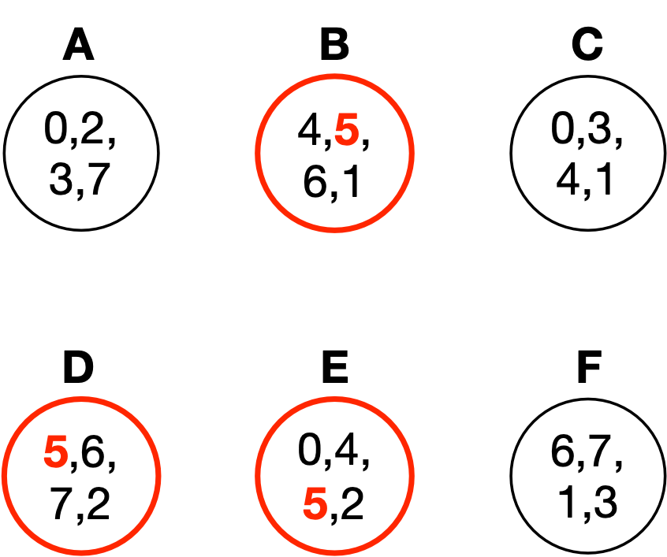
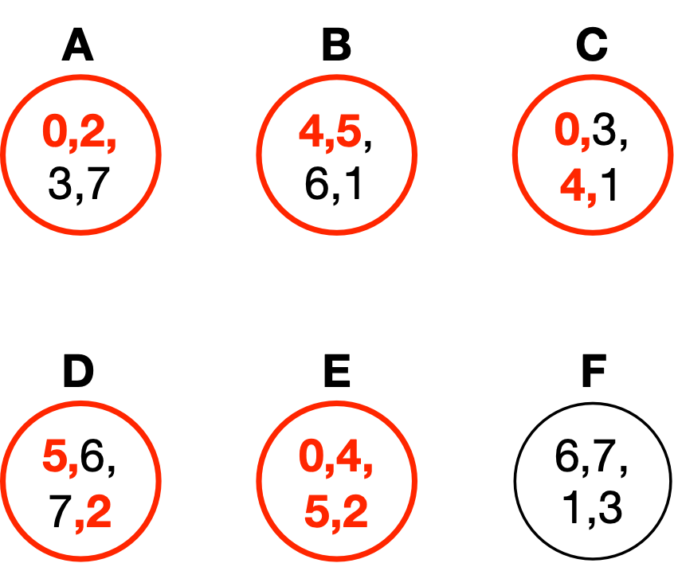

## CS 161 - Intro to Computer Science

### Homework: Pooled Sample Testing

In this assignment you will be writing a program to perform Pooled Sample Testing analysis and dealing with real Covid-19 infection data.

Ready access and frequent testing are keys to curtailing the spread of novel viruses, and it is widely documented that the shortage of testing supplies has diminished our ability to curtail the current COVID-19 pandemic. One longstanding idea to handle testing shortages is through a strategy called Pooled Sample Testing. In this method, samples are grouped into "pools" of equal size. Samples are then mixed with other samples that share the same pool and then tested. By analyzing which pools tested positive, scientists are able to identify those individuals testing positive with a high degree of accuracy. In [a 2020 study](https://advances.sciencemag.org/content/early/2020/08/20/sciadv.abc5961), Israeli scientists were able to reduce the number of COVID-19 tests by a factor of 8!

Here's a super-simplified example of how Pooled Sample Testing might work. Let's say there are eight people (with sample IDs `0`,`1`,`2`,`3`,`4`,`5`,`6`,`7`) to be tested. Here's one way we can group the samples into pools:


Remember, the samples from each pool are blended together and the tests are only administered to each pool. Let's suppose that pools `B`, `D`, and `E` tested positive, as shown below.



We can infer that the person associated with sample `5` must be positive, since it is the only sample that exists in pools `B`, `D`, and `E`. Moreover, sample `5` is not included in any other pool that tested negative. This is great news, because it only required 6 tests to be run on 8 samples! One can see that, with enough samples, pools, and a good pool assignment strategy, we stand to save a large amount of tests needing to be administered.

**Aside:** Suppose we know that samples 0 and 5 are infected. Would this testing strategy still work? Let's see... A positive test for `0` and `5` would cause pools
`A`, `B`, `C`, `D`, and `E` to light up:



Uh oh, now the results are ambiguous. Samples `0` and `5` would indeed still be identified as being positive, but _so_ will samples `2` and `4`! This shows that Pooled Testing is susceptible to false positives when the infection rate is high and the number of pools is smaller than the number of samples. **I'll make sure that you don't have to deal with false positives for this assignment, but as good scientists, you should at least know that there are limitations to the Pooled Testing strategy.**

#### Student Outcomes

- Dealing with input files using a Scanner object.
- Dealing with user input using a Scanner object.
- Practice with ArrayLists
- Practice with HashMaps
- Exposure to real data analysis

#### Getting to Know the Data

Download the [PooledTesting Project](Hwk7_PooledTesting.zip) and open it in BlueJ. It contains the `PooledSampleTester` class, and a starting point for the other two classes you'll have to implement. The project folder also includes two data files you can use to test your code: `pooling_example.txt` and `pooling384_48_by_pool.txt`. The `pooling_example.txt` contains pool-sample assignments for the example given in this project's narrative. Here's what that file looks like:

```
pool    sample
A       0
A       2
A       3
A       7
B       4
B       5
B       6
B       1
C       0
C       3
C       4
C       1
D       5
D       6
D       7
D       2
E       0
E       4
E       5
E       2
F       6
F       7
F       1
F       3
```

You should use this example for testing as you write your program.

The second file is `pooling384_48_by_pool.txt`. This file has the same format, but the data is real, and was provided by the authors of this [2020 Scientific Advances paper](https://advances.sciencemag.org/content/early/2020/08/20/sciadv.abc5961). The data contains 384 COVID-19 samples split into 48 pools. Each pool is assigned 48 samples, and each sample is assigned to 6 pools.

#### Writing the Pool Class

- The first class you will write is `Pool`. A pool consists of a list of samples that have been blended together. Samples are represented with just integers in this project. Write the following:

  - There are two fields: A label or name to identify the pool (like `"A"`, `"B"`, `"C"`, ...) and an ArrayList of integers representing the pool's samples.

  - Constructor: Its only constructor takes a pool label as input. It instantiates the ArrayList field, and assigns the input ID.

  - `getSamples()` -- This method returns the list of samples.

  - `getPoolLabel()` -- This method returns the pool label.

  - `addSample(int s)` -- This method takes as input a sample number, and adds it to the list. Be careful not to add duplicates!

  - `containsSample(int s)` -- This method checks if the given sample number is contained in the current pool list. If so, return `true`.

  - `toString()` -- This method returns a String formatted as: `"P(s1, s2, ...)"`, where `P` is the pool label, and `s1` is the first sample in the pool, `s2` is the second sample in the pool, and so on.

  Make sure you test this class before moving on.

#### Writing the Detection Class

This class does most of the heavy lifting.

- Fields: You will need a HashMap that maps pool labels (which are `String`s) to `Pool` objects.

- A constructor that takes a `String` (the name of the pool-assignment file) as an argument. The constructor must build the set of Pools, and it stores them in the HashMap field. The constructor opens the file and ignores the first line, which just contains the column names. Each line in the file has this format: a pool label, followed by a "tab," followed by a sample that is assigned to that pool.

  You need to split each line by a tab (`"\\t"`) and convert the sample ID into an int, leaving the pool label as a String. Next, you must check the HashMap to see if the pool label already exists. If it does, then add the sample to the associated Pool. If it doesn't, then you need to first create a new entry in the HashMap (keyed on pool label, mapping to a new, empty `Pool`). Once this process is done, your HashMap might look something like:

  | Key (String) | Value (Pool)                               |
  | ------------ | ------------------------------------------ |
  | `"A"`        | Pool object containing samples `{0, 2, 3}` |
  | `"B"`        | Pool object containing samples `{4, 5, 6}` |
  | `"C"`        | etc.                                       |
  | ...          | etc.                                       |

- `toString()` -- This method returns a String containing all Pools (with each Pool on a separate line). You will need to use a for-each loop to iterate through the Pool objects in the HashMap, and append together each Pool object's string representation. The String you return should have one Pool per line, to look something like this:

  ```java
  Detection d = new Detection("pooling_example.txt");
  System.out.println(d.toString());
  > A(0, 2, 3, 7)
  > B(4, 5, 6, 1)
  > C(0, 3, 4, 1)
  > D(5, 6, 7, 2)
  > E(0, 4, 5, 2)
  > F(6, 7, 1, 3)
  ```

- getPoolsBySample(int sample) -- Since the HashMap only associates pools to its set of samples, we don't have an easy way of determining all the pools that a sample belongs to. (That is, a reverse lookup). Let's make one! Loop through your HashMap and keep track of all Pool objects that contain the given sample. You will need to use a for-each loop to iterate the HashMap. This method should return an ArrayList of Pools.

- `checkPoolIntegrity()` ensures that all Pools in the HashMap have equal size. Return true if that is the case, and false otherwise. You will need to use a for-each loop to iterate the HashMap.

- `detect(ArrayList<String> positivePoolLabels)` takes as input a list of labels belonging to Pools that have tested positive. It is up to this method to determine which samples are positive. Here's what you need to do. Loop through all your samples (not Pools!). For each one, you need to determine all the Pools to which it is assigned. Then check if all those Pools are in the input list. If so, then the current sample must be positive! Store it in an ArrayList. Return an ArrayList containing the positive samples.

To test this class, I would construct a Detection object to open the pooling_example.txt file, and running various methods on it. Here are some codepad examples:

```java
import java.util.ArrayList;
Detection d = new Detection("pooling_example.txt");
System.out.println(d.checkPoolIntegrity());
> true

System.out.println(d.getPoolsBySample(0));
> [A(0, 2, 3, 7), C(0, 3, 4, 1), E(0, 4, 5, 2)]

System.out.println(d.getPoolsBySample(5));
> [B(4, 5, 6, 1), D(5, 6, 7, 2), E(0, 4, 5, 2)]

System.out.println(d.getPoolsBySample(100));
> []

ArrayList<String> positivePools= new ArrayList<>();
positivePools.add("B");
positivePools.add("D");
positivePools.add("E");
System.out.println(d.detect(positivePools));
> [5]

positivePools.add("A");
System.out.println(d.detect(positivePools));
> [2, 5]

positivePools.add("C");
System.out.println(d.detect(positivePools));
> [0, 2, 4, 5]
```

#### Integrating the main() method

If everything is implemented, PooledSampleTester should now compile. Okay, let's run some tests on real COVID-19 data. Run its `main()` method. Remember that each pool is assigned 48 samples in the COVID-19 data, and each sample is assigned to 6 pools. Let's suppose Sample 2 (which is assigned to pools `B`, `J`, `R`, `Z`, `AH`, `AP`) is positive for COVID-19. Let's see if our tool can detect that!

```
Opening pooling384_48_by_pool.txt...
Testing pool integrity...Passed!
Enter the ID of a pool testing positive (or 'stop'): B
Enter the ID of a pool testing positive (or 'stop'): J
Enter the ID of a pool testing positive (or 'stop'): R
Enter the ID of a pool testing positive (or 'stop'): Z
Enter the ID of a pool testing positive (or 'stop'): AH
Enter the ID of a pool testing positive (or 'stop'): AP
Enter the ID of a pool testing positive (or 'stop'): stop
Sample 2 tested positive.
```

Here's samples 1 and 2 testing positive.

```
Opening pooling384_48_by_pool.txt...
Testing pool integrity...Passed!
Enter the ID of a pool testing positive (or 'stop'): A
Enter the ID of a pool testing positive (or 'stop'): I
Enter the ID of a pool testing positive (or 'stop'): Q
Enter the ID of a pool testing positive (or 'stop'): Y
Enter the ID of a pool testing positive (or 'stop'): AG
Enter the ID of a pool testing positive (or 'stop'): AO
Enter the ID of a pool testing positive (or 'stop'): B
Enter the ID of a pool testing positive (or 'stop'): J
Enter the ID of a pool testing positive (or 'stop'): R
Enter the ID of a pool testing positive (or 'stop'): Z
Enter the ID of a pool testing positive (or 'stop'): AH
Enter the ID of a pool testing positive (or 'stop'): AP
Enter the ID of a pool testing positive (or 'stop'): stop
Sample 1 tested positive.
Sample 2 tested positive.
```

Make sure you should test other scenarios besides these.

#### Food for Thought

- Can you explain to a child how Pooled Sample Testing actually reduces the number of tests needed to test 100 people? (You still need 100 swabs to get samples, but it's testing those swabs that we're saving)

- The magic behind Pooled Testing has to do with how the pools were assigned in the first place. They were given to you in the files, but their assignments aren't arbitrary! It turns out that the pooling assignment is nontrivial, and is related to [Kirkman's Problem](https://cs.lmu.edu/~ray/notes/kirkman/). Check out that link if you're interested!

- Given a set of pools (and their assigned samples), can you express a way to predict the false positive rate?

#### Program Defensively

You can't control how another user or program chooses to use your methods. For each method, think critically about all the things that could go wrong and cause an unintended result (e.g., a runtime error, infinite loop/recursion, etc.). Chances are, I'll be trying all kinds of inputs (negative values, zeroes, nulls, empty-strings, etc.) when I grade your program. The mark of a good programmer is one that can anticipate such scenarios ahead of time and ensure that their program handles all sorts of errors gracefully.

#### Commenting

Each and every method should have a "javadoc-style" comment above it (the ones that use `/* ... */`). For full credit, you should use the @param and @return tags as appropriate in these method comments. Each instance variable (field) should have a brief comment as well. Don't forget the main comment at the top of the class either - I'm looking for more than just a sentence or two.

#### Grading

```
This assignment will be graded out of a total of 100pts.

[5pts]  Appropriate fields have been declared.
[10pts] All elements of the Pool class has been properly
        implemented.

Detection class
[10pts] The constructor reads the contents of the given file
        into a HashMap of Strings to Pools.

[5pts]  toString() returns a string containing all pools in
        the HashMap (one per line)

[20pts] getPoolsBySample(int sample) returns an ArrayList of
        Pools that contains the given sample

[10pts] checkPoolIntegrity() ensures all pools have equal size.

[20pts] detect(ArrayList<String> positivePoolLabels) a list of
        samples testing positive

Misc
[5pts] You re-use code whenever possible.

[5pts] You program defensively and check for edge cases.

[5pts] You provide Javadocs style comments for any new methods
       implemented.

[5pts] You include sufficient inline comments to explain the
       logic of your methods.
```

#### Submitting Your Assignment

After you have completed the assignment, use the following to submit your work.
Exit BlueJ

- Open your computer's File Finder (some times called File Explorer). Locate the project folder.

- Right-click on the project folder, then:

  - If using Windows, select Send to then Zip file
  - If using MacOS, select Compress ... items
  - This step takes your selected creates a .zip file that you will submit to me.

  It's really important you got this right. If you have doubts, ask one of us to check for you! I recommend that you double-check by opening the zip file, and investigating the contents to ensure that all the files are in there.

- Navigate to our course page on Canvas and click on the assignment to which you are submitting.

- Click on Submit Assignment, and you should be able to "browse" for your file

- Select the `.zip` you just created, and click Submit Assignment again to upload it.

- You may submit as often as you'd like before the deadline. I will grade the most recent copy.

#### Credits

Written by David Chiu.
