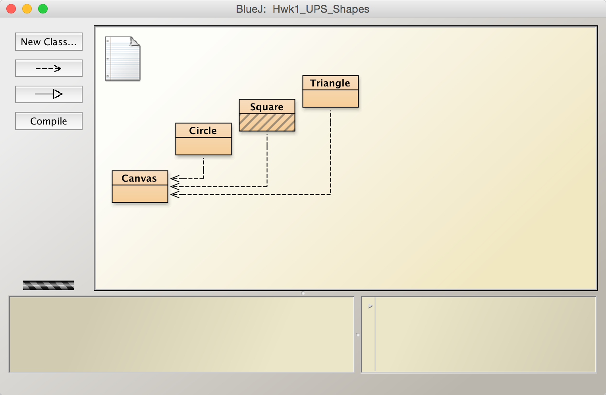
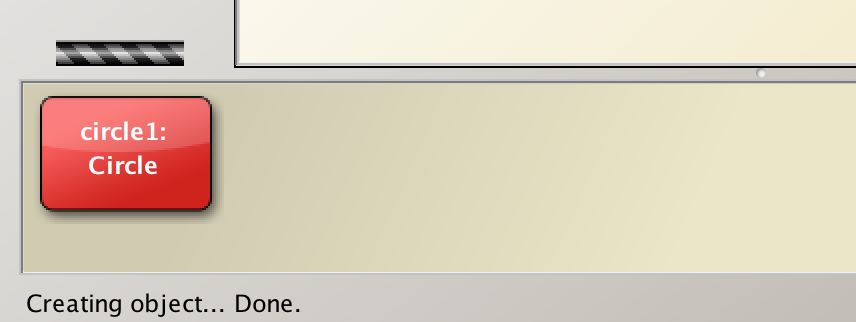
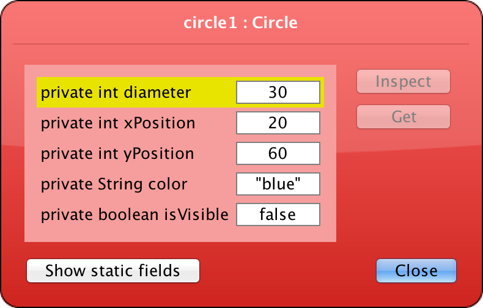
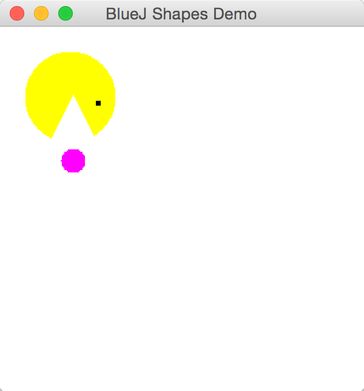

## CS 161 - Intro to Computer Science

### Lab: Draw My Picture

In this assignment you will use BlueJ to practice creating and calling methods on some limited Shape objects. You will manipulate these shapes to create a simple picture of Pac-Man. You will then create a picture of your own.

#### Student Outcomes

- To become familiar with the lab environment and BlueJ
- To become familiar manipulating objects
- To understand the concept of an algorithm
- To practice the procedure for submitting your work

#### Required Files

The following file(s) have been provided for this lab.

- [Lab1_Shapes.zip](Lab1_Shapes.zip)

#### Preliminary: Watch This Video

If you haven't already, please [watch this video](https://youtu.be/ffj_TahUeZA) to learn how to save and open BlueJ files for this course.

#### Part 1: Getting Started

- Important (READ THIS): Usually, you would start lab by finding your partner and sitting with them. This first lab, you will work independently at first, and then you'll be prompted to find your partner about halfway through.

- Download the project from the link above. You will need to save the `.zip` file to your computer. The actual project files are stored inside this compressed zip, and you need to first extract its contents before BlueJ can open the project.

  - On a Windows machine, double-click on this zip file, and you should find two folders in the file explorer. Ignore the Mac OS X folder, now drag the Lab1_Shapes folder to a place you'll remember (like into a dedicated folder for this course). You may close out and delete the zip file. Navigate to that project folder before moving on.

  - On a Mac, double-clicking the file should extract the project folder in the current folder as the compressed file. If you have any problems with this process, let us know!

- You can open this project by either double-clicking on the `package.bluej` file inside the project folder. If all goes well, you should see a project window like the one below:

  

- Some terminology:
  The orange boxes that are displayed are called `classes`. As you can see, our program currently only supports three shape classes: Squares, Triangles, and Circles. Think of these classes as recipes that you can use to create any number of instances of those classes. For instance, you can use the `Circle` to create any number of circle objects, which we can control and have appear on the canvas.

  The gray stripes appear on the class icons when the classes need to be **compiled**. We can't interact with the classes until they are compiled (that is, their Java code has been converted to machine code), so click on the `Compile` button on the left side of the screen to compile all the classes before proceeding.

  If something goes wrong when you click `Compile`, it's typically because either Java isn't properly installed on your machine, or BlueJ hasn't been configured properly and is having trouble finding the Java compiler. Let us know if this step fails, and we'll be happy to help you sort things out.

#### Part 2: From Shapes to Pictures

- Now that you have the project open and compiled, you can start creating and manipulating objects.

- You can instantiate (create) objects by right-clicking (**If you're using a Mac**, you should use a two-finger click or hold down control and click.) on the appropriate shape class and selecting the `new ...()` menu item. For example, if you right-click on the `Circle` class, you should be able to select the `new Circle()` method:

  You will be prompted to provide a name for your object in order to keep track of it. To continue with the default name shown in the text box (e.g., `circle1`), click the `OK` button to create the object. You should now see a red box labeled with the object's name and class in the **workbench** (the lower left corner of the BlueJ window). The red object represents and gives you access to the object you just created.

  

- You can now begin calling methods on the circle and changing its state. Right-click on the object to see a list of **methods** that you can call on it. Select the `makeVisible()` method, and you should now get a window with a single blue circle drawn.

  - If you accidentally close this window with the drawing, you can select the `makeVisible()` method class to make it appear again.

  - DO NOT select the red "Remove" option at the bottom of an object's method list: this will remove the object from the object bench, but not from the drawing! And since it is removed from the bench, you'll never be able to call a method on it again. You should first call the `makeInvisible()` method on the object in order to remove it from the Canvas---then you can remove it from the bench.

  - If you select the red `Inspect` option from the BlueJ menu, you will get a window that shows you all of the **instance variables (or fields)** of the object. Together, this set of instance variables combine to form the **object's state**. Here, we can see that this state comprise its location, its diameter, its color, and whether it is visible on the canvas window. Note that you cannot change their values from here; you can only change the state of an object through the methods menu.

    

- Before continuing to the next section, select `makeInvisible()` and then `Remove` this circle. (Yes, I know it's unintuitive, but if you don't hide it before you remove it, then its image will remain on the canvas forever!)

- Your first task is to create and manipulate shapes to create a drawing of Pac-Man. Execute the following steps in-order by selecting the proper methods from the BlueJ menus. Note that some steps require additional inputs. These inputs are called **parameters**.

  Algorithm:

  ```
  1 Create a new Circle named body
  2 Create a new Circle named eye
  3 Create a new Triangle named mouth
  4 Make body visible
  5 Make eye visible
  6 Make mouth visible
  7 Change body color to "yellow"    // Yes, the quotes are required
  8 Change body size to 75           // No quotes needed for numbers!
  9 Move body up
  10 Move body up
  11 Change eye color to "black"
  12 Change eye size to 5
  13 Slow-Move eye horizontally by 58
  14 Change mouth size to 75 (height) and 75 (width)
  15 Move mouth horizontally by 10
  16 Move mouth vertically by 40
  17 Change mouth color to "white"
  18 Create a new Circle named ball
  19 Make ball visible
  20 Change ball color to "magenta"
  21 Change ball size to 20
  22 Move ball horizontally by 30
  23 Move ball down
  24 Move ball down
  ```

- If you followed the instructions correctly, you should see the following image being drawn:

  

#### Part 3: Your Turn!

- You just executed an **Algorithm** -- recall from class that it's a sequence of instructions that gives you some desired outcome. The algorithm we provided, when executed faithfully, will always produce the same Pac-Man picture. This means that, when designing this algorithm, we had to be careful and detail-oriented when recording steps. We even test-ran the algorithm several times just to make sure it would be repeatable.

- You still don't need a partner yet, but now it's your turn to write an algorithm to draw anything of your choosing. (Without saying, please draw something appropriate!)

  - To remove Pac-Man, you can click on the reset arrow &#8617; found at the _bottom right corner_ of BlueJ. This will reset the entire process.

  - Once your canvas is clean, design a simple drawing on a piece of paper using only Circles, Squares, and Triangles. Popular ideas in the past include: a face, a spaceship, a house, a landscape, etc. Try not to draw something too complicated (maybe just 3-4 shapes should suffice) because your partner will have to reproduce your drawing before the lab period is over!

  - Now take your design from paper to screen! **Here are the critical steps:** As you move the shapes around on the canvas, **you should be recording each step.** There is no "record" function in BlueJ -- open that white paper icon  in BlueJ's project window and type in the steps. This recording becomes the algorithm to create your drawing.

  - When you're done, erase your drawing by clicking on the reset arrow &#8617;, and wait until "time" is called.

  - When I call "time", you will need to find another student and exchange algorithms (you can email them your algorithm, for example). By following their algorithm exactly as written (even if you think you found an error), you should be able to reproduce each other's drawings!

  - Once you are finished, give your partner some feedback: Describe whether there were any problems you ran into when following the algorithm. (It's okay for there to be problems -- you aren't getting graded on that.)

#### Part 4: Answering Questions in the README file

Back in BlueJ's project window, open up the README.txt file by double-clicking on the white paper icon .
In general, the README file never contains any programming elements, and is used to let you describe your program.

- First, add your name to the Authors list.

- Next, answer each question directly in the README file. Place your answer below each question. Remember to save your changes (select "Class" > "Save" from the menu).

- You're ready to submit your lab assignment for grading. Briefly read over the grading criteria below to make sure you've covered the basis. Now skip down to the "Submitting Your Lab" section and follow the steps to zip up and submit your lab to me.

#### Optional Extensions

Have some free time? There are no limitations to the content you want to display. Feel free to make more pages about yourself, and add as much styling as you wish! As long as your site meets the requirements, you will receive full credit!

#### Grading

```
This assignment will be graded out of 10 points, provided you do all the following:

- Attended lab.
- You submitted a README.txt with a detailed and precise algorithm for producing a
  drawing, as well as answers to the questions.
- Your algorithm produces something recognizable.
- You have executed your partner's algorithm and gave them feedback on the process.
- You have properly submitted your lab.
```

#### Submitting Your Assignment

After you have completed the assignment, use the following to submit your work.
Exit BlueJ

- Open your computer's File Finder (some times called File Explorer). Locate the project folder.

- Right-click on the project folder, then:

  - If using Windows, select Send to then Zip file
  - If using MacOS, select Compress ... items
  - This step takes your selected creates a .zip file that you will submit to me.

  It's really important you got this right. If you have doubts, ask one of us to check for you! I recommend that you double-check by opening the zip file, and investigating the contents to ensure that all the files are in there.

- Navigate to our course page on Canvas and click on the assignment to which you are submitting.

- Click on Submit Assignment, and you should be able to "browse" for your file

- Select the `.zip` you just created, and click Submit Assignment again to upload it.

- You may submit as often as you'd like before the deadline. I will grade the most recent copy.

#### Credits

Written by David Chiu and Joel Ross.

#### Lab Attendance Policies

Attendance is required for lab. Unexcused absence = no credit even if you turned in the lab. Unexcused tardiness = half credit.
