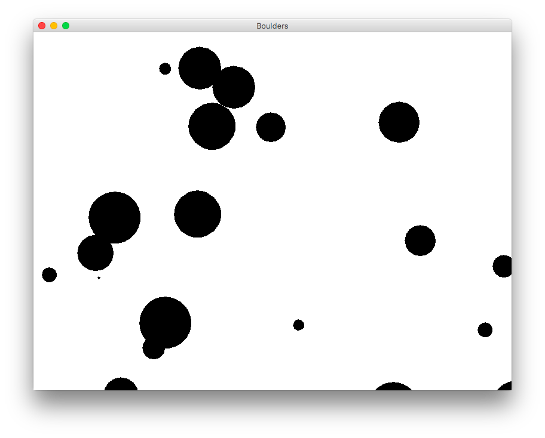

## CS 161 - Intro to Computer Science

### Lab: Boulders

NASA recently called and asked you to consult on their latest astronomical simulations. When they heard you'd worked with managing collections circles on a lab exercise, they hired you on the spot! NASA wants to be able to create large collections of boulder-like objects and simulate their motions on the screen. They've got a few more requests that you can read about below.

<center></center>

#### Student Outcomes

- To deal with file input/output
- To deal with data parsing

#### Required Files

The following file(s) have been provided for this homework.

- [Lab10_Boulders.zip](Lab10_Boulders.zip)

#### Helpful APIs

The API handout that you'll want to have in front of you:

- [Scanner](../api/ScannerAPI.pdf)

#### Part I: Boulders

I've created a new project to get you started. Please download and modify Boulders instead of creating a new project via BlueJ. There's a `Canvas` class that helps display our objects, a Boulder class (that's smart enough to wrap instances around at the edges of the screen), and a `BoulderSim` class that's mostly empty at this point. First you'll make a few small improvements to the Boulder class, then define methods in the `BoulderSim` class.

- Open the `Boulder` class. Try to understand this class by reading its fields and available methods. You'll see quite a bit of similarities with the Circle class, except that Boulders keep track of velocities. Note that it has a constructor, and the constructor expects the user to pass in most of the information about the new boulder they want (position, speed, size).

- Create a couple `Boulders` and test them out on canvas. Check their state after running `updatePosition()` to see what that does.

- Create the `toString()`. It returns a String describing the boulder's state. It should include the size, position, and speed (see below on how it's supposed to be formatted).

- The sample interactions below illustrate the creation a `Boulder` object, and its output from `toString`:
  ```java
  Boulder b = new Boulder(52, 656.063, 240.661, -13.301, 4.454);
  System.out.println(b.toString())
  > Boulder of size 52 is at 656.063, 240.661 with velocity -13.301, 4.454
  ```

#### Part II: BoulderSim and File Handling

We currently have a way to draw boulders on the canvas, but if we were to add all the boulders into our program by hand, it would take forever and it would be error-prone due to human fallacies! Instead, NASA has collected the sizes, starting positions, and velocities of each boulder in a comma-separated file. This file is named `boulders_data.txt`, and it's been provided to you in the project folder. You can open it up to see its contents, if you're curious!

The next objective is to write a class, like `CircleDrawer` from before, that manages a collection of Boulders. This class will read from the `boulders_data.txt` and construct `Boulders` based on the properties given in the file. Then it will allow us to simulate the motions of all these boulders over time.

- Open up `BoulderSim`. You'll see a constructor and a couple methods that need to be filled in. But first, an instance of the `BoulderSim` class needs to contain a collection of Boulder instances so that it can make them all move around the screen. Start by defining an instance variable for the ArrayList that will be used to hold all of the `Boulders`.

- Implement the constructor, which inputs the name of the file containing the boulders' data. Before we dig into what the constructor does, let's have a look at the boulder file's format. Here is the content of `boulders_data.txt`, which is given to you in the project:

  ```
  50,372.1875893819677,133.87776166702926,11.932056023677355,-10.554410451924971
  19,433.82398487718194,481.6550233232082,-6.080615674768774,4.478703423386534
  25,14.205130964340174,393.97603145969526,11.11050281871444,7.603736784016846
  52,620.951230348042,323.61362827344834,5.114525160868034,-4.187689679784777
  38,768.4674629842491,373.37094868583165,-1.8793981371839266,2.323836781228364
  5,106.94259393133359,409.1286104889523,8.541187451017588,-2.0980170740851207
  100,50,10,10,20
  ```

  Each line contains data for the state of a Boulder. The values are separated by a comma as follows: (1) `diameter` (2) `xPosition` (3) `yPosition` (4) `xVelocity` (5) `yVelocity`.

- Your constructor should read this file and create the required number of boulders (using the `Boulder()` constructor) and add them to the ArrayList. While you're at it, make sure you call makeVisible on each boulder so they all start out visible. You are reminded that a String can be tokenized using the `split(..)` method. You can also convert strings to doubles and ints using the `Double.parseDouble(..)` and `Integer.parseInt(..)` methods, respectively.

- Once you're done with the constructor, you can test it by creating a new `BoulderSim` object, and passing it the `boulders_data.txt` file. If everything works, you should get no runtime exceptions and see six Boulders on the canvas.

- Move on to `animate(..)` that takes a single integer as its input: the number of update steps that should be performed on the collection of boulders. If the user passes `10` as an input to the method, for example, each boulder in the group should have its position updated, then you should do it again, and again, until each boulder has had its position updated `10` times. (Do not just update the first boulder `10` times, then the second boulder `10` times, etc. That wouldn't look right.)

  It should look something like this, when run except that my boulders collide with each other (you'll deal with collision a little later):

  <video alt="Video from Gyazo" width="400" autoplay muted loop playsinline><source src="https://i.gyazo.com/23833682efd385e2c434d4e44f52f55c.mp4" type="video/mp4" /></video>

- Add the `public static void main(String[] args)` method to your `BoulderSim` class. You may want to refer back to the notes for its syntax. The method should simply instantiate a new `BoulderSim` object with the `boulders_data.txt` file we've been working with, and call animate for `200` time steps.

#### Colorful Boulders

Let's say we wanted to jazz up our boulders a little more.

- Go in your file finder and open up your `boulders_data.txt` file and add a color to the end of each row. You need to separate the colors with a comma, and available colors include: `black`, `red`, `green`, `blue`, `yellow`, `magenta`. Save the file after you're done.

- Refactor your code to account for the colors in the file.

#### Collision Detection

Currently the boulders just pass through each other, which doesn't look very realistic.

- Add an `overlaps(Boulder other)` method to the Boulder class. It should take another boulder as an input, and return `true` if the input boulder overlaps with our boulder. Two boulders overlap if the distance between _our_ boulder's position and the other boulder's position is less than the sum of both boulders' radii. Recall that the euclidean distance formula is $$\sqrt{(x_{first}-x_{second})^2+(y_{first}-y_{second})^2}$$ (There's a `Math.sqrt()` method that you can use when calculating distances.)

- Update your `animate()` method so that, for each time-step, it first checks to see if any boulders are overlapping with one another. If they are, they should bounce off of each other. A simple way is by reversing their velocities.

#### Optional Extensions

If you're done early and want some more practice, try the following exercises:
Make the boulder collision more realistic by taking into account their size.

- Write a new version of the updatePosition method that has the boulders "bounce" back off of the walls rather than wrapping around.

- Implement a method called `writeToFile(..)`. It takes another file name as input. This file, you need to open the given file name for writing. When called it should print out information on each of the boulders in the collection into the given file. For full credit, there should be a boulder "number" printed out with each entry, with the first boulder being displayed as #1.

- After loading the data from the given file, I called `updateAll(250)` to move the boulders around by 250 steps. I then call `writeToFile("boulders_out.txt")`. Inside this file, I find:

  ```
  1: Boulder of size 50 is at 155.20159530130397, 495.2751486857869 with velocity 11.932056023677355, -10.554410451924971
  2: Boulder of size 19 is at 513.6700661849919, 401.3308791698421 with velocity -6.080615674768774, 4.478703423386534
  3: Boulder of size 25 is at 391.8308356429477, 494.91022746390956 with velocity 11.11050281871444, 7.603736784016846
  4: Boulder of size 52 is at 299.5825205650542, 476.6912083272544 with velocity 5.114525160868034, -4.187689679784777
  5: Boulder of size 38 is at 298.61792868827456, 354.3301439929203 with velocity -1.8793981371839266, 2.323836781228364
  6: Boulder of size 5 is at 642.2394566857287, 484.62434196767174 with velocity 8.541187451017588, -2.0980170740851207
  ```

#### Grading

```

This assignment will be graded out of a total of 10pts.

```

#### Submitting Your Assignment

After you have completed the assignment, use the following to submit your work.
Exit BlueJ

- Open your computer's File Finder (some times called File Explorer). Locate the project folder.

- Right-click on the project folder, then:

  - If using Windows, select Send to then Zip file
  - If using MacOS, select Compress ... items
  - This step takes your selected creates a .zip file that you will submit to me.

  It's really important you got this right. If you have doubts, ask one of us to check for you! I recommend that you double-check by opening the zip file, and investigating the contents to ensure that all the files are in there.

- Navigate to our course page on Canvas and click on the assignment to which you are submitting.

- Click on Submit Assignment, and you should be able to "browse" for your file

- Select the `.zip` you just created, and click Submit Assignment again to upload it.

- You may submit as often as you'd like before the deadline. I will grade the most recent copy.

#### Credits

Written by David Chiu.

#### Lab Attendance Policies

Attendance is required for lab. Unexcused absence = no credit even if you turned in the lab. Unexcused tardiness = half credit.
