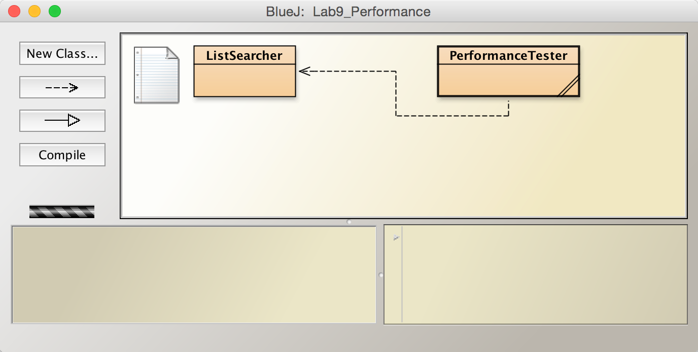
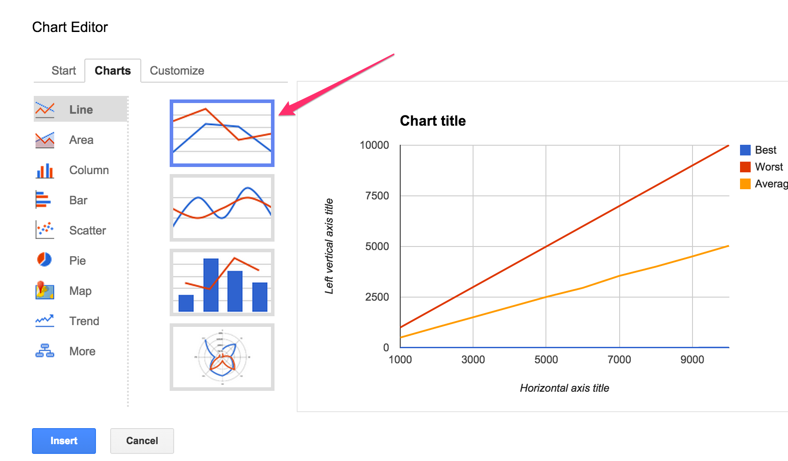
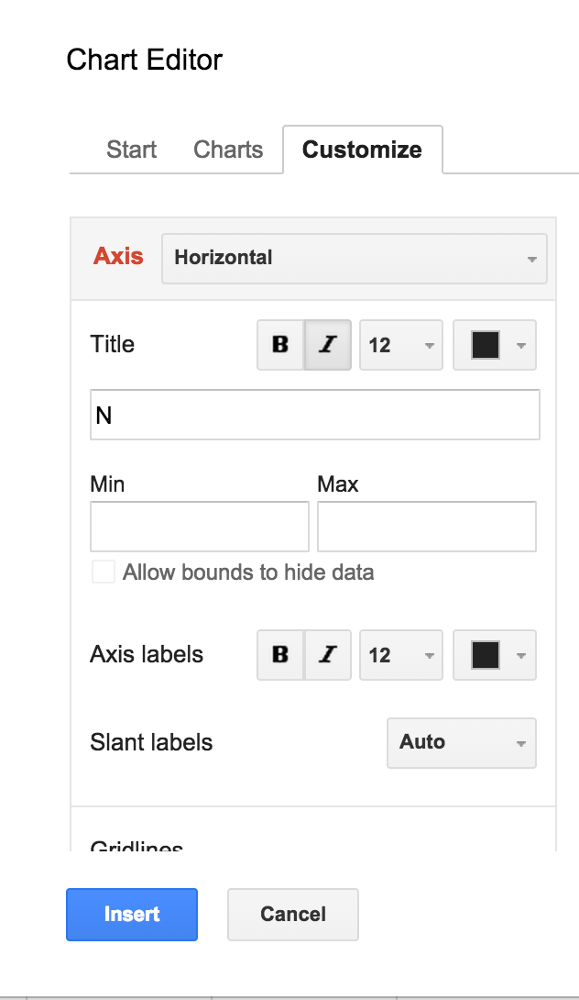
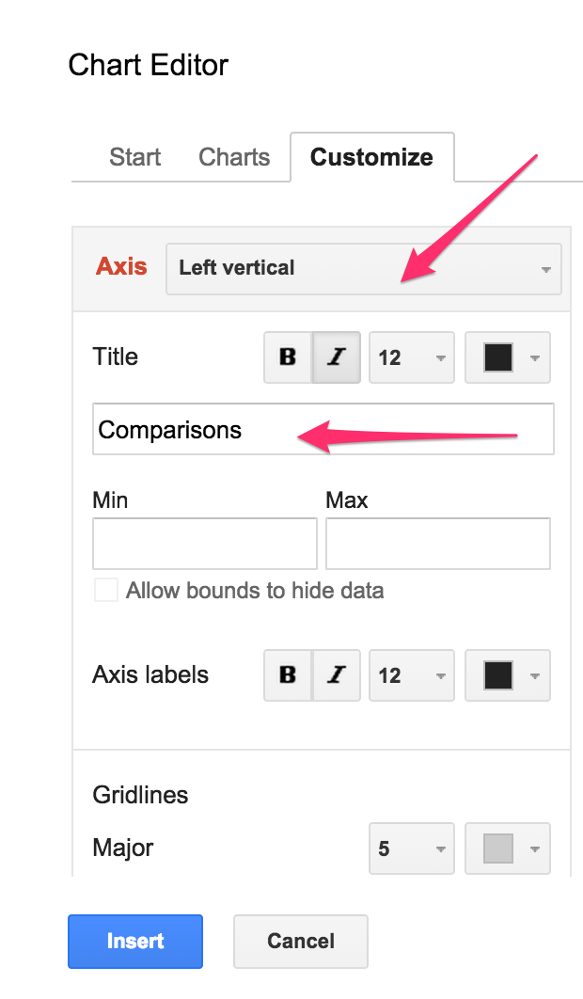

## CS 161 - Intro to Computer Science

### Lab: Elementary Complexity Analysis

Suppose your friend pondered about who computer scientists actually are, and what makes them called "scientists." They admitted that they didn't quite know the difference between a computer scientist and a software engineer, or a programmer. Troubled by this view, you recalled from your very first lecture that the study of algorithms is central to CS, and the field is deeply rooted in formal and theoretical foundations. You explain to your friend that, like all other sciences, CS's intellectual expanse has been built through reproducible observations and rigorous experimental evaluation. Programming is only the practice of communicating algorithms to the machine.

Intrigued, but skeptical, your friend asks you to "show them what you mean." In this lab, you'll form hypotheses on the time complexity (running time) of various algorithms, and validate/reject those hypotheses through experimentation, analysis of its results, and drawing conclusions. You will be generating plots and be providing a Lab Report.

#### Student Outcomes

- To apply critical and scientific thinking to the analysis of algorithms
- Experience putting together a CS lab report

#### Required Files

The following file(s) have been provided for this homework.

- [Lab11_Performance.zip](Lab11_Performance.zip)

#### Preliminary

Download the BlueJ project from the above link. After you unzip it into your working directory, navigate into the Lab12_Performance folder. Inside, you'll find a Word document called `Lab_Report.docx` and a BlueJ package. Open up the package and you'll see the following classes: `ListSearcher` and `PerformanceTester`.

<center></center>

#### Part 1: Generating Test Data

To investigate the performance of our algorithms, we need to first generate some test data. Open the `ListSearcher` class. You should see that there is only a single field -- an array of ints. You need to provide the following elements:

1.  Constructor: Your constructor should input an integer `size`, denoting the length of your list. It will instantiate a new integer array of the prescribed `size` and assign it to your field. If `size` is input as zero or negative, your constructor should instead create an integer array of size ten. An example in Codepad is shown below:

    ```java
    ListSearcher mySearcher = new ListSearcher(0);
    System.out.println(mySearcher.toString());
    > [0, 0, 0, 0, 0, 0, 0, 0, 0, 0]

    mySearcher = new ListSearcher(5);
    System.out.println(mySearcher.toString());
    > [0, 0, 0, 0, 0]
    ```

2.  Write a method, `generateOrderedData()` that takes no inputs and returns no values. This method will fill your list with integers from 0 to `list.length-1` in that order.

    ```java
    ListSearcher mySearcher = new ListSearcher(10);
    mySearcher.generateOrderedData();
    System.out.println(mySearcher.toString())
    > [0, 1, 2, 3, 4, 5, 6, 7, 8, 9]
    ```

3.  Write a method, `shuffle()` that takes no inputs and returns no values. This method will randomly shuffle the values around in the int array stored as your field. To implement this method, you should loop through every element in the array and swap its value with a randomly chosen element from the remaining array.

When properly implemented, it will have this type of effect on your list:

    ```java
    ListSearcher mySearcher = new ListSearcher(10);
    System.out.println(mySearcher.toString());
    > [0, 0, 0, 0, 0, 0, 0, 0, 0, 0]

    myListSearcher.generateOrderedData();
    System.out.println(mySearcher.toString());
    > [0, 1, 2, 3, 4, 5, 6, 7, 8, 9]

    myListSearcher.shuffle();
    System.out.println(mySearcher.toString());
    > [5, 9, 2, 6, 0, 3, 1, 8, 4, 7]

    myListSearcher.shuffle();
    System.out.println(mySearcher.toString());
    > [3, 8, 9, 1, 4, 7, 5, 2, 6, 0]
    ```

4. Write a method, `generateUnorderedData()` that takes no inputs and returns no values. This method will fill your list with integers from 0 to `list.length-1`. Each number from this range should appear exactly once, but should be in _random_ order. This array will then be assigned to your field. Hint: This method is only a couple of lines (literally) if you remember to reuse the code you've just written...

   ```java
   ListSearcher mySearcher = new ListSearcher(10);
   mySearcher.generateUnorderedData();
   System.out.println(mySearcher.toString());
   > [6, 3, 4, 8, 7, 9, 1, 0, 2, 5]
   ```

   The order of _your_ list will probably be quite different from the one above, but the numbers should be the same.

#### Part 2: Counting Comparisons

In class, we learned that searching over collections of data is one of the most commonly-used operations in computing. Here, we will explore the complexity of linear search and binary search algorithms. In this lab, we assume that the time complexity of an algorithm is the number of comparisons it has to make, as a function of the problem size (i.e., list size in most of our examples).

##### Review: Linear Search

1. Still inside the `ListSearcher` class, find the `linearSearch()` method. You should already be familiar with this algorithm, but read through the code again to remind yourself. This method takes an integer `key` as input, then scans your list element-by-element (that is, linearly) to see if there is a match with the key. If so, it returns the index of that element. If is not found, it returns -1.

2. In class, we learned that the time complexity of this method varies based on the elements inside the list, as well as the key you're searching for. Specifically, if $$n$$ is the size of your list, we estimated that it would take $$1$$, $$n$$, and
   $$\dfrac{n+1}{2}$$ comparisons for the best-case, worst-case, and average case, respectively. Also recall the scenarios under which these cases are exhibited:

   - Best Case: triggered when the key is found in the first element of the list.
   - Worst Case: triggered when the key is not found.
   - Average Case: Assuming the key is in the list somewhere, over many runs, the key's location is generally toward the middle of the list.

<!-- 3. Though we wouldn't lie to you, it still would be cool to verify these cases, but to do that, we need to have this class store the number of comparisons made in each method's execution:

   - Add a new field `numComparisons`
   - Add a getter for this field called `getComparisons()`, and
   - Add a setter method called `resetComparisons()` that inputs nothing, and simply clears this field to 0 -->

<!-- 4. Next, Modify the `linearSearch` method so that it counts the comparisons to perform a search.  -->

3. Though we wouldn't lie to you, it still would be cool to verify these cases. If you type out the following in code pad, your outputs should look _exactly_ like the mine:

   ```java
   ListSearcher mySearcher = new ListSearcher(10);
   mySearcher.generateOrderedData();
   System.out.println(mySearcher.toString());
   > [0, 1, 2, 3, 4, 5, 6, 7, 8, 9]

   mySearcher.resetComparisons();
   mySearcher.linearSearch(7);
   System.out.println(mySearcher.getComparisons());
   > 8

   mySearcher.resetComparisons();
   mySearcher.linearSearch(56);
   System.out.println(mySearcher.getComparisons());
   > 10

   mySearcher.resetComparisons();
   mySearcher.linearSearch(0);
   System.out.println(mySearcher.getComparisons());
   > 1
   ```

#### Review: Binary Search

1. Now find the `binarySearch()` method. Read through it to get a basic understanding of what it does. Recall the caveat that binary search only works if the list is already sorted in ascending order! This method takes an integer `key` as input. It then compares the middle element in the list to the key. If the middle element is larger, then it "throws away" the latter half of the list from further consideration, and vice-versa if the element was instead smaller. These steps continue until the key is found, or if there is no more elements to throw away, in which case, the key is not found.

2. We saw that the time complexity of this method varies based on the elements inside the list, as well as the key you're searching for. Specifically, if $$n$$ is the size of your list, we calculated that it would take 1 and $$\log_2{n}$$ comparisons for the best-case and worst-case, respectively. Also recall the scenarios under which these cases are exhibited:

   - Best Case: triggered when the key is found in the middle of the original list.
   - Worst Case: triggered when the key is not found.
   - Average Case: ?

<!-- 3. Now modify the `binarySearch()` method so that it counts the number of comparisons. If you did it correctly, you should be able to reproduce this. -->

3. If you type out the following in code pad, your outputs should look _exactly_ like the mine:

   ```java
   ListSearcher mySearcher = new ListSearcher(8);
   mySearcher.generateOrderedData();
   System.out.println(mySearcher.toString());
   "[0, 1, 2, 3, 4, 5, 6, 7]"   (String)

   mySearcher.binarySearch(0);
   System.out.println(mySearcher.getComparisons());
   > 3

   mySearcher.resetComparisons();
   mySearcher.binarySearch(1);
   System.out.println(mySearcher.getComparisons());
   > 2

   mySearcher.resetComparisons();
   mySearcher.binarySearch(2);
   System.out.println(mySearcher.getComparisons());
   > 3

   mySearcher.resetComparisons()
   mySearcher.binarySearch(3);
   System.out.println(mySearcher.getComparisons());
   > 1

   mySearcher.resetComparisons()
   mySearcher.binarySearch(68);
   System.out.println(mySearcher.getComparisons());
   > 4
   ```

#### Part 3: Experimentation and Analysis

Now that your search methods can count comparisons, let's test to see if our hypotheses on their time complexity are sound. The `PerformanceTester` class has three `static` methods (already implemented):

      - testLinearSearch(int N, int numRuns, boolean unordered): This method inputs the list size N, and a boolean on whether it should run over an ordered list or unordered list. It runs linear search over the same list `numRuns` times, searching for a random key during each run.

      - testBinarySearch(int N, int numRuns): This method creates an ordered list of size N, and it will run `binarySearch()` over the same list `numRuns` times, searching for a random key during each run.

      - testMedian(int N, int numRuns, boolean unordered): This method inputs the list size N, and a boolean on whether it should run over an ordered list or unordered list. It finds the median over the same list `numRuns` times.

_Important:_ A static method means that it belongs to the class, not to its instances (objects). That is, you don't need to instantiate any objects to call them. When you right-click on the PerformanceTester class, you'll find that the static methods are available under this menu. If you prefer to call them from the Code pad, you could use something like: `PerformanceTester.testBinarySearch(1000,5);` to run binary search over a list of N=1000 elements, and the experiment will be repeated five times.

##### Linear Search Analysis

1. Try running testLinearSearch(1000, 1, true). This call will generate an unordered list of
   N = 1000 numbers, and run `linearSearch` on a random key over this list just once. If you implemented everything properly in the previous section, you should get an output similar to the following:

   ```java
   PerformanceTester.testLinearSearch(1000, 1, true);
   > N=1000, best=672 (expected 1), worst=672 (expected 1000), avg=672 (expected 500)
   ```

   Your results will probably vary (wildly) from these.

2. Let's actually spend a little bit of time understanding the report we just generated above. Recall our hypothesis that the best case, worst case, and average case comparisons for linear search is $$1$$, $$n$$, and $$(n + 1)/2$$, respectively.

In the report, the best, worst, and average number of comparisons are all the same because `linearSearch()` was only run once. As a result, the quality of these results are very low, and as computer scientists, we know that results from a single experiment cannot be taken at face value. A good scientist would repeat the experiment multiple times to obtain a larger sample from which to draw conclusions.

3. Okay, lesson-learned. Let's get the simulator to run `linearSearch()` multiple times over randomly generated keys. Repeating the experiment 10 times seems reasonable...

   ```java
   PerformanceTester.testLinearSearch(1000, 10, true);
   > N=1000, best=40 (expected 1), worst=831 (expected 1000), avg=485 (expected 500)
   ```

   Well, this time the results look closer to what we were expecting, but it's still not quite there.
   We wonder what would happen if you ran more than 10 tests (runs)? Closer still, to our expectations? 100 runs? Hmm.. what if the size of the list was also increased? Might a longer list require more experimental trials for you to obtain a good, representative results?

4. We wonder what would happen if you ran more than 10 tests (runs)? Closer still, to our expectations? 100 runs? Hmm.. what if the size of the list was also increased? Might a longer list require more experimental trials for you to obtain a good, representative results?

##### Generating Plots

We'd like to generate some charts to better visualize our results.

1. Run the `testLinearSearch()` experiments for N = 1000, then 2000, then 3000, ..., 10000. Remember to use the value that worked best for you as numRuns (it should be pretty large.. like over 1000), and to use an unsorted list. We recorded the following results from all these runs:

   ```
   N=1000, best=1 (expected 1), worst=1000 (expected 1000), avg=502 (expected 500)
   N=2000, best=1 (expected 1), worst=2000 (expected 2000), avg=1011 (expected 1000)
   N=3000, best=1 (expected 1), worst=3000 (expected 3000), avg=1507 (expected 1500)
   N=4000, best=1 (expected 1), worst=4000 (expected 4000), avg=2007 (expected 2000)
   N=5000, best=2 (expected 1), worst=5000 (expected 5000), avg=2509 (expected 2500)
   N=6000, best=2 (expected 1), worst=6000 (expected 6000), avg=2957 (expected 3000)
   N=7000, best=2 (expected 1), worst=6999 (expected 7000), avg=3550 (expected 3500)
   N=8000, best=1 (expected 1), worst=7997 (expected 8000), avg=4004 (expected 4000)
   N=9000, best=2 (expected 1), worst=9000 (expected 9000), avg=4510 (expected 4500)
   N=10000, best=6 (expected 1), worst=10000 (expected 10000), avg=5037 (expected 5000)
   ```

2. It sure would be nice to summarize this data in a plot. Open up your favorite spreadsheet tool, like Sheets on Google Docs or Excel. The following example shows how to generate charts using Sheets on Google Docs.

   - Head over to [Google Docs](https://docs.google.com). One of you will need a Google ID, and sign in. Once in, click on the striped-lines button on the top-left corner, and select Sheets. Next, click on the `+` button on the bottom-right corner and it should generate a new blank spreadsheet. Let us know if you have troubles getting this far. After you've got a blank sheet in front of you, start plugging the numbers for N, Best Case, Worst Case, and Average Case as follows.

   - After you've got a blank sheet in front of you, start plugging the numbers for N, Best Case, Worst Case, and Average Case as follows
      <center></center><br/>

   - Double-check that all of your data is entered correctly. Then select your data (including the first row containing labels). Then from the menu bar, click `Insert` > `Chart`... This will bring up a new dialog box that looks like the following. Make sure you place checkmarks in Use `Row 1` as Headers and Use `Column A` as Labels
      <center></center><br/>

   - Now we need to decide the best kind of graph to visualize our data. For our results, we want a simple line-graph. From the dialog, click on the Charts tab. Make sure Line is selected on the left-hand panel, then select top option:
      <center></center><br/>

   - Inside the same dialog, click on the Customize tab. Give your chart a title, then scroll down half way to find Axis:

     - Label your Horizontal Axis to be "N (List Size)"
     - Label your Left Vertical Axis to be "Comparisons"
     <center>
     &nbsp;&nbsp;</center><br/>

   - Click the Insert button on the bottom, and you should see the Chart!
      <center></center><br/>

   - Click on the chart, and on the top-right hand corner you should see a triangle button. Click on this button, and click Save Image. This will download the chart as a PNG file. Finally, open it and copy-and-paste this Chart into the appropriate place in your Lab Report under Linear Search Time Complexity Plot (Unordered Lists).

3. Now run the experiment and plot the results again for ordered lists and paste it into the lab report. Then answer Q1 in the lab report.

##### Binary Search Analysis

1. Now try experimenting with testBinarySearch(). This method has no boolean flag to indicate whether it should generate an ordered or unordered list. It always generates an ordered list, because binary search relies on this ordering to work!

2. Try running this test with the same number of trials you found that worked best from the linear search experiments. Again, vary
   N=1000,2000,3000,...,10000.

3. Open your spreadsheet program, and generate another plot, with the best, worst, and average-case as the series. Again, drop it into the proper place in your **Lab Report**. Juxtapose the two Charts (between Linear Search and Binary Search) and you can see the power of Binary Search. Also, what can you glean about the average-case time complexity of binary search? Is it more like the best-case, or the worst-case?

##### Find Median Analysis

1. Open up the `ListSearcher` class, and look for the `findMedian()` method. Again, study the code carefully and hypothesize what the best, worst, and average cases would be.

2. Open your Lab Report back up. For each best/worst/average case, write down (1) the scenario under which the case would be observed, and (2) the equation, in terms of N, expressing its complexity.

3. Run some experiments by varying N = 1000, 2000, ..., 10000. Open your spreadsheet program, and generate another plot, with the best, worst, and average-case. Insert the plot in your Lab Report, and answer the final questions.

4. Finally hypothesize whether ordering affects the complexities of this method. Run a final set of experiments to confirm/reject your hypothesis.

#### Grading

```

This assignment will be graded out of a total of 2 pts.

```

#### Submitting Your Assignment

Remember to put both your names on the Lab Report, and zip it up together with your Java code.

After you have completed the assignment, use the following to submit your work.
Exit BlueJ

- Open your computer's File Finder (some times called File Explorer). Locate the project folder.

- Right-click on the project folder, then:

  - If using Windows, select Send to then Zip file
  - If using MacOS, select Compress ... items
  - This step takes your selected creates a .zip file that you will submit to me.

  It's really important you got this right. If you have doubts, ask one of us to check for you! I recommend that you double-check by opening the zip file, and investigating the contents to ensure that all the files are in there.

- Navigate to our course page on Canvas and click on the assignment to which you are submitting.

- Click on Submit Assignment, and you should be able to "browse" for your file

- Select the `.zip` you just created, and click Submit Assignment again to upload it.

- You may submit as often as you'd like before the deadline. I will grade the most recent copy.

#### Credits

Written by David Chiu.

#### Lab Attendance Policies

Attendance is required for lab. Unexcused absence = no credit even if you turned in the lab. Unexcused tardiness = half credit.
