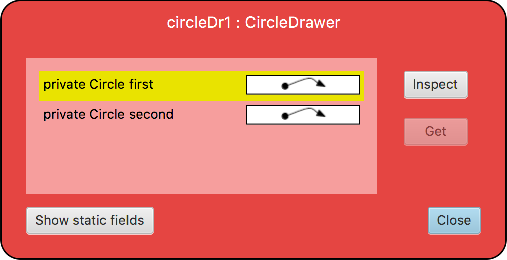

## CS 161 - Intro to Computer Science

### Lab: The Circle Drawer

This assignment is all about conditionals and object references! We'll work with the `CircleDrawer` class that is given to you. Along the way you'll write code that uses and manipulates object references, and requires more complex boolean expressions than you've written previously.

#### Student Outcomes

- Practice using object references
- Working with object equality

#### Required Files

The following file(s) have been provided for this homework.

- [Lab5_CircleDrawer.zip](Lab5_CircleDrawer.zip)

#### Helpful APIs

The API handout that you'll want to have in front of you:

- [Circle](../api/CircleAPI.pdf)
- [Random](../api/RandomAPI.pdf)

#### Instructions

- Download the `CircleDrawer` project from the link above and extract its contents, then start BlueJ and open the project. Take a moment to familiarize yourself with the code in the `CircleDrawer` class. A `CircleDrawer` contains references to a pair of circles (named `first` and `second`), and can make both these circles visible or invisible.

- Notice the `CircleDrawer` class has two constructors. The default constructor is not given references to the two Circles to manage, it just sets both fields to null. The second constructor is given references to two `Circles`, and it sets both fields appropriately.

  a. Using the menus in BlueJ, create two `Circle` objects, named `c1` and `c2`.
  b. Change `c1` to green, change size to `50`.
  c. Change `c2` to red, change size to `75`. Then move it down by `50` pixels.
  d. Now create a new `CircleDrawer`, called drawer with its second constructor (the one that requires references to two Circles). Input `c1` and `c2`. The new `CircleDrawer` will now "control" the two circles you've created.
  e. Inspect the drawer object on the workbench, and you see that first and second store references. Follow the references by double-clicking on the arrows. It opens the inspector for the Circles you created! Look through the fields to convince yourself that these are the same circles. Close out the inspectors before moving on.

    

  f. Now call the `drawCircles()` method on the drawer, and notice that both Circles appear. (If you call `eraseCircles()` both disappear!)

    

- It's time to start weaning you off the BlueJ menus, and start learning how to do everything in code. Create a new class, and name it `Tester`. Clean up the "boilerplate code" that BlueJ fills in automatically. There are no fields. Now create the `main` method, which always has the same signature below:

  ```java
  public static void main(String[] args) {
    // Code goes here
  }
  ```

  In the body of the `main` method, write code to do what we had just done using menus. Before you write anything though, you might interested in the following syntax reminders.

  Object Instantiation/Creation:

  ```java
  ObjectType name = new ObjectType(...);  // 1) ObjectType refers to the Class name
                                        // 2) name is a good name to call your object variable
                                        // 3) ... refers to any parameters you wish to input to the constructor
  ```

  Calling a method on an object:

  ```java
  name.method(...);    // 1) name is the variable that refers to an object
                     // 2) ... refers to any parameters input into the method
  ```

- I got things started for you...

  ```java
  public static void main(String[] args) {
      Circle c1 = new Circle();
      c1.makeVisible();
      c1.changeColor("green");
      c1.changeSize(50);

      // Finish the rest
  }
  ```

- After you're done, close out the code window. Right click on the `Tester` class and call the main method (Don't create a new `Tester` object on the workbench). You should again see the green and red circles drawn.

- Now go back in the `CircleDrawer` class and take a look at `drawCircles()` and `eraseCircles()`. Their code looks pretty innocuous and straightforward. Calling them will make both circles visible or invisible, respectively, but... that's assuming that our `first` and `second` fields actually refer to actual `Circle` objects, and not `null`. Let's test what happens if you tried to call these methods after running the default constructor.

- Go back into the main method in the Tester class, and comment out everything we'd written earlier. Create a `CircleDrawer` using the default constructor, which sets both circles to null. Then call `drawCircles()` on this CircleDrawer. If you run `main()`, the program should crash with a `"Null pointer exception."` That's bad news -- it means our code isn't all that robust.

  Back in the `CircleDrawer` class, add necessary changes to `drawCircles()` and `eraseCircles()` so that no action is taken if either field refers to `null` (use an if-statement to check if either field is `==` to `null`), otherwise both are drawn. Make sure you test these out after you're done.

- Go back in the `CircleDrawer` class. Write a method `drawLarger()` that draws only the larger of the two circles. The smaller one should be hidden.

- Now modify `CircleDrawer`'s `drawCircles()` method so that it only draws circles with radii greater than `20` and less than `50`. But how do you get a `Circle`'s radius? Add any necessary code to the `Circle` class so that it provides a method to return its own size. Again, test this out back inside main.

- Add a method in `CircleDrawer` called `addCircle()` that takes a `Circle` as input, and it doesn't return anything. This method will first erase both `Circle`s. If either of the two `Circles` (first, second) are `null`, simply add the `Circle` that was input into this method to that `null` reference. If neither reference is pointing to `null`, then promote the second `Circle` to the first, then sets the newly-input `Circle` to be the second. Then draw both Circles. Test it in `main()` before moving on.

- Write a new method called `replaceSmallest()` that takes a `Circle` as input. In `CircleDrawer`, if either of the two `Circles` (first, second) are `null`, simply add the `Circle` that was input into this method to that `null` reference. If both fields refer to non-null circle objects, this method will replace one of the current circles with the one passed to the method but, unlike `addCircle()`, we'll get rid of the smaller of first and second. We need to respect seniority, though: If first is the smaller, we'll promote second to take its place and add the new circle in second place. If second is the smaller, we'll just replace it with the new circle. In the case of a tie, replace second.

- Finally, add a method to `CircleDrawer` called `drawWhenEquals()` that draws both `Circles` if they are "equal" in _content_. Hide both of them if they aren't equal. Before you can write the method, you need to add an equals method in the Circle class. Let's say that two `Circle`s are equal if they have the same radius. Refer back to the "content equality" notes, if you need a reminder on how these are written. If everything's working, then the following main method should cause both circles to be drawn.

  ```java
  public static void main(String[] args) {
      Circle c1 = new Circle();
      Circle c2 = new Circle();
      c1.moveVertical(100);
      c1.changeSize(50);
      c2.changeSize(50);

      CircleDrawer drawer = new CircleDrawer(c1, c2);
      drawer.drawWhenEquals();
  }
  ```

#### Grading

```
This lab assignment will be graded out of a total of 10pts provided the following
items are completed.

- Circles have an boolean equals(Circle other) method that returns true
  if the content of the current circle is the same as the other circle being
  compared.

- drawCircles() and eraseCircle() do not suffer from NullPointerException.

- The addCircle() method is properly implemented.

- drawLarger() that only draws the larger of the two circles. The smaller one
  should be hidden.

- The drawWhenEquals() method is properly implemented.

- You provide Javadocs style comments for any new methods implemented.

- You include sufficient inline comments to explain the logic of your methods.
```

#### Submitting Your Assignment

After you have completed the assignment, use the following to submit your work.
Exit BlueJ

- Open your computer's File Finder (some times called File Explorer). Locate the project folder.

- Right-click on the project folder, then:

  - If using Windows, select Send to then Zip file
  - If using MacOS, select Compress ... items
  - This step takes your selected creates a .zip file that you will submit to me.

  It's really important you got this right. If you have doubts, ask one of us to check for you! I recommend that you double-check by opening the zip file, and investigating the contents to ensure that all the files are in there.

- Navigate to our course page on Canvas and click on the assignment to which you are submitting.

- Click on Submit Assignment, and you should be able to "browse" for your file

- Select the `.zip` you just created, and click Submit Assignment again to upload it.

- You may submit as often as you'd like before the deadline. I will grade the most recent copy.

#### Credits

Written by Brad Richards with modifications.

#### Lab Attendance Policies

Attendance is required for lab. Unexcused absence = no credit even if you turned in the lab. Unexcused tardiness = half credit.
