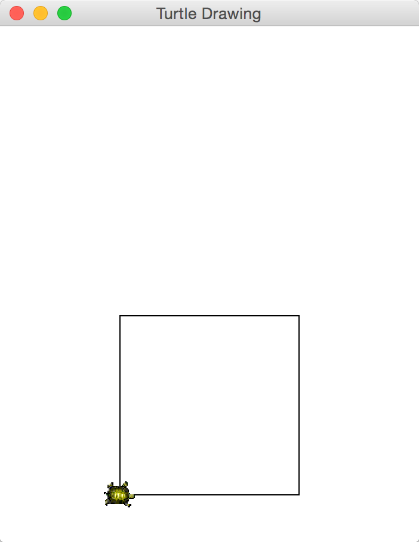
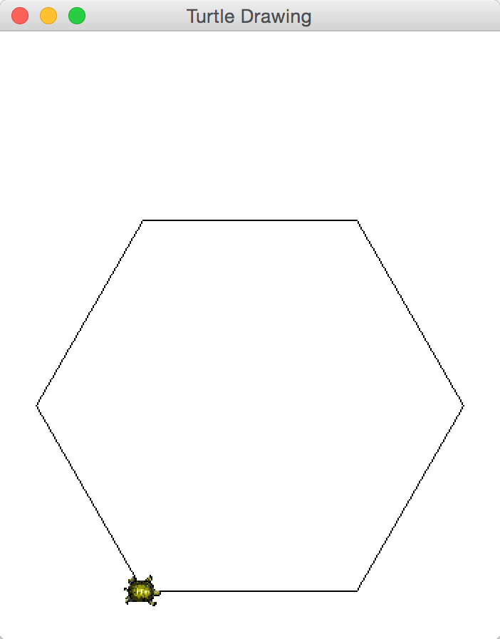
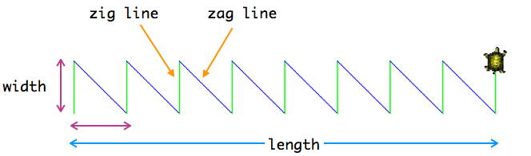

## CS 161 - Intro to Computer Science

### Lab: Turtle Graphics

This lab is based on the iconic [Logo Turtle](https://techcommunity.microsoft.com/t5/small-basic-blog/small-basic-the-history-of-the-logo-turtle/ba-p/337073), which was an early tool for teaching kids how to program. The `Turtle` has a pen that can change colors and be dropped and lifted on/off the ground. It also has a few mobility functions, like crawling forward and turning by a certain angle. Given this small set of functionalities, people can create impressively complex drawings.

In this lab, we'll be using a supplied `Turtle` library to make some drawings, all requiring loops.

#### Student Outcomes

- To practice writing loops and nested loops

#### Required Files

The following file(s) have been provided for this homework.

- [Lab6_TurtleDrawer.zip](Lab6_TurtleDrawer.zip)

#### Helpful APIs

The API handout that you'll want to have in front of you:

- [Random](../api/RandomAPI.pdf)
- [Turtle](../api/TurtleAPI.pdf)

#### Preliminary

Download the BlueJ project from the above link. After you unzip it into your working directory, navigate into the project folder. Inside, you will see a `Turtle` class. **You do not need to make changes to this class.** You only need to know its public methods (given in the [Turtle API](TurtleAPI.pdf) hand out).

#### Part 1

- All code for this lab should be written in the `TurtleDrawer` class. Again, **do not make changes** to the `Turtle` class. Before we begin, you may want to familiarize yourselves with the `Turtle` class by creating an object on the workbench and playing with its methods.
  Create a new class, called TurtleDrawer, with the following requirements:

  - It has one field: a `Turtle` object named `pen`.
  - It has a default constructor that first instantiates `pen`, then sets the `pen`'s color to black, and lowers the `pen` for drawing.
  - Let's write a quick-and-dirty method to test out the Turtle. Let's name it `drawTriangle`. It returns nothing, but takes a `double sideLength` as input. Your code should navigate the pen to draw an equilateral triangle, i.e., same length on all sides (see below)

    <center></center>

    There are a couple things to consider before you plunge into writing the code:

    - Notice that when the Turtle object (`pen`) is instantiated, it appears on the canvas and initially faces _East_.

    - Observe how the angles are all 60 degrees within an equilateral triangle. Once a side is drawn, you then want to turn your Turtle left to prepare drawing the next side. But how many degrees do you need to turn? (Well, if you turned 180 degrees, the `Turtle` would be facing the opposite direction...)

    - Even better: Is there a relationship between the degrees-turn you always need to make and the number of sides in this shape (three)? Answering this now will makes your life easier later.

    - Because a triangle is easy to draw, it may be tempting to write this method without loops, like the code that's given below. Read through it, and make sure you understand the code!

      ```java
      public void drawTriangle(double sideLength) {
        pen.penDown();
        double degreesTurn = <<FILL ME IN>>;   // angle by which to turn after drawing an edge

        //first edge
        pen.forward(sideLength);
        pen.left(degreesTurn);

        //second edge
        pen.forward(sideLength);
        pen.left(degreesTurn);

       //third edge
        pen.forward(sideLength);
        pen.left(degreesTurn);
      }
      ```

      That's simple, and it reveals the code's repetitive structure. The code segments to draw each of the three edges are always the same, so could be placed in a loop that iterates three times (Hey, that's the number of edges for _-this-_ particular shape...).

- *Your task *is to rewrite this method using a loop to replace the above redundant code segment above. You can use either a while-loop or a for-loop to get the job done (they are equal in power). The following code samples, for example, both iterate `n` times, for any `n` that is greater than or equal to zero. Recall that for-loops are generally used for counter-controlled loops, and while-loops are used for sentinel or event-controlled loops.
  ```java
  int i = 0;
  while (i < n) {
      //statements to repeat n times
      i++;
  }
  ```
  ```java
  for (int i = 0; i < n; i++) {
      //statements to repeat n times
  }
  ```

#### Part 2: Polygons

Yeah okay, `Triangles` are cool and all, but our `TurtleDrawer` class should be made to be more general. If we needed to write new methods just to draw a square (4 sides), a pentagon (5 sides), hexagon (6 sides), etc., then when would we ever stop writing methods?! A better alternative would be to write a single method that inputs, along with the `sideLength`, the number of sides, `numSides`, and a `pen` color color for the polygon you wish to draw.

- Name this new method `drawPolygon`. If `numSides` is entered as less than 3, then this method should do nothing.

- If you didn't answer the question on the previous section about how many degrees by which to turn the `Turtle` after each edge is drawn, you need to do so now. To help you through this process, draw several polygons on a piece of paper. Start with triangle (3-sides) again, then try a square (4-sides), pentagon (5-sides), and so on, until it becomes obvious what the relationship between the number of sides vs. how much to turn by.

- Now you're ready to write your method. Remember to write-a-little, test, write-a-little-more, test. When you're done, make sure it works on multiple inputs. For instance, here's what the following method calls should draw:

  <table width="100%">
  <tr>
  <td align="center" width="33%">
  (1) <code>drawPolygon(150, 4, "black");</code><br/>
  
  </td>
  <td align="center" width="33%">
  (2) <code>drawPolygon(150, 5, "black");</code><br/>
  
  </td>
  <td align="center" width="33%">
  (3) <code>drawPolygon(150, 6, "black");</code><br/>
  
  </td>
  </tr>
  </table>

- **Important (read this)!** When programmers re-write code to improve the design and functionality of their code for future extension, it is called **_refactoring_**.
  The implementation of `drawPolygon` renders `drawTriangle` a bit useless, doesn't it? Indeed, you could replace the entire body of the `drawTriangle` method with just a call to the new method: `this.drawPolygon(sideLength, 3, "black")` and you should do so now. Make sure you understand why this works.

  You might wonder why we should even keep `drawTriangle` around, instead of removing it altogether. Consider this real-world scenario: Suppose thousands of users are currently using the old version of your `TurtleDrawer` class. Today, we decide to refactor the code and push a new and improved version to the public. If we removed `drawTriangle` completely, and insisted that everyone switch to using `drawPolygon`, then everyone's code which made calls to `drawTriangle` is now broken. That would not be a wise decision, and you would lose the trust of many customers.

  So, by keeping `drawTriangle` around, we can ensure that our new upgrade is backward-compatible. However, we might warn the user the `drawTriangle` is now "deprecated," and it could be removed in future versions of our code. This makes for a much smoother transition.

#### Part 3: Zigzags

- Zigzags: It turns out that these zigzags lines don't just make for great sweatpants and haircut patterns. Zigzags are also great ways for us to teach loops. Make a new method, called `drawZigzag`, that takes as input two double arguments. The first argument is length, which specifies the length of the zigzag line to be drawn. The second argument width, which serves as both the width and the zigzagging interval (see below for illustration). In addition, it should take as input two String arguments: `zigColor` and `zagColor`.

  <center>
  <code>drawZigzag(400, 50, "green", "blue");</code><br/>
  
  </center>

- Things worth considering:

  - For convenience, let's call the lines that move vertically along the width a zig line, and the longer lines that sweep back across a zag line

  - In the picture above, the turtle was initially facing east. Therefore, when I call this method, I expect that the zigzag will be drawn horizontally, and to the east. But notice how the first zig-line is actually vertical.

  - Next, you need to determine the length of the zag-lines, as well as the angle of your turns. (Hint: These sawtooth shapes sure remind me of [right triangles](https://mathworld.wolfram.com/PythagoreanTheorem.html))

  - Think about the loop condition, which is related to how much you should draw per iteration. A single zig-line plus zag-line combination (looks like a tooth) appears to be the minimally repeated pattern.

  - Make sure your zig-lines and zag-lines are alternating colors.

  - Finally, if the width is longer than the length, you should draw nothing.

  - **You do not need a nested loop to complete this method.**

#### Part 4: Grids (Nested Loops)

- You can use the method you just implemented to draw a grid. Think of an `H * W` grid as having `W` cells across (number of columns) by
  `H` cells vertically (number of rows).

- Write a method called `drawGrid(int numRows, int numCols, double cellSize, String color)` that inputs the number of rows, columns, a cell size, and a color, respectively.

  - You will need a nested loop of degree 2 (i.e., one loop inside an outer loop) for this exercise.

  - I would first focus on writing the loop to draw just one row: This loop should draw `numCols` cells (of `cellSize` length) adjacent to one another. Try inputting different values for `numCols` and `cellSize` to convince yourself that this loop works as intended.

  - Once that's done, now you just need to focus on stacking `numRows` of these rows on top of one another. You'll therefore need to nest the previous loop you wrote inside of this loop. Every time a row is drawn, you need to reset the turtle's position to draw the next row in place (like a typewriter's head movements)

  - Take a look at the video below, which calls `drawGrid(5,6,40,"blue");`

    <video width="620" controls loop>
      <source src="figures/drawGrid.mp4" type="video/mp4">
      Your browser does not support the video tag.
    </video>

#### Optional: Making Your Own Drawings

It's amazing how many cool patterns we can now draw with just these method implemented. Your task is to create your very own pattern by combining loops and those previous methods you wrote. Create a method called `drawMyPattern` and try looping while calling the methods that we already wrote to see if you end up with some neat patterns.

#### Grading

```
This assignment will be graded out of 10 points.

Your TurtleDrawer class has appropriate field(s)
Your TurtleDrawer has an appropriate constructor (that meets the requirements)
Your TurtleDrawer includes a drawTriangle() method with an appropriate signature
Your drawTriangle() method uses the drawPolygon() method
Your TurtleDrawer includes a drawPolygon() method with an appropriate signature
Your drawPolygon() method can draw a regular polygon of the given size
drawPolygon() doesn't try to draw shapes with less than 3 sides
Your TurtleDrawer includes a drawZigzag() method with an appropriate signature
Your drawZigzag() method draws a zigzag
Your drawn zig and zag lines are different colors (as specified by the parameter)
Your TurtleDrawer includes a drawPattern() method with an appropriate signature
Your TurtleDrawer includes a drawGrid() method with an appropriate signature
Your code is properly formatted (indentation, etc) and methods/variables are properly named
Each of your methods includes a method comment explaining what it does and what its parameters are
```

#### Submitting Your Assignment

After you have completed the assignment, use the following to submit your work.
Exit BlueJ

- Open your computer's File Finder (some times called File Explorer). Locate the project folder.

- Right-click on the project folder, then:

  - If using Windows, select Send to then Zip file
  - If using MacOS, select Compress ... items
  - This step takes your selected creates a .zip file that you will submit to me.

  It's really important you got this right. If you have doubts, ask one of us to check for you! I recommend that you double-check by opening the zip file, and investigating the contents to ensure that all the files are in there.

- Navigate to our course page on Canvas and click on the assignment to which you are submitting.

- Click on Submit Assignment, and you should be able to "browse" for your file

- Select the `.zip` you just created, and click Submit Assignment again to upload it.

- You may submit as often as you'd like before the deadline. I will grade the most recent copy.

#### Credits

Written by David Chiu.

#### Lab Attendance Policies

Attendance is required for lab. Unexcused absence = no credit even if you turned in the lab. Unexcused tardiness = half credit.
