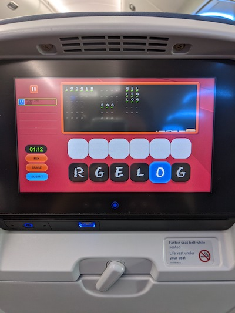

## CS 240 - Software Engineering

### Homework: Wordplay

_This assignment is based on a true story._ David was on a long flight home from Ohio with his kids recently. To kill time, he found himself playing a few games on the back of the seats on the plane. One game, called _Wordplay_ (he thinks), was by far the most interesting.
Here's how the game goes. The computer selects a random 6-letter word from the English dictionary. We'll call this the _root word_. The computer then scrambles the letters of this root word and displays it to the player. It is the player's job to list as many other words as they can think of that uses a subset of the root word. To reduce possibilities, the computer only considers words that are 3 or more letters in length. To remind himself of how the gameplay worked, here's a terrible picture David took on the plane. (By sheer accident, the 6-letter word happened to be _"logger"_.)



As he kept losing, because there are a lot of 3-letter words he didn't know existed, David got to thinking about how the game was written. Surely, each puzzle wasn't curated by someone... there's just too many possibilities to handcraft! To accomplish gameplay, the computer must run some internal algorithm to determine a list of possible English words of lengths 3-to-6 that can be formed using the letters of the root word. For instance, if the selected 6-letter root word is "popped", then the following words can be formed using a subset of its letters: "popped" (by default), "pop", "ode", "dope", "pope", "pod", and "pep".

We don't know how to manipulate graphics (yet) using JavaScript, so we'll simulate this game in the text console. In the beginning, the computer lists all possible words in hidden form (think Hangman). Every correct answer will reveal a word, and it's up to the player to try to guess them all. For instance, after guessing a few on the root word "popped", it might display:

```
Letters: e o p d p p

- - -
- - -
o d e
- - -
d o p e
- - - -
- - - - - -
```

Note that the available letters from the root word are scrambled and listed on top. The player can also mix those letters up if it helps get them past a mental block. In the real game, you can see that there is a 3 minute timer before the game ends, but we'll ignore the timer for our implementation.

#### Student Outcomes

- Use of JavaScript: Functions, arrays, objects, etc.

#### Starter Code and Git

Starter code for this assignment is provided in the github repo [https://github.com/davidtchiu/cs240-hwk-wordplay](https://github.com/davidtchiu/cs240-hwk-wordplay). Go to my github repo, and _*fork*_ this repository to your github account to obtain your own copy on github. Copy the Github URL to _your_ newly forked project. Then from your local machine, open a terminal, navigate to your directory for this class, and _*clone*_ your forked Github repo down to your local working directory. After you've done this, you can work freely in VS Code. Remember to commit when appropriate with substantive messages. Branch early and often. Push your `main` branch up to your github repo for backing up your work. I also will be checking out your Github's `main` branch for grading!

#### Working Solution

- [Click here](demo/) for my working solution of this App. This is how your solution should behave when it's done. (You'll need to cancel the first run, to open the Inspector and Console, then reload the page.)

- [Click here](demo2/) for testing against my App. This version lets you enter the root word and it does not hide the possible English words, so you can see if your results actually match mine. Try root words like: "popped", "grades", "joists".

#### Program Requirements

For full credit, your project should observe the following requirements.

- The starter code provides you with a file containing the English dictionary formatted as an array. It's easy to include this in your code: Create an `index.html` file that first includes the dictionary's `.js` file in a `<script>` tag, and then include your own `app.js` file in another `<script>` tag.

- The game starts by randomly selecting a 6-letter root word from the English dictionary. This word is not revealed to the user.

- The bulk of your work is the next step. Given root word, you are then to compute all the valid English words using a subset of its letters. A root word's letter cannot be used more than once, unless it appears more than once in the root word. For instance, the root word "hello" can't generate the word "lee" because 'e' only appears once in "hello". There are multiple ways to tackle this problem, so I'll leave it up to you, but keep in mind that time-efficiency matters -- we wouldn't want those pesky airplane passengers to lose their patience and exit the game before it even starts!

- Scramble the root word and output it to the console so the player knows what letters they have to work with. Then display to the console the current list of guessed/unguessed words to the user, and get their inputs. Repeat until all words have been guessed, or if the user presses cancel. For the words that have not been guessed, hide them using a dashes (one dash per letter separaated by space, like for Hangman). Print this output to the console.
  To prompt the user for an input, use:

  ```javascript
  let input = prompt(someString);
  ```

  To print and display a dialog window, use:

  ```javascript
  alert(someOtherString);
  ```

  To print something to the console window, use:

  ```javascript
  console.log(someOtherString);
  ```

- You should clear the console after each guess.

  ```javascript
  console.clear();
  ```

- Your program outputs an appropriate message on a given input. These messages are appropriate on a given input word:

  - Alert to the user: `word` is not a valid English word (or too short/long)
  - Alert to the user: `word` has already been found
  - Alert to the user: Correct!
  - The exception is if a `*` was entered. When this is the case, scramble the available letters and display the status of the game again. Alert the user that you have done this.

- The game ends on two conditions: if the user guesses all words, or if the user inputs null for a guess, which can be accomplished by pressing `Cancel` on the prompt.

  - Congratulate the user if they mananged to get all the words!
  - Otherwise, display the solution (all the valid words), as well as the number of words the player got right!

#### Optional Extension

If you have time, add a 3-minute countdown timer which starts as soon as the page is loaded. When the timer hits 0, the game ends.

#### Submission

Assignment submission is simple. Simply make sure that the latest code is committed and pushed into your forked `cs240-hwk-wordplay` on github (before the 12am deadline). Then send me the link to your repository on [canvas](https://canvas.pugetsound.edu).

#### Grading

```
CS 240 Homework (Word Play)

----------------------------------------------------------
[40/40pts] Algorithms

> Given a string, your program can determine a complete set of
  of English words that use a subset of letters in that string.

> Entering "*" for a guess will shuffle the available letters.
  The user should be alerted.

----------------------------------------------------------
[10/10pts] Game Play

> Your program hides all words initially (except for the root
  word), revealing them only as the player answers correctly.

> Your program outputs an appropriate message on a given input.
  These messages are appropriate on a given input word:
    * word is not a valid English word (or too short/long)
    * word has already been found
    * Correct!

> Your program congratulates the user and terminates when
  they guess all words.

> Your program terminates and reveals the key if null is
  given as input.

> Your program also outputs the number answered right.

----------------------------------------------------------
[5/5pts] Implementation and Efficiency

> Your program should demonstrate reasonable runtime
  efficiency of all algorithms. Appropriate data structures
  should be used.

----------------------------------------------------------
[5/5pts] Comments

> You include sufficient block comments for each class and method.

> You include sufficient inline comments in your methods.


----------------------------------------------------------
[0pts] Misc. Deductions
> Late?

----------------------------------------------------------
Suggestions (No Deductions)


Total: 60 pt
```
