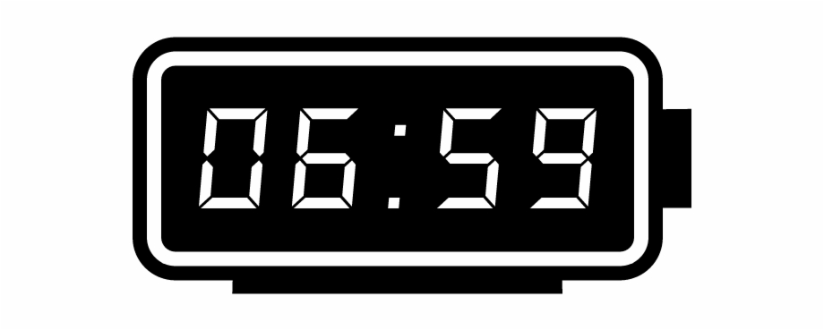
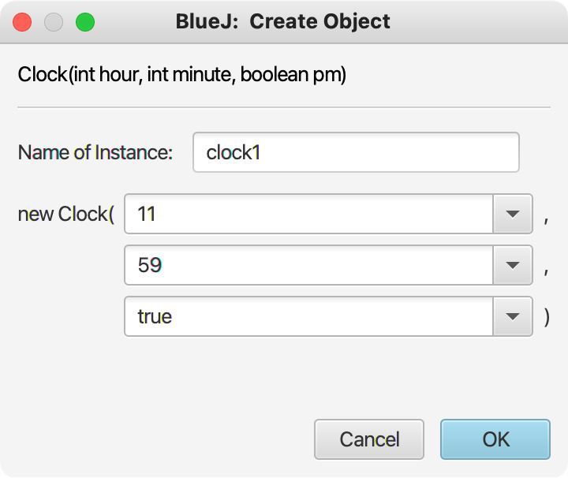
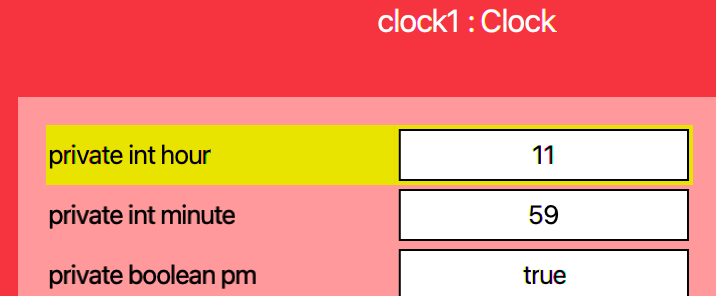
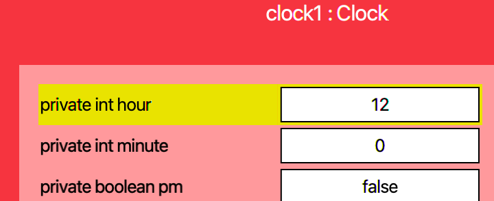

## CS 161 - Intro to Computer Science

### Homework: Alarm Clock

Clocks are cool. At a glance, they seem like just a glorified counter, ticking seconds, minutes, and hours up by one. But when we dig into them a bit more, we realize that there's actually a lot more detail that goes into properly implementing them. For instance, the minutes reset to 0 when they reach 60. The hours reset to 1 when they reach 13. We also need to keep track of am and pm, and that they change when the clock strikes 12.



In this project, you will put in the work to write a class of (alarm) clocks from scratch! I'll take you through the process of identifying your instance variables, and get you started on writing constructors and methods. You will have to have a pretty good handle on integer operations and writing if-else statements.


#### Student Outcomes

- To practice writing Java programs from scratch
- To use integer operations
- To use print statements and concatenation
- To use parameters, fields, and local variables
- To use if-else statements

#### Required Files

There are no starter files provided for this project. To create a new project, follow these instructions:   
  1. Open BlueJ. It might show you the most recently opened project, but that's okay.
  2. Click on the `BlueJ` menu (called `File` menu in Windows) on top.
  3. Select `New Project...`
  4. BlueJ will ask you for a project name. You can name it `Clock` or whatever you see fit.
  5. Then it asks you for the location to store the project. Click `Choose` and I'd put it along with your other projects for this class (hopefully in a Google Drive folder).
  6. Then click `OK`. BlueJ will automatically give you a sample class. You can remove it, and start clean.


#### Instructions

- **Instance Variables:** What do all clocks need to remember about themselves? Well, your clocks for this project need to store the hour, minute, and whether it is am/pm. (You can ignore seconds.) For the am/pm indicator, I would use a `boolean` data type to store an instance variable called `pm`.

- **Define a constructor:** The Clock constructor should be written to accept the hour, minute, and a boolean indicating whether the clock should be read as am or pm. Take the caller's inputs and store them in the corresponding instance variables. If you need a refresher on how to do this, check out Lab 2 (Triangle), or go to your class notes on Circle and TicketMachine.

  - However, you need to be *defensive* here. A user could give you a value for `hour` that is not within the range of 1 to 12. When this is the case, set the hour to 12 instead. A bad value for `minute` that is outside the range of 0 and 59 could also be given. When that's the case, set the minutes to 0.

- Implement a method called `tickUp()`. It does not return and it inputs nothing. Calling it will increment the minute counter by one. Be careful though. If the current minute counter is at 59, then `tickUp()` must cause the hour to increment too, and you should reset the minute to 0 instead of incrementing it to 60! Taking this idea further, if the hour increments from 11 to 12, then the am/pm state needs to be flipped! Furthermore, if the hour increments from 12 to 13, then you need to reset the hour counter back to 1!

  - You need to write if-statements to test if your hours/minutes are in one of those boundary conditions. I would draw it out on paper (and in English) before trying to code it up.

  - If you've coded everything up, test by creating a clock representing 11:59pm.

    

  - Inspect the object to ensure your state is correct:

    


  - Ticking up the clock once should make it 12:00am. Inspect the object after you tick up to show:

    

  - Test your method out using some other times just to convince yourself that you're doing everything properly.

- Next, create a new method called `tickDown()`. It should have the opposite effect of `tickUp()`! Each call should tick the minute down by one. Again, beware of "boundary conditions" just like before. Try starting the clock to 1:00 am, and `tickDown()`. Verify that you should get 12:59 am. Likewise, setting the clock to 12:01 am, and calling `tickDown()` twice should now yield a time of 11:59 pm.

- Now add a new method called `showTime()` that inputs and returns nothing. This method should print either the string `"hh:mm am"` or `"hh:mm pm"`, where `hh` is the 2-digit hour counter, and `mm` is the 2-digit minute counter. 

  - Note that the 2-digit `hh` and `mm` format calls for you to concatenate a leading `0` to the hour or minute counter if they are single-digit. For example, suppose your clock's state is set to hour = 9, minute = 4, pm = true. Then calling `showTime()` would print: `09:04 pm` and not simply `9:4 pm`.

  - You should find it helpful to create a local String variable and assigning it to the empty string `""` first. Then "build" this string up piece by piece. After you're done building the string, print it out before exiting the method.

#### Alarm Function
When you've tested everything you've written so far, let's add some new functionalities. Specifically, we want to add an alarm function.

- We need to store more instance variables. Add 3 more instance variables, that will capture the hour, minute, and am/pm of the alarm.

- Because you added instance variables, you need to go back into your constructors to initialize them. Let's go ahead and initialize them to `-1`, `-1`, and `false`, respectively.

- Write a new method `setAlarm()` that returns nothing, but takes as input the hour, minute, and am/pm of an alarm the caller would like to set. Assign your new instance variables to the values that are input.

- Write a method called `unsetAlarm()` that returns nothing, and resets the hour, minute, and am/pm status of your alarm to `-1`, `-1`, and `false`, respectively.

- Write a method `isAlarmSet()` that accepts no inputs, but returns the status of the alarm as a `boolean`. If the hour and minute of the alarm are both set to `-1`, then this method returns `false` (that is, no alarm is set). Otherwise, this method returns `true`.

- Next, inside `tickUp()`, you'll need to add some code to check if the current time (after ticking up) matches the alarm time. If the hour, minute, and am/pm status all match, then you should print `***** BEEP BEEP BEEP *****` to the terminal. Make sure `tickDown()` also checks for the alarm to go off.

#### Example Output
Here's a sample interaction of my working clock. If you type out the commands in your BlueJ Code Pad, you should get outputs that match mine. The lines below starting with `>` denote output to the terminal.

Specifically, I create a clock given a time of 11:57 pm. Then I tick up 3 times and show that it is now properly showing 12:00 am (the minutes wrapped around to 00, and the hour incremented to 12; additionally, pm flipped to am.) Next, I set an alarm for 11:58 pm, which we're already past. So I tick down twice, and the clock reaches 11:58 pm, setting off the alarm. Finally, I print off the state of the alarm to show that it is currently set. So I unset the alarm, and print off the state again.

```java
Clock myClock = new Clock(11, 57, true);
myClock.showTime();
> 11:57 pm

myClock.tickUp();
myClock.tickUp();
myClock.tickUp();
myClock.showTime();
> 12:00 am

myClock.setAlarm(11, 58, true);
myClock.tickDown();
myClock.tickDown();
> ****** BEEP BEEP BEEP ******

myClock.showTime();
> 11:58 pm

System.out.println(myClock.isAlarmSet());
> true

myClock.unsetAlarm();
System.out.println(myClock.isAlarmSet());
> false
```


#### Optional Extensions
If you have some time to spare and want to extend your clock, try doing the following optional challenges:

  - Add a method called `show24HrTime()` that prints the current time in 24-hour format (no am/pm needed). Recall that 12:00am is shown as 00:00, and that if it's between 1pm to 11pm, you need to add 12 to the hour! For instance, 10:00pm should be displayed as 22:00. (Don't worry, we'll ignore it when grading, but give kudos if you properly implemented it.)

  - Add a method called `addMinutes(int min)` that adds a given number of minutes `min` to the current time. Your clock needs to reflect any changes the addition would have had on the hours and the am/pm status. Don't forget that `min` can be given as a negative number too...


#### Grading

```
This assignment will be graded out of a total of 85pts.

[5pts] Appropriate instance variables have been defined for this class.
       No local variables are defined as instance variables.

[10pts] The constructor is properly implemented and defenseive to bad inputs. Upon 
        receiving a bad hour, set the hour to 12. Set the minutes to 0 if a bad input
        is given to it.

[15pts] tickUp() moves the clock ahead by 1 minute, which may cause am/pm to flip. It may   
        also cause the hour and minutes to "wrap around" to the beginning.

[15pts] tickDown() moves the clock back by 1 minute, which may cause am/pm to flip. It may   
        also cause the hour and minutes to "wrap around" to the beginning.

[15pts] The showTime() method accepts an input and prints the current time in either 
        If either hour or minute is single digit, then a leading 0 is appended.

[10pts] The setAlarm(),  unsetAlarm(), and isAlarmSet() methods are properly implemented.

[10pts] tickUp() and tickDown() further print out ***** BEEP BEEP BEEP **** if the time now 
        matches the alarm that is set.

[5pts] You include sufficient inline and block comments to explain the logic of your methods.
```

#### Submitting Your Assignment
Follow these instructions to submit your work. You may submit as often as you'd like before the deadline. I will grade the most recent copy.

- Navigate to our course page on Canvas and click on the assignment to which you are submitting. Click on "Submit Assignment."

- Upload all the files ending in `.java` from your project folder.

- Click "Submit Assignment" again to upload it.

#### Credits

Written by David Chiu. 2023.