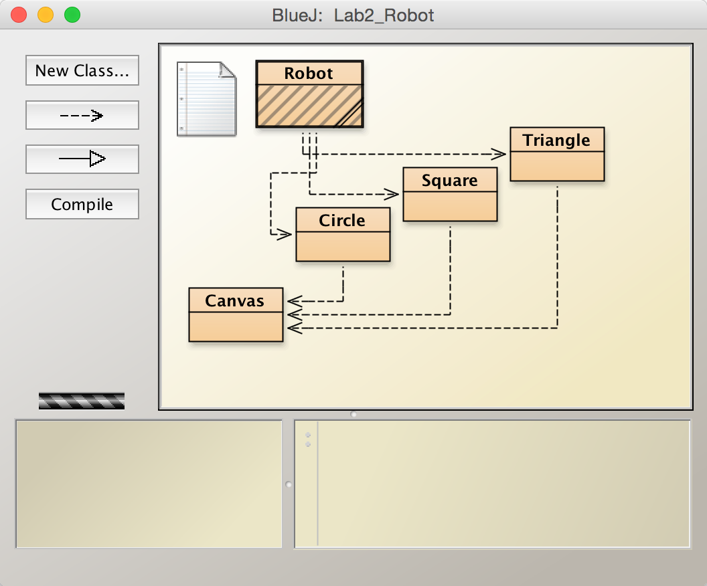
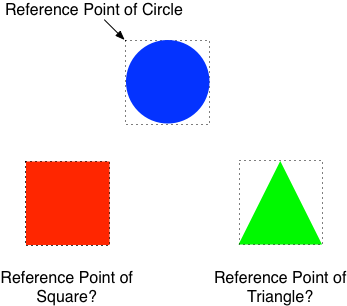
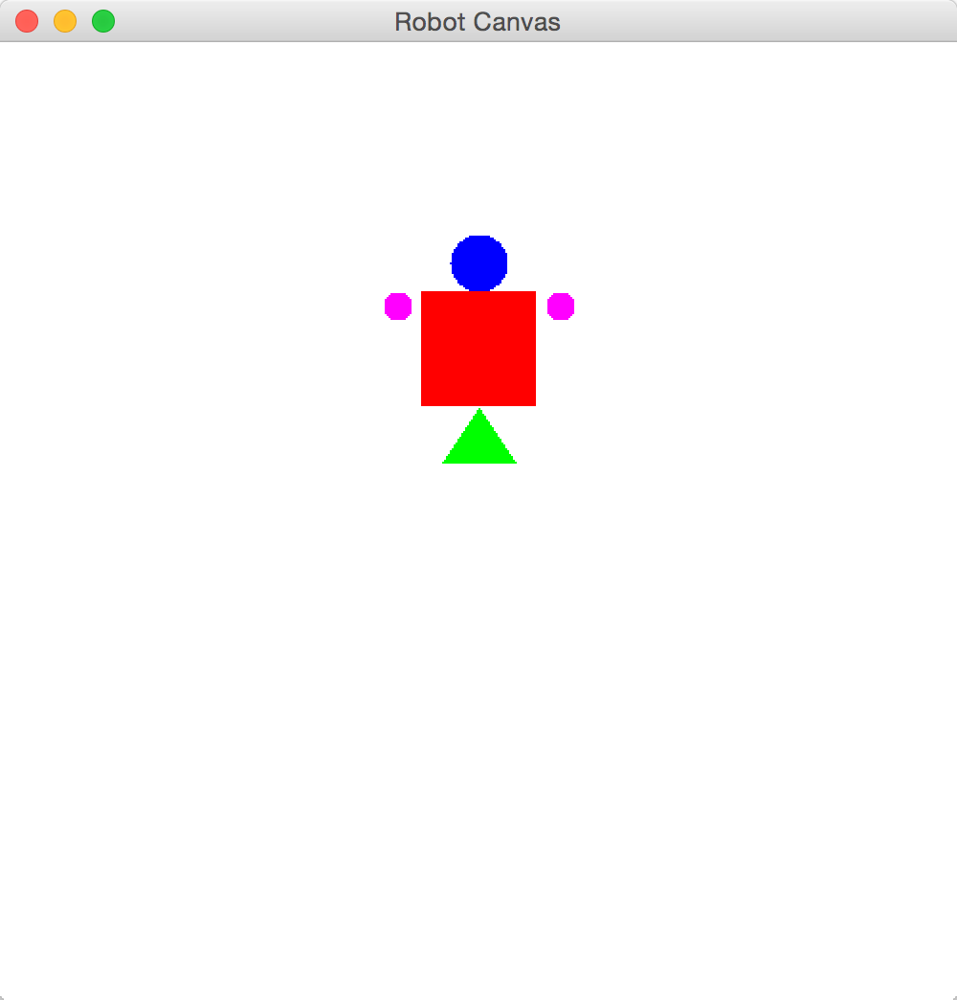
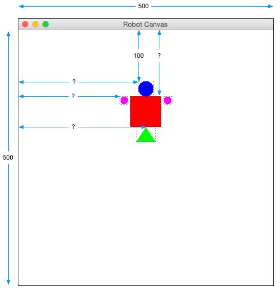
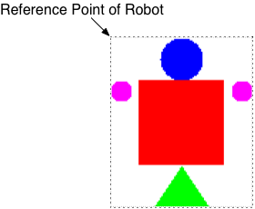
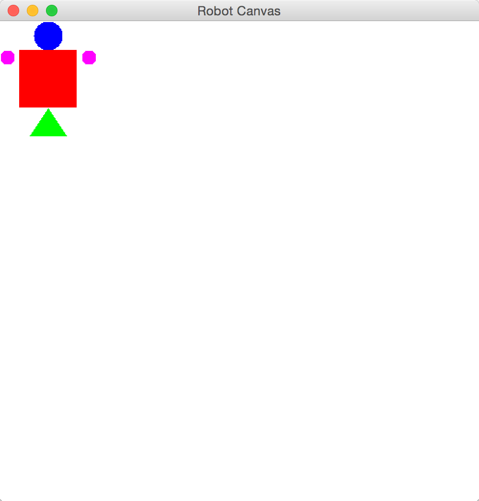
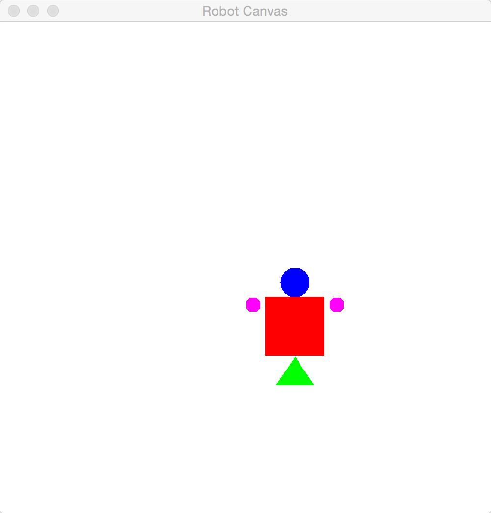

## CS 161 - Intro to Computer Science

### Homework: Robots

In class we talked about the importance of modularity and abstraction to create larger-scale software applications. In the modularity step, the software designer breaks down the desired product into smaller, easy-to-program pieces. After each of these pieces have been programmed and tested, one can then focus on putting them together to obtain the desiderata.

For this assignment, your task is to program a robot that can move around, shake its head, wave, etc. Then you`ll program a dance routine involving a pair of robots.

#### Student Outcomes

- Practice using abstraction and modularity
- Using with object interaction
- Writing a simple loop

#### Required Files

The following file(s) have been provided for this assignment.

- [Hwk4_Robot.zip](Hwk4_Robot.zip)

#### Preliminary: The Canvas` Coordinate System (Do Not Skip!)

- Download Hwk4_Robot.zip and extract it. You can open this project by either double-clicking on the `package.bluej` file inside the project folder. You should see the following classes:

    

- Create a `Circle` object, and take a look at its methods. You should notice a new one
  called `moveTo(int x, int y)`. Call this method a few times on certain inputs for `x` and `y`,
  and take note on where it positions the `Circle`. Of particular interest
  is the location `(0,0)`. Notice how it is the _top-left corner_ of the imaginary the box
  enclosing the `Circle` that is placed at `(0,0)`. This implies that the `moveTo(int x, int y)` method would
  move any Circle to the given location relative to that imaginary corner, we'll call that the <b>reference point</b>
  of the `Circle`.

    

- Test out the `moveTo(int x, int y)` methods belonging to the Square and the Triangle next. Where are the reference points for these two shapes? Pay particular attention to the Triangle.

#### Part 1: Defining a Robot Class

- Notice the new class, `Robot`. Double-click on it to open up its source-code. Aside from the class header and some comments, this file is again pretty empty. Now, to design a robot, we need to think about what state and behaviors it should have. Let's focus on its state initially. For sake of consistency, we'll assume in this assignment that our robot should look like the one depicted below:

  

  State: What should a Robot remember about itself? For starters, it should probably remember that it has a head, arms, body, and feet. There may be more state to be added later, but let's focus on these for now. Go ahead and declare these instance variables.

- At this point, you've merely declared the instance variables' existence, and you have yet to assign any values to these instance variables. Define the default constructor (that's the one that accepts no inputs). For each instance variable, you need to instantiate it using the syntax you've seen in class:

  ```java
  objectName = new ClassName();
  ```

- For instance, you should have declared the `feet` field as a `Triangle`. To instantiate it you would write:

  ```java
  feet = new Triangle();
  ```

- Now that the default constructor is written, try to create a Robot object. Yikes! It doesn't look much like a Robot, does it? All the body parts seem to be there, but they're way out of whack. Alas, there's more work to be done in the constructor to get all these pieces into the right place. Here's how I want things positioned:

  - The canvas you're working on is 500 by 500 pixels. You cannot change these dimensions.
  - The head should have a diameter of 30. The top of the head should be 100 pixels down from the top of the canvas. The head is to be centered in the middle of the canvas.
  - The body is a 60 x 60 Square, and should be centered under the head. The bottom of the head and the top of the body must be at the same level.
  - The arms should be colored magenta, and each arm has a diameter of 15, and must be aligned with the top of the body. Each arm must be a distance of 5 pixels away from the body.
  - The feet is a triangle with a height of 30 and a base of 40. It is horizontally centered with the body. The top of the feet and the bottom of the body are at the same level

  **DON'T IGNORE THIS:** We strongly suggest you draw out the coordinate system with dimensions and the expected coordinates of each shape on a piece of paper before you start writing the code to move the Shapes. The design and planning of algorithms is often overlooked, even by expert programmers. Take our word for it, it will save you a ton of time to do this now. We've even gotten it started for you, so no excuses.

  

- Important: Once you figure out all the shapes' initial coordinates, use each shape's `moveTo()` method to get them to the right place!

#### Part 2: Robotic Motions

- Write a method, `shakeHead()` that causes the Robot to shake its head horizontally (see video below).

<video width="420" controls>
  <source src="https://i.gyazo.com/02a78f5a6a8a3555af5f2b4694070964.mp4" type="video/mp4">
  Your browser does not support the video tag.
</video>

Thanks to **abstraction**, we can ignore the details on *how* to get the head to move smoothly (since `Circle` objects already provide that functionality!). We only need to focus on making the movements appear like the head is shaking side to side. This method should only be a couple lines of code. Test and ensure it is working.

- Write a method, `waveHand()` that causes the Robot to raise its left hand up and down twice (see video above). Again, this method should only be a few line of code.

- Isn't abstraction great? Because the coders before us had ensured `Circle`s (and other objects) are expertly coded and tested, we don't need to worry about their implementation details. We simply called their existing methods to do what we want, so that our focus can stay on the task at hand.

#### Part 3: Behaviors - Adding Movement

- Lets give the Robot the ability to move around. Particularly, we're interested in providing methods to move the entire robot (all body parts) vertically and horizontally. Provide the methods,

  - `moveHorizontal(int distance)`
  - `moveVertical(int distance)`

  These methods will move the robot horizontally or vertically by the specified distance.

- Again, the key is to trust that the individual shapes' methods are expertly programmed and can be called  to do what you want!

#### Part 4: Robot Learns Teleportation

- Moving the Robot by specific distances is all well and good, but a cooler Robot can teleport to specific coordinates on the canvas, just like how the shapes could. Before we can get started on writing such a method, we need to do some more planning.

- Remember how each shape had its **reference point** to move by? We need to define a reference point for our Robot. Draw an imaginary box around your Robot, we will make the top-left corner of that imaginary box our reference point.

  

- The reference point can be represented by the current `x` and `y` coordinates of that top-left corner. That means the Robot now needs to remember these coordinates, which are both integers. Go back up in your source code and add these instance variables.

- After you've added these two fields, you need to think about how to assign them values. Well, the first place they should get assigned values is inside the default constructor. Based on where the constructor positions the robot, you should be able to easily compute the coordinates for that top-left imaginary corner. Once you know the coordinates, assign them to your new fields.

- Your "move" methods must also update the coordinates based on the distance moved. That is, create a new Robot object, and inspect its coordinates. Then move it horizontally and vertically. Inspect its coordinates again. They should reflect its current location.

- Now add the following method:

  ```java
  /**
  * Moves the Robot to the specified location
  */
  public void moveTo(int newX, int newY)
  ```

where `newX` and `newY` are the new coordinates to which the Robot should move. A hint for writing this method: Use the `moveHorizontal()` and `moveVertical()` methods you just wrote. If your code for implementing the Robot's `moveTo()` is more than a few lines, your code is probably off-base.


- Here are a few examples to check your work.

    <table width="100%">
    <tr>
    <td align="center" width="25%">
    (1) After instantiation<br/> <code>Robot robo = new Robot();</code><br/>
    
    </td>
    <td align="center" width="25%">
    (2) Then calling<br/> <code>robo.moveTo(0,0);</code><br/>
    
    </td>
    <td align="center" width="25%">
    (3) Then calling<br/> <code>robo.moveTo(250,250);</code><br/>
    
    </td>
    <td align="center" width="25%">
    (4) Then calling<br/> <code>robo.moveTo(200,100);</code><br/>
    
    </td>
    </tr>
    </table>


#### Part 5: A Pair of Robots

- Playing with one Robot is cool and all. You know what's cooler? Playing with two Robots. Create a new class called `RobotPair`.

- State: A `RobotPair` remembers two Robot objects.

- Constructor: The constructor of this class instantiates the two fields with calls to the Robot constructor. Next, you'll want to move these robots so that they're side-by-side. Move one Robot to `(125,200)` and the other one to `(275,200)`.

- Behavior: Now that we can manage two Robots (like how CircleDrawer controlled two Circles), let's write some methods that can control both of them! Add these methods below. The first one will move the Robots apart by a distance of 50, and conversely, the second method moves them together closer by a distance of 50.

  ```java
  /**
   * Moves the Robot apart along the horizontal axis by a distance of 50.
   */
  public void moveApart() {
    // TODO 
  }

  /**
   * Moves the Robot closer together along the horizontal axis by a distance of 50.
   */
  public void moveTogether() {
    // TODO
  }
  ```

- Before moving on, create a `RobotPair` object in BlueJ, and test out your methods.

- Almost done. Write a method that will ask the Robots to perform a dance routine. This method has the following signature:

  ```java
  /**
   * Makes the Robots do a special dance
   */
  public void dance() {
    // create a dance routine. You must incorporate two loops.
  }
  ```

- Important: Your dance routine must employ at least two loops. Here's an animation of my dance routine below.  Feel free to create your own dance routine, adding even more methods if necessary. Also remember that all those Robot's methods you wrote earlier are still available to use (e.g., moveVertical, moveHorizontal, moveTo, ...).

<video width="420" controls>
  <source src="https://gyazo.com/c71245b5f41e631a7aed80e6642ec3da.mp4" type="video/mp4">
  Your browser does not support the video tag.
</video>

- You are welcome to add any other movements and motions for the robots to perform your dance. 

#### Program Defensively

You can't control how another user or program chooses to use your methods. For each method, think critically about all the things that could go wrong and cause an unintended result (e.g., a runtime error, infinite loop/recursion, etc.). Chances are, I`ll be trying all kinds of inputs (negative values, zeroes, nulls, empty-strings, etc.) when I grade your program. The mark of a good programmer is one that can anticipate such scenarios ahead of time and ensure that their program handles all sorts of errors gracefully.

#### Commenting

Each and every method should have a "javadoc-style" comment above it (the ones that use `/* ... */`). For full credit, you should use the @param and @return tags as appropriate in these method comments. Each instance variable (field) should have a brief comment as well. Don't forget the main comment at the top of the class either - I`m looking for more than just a sentence or two.

#### Grading

```
This assignment will be graded out of 80 points:

[10pt]  Your Robot constructor properly initializes the shape components
        of the Robot and get them into the proper positions

[5pt]   The Robot's shakeHead() method slowly moves the head to the left,
        right, and back..

[5pt]   The Robot's waveHand() method slowly raises the robot's hand twice.

[5pt]   The Robot's moveHorizontal() method moves the entire Robot
        horizontally by the given distance

[5pt]   The Robot's movevertical() method moves the entire Robot vertically
        by the given distance

[20pt]  The Robot's moveTo() method will move the entire Robot to the given
        coordinate. You must track its current position in fields and use
        the moveHorizontal() and moveVertical() methods.

[5pt]   Your RobotPair class has two Robot references stored as fields and
        its constructor instantiates the Robots.

[5pt]   Your RobotPair's moveTogether() will move the pair closer together.

[5pt]   Your RobotPair's moveApart() will move the pair further apart.

[10pt]  Your RobotPair's dance() method will cause the pair to perform a
        silly dance routine. Two loops are necessary for full credit.

[5pt]   All methods include a JavaDocs comment describing its interface.
```


#### Submitting Your Assignment
Follow these instructions to submit your work. You may submit as often as you'd like before the deadline. I will grade the most recent copy.

- Navigate to our course page on Canvas and click on the assignment to which you are submitting. Click on "Submit Assignment."

- Upload all the files ending in `.java` from your project folder.

- Click "Submit Assignment" again to upload it.

#### Credits

Written by David Chiu and Joel Ross.
