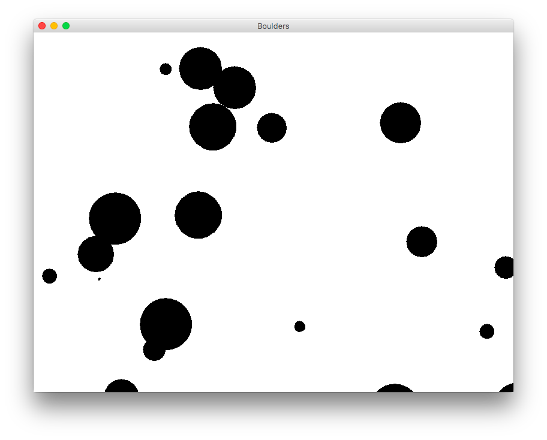

## CS 161 - Intro to Computer Science

### Lab: Boulders (File Handling)

NASA called and asked you to consult on their latest astronomical simulations. When they heard you'd worked with managing collections circles on a lab exercise, they hired you on the spot! NASA wants to be able to create large collections of boulder-like objects and simulate their motions on the screen. They've got a few more requests that you can read about below.

<center></center>

#### Student Outcomes

- To work with file handling in Java
- To deal with String parsing
- Practice with loops and lists

#### Required Files

The following file(s) have been provided for this homework.

- [Lab10_Boulders.zip](Lab10_Boulders.zip)

#### Helpful APIs

The API handouts that you'll want to have in front of you:

- [ArrayList](../api/ArrayListAPI.pdf)
- [Scanner](../api/ScannerAPI.pdf)

#### Part I: Boulders

I've created a new project to get you started.  There's a `Canvas` class that helps display our objects, a Boulder class (that's smart enough to wrap instances around at the edges of the screen), and a `BoulderSim` class that's mostly empty at this point. First you'll make a few small improvements to the Boulder class, then define methods in the `BoulderSim` class.

- Open the `Boulder` class. Try to understand this class by reading its fields and available methods. You'll see quite a bit of similarities with the `Circle` class, except that `Boulders` keep track of velocities. Note that it has a constructor, and the constructor expects the user to pass in most of the information about the new boulder they want (including its initial position, velocities, and size).

- Create a couple `Boulders` and test them out. Check their state after running `updatePosition()` to see what that does.

- Create the `toString()`. It returns a String describing the boulder's state. It should include the size, position, and speed (see below on how it's supposed to be formatted).

- The sample interactions on code pad below illustrate the creation a `Boulder` object, and its output from `toString`:
  ```java
  Boulder b = new Boulder(52, 656.063, 240.661, -13.301, 4.454);
  System.out.println(b.toString());
  > Boulder of size 52 is at 656.063, 240.661 with velocity -13.301, 4.454
  ```

#### Part II: BoulderSim and File Handling

We currently have a way to draw boulders on the canvas, but if we were to add all the boulders into our program by hand, it would take forever and it would be error-prone! Instead, NASA has collected the sizes, starting positions, and velocities of each boulder in a comma-separated file. This file is named `boulders_data.txt`, and it's been provided to you in the project folder. You should open it up to see its contents!

Here is the content of `boulders_data.txt`, which is given to you in the project:

  ```
  50,372.1875893819677,133.87776166702926,11.932056023677355,-10.554410451924971
  19,433.82398487718194,481.6550233232082,-6.080615674768774,4.478703423386534
  25,14.205130964340174,393.97603145969526,11.11050281871444,7.603736784016846
  52,620.951230348042,323.61362827344834,5.114525160868034,-4.187689679784777
  38,768.4674629842491,373.37094868583165,-1.8793981371839266,2.323836781228364
  5,106.94259393133359,409.1286104889523,8.541187451017588,-2.0980170740851207
  100,50,10,10,20
  ```

  Each line contains data for the state of a Boulder. The values are separated by a comma as follows: `diameter`, `xPosition`, `yPosition`, `xVelocity`, and `yVelocity`.

- The next objective is to write a class that manages an ArrayList of `Boulders`. This class will read from the `boulders_data.txt` and construct `Boulders` based on the properties given in the file. Then it will allow us to simulate the motions of all these boulders over time.


- Implement the `BoulderSim` constructor, which inputs the name of the file containing the boulder data. Your constructor should read this file and create the required number of boulders (using the `Boulder(..)` constructor) and add them to the `ArrayList`. While you're at it, make sure you call `makeVisible` on each boulder so they all start out visible. As you read in your file, you are reminded that a `String` can be tokenized using the `split(..)` method. You can also convert strings to `doubles` and `ints` using the `Double.parseDouble(..)` and `Integer.parseInt(..)` methods, respectively.

  - Remember that, since the constructor is opening a file, you must specify that it `throws FileNotFoundException`.
  - Remember to `close()` out the Scanner after you're finished reading the file.

- Once you're done writing the constructor, you can test it by creating a new `BoulderSim` object, and passing it the `boulders_data.txt` file. If everything works, you should get no runtime exceptions and see six Boulders on the canvas.

- Move on to `animate(..)` which takes an `int` as input: the number of update steps that should be performed on the collection of boulders. If the user passes `10` as an input to the method, for example, each boulder in the group should have its position updated, then you should run it again, and again, until each boulder has had its position updated `10` times. (Do not just update the first boulder `10` times, then the second boulder `10` times, etc. That wouldn't look right.)

  It should look something like this, when run except that my boulders collide with each other (you'll deal with collision a little later):

  <video alt="Video from Gyazo" width="400" autoplay muted loop playsinline><source src="https://i.gyazo.com/23833682efd385e2c434d4e44f52f55c.mp4" type="video/mp4" /></video>

<!-- - Add the `public static void main(String[] args)` method to your `BoulderSim` class. You may want to refer back to the notes for its syntax. The method should simply instantiate a new `BoulderSim` object with the `boulders_data.txt` file we've been working with, and call animate for `200` time steps. -->

#### Festive Boulders

Let's say we wanted to jazz up our boulders by adding some colors.

- Go in your file finder and open up your `boulders_data.txt` file and add a color to the end of each row (i.e., the last column of each row, separated by comma). Remember to add a comma. The available colors include: `black`, `red`, `green`, `blue`, `yellow`, `magenta`. Save the file after you're done.

- But now that the file's content has changed, your code need to account for colors! Modify your code so that it additionally reads in the new column of data. Additional to creating the boulders themselves, you'll need to change its color to the color listed in the file!

- **Food for Thought** You should find it slightly irritating that a change to the file causes you to change the program. What if I had asked you to add the color into the first or second column of the file, instead of the last column? How would your program change? Would it be a bigger pain to ensure that your program still works?

  - It would be nice if your programs didn't have to be modified and recompiled every time a change in the file's format occurs. This is called **Data Independence**, and is one of the key problems of computer science. We study this problem in the field of *Database Systems*, an upper-division elective.

#### Collision Detection

Currently the boulders just pass through each other, which looks okay if we assume that we're looking at a 3D space and that they're actually quite far apart from each other. But what if we assumed that we're looking at a 2D view? They should be colliding and bouncing off of one another.

- Add an `overlaps(Boulder other)` method to the `Boulder` class. It should take another boulder as an input, and return `true` if the other boulder overlaps with this boulder. Two boulders overlap if the **distance** between _our_ boulder's position and the other boulder's position is less than the sum of both boulders' radii. For distance measurement, you can use the Euclidean distance formula, $$\sqrt{(x_{1}-x_{2})^2+(y_{1}-y_{2})^2}$$. (There's a `Math.sqrt(..)` method that you can use for calculating the square root.)

- Update your `animate()` method so that, for each time-step, it first checks to see if any boulders are overlapping with one another. If they are, they should bounce off of each other. A simple way to achieve this is by reversing their velocities.

#### Optional Extensions

If you're done early and want some more practice, try the following exercises:
Make the boulder collision more realistic by taking into account their size.

- Write a new version of the `updatePosition` method that has the boulders "bounce" back off of the walls rather than wrapping around.

- Implement a method called `writeToFile(..)`. It takes another file name as input. This file, you need to open the given file name for writing. When called it should print out information on each of the boulders in the collection into the given file. For full credit, there should be a boulder "number" printed out with each entry, with the first boulder being displayed as #1.

- After loading the data from the given file, I called `updateAll(250)` to move the boulders around by 250 steps. I then call `writeToFile("boulders_out.txt")`. Inside this file, I find:

  ```
  1: Boulder of size 50 is at 155.20159530130397, 495.2751486857869 with velocity 11.932056023677355, -10.554410451924971
  2: Boulder of size 19 is at 513.6700661849919, 401.3308791698421 with velocity -6.080615674768774, 4.478703423386534
  3: Boulder of size 25 is at 391.8308356429477, 494.91022746390956 with velocity 11.11050281871444, 7.603736784016846
  4: Boulder of size 52 is at 299.5825205650542, 476.6912083272544 with velocity 5.114525160868034, -4.187689679784777
  5: Boulder of size 38 is at 298.61792868827456, 354.3301439929203 with velocity -1.8793981371839266, 2.323836781228364
  6: Boulder of size 5 is at 642.2394566857287, 484.62434196767174 with velocity 8.541187451017588, -2.0980170740851207
  ```

#### Grading

```
This assignment will be graded out of 2 points, provided that:
- You were in attendance and on-time.
- Completed all required methods.
```


#### Submitting Your Assignment
Follow these instructions to submit your work. You may submit as often as you'd like before the deadline. I will grade the most recent copy.

- Navigate to our course page on Canvas and click on the assignment to which you are submitting. Click on "Submit Assignment."

- Upload all files ending in  `.java` from your project folder.

- Click "Submit Assignment" again to upload it.

#### Credits

Written by David Chiu.

#### Lab Attendance Policies

Attendance is required for lab. Unexcused absence = no credit even if you turned in the lab. Unexcused tardiness = half credit.
