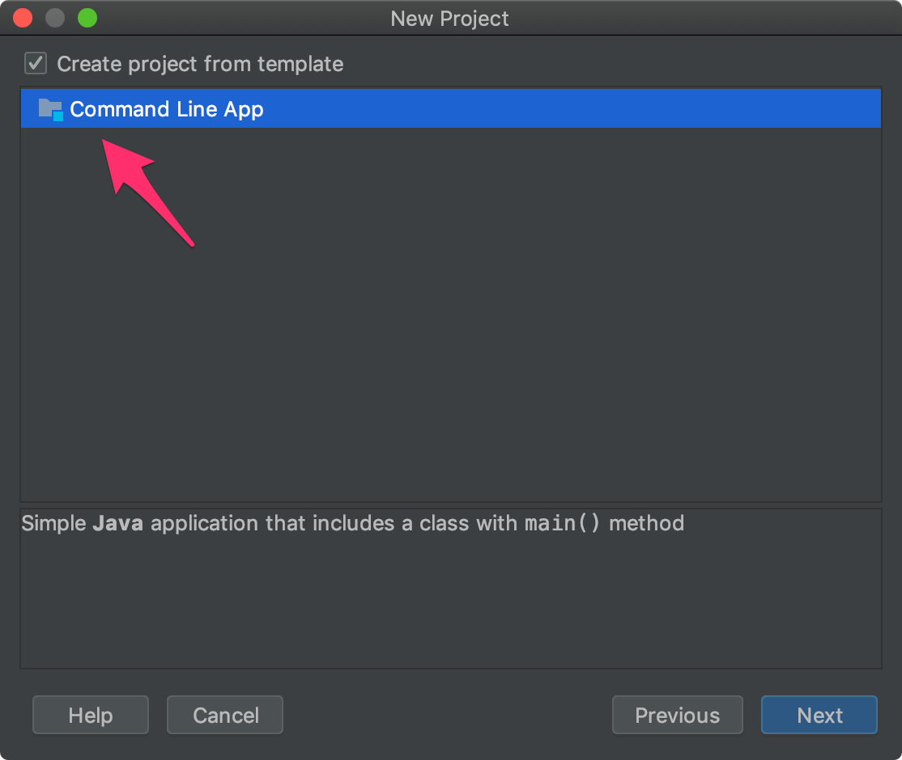
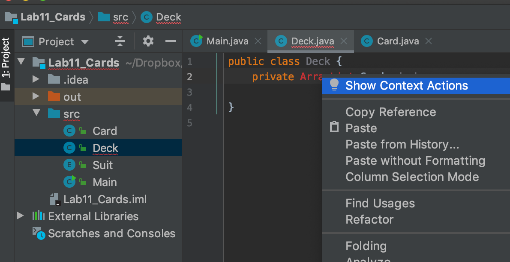
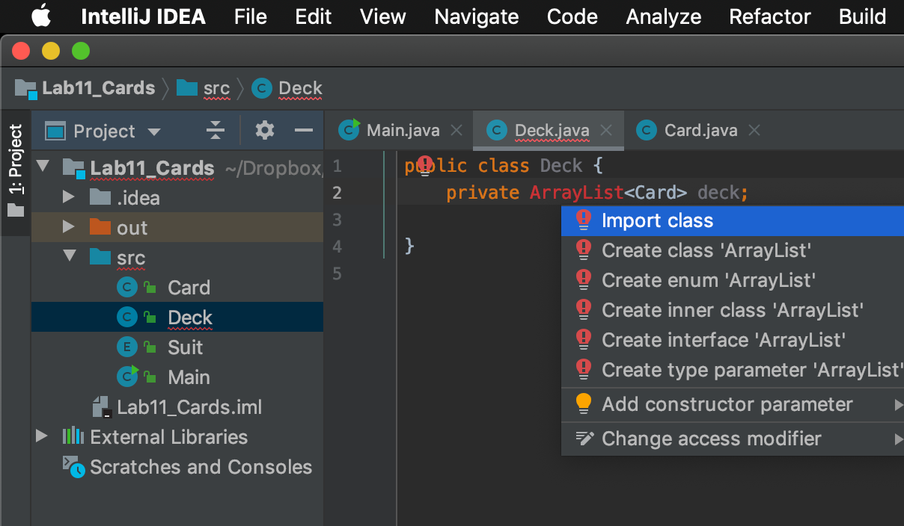

## CS 161 - Intro to Computer Science

### Lab: Playing Cards


In this lab, you will create classes that model playing cards and decks of playing
cards. You will practice using enum classes, and the `main()` method.

#### Student Outcomes

- Practice writing/using `enum` classes
- Practice writing the `main()` method

<!--
#### Required Files

The following file(s) have been provided for this homework.

- [Download IntelliJ IDEA](https://www.jetbrains.com/idea/)
-->

#### Helpful APIs

The API handout that you'll want to have in front of you:

- [ArrayList](../api/ArrayListAPI.pdf)
- [Random](../api/RandomAPI.pdf)

<!--

#### Part 1: Running a Simple Program in IntelliJ

If you haven't already, download and install IntelliJ. When you run IntelliJ for the first time, it will ask you where to place its "workspace". This is the folder in which it wants to store all of your coding projects. I'd recommend choosing a folder in your Google Drive, so that things are backed up!

- Once installed, you should get a dialog window (shown below). Select "Create a new project."

  

- Make sure that Java is selected on the left panel. Under "Project SDK" you may or may not be running "Java version 13" (as shown), but if the option is empty or can't be found, then let me know right away! Do not select anything under "Additional Libraries" and click "Next."

  

- Select "Create project from template" on the next screen, and click "Next" again.

  

- In the following window, name your project Lab_Cards, leave `"Base Package"` blank (erase what's already in there), wand hit `"Finish."`

- This should bring up the editor, with a `Main` class already open. It has also provided you with the `main()` method. Print out some dummy message within main. Save it, and to run the program, look for the green "play" button on the top-right corner of your editor. Important: There's no more object workbench or point-and-click menus to run methods. Anything you want to do involving your objects must be scripted in the `main()` method so that it can be run.

  

- Once you run your program for the first time, the terminal with the output should appear on the
  bottom panel.

  

- Now, let's create a new class. Right click on the `src` folder (shown below) and select `New -> Java Class`. Name your class `Card`, and follow the rest of the instructions..

  

-->

#### Preliminary: The main() Method
Create a new class called `Main`. Inside the class, you should provide a single main method. Feel free to copy and paste the segment below:

```java
public static void main(String[] args) {
  System.out.println("Test");
}
```
Within the main method, print out some dummy message within main. Save it, and to run the main method, simply right-click on the `Main` class, and call the `main()` method. Hit enter on the dialog box that pops up.

#### Part 1: Card Class and Suit Enum Class

- Start writing the `Card` class. Each `Card` has a face-value and a suit.

  - The `faceValue` is an integer from 1, 2, 3, 4, ..., 12, and 13.
  - The `suit` is a constant with the following options: `CLUB`, `SPADE`, `HEART`, `DIAMOND`.

- Before going any further, create a new `enum` class called `Suit`, which defines `CLUB`, `SPADE`, `HEART`, `DIAMOND`. Now ensure that your `Card`'s `suit` field is of a `Suit` data type.

- Back in `Card`, 


- you need to implement two constructors:

  - A default constructor that randomly generates a suit and face value. For the face value, you simply need to generate an integer between 1 and 13 (both inclusive). What do you do to generate a random suit?

    How do you create a random suit? Here's a hint. The `Suit.values()` method returns an *array* of all the constants you listed in the `Suit` enum class.


  - A second constructor that takes as input a given suit and face value. If the given face value or suit is not legal. For instance, the face value was given as a negative number, or a number greater than 13, then you should print out an error message, and instead create a random legal Card.

- Implement and document the following methods. Remember to write-and-test, write-and-test! That means you need to go back and forth between this class and the `main()` method.

  - `int getFaceValue()`: Getter for this card's face value.

  - `Suit getSuit()`: Getter for this card's suit

  - `boolean hasSameFaceValue(Card other)`: Returns true if this card has same face value as another given card

  - `boolean hasSameSuit(Card other)`: Returns true if this card has same suit as another given card.

  - `boolean equals(Card other)`: Returns true if this card has same face value and suit as another given card. Seems like there's code that can be re-used here...

  - `boolean isFaceCard()`: Returns true if this card is a face card (i.e., is the faceValue is 11, 12, 13)

  - `boolean isRed()`: Returns true if this card is red. Diamond and heart suits are red.

  - `boolean isBlack()`: Returns true if this card is black. Club and spade suits are black.

  - `boolean outRanks(Card other)`: Returns true if this card has greater face value than another given card. This one can be a tiny bit tricky, because an Ace (face value of 1) outranks all other face values, except other Aces.

- Here's what should happen if you typed the following in `main()` and ran it. Notice an illegal card entered into the constructor below. Notice how the constructor generated a random card instead.

  ```java
  public static void main(String[] args) {
      Card card1 = new Card(Suit.CLUB, 15);
      System.out.println(card1.getFaceValue());
      System.out.println(card1.getSuit());
  }
  ```

  ```
  > ------------ HERE IS THE OUTPUT -------------
  > 7
  > HEART
  > Illegal card entered. Generating random card.
  ```

- In the following example, legal cards have been created.

  ```java
  public static void main(String[] args) {
      Card card1 = new Card(Suit.SPADE, 1);
      System.out.println(card1.getFaceValue());
      System.out.println(card1.getSuit());
      System.out.println(card1.isRed());
      System.out.println(card1.isBlack());

      Card card2 = new Card(Suit.DIAMOND, 5);
      System.out.println(card2.outRanks(card1));
      System.out.println(card2.equals(card1));
  }
  ```

  ```
  > ------------ HERE IS THE OUTPUT -------------
  > 1
  > SPADE
  > false
  > true
  > false
  > false
  ```

- The `toString()` Method: As you test your methods, you might've been tempted to print out the Card objects. Let's try doing that and see what happens:

  ```java
      Card card1 = new Card(Suit.DIAMOND, 1);
      System.out.println("This card is: " + card1);
  ```

  ```
  > ------------ HERE IS THE OUTPUT -------------
  > This card is: Card@2ad9c78f
  ```

  Your output might look bit different, but in general, it appears to be garbage. What could be going on? Well, we're telling Java to print out an object that isn't a String. When this happens, Java will try to find and call the `toString()` method on your object, but we haven't implemented a `toString()` method for Card.

- Write a new method called `toString()`, which takes no inputs and returns a String. It should be noted that all toString methods have this signature. This method should return the a String `<S,V>` where `S` and `V` are the suit and face value, respectively. The face value `V` must replace 1 with "A", 11 with "J", 12 with "Q", and 13 with "K". If you implemented this method correctly, you should get the following output instead of the cryptic one above:

  ```
  > ------------ HERE IS THE OUTPUT -------------
  > This card is: <DIAMOND,A>
  ```

- Important: Notice how we don't even need to call `card1.toString()` (although that would also work). This is because `toString()` is special; it is called automatically by Java whenever an object is used in the context of a `String`.

#### Part 2: The Deck Class

- Now let's create the `Deck` class. This class stores an `ArrayList` of `Cards`. Go ahead and create that field.

<!--
Here's where a professional editor like IntelliJ shines: Try declaring the field without first importing the `java.util.ArrayList` class. You'll see that `ArrayList` is in red. Right-click on Array`List, and you'll see `"Show Context Actions"` shown below.

  

- When you choose "Show Context Actions," you'll see a list of suggested actions. Select the
  the action, "Import Class." The class will be imported for you automatically. Cool! In fact,
  whenever you a term highlighted in <font color="red">red</font>, you can right click on it
  to see a list of suggestions. They might not always be correct, but they're usually quite on-point.

  

-->

- Now write the default constructor, which adds the standard 52 cards to the list:

  - Spade: 1 (Ace), 2, 3, ..., 10, 11 (J), 12 (Q), 13 (K)
  - Club: 1 (Ace), 2, 3, ..., 10, 11 (J), 12 (Q), 13 (K)
  - Diamond: 1 (Ace), 2, 3, ..., 10, 11 (J), 12 (Q), 13 (K)
  - Heart: 1 (Ace), 2, 3, ..., 10, 11 (J), 12 (Q), 13 (K)

  How do you loop through `Enum` values? You can do this using a nested loop. For each suit, loop from 1 through 13, and create a Card using those suit and value combinations. Here's how to loop through the Enum values:

  ```java
  for (Suit s : Suit.values()) {
      // s is a Suit constant
  }
  ```

- Implement and document the following methods. Remember to write-and-test, write-and-test! That means you need to go back and forth between this class and the `main()` method.

  - `Card discard()`: Removes the first Card in the list and returns it, or returns null if the `Deck` is empty.

  - `void replenish()`: No matter what the state of the `Deck` is, replenish all 52 cards in order specified earlier, i.e., spades, clubs, diamonds, hearts.

  - `void shuffle()`: Randomly shuffles the cards around. One idea is to loop through all cards (don't use a for-each loop) in the ArrayList, remove it, then add it to a random location in the list.

  - `String toString()`: Returns a string containing each card in the `Deck` on a separate line.

- Here's what it should look like when you create and print and deck. You can test by creating a new class called `Main`, and copying the code below. From outside, right-click on `Main` and run the `main(...)` method.

  ```java
  public class Main {

    public static void main(String[] args) {
        Deck myDeck = new Deck();
        System.out.println(myDeck);
    }
  }
  ```

  ```
  <SPADE,A>
  <SPADE,2>
  <SPADE,3>
  <SPADE,4>
  <SPADE,5>
  <SPADE,6>
  <SPADE,7>
  <SPADE,8>
  <SPADE,9>
  <SPADE,10>
  <SPADE,J>
  <SPADE,Q>
  <SPADE,K>
  <CLUB,A>
  <CLUB,2>
  <CLUB,3>
  <CLUB,4>
  <CLUB,5>
  <CLUB,6>
  <CLUB,7>
  <CLUB,8>
  <CLUB,9>
  <CLUB,10>
  <CLUB,J>
  <CLUB,Q>
  <CLUB,K>
  <HEART,A>
  <HEART,2>
  <HEART,3>
  <HEART,4>
  <HEART,5>
  <HEART,6>
  <HEART,7>
  <HEART,8>
  <HEART,9>
  <HEART,10>
  <HEART,J>
  <HEART,Q>
  <HEART,K>
  <DIAMOND,A>
  <DIAMOND,2>
  <DIAMOND,3>
  <DIAMOND,4>
  <DIAMOND,5>
  <DIAMOND,6>
  <DIAMOND,7>
  <DIAMOND,8>
  <DIAMOND,9>
  <DIAMOND,10>
  <DIAMOND,J>
  <DIAMOND,Q>
  <DIAMOND,K>
  ```

- Here's what it should look like when you create and print and deck after shuffling.

  ```java
  public class Main {

      public static void main(String[] args) {
          Deck myDeck = new Deck();
          myDeck.shuffle(); //shuffle the cards
          System.out.println(myDeck);
      }
  }
  ```

  ```
  <HEART,10>
  <DIAMOND,5>
  <CLUB,9>
  <SPADE,2>
  <DIAMOND,2>
  <DIAMOND,8>
  <SPADE,4>
  <SPADE,6>
  <CLUB,Q>
  <SPADE,8>
  <HEART,5>
  <HEART,J>
  <SPADE,10>
  <CLUB,7>
  <SPADE,Q>
  <SPADE,K>
  <CLUB,2>
  <DIAMOND,6>
  <DIAMOND,Q>
  <CLUB,4>
  <HEART,6>
  <HEART,K>
  <CLUB,6>
  <SPADE,J>
  <DIAMOND,7>
  <CLUB,8>
  <CLUB,10>
  <HEART,7>
  <CLUB,J>
  <CLUB,K>
  <CLUB,5>
  <HEART,2>
  <DIAMOND,A>
  <SPADE,5>
  <HEART,4>
  <HEART,8>
  <CLUB,A>
  <HEART,9>
  <SPADE,7>
  <HEART,Q>
  <DIAMOND,K>
  <DIAMOND,3>
  <CLUB,3>
  <DIAMOND,J>
  <SPADE,3>
  <SPADE,A>
  <DIAMOND,4>
  <SPADE,9>
  <DIAMOND,9>
  <DIAMOND,10>
  <HEART,3>
  <HEART,A>
  ```

- We can also give users a quick and dirty way of obtaining a deck using a `static` method. Write a `public static` method called `createShuffledDeck()` that returns a shuffled deck of cards. You can use it like this:

  ```java
  public class Main {

      public static void main(String[] args) {
          Deck myDeck = Deck.createShuffledDeck();
          System.out.println(myDeck);
      }
  }
  ```

  ```
  <DIAMOND,2>
  <DIAMOND,8>
  <SPADE,4>
  <SPADE,6>
  <CLUB,Q>
  <SPADE,8>
  <HEART,5>
  <HEART,J>
  <SPADE,10>
  <CLUB,7>
  <SPADE,Q>
  <SPADE,K>
  <HEART,10>
  <DIAMOND,5>
  <CLUB,9>
  <SPADE,2>
  <CLUB,2>
  <DIAMOND,6>
  <DIAMOND,Q>
  <CLUB,4>
  <HEART,6>
  <HEART,K>
  <CLUB,6>
  <SPADE,J>
  <DIAMOND,7>
  <CLUB,8>
  <CLUB,10>
  <HEART,7>
  <CLUB,J>
  <CLUB,K>
  <CLUB,5>
  <HEART,2>
  <HEART,A>
  <DIAMOND,J>
  <DIAMOND,A>
  <SPADE,5>
  <HEART,4>
  <HEART,8>
  <CLUB,A>
  <HEART,9>
  <SPADE,7>
  <HEART,Q>
  <DIAMOND,K>
  <DIAMOND,3>
  <CLUB,3>
  <DIAMOND,4>
  <SPADE,9>
  <DIAMOND,9>
  <DIAMOND,10>
  <HEART,3>
  <SPADE,3>
  <SPADE,A>
  ```

#### Grading

```
This assignment will be graded out of 2 points, provided that:
- You were in attendance and on-time.
- Completed all required methods.
```


#### Submitting Your Assignment
Follow these instructions to submit your work. You may submit as often as you'd like before the deadline. I will grade the most recent copy.

- Navigate to our course page on Canvas and click on the assignment to which you are submitting. Click on "Submit Assignment."

- Upload all files ending in  `.java` from your project folder.

- Click "Submit Assignment" again to upload it.

#### Credits

Written by David Chiu.

#### Lab Attendance Policies

Attendance is required for lab. Unexcused absence = no credit even if you turned in the lab. Unexcused tardiness = half credit.
