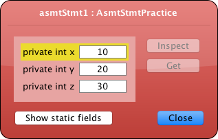

## CS 161 - Intro to Computer Science

### Lab: Variables and Assignment

In this assignment you will use BlueJ to practice creating and calling methods on some limited Shape objects. You will manipulate these shapes to create a simple picture of Pac-Man. You will then create a picture of your own.

#### Student Outcomes

- To understand variable assignment statements
- To understand the difference between local and object (instance) scope
- To understand the lifetime of certain variables

#### Working with Partners (Please Read)

You are required to work _together_ on labs. As I mentioned the first day of class, some of you may have had some prior programming experience, and this lab may come more naturally for you. Please be humble and be supportive to one another, and don't leave your partner behind. Labs are _very_ low-stakes, and you'll get full credit for being here, working through it, and being a good citizen. We'll be around to help.

Here are your assigned partners for today's lab.

```
[Jones, B, Miller, D]
[Brown, A, Murphy, C, Wissing, A]
[Jones, S, Culpepper, A]
[Strash, K, Grey, E]
[Roppolo, G, Murayama, E]
[Steller, L, Beardsley, M]
[Camblin, F, Rodriguez, C]
```

#### Required Files

The following file(s) have been provided for this lab.

- [Lab2_Explore.zip](Lab2_Explore.zip)

#### Preliminary

You might've already done this, but just in case, let's take some time to customize your BlueJ environment:

- Open up the project you just downloaded in BlueJ,
- If you're on _Windows_, go to the `Tools` menu on the top, and click `Preferences`. If you're on a _Mac_, from the `BlueJ` menu on the top, select `Preferences`.
- The `Editor` tab should already be selected. Please select the `Display Line Numbers` setting. You can also enlarge the font size, so that you code might be easier on the eyes. Click OK to exit.
  - If you're on a Windows machine, you can get to `Preferences` from the `Tools` menu on top.
- Now click on the `View` menu on the top. Please make sure `Show Code Pad` is selected.
- That should be it for now. Go ahead and start reading the lab assignment with your partner.

#### Part 1: Changing Object State via Assignment

**Read this, don't skim**

In Java (and all other programming languages), a variable refers to some unit of storage with a name. Before you can use a variable, the programmer must first declare what kind of data a particular variable can store and then the programmer should give it a good name to avoid confusion later. You have already seen several common data types: `int`, `double`, `String`, `char`, and `boolean` (yes, these are case sensitive).

The particular variable that we have been using thus far in lectures is used to store an object's state. We call these fields (or instance variables). Later, we'll introduce you to a couple other types of variables, each with different usages. Recall the class structure shown below.

```java
/**
 * Some comment about the class as a whole.
 * @author David
 */
public class SomeClassName {
    /* FIELDS (INSTANCE VARIABLES) GO HERE */

    /* CONSTRUCTORS GO HERE */

    /* METHODS GO HERE */
}
```

and that you can declare any number of fields to store your object's state. Any time you need a field, you will first declare its existence using the following syntax:

```java
private dataType fieldName;
```

For instance, I might declare `private int speed;` to store the current speed of my vehicle objects. I could declare `private String firstName;` to store the first name of `Student` objects.

##### The Assignment ("Gets") Operator: `=`

After a variable or field has been declared, you can use assignment statements to give it a value. An assignment statement has two forms:

1. Use the following syntax (with the `this.` prefix) if you wish to give a field (instance variable) a new value.

   ```java
   this.fieldName = expression;
   ```

2. We haven't spent a ton of time on "local variables" in our lectures yet, but we will soon. For now, just know that if you wish to give a local variable a new value, you should instead use the syntax below.

   ```java
   localVariableName = expression;
   ```

In the above syntax, expression refers to a Java expression that results in the new value to be stored in the variable or field. The expression can be a literal value like `100`, `"green"`. It could be more complex, like `3 * 9000 + 21`, and it can even contain the name of another variable. If the expression contains the name of another variable, you're telling Java to look inside that variable, retrieve its value, and put that value in the variable on the left-hand side. One good way to get practice with the assignment statement is to read existing code that uses assignment statements, and see if you can predict their results.

#### Part 2: Completing the Exercises

- Double-click the `AsmtStmtPractice` class and spend a minute familiarizing yourself with its contents. You don't have to understand everything that's going on, but you should be able to pick out what fields there are, as well as each individual method. Objects (or, instances) of this class each have three fields: `x`, `y`, and `z`. Create an object of the class, then double-click it to open an object inspector (shown below) before proceeding:

  

- Notice that there are various "test" methods in the class. Here's what you'll do:

  - Open the `README` file (that's the notepad icon) from the BlueJ project window. You'll do the following for each test.

  - For each test, do the following: (1) read the assignment statements in the body of the method, (2) think about how they'll modify the fields, and try to predict the values in `x`, `y`, and `z`. Record your predictions in the README file.

  - Then test it by running the method and using the object inspector to peek at the final values.

  - You must call `reset()` on the object before moving on to the next test method. Then record the actual values in the `README`.

  - If there is any mismatch, write a brief sentence explaining why. No explanation needed if your answers match. _Ask questions if you're unsure about anything!_

#### Part 3: Scope Practice

**Important:** Read this section completely before tackling the code. In programming, the scope of a variable is a very important concept to learn early. The scope of a variable refers the set of statements that can access it. For now, we shall focus on just two: local scope and object scope.

- **_Fields (i.e., instance variables)_** that are defined at the top of your class have **global scope**. This means several things:

  - Field names must be _unique_ in the class.
  - Fields are accessible (can be read, and can be written to) by any constructor or method in the class.
  - A field named `speed` can be referred to using `this.speed` (note the `this` prefix).
  - **Life-span:** Fields come into existence when the object is created, and they are destroyed only when the object is destroyed.

- **_Local variables (including input parameters)_** are defined inside each method, and they have **local scope**. This means several things:

  - Local variable names must be unique in only within each method.
    - This means you can have a local variable `x` inside multiple methods, and they are all independent from each other.
  - Local variables are accessible (can be read, and can be written to) by only the method within which it is declared
  - A local variable or input parameter named `speed` can be referred to simply using `speed` (that is, without the `this` prefix)
  - **Life-span:** Local variables (and input parameters) come into existence when the method is called, and are destroyed when the method terminates.

- All that might not make a whole lot of sense yet, and it's always easier to experience scope through running some code. For this part of the lab, it's more convenient to print the values of variables out to the screen.

- Double-click the `ScopePractice` class to open it. Once again, work through each "test" method in sequence, and answer the questions in the README.

  - Where required, you can write the following code inside any method to print out the value contained in a variable named `thingToPrint`.

    ```java
    System.out.println(thingToPrint);
    ```

  - As before, call `reset()` on the object before moving on to the next test method. Record your responses in the README.

#### Grading

```
This assignment will be graded out of 10 points, provided you do all the following:
- Your README contains responses to all test cases from AsmtStmtPractice.
- Your README contains responses to all test cases from ScopePractice.
- Your README contains answers to the additional questions I pose about scope.
```

#### Submitting Your Assignment

After you have completed the assignment, use the following to submit your work.
Exit BlueJ

- Open your computer's File Finder (some times called File Explorer). Locate the project folder.

- Right-click on the project folder, then:

  - If using Windows, select Send to then Zip file
  - If using MacOS, select Compress ... items
  - This step takes your selected creates a .zip file that you will submit to me.

  It's really important you got this right. If you have doubts, ask one of us to check for you! I recommend that you double-check by opening the zip file, and investigating the contents to ensure that all the files are in there.

- Navigate to our course page on Canvas and click on the assignment to which you are submitting.

- Click on Submit Assignment, and you should be able to "browse" for your file

- Select the `.zip` you just created, and click Submit Assignment again to upload it.

- You may submit as often as you'd like before the deadline. I will grade the most recent copy.

#### Credits

Written by Brad Richards.

#### Lab Attendance Policies

Attendance is required for lab. Unexcused absence = no credit even if you turned in the lab. Unexcused tardiness = half credit.
