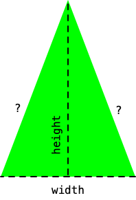

## CS 161 - Intro to Computer Science

### Lab: Variables and Scope

In this lab, you'll get familiarized with the concepts of data types, variables, assignment statements, and scope. You'll be modifying the `Triangle` shape class to add some functionalities.

#### Student Outcomes

- To understand variable assignment statements
- To understand the difference between local and object (instance) scope
- To understand the lifetime of certain variables


#### Required Files

The following file(s) have been provided for this lab.

- [Lab2_Triangle.zip](Lab2_Triangle.zip)

#### Preliminary

You might've already done this, but just in case, let's take some time to customize your BlueJ environment:

- Open up the project you just downloaded in BlueJ,
- If you're on _Windows_, go to the `Tools` menu on the top, and click `Preferences`. If you're on a _Mac_, from the `BlueJ` menu on the top, select `Preferences`.
- The `Editor` tab should already be selected. Please select the `Display Line Numbers` setting. You can also enlarge the font size, so that you code might be easier on the eyes. Click OK to exit.
  - If you're on a Windows machine, you can get to `Preferences` from the `Tools` menu on top.
- Now click on the `View` menu on the top. Please make sure `Show Code Pad` is selected.
- That should be it for now. Go ahead and start reading the lab assignment with your partner.

#### Part 1: Instance Variables

**Read this, don't skim**

In Java (and other programming languages), a variable refers to some unit of storage with a name. Before you can use a variable, the programmer must first declare what kind of data a particular variable can store (**data type**) and then the programmer should give it a good name to avoid confusion later. You have already seen several common data types: `int`, `double`, `String`, `char`, and `boolean`.

The particular kind of variable that we have been using thus far in lectures is used to store an object's state. We call these **fields** (or **instance variables**). Later in lab, we'll introduce you to a couple other types of variables, each with different usages. Recall the basic class syntax, shown below.

```java
/**
 * Some comment about the class as a whole.
 * @author David
 */
public class SomeClassName {
    /* INSTANCE VARIABLES GO HERE */

    /* CONSTRUCTORS GO HERE */

    /* METHODS GO HERE */
}
```

You can declare any number of instance variables to store your object's state. When you need an instance variable, you must first declare it using the following syntax:

```java
private dataType variableName;
```


1. Modify the `Triangle` class to store two new instance variables, an `area` and a `perimeter`. It doesn't matter if they go first or last in line of your instance-variable section. Before you declare each one, you ought to be thinking ahead --- what kind of data does each hold? Integers? Strings? Doubles? Something else? Choose the right data type, and declare these two now.

2. Back in the BlueJ project window, create a new `Triangle` instance and inspect its state by double-clicking it. You should see the two new instance variables you just declared, but alas, they are showing up as zeroes.

    - It's important to use this moment to reflect. Even though you gave these fields names that indicate exactly what they are, they don't just magically get values. (Computers have no insight, remember?)

    - It's up to *you* to assign values to these instance variables, and to keep track of them. Let's do so now.

3. Let's start by thinking about all the places where the `area` and `perimeter` need to be updated.

    - One place is in the code that runs when `Triangles` get created in the first place -- Remember that we called the object-creation code the class' **constructor**. Find the constructor code, which usually appears right after all your instance variables. It should look something like this:

      ```java
      public Triangle() {
        ...
      }
      ```

    - Update the constructor to assign values to `area` and `perimeter`.

      - Recall that the syntax to assign a value to a variable is: `variableName = expr;`, where `expr` is any algebraic expression. For instance, if I were inputing the area of a *square*, the expression would be `area = width * length;` (assuming `width` and `length` are the instance variable's names.)

      - You may want to lookup (on Google) how to find the area and perimeter of an *isosceles triangle*, given its height and width. Here's a hint for perimeter though. In the figure below, you know the width and height of the Triangle. You just need to figure out the length of the sides, which you can determine using Pythagorean Theorem.

        

      - You'll need know this for calculating the perimeter. If you need to take the square root of a value `x`, you can use the built-in Java function `Math.sqrt(x)`. Also, to take `x` to the `y`th power ($$x^y$$), you can use `Math.pow(x,y)`

4. Create a new `Triangle` to see if your `area` and `perimeter` fields are now populating. If you did everything above correctly, you should've gotten 600.0 for area and roughly 112.11 for perimeter.

5. But is this the only place where a triangle's `area` and `perimeter` need to be updated? Scroll further down the source code and see if there are any methods that might require the `area` and `perimeter` to be updated. Put in the assignment statements in those method(s) as well. Test again to make sure everything's working.

#### Part II: Local Variables
We know that instance variables store an object's current *state*. But that's not the only kind of variable that exists. In Java, there are actually four kinds:
  - **Instance Variables:** Used to store an object's state. Exists until the object is removed (or when your program terminates).
  - **Local Variables:** Used for temporary storage within a method or constructor. Exists until you exit the segment of code (enclosed between curly braces `{` ... `}`) in which the local variable was declared.
  - **Input Parameters:** Used for accepting input to a method or constructor. Exists until you exit the method or construct.
  - **Static Variables** (We'll cover these later in the semester)

In this section, let's focus on local variables, so you can appreciate when they should be used.

1. Find the `moveHorizontal()` method in your source code. Here's what it should look like:
    ```java
    public void moveHorizontal(int distance) {
        erase();
        xPosition += distance;
        draw();
    }
    ```
    - Studying its algorithm, this method does nothing more than simply erasing the Triangle off the canvas, updating the `xPosition` of its instance state, then re-drawing the Triangle on the canvas. The erasing and re-drawing happens so quickly that it appears as if the Triangle moved places instantly.

2. Suppose we now want the Triangle to output (print) its *old* coordinate position the Triangle moves. To do that, we need to *save* its x and y positions *before* they get updated in the `moveHorizontal()` code. To save the current positions, we'll need to introduce two variables  (one for each coordinate).

3. For now, add two **instance variables** near the top of the source code, and you can name them `oldXPosition` and `oldYPosition`. Go back to your notes (or book) to see the syntax for declaring new instance variables. 

4. Then go back in your `moveHorizontal()` method, and assign the current x and y positions to the `oldXPosition` and `oldYPosition` instance variables anytime before `xPosition` is updated.

5. Now, below the call to `draw()`, print out the old positions and the new positions. Recall that, to print something to the screen, you can use this syntax:

    ```java
    System.out.println("stringYouWantToPrint");
    ```
    But if you need to evaluate variables in your print-out, then you need to concatenate (`+`) the variables to the string you want printed. For instance:
    ```java
    System.out.println("stringYouWantToPrint" + someVariable + "moreString" + anotherVariable);
    ```

    For instance, the following will print something to the effect of: `"Old X is 50"` on the *same* line.
    ```java
    System.out.println("Old X is " + oldXPosition);
    ```
    Play with the string to print both old X and old Y values on the *same* line.

6. Test it out, and see if everything's working before moving on.

7. Once everything checks out, inspect the `Triangle`'s state and you should see the `oldXPosition` and `oldYPosition` instance variables. **But this begs the question.** Why are a Triangle's *old* positions even stored as part of its *current* state? 

    *You should always ask yourself these questions when you  introduce new variables:*
    - Would the object benefit from memorizing and always carrying these new values in the future? Should they be an intrinsic part of the object's state of existence? (If so, the variable should be an instance variable.)
    - Are the new variables used in only one or two methods, and serve no purpose elsewhere? It is okay for these variables to be destroyed as soon as the method exits? (If so, the variable should be local)

8. The purpose of these questions is to gauge whether you need variables that are "global" (and accessible by any method) or just "local" to each method.

    - In our case, `oldXPosition` and `oldYPosition` serve a very specific purpose, inside only one method!
    - This suggests that `oldXPosition` and `oldYPosition` do not need to be instance variables.

9. Remove the two instance variables from the top of your source code. Go back in your `moveHorizontal()` method and declare the variables within. The major difference in syntax is that, you must remove the `private` keyword when declaring local variables. This ought to do:

    ```java
    public void moveHorizontal(int distance) {
        //declare local variables (you can name them whatever)
        int oldXPosition;
        int oldYPosition;
 
        // remainder code omitted
    }
    ```

10. After you've made these changes, compile and create another `Triangle`. Move it around horizontally to ensure that the print-outs are working. Now double-click on the `Triangle` object and you should find that the `oldXPosition` and `oldYPosition` instance variables are gone.

    - **Tip: Keep it as tidy as possible.** Less state (i.e., fewer instance variables) is generally preferable. Having too many instance variables could mean that the programmer may lose track of variables and have too much to manage in the future.

11. Now update `moveVertical()` to also print its old coordinates.

#### Part III: Input Parameters
The last type of variables in Java are  input parameters. Input parameters allow callers to provide values (called **arguments**) to a constructor or a method. Therefore, input parameters are always found on the first line of constructors' and methods's declaration. Here's the syntax for constructors and methods, respectively:

```java
public ClassName(listOfInputParameters) {
  // body of constructor omitted
}
```

```java
public void someMethod(listOfInputParameters) {
  // body of method omitted
}
```

1. Go  and find the `moveHorizontal()` method again, and you need to only examine the first line of the method. Here it is again:

    ```java
    public void moveHorizontal(int distance) {
    ```

2. This method has exactly one input parameter, `int distance`, that is accepted. In fact, this method can't even be executed until the caller inputs a valid input value for `distance`. 
    - If your method or constructor accepts multiple input parameters, then you should separate them with a comma.
    - The value that is given to `distance` upon calling it is known as the **argument** for that input.
    - The `distance` parameter captures the given argument, and it can be treated as a local variable in the code for `moveHorizontal()`

3. Therefore, input parameters are nothing more than local variables to the method, except that they hold the values of given arguments! All input parameters are destroyed when the method exits.

4. Write a new `Triangle()` constructor that accepts the starting height and width. You may name these input parameters `initialHeight` and `initialWidth` (honestly, you can name them whatever you like as long as their names make sense and are legal). Don't forget that you'll also need to declare their data types.
    
    - Next, assign the instance variables `height` and `width` to these values in order to save them.
    
    - All other instance variables should be assigned to the same values as in the original (default) constructor.

5. Test out your code to ensure that you can now create Triangles of customized height and width.

    - You might as well ensure that the perimeter and areas still check out too!

6. Go back in your new constructor and rename the input parameters to just `height` and `width` (yes, the same names as your instance variables.)

    - Does it still compile?
    - Does it still work when you construct a new Triangle? Think about why this is the case.

7. Create a new method `changeSizeAndColor()` that accepts 3 parameters, a new width, height, and color. Put in the code to change its size and color concurrently. To help do this, you should be calling existing methods instead of copying-and-pasting code.
    
#### Part IV: Writing Effective Comments

I've mentioned that effective commenting is an important habit for programmers to form. The reason is for documenting your code for posterity... and for yourself. There are generally two types of comments that I look for when grading: *line comments* and *Javadocs comments*.

**Line comments** are free-form. They are used to describe blocks of code that you write. Their syntax is easy to remember. For instance:

```java
public void moveHorizontal(int distance) {
    // This is a line comment!
    erase();
    xPosition += distance;
    draw();

    // This is another line comment!
}
```
Use line comments whenever you've written a chunk of code and its purpose and function may not be obvious.

**Javadocs comments** are more structured. You should write a Javadocs comment on top of every class definition, on top of each constructor, and on top of each method. For instance. Here's an example class comment:

```java
/**
 * This is a class that simulates cars. blah blah blah
 * @author David
 * @version 1/26/2023
 */
public class Car {
    // code omitted
}
```

Here's a Javadocs comment for a method:

```java
/**
 * This method moves a Triangle horizontally by the 
 * given distance.
 * 
 * @param distance A distance (in pixels) to displace
 */
public void moveHorizontal(int distance) {
    // This is a line comment!
    erase();
    xPosition += distance;
    draw();
}
```

Note the use of `@tags` in the Javadocs comments.

Go ahead and add comments to the new constructor and method that you wrote for this lab.

#### Grading

```
This assignment will be graded out of 2 points, provided that:

- You were in attendance and on-time.
- Your Triangle class is fully modified.
```

#### Submitting Your Assignment
Follow these instructions to submit your work. You may submit as often as you'd like before the deadline. I will grade the most recent copy.

- Navigate to our course page on Canvas and click on the assignment to which you are submitting. Click on "Submit Assignment."

- Upload all the files ending in `.java` from your project folder.

- Click "Submit Assignment" again to upload it.

#### Credits

Written by David Chiu. 2023.

#### Lab Attendance Policies

Attendance is required for lab. Unexcused absence = no credit even if you turned in the lab. Unexcused tardiness = half credit.
