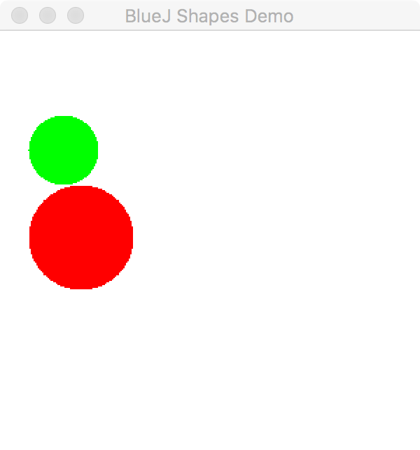

## CS 161 - Intro to Computer Science

### Lab: Circle Drawer

This assignment is all about conditionals and object references! We'll work with the `CircleDrawer` class that is given to you. Along the way you'll write code that uses and manipulates object references, and requires more complex boolean expressions than you've written previously.

#### Student Outcomes

- Practice object interaction (puppeteering)
- Practice using object references
- Practice returning values across objects
- Working with null reference testing

<!-- 
#### Working with Partners (Please Read)

You are required to work _together_ on labs. As I mentioned the first day of class, some of you may have had some prior programming experience, and this lab may come more naturally for you. Please be humble and be supportive to one another, and don't leave your partner behind. Labs are _very_ low-stakes, and you'll get full credit for being here, working through it, and being a good citizen. We'll be around to help.

Here are your assigned partners for today's lab.

```
[Jones, B, Jones, S]
[Steller, L, Culpepper, A]
[Camblin, F, Strash, K]
[Beardsley, M, Murphy, C, Rodriguez, C]
[Brown, A, Grey, E]
[Roppolo, G, Murayama, E]
[Wissing, A, Miller, D]
``` 
-->


#### Required Files

The following file(s) have been provided for this homework.

- [Lab5_CircleDrawer.zip](Lab5_CircleDrawer.zip)

#### Instructions

- Download the `CircleDrawer` project from the link above and extract its contents, then start BlueJ and open the project. Take a moment to familiarize yourself with the code in the `CircleDrawer` class. A `CircleDrawer` contains two instance variables as references to a pair of Circles (named `first` and `second`).

- Notice that the `CircleDrawer` class has two constructors. The default constructor is not given references to the two Circles to manage, it just sets both fields to `null`. The second constructor is given references to two `Circles`, and it sets both instance variables appropriately.

  - Using the menus in BlueJ, instantiate two `Circle` objects. You can name them `c1` and `c2`.
  - Change `c1` to green, change size to `50`.
  - Change `c2` to red, change size to `75`. Then move it down by `50` pixels.
  - Now create a new `CircleDrawer`, called drawer with its second constructor (the one that requires references to two Circles). Input `c1` and `c2` as your inputs. The new `CircleDrawer` will now "control" the two circles.

  - Inspect the `CircleDrawer` object on the workbench, and you see that `first` and `second` store references (arrows). Follow the arrows by double-clicking on them. It opens the inspector to the Circles you created!

    

  - Call the `drawCircles()` method on the drawer, and notice that both Circles appear. (If you call `eraseCircles()` both disappear!)

    

  - So, this gives us some idea about what a `CircleDrawer` object does. It's basically a "puppet master" that bosses around one or two Circles.

<!-- - It's time to start weaning you off the BlueJ menus, and start learning how to do everything in code. Create a new class, and name it `Tester`. Clean up the "boilerplate code" that BlueJ fills in automatically. There are no fields. Now create the `main` method, which always has the same signature below:

  ```java
  public static void main(String[] args) {
    // Code goes here
  }
  ```

  In the body of the `main` method, write code to do what we had just done using menus. Before you write anything though, you might interested in the following syntax reminders.

  Object Instantiation/Creation:

  ```java
  ObjectType name = new ObjectType(...);  // 1) ObjectType refers to the Class name
                                        // 2) name is a good name to call your object variable
                                        // 3) ... refers to any parameters you wish to input to the constructor
  ```

  Calling a method on an object:

  ```java
  name.method(...);    // 1) name is the variable that refers to an object
                     // 2) ... refers to any parameters input into the method
  ```

- I got things started for you...

  ```java
  public static void main(String[] args) {
      Circle c1 = new Circle();
      c1.makeVisible();
      c1.changeColor("green");
      c1.changeSize(50);

      // Finish the rest
  }
  ```

- After you're done, close out the code window. Right click on the `Tester` class and call the main method (Don't create a new `Tester` object on the workbench). You should again see the green and red circles drawn. -->

- Now go back in the `CircleDrawer` code and take a look at `drawCircles()` and `eraseCircles()`. Their code looks pretty straightforward. Calling them will make both circles visible or invisible, but... that's assuming that our `first` and `second` fields actually refer to actual `Circle` objects, and not `null`.

  - Create a `CircleDrawer` object using its default constructor (that's the one with no inputs).
  - Inspect it, and see that `first` and `second` both point to `null` (no arrows to circle objects as before).
  - Let's see what happens if you tried to call `drawCircles()` or `eraseCircles()`.
  - The program should **crash** with a `"NullPointerException."` That's bad news -- it means our code isn't all that robust.

- Back in the `CircleDrawer` code, add necessary changes to `drawCircles()` and `eraseCircles()` so that no action is taken if either field refers to `null`. To do this, use an if-statement to check if each field is `==` or `!=` to the keyword `null`. Make sure you test these out after you're done.

- Now **modify** the `drawCircles()` method so that it only draws circles with **radii** strictly greater than `20` and strictly less than `50`.

  - But how do you get a `Circle`'s radius? One way is to go into `Circle` and making the `diameter` public instead of private. However this is a practice considered highly dangerous because it exposes `diameter` to unwanted changes. You should instead add a method in  the `Circle` class that returns its diameter. 
  - Again, test this out. Ahem -- if your Circle's diameter is say, **41**, it *should* be drawn. 

- Go back in the `CircleDrawer` class. **Add a method** called `drawLarger()` that draws only the larger of the two circles. The smaller one should be hidden. If there's a tie, then draw both of them.

- **Add a method** in `CircleDrawer` called `sizeRatio()` that returns the ratio of the two circle's diameters as a `double`. If one circle has a diameter of 10 and another has a diameter of 3, then this method returns 0.333... You should always divide the smaller diameter by the larger.

  - If either circle is `null`, simply return 0.

- **Add a method** in `CircleDrawer` called `addCircle()` that inputs a `Circle` object, and it doesn't return anything. This method will first erase both `Circle`s. If *either* of the two instance variables (`first`, `second`) are pointing to `null`, then simply assign the new `Circle` to that field. If neither reference is pointing to `null`, then promote the second `Circle` to the `first`, then sets the newly-input `Circle` to be the `second`. After you're done, make both Circles visible.

  - To test, I would create 3 circles in BlueJ. Then create a CircleDrawer using the default constructor so that both `first` and `second` are `null`. Then call `addCircle()` 3 consecutive times (on the 3 circles you created).

- **Add a method** called `swapCircles()` that inputs and returns nothing. Calling this method will cause  `first` to now point to whatever `second` held, and vice versa. 

- **Add a method** called `replaceSmallest()` that takes a `Circle` as input. In `CircleDrawer`, if either of the two instance variables are `null`, simply add the new circle into the empty slot. If both instance variables are non-null, this method must replace the smaller circle with the new one. We need to respect seniority, though:
  - If `first` is smaller, we'll first promote `second` to take its place, and assign the new circle in `second`'s place.
  - If `second` is smaller, we'll just replace it with the new circle. In the case of a tie, replace second.
  - This method seems to have quite a bit of similarities to `addCircle()`. You don't need to, but kudos if you can figure out how to utilize `addCircle()` and `swapCircles()` to simplify writing this method.


<!-- 

- Finally, add a method to `CircleDrawer` called `drawWhenEquals()` that draws both `Circles` if they are "equal" in _content_. Hide both of them if they aren't "equal." Before you can write the method, you need to add an `equals()` method in the `Circle` class.

  - Let's say that two `Circle`s are equal in content if they have the same size and (x,y) positioning. Refer back to the "content (deep) equality" notes, if you need a reminder on how these `equals()` methods are written.

-->


#### Grading

```
This assignment will be graded out of 2 points, provided that:
- You were in attendance and on-time.
- Completed all required methods.
```


#### Submitting Your Assignment
Follow these instructions to submit your work. You may submit as often as you'd like before the deadline. I will grade the most recent copy.

- Navigate to our course page on Canvas and click on the assignment to which you are submitting. Click on "Submit Assignment."

- Upload all files ending in  `.java` from your project folder.

- Click "Submit Assignment" again to upload it.

#### Credits

Written by Brad Richards with modifications.

#### Lab Attendance Policies

Attendance is required for lab. Unexcused absence = no credit even if you turned in the lab. Unexcused tardiness = half credit.
