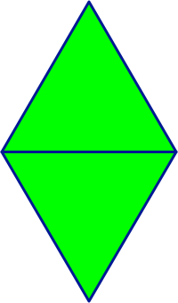

## CS 161 - Intro to Computer Science

### Lab: Diamonds (Abstraction)
David is a Rihanna super fan. While jamming to his favorite tune ``Diamonds,'' he realized diamonds aren't  a part of the _shapes_ toolkit he gives to his CS 161 students. He wants you to fix that in this lab.

Instead of creating diamonds from scratch (and saving ourselves from copying and pasting other shape classes), we'll make a keen observation that a diamond can be constructed using two triangles -- only that one of the triangles needs to be flipped upside down and placed right below the other, as shown below. Given that we already have a `Triangle` class in our toolkit, it will vastly simplify our work in constructing `Diamond`s.

  

This lab is all about abstraction and object interaction. 

#### Student Outcomes

- Practice abstract thinking
- Practice with basic loops

<!-- 
#### Working with Partners (Please Read)

You are required to work _together_ on labs. As I mentioned the first day of class, some of you may have had some prior programming experience, and this lab may come more naturally for you. Please be humble and be supportive to one another, and don't leave your partner behind. Labs are _very_ low-stakes, and you'll get full credit for being here, working through it, and being a good citizen. We'll be around to help.

Here are your assigned partners for today's lab.

```
[Strash, K, Steller, L, Jones, S]
[Roppolo, G, Culpepper, A]
[Rodriguez, C, Jones, B]
[Murphy, C, Beardsley, M]
[Grey, E, Brown, A]
[Miller, D, Murayama, E]
[Wissing, A, Camblin, F]
``` -->

#### Required Files

The following file(s) have been provided for this homework.

- [Lab6_Diamonds.zip](Lab6_Diamonds.zip)


#### Preliminary: An Improved Triangle Class

You'll find that there's a slightly improved `Triangle` class. This `Triangle` sports a new method called `flip()`. Play around with it to see it in action. As you flip the triangle, notice that it is flipped "in place." That is, it doesn't just turn over downwards. This behavior is important to know because you'll have to move it to the right place.

#### Part I: Diamonds

Our objective is to create a new class that can create  `Diamond`s with the same set of methods as all the other shapes we've seen thus far. But as you know, there is code in the other shape classes that we still don't know how to read or what they do underneath the hood. But no worries, such is the power of abstraction. *Truth is, we don't have to know those implementation details!* Let's get started...

1. Create a new class called `Diamond`. A diamond can be formed using two Triangles (which we have), with one flipped upside down and positioned properly. For now, your `Diamond` class only needs to store references to these two `Triangles` as  instance variables. Because of their placement, I would name them `top` and `bottom`.

    - You might as well go ahead and store a diamond's `height` and `width`  as instance variables too. They are both integers.

2. Write a constructor that  accepts two inputs: the `height` and `width` of a  diamond object. First, it needs to *instantiate* both `top` and `bottom` triangles.

    - Don't forget to resize the triangles. How large do you need to make these triangles to ensure that your diamond is of the given dimensions? 

    - Each triangle essentially occupies **half** of the height of the new diamond, and they both have the same width as the diamond. You need to flip the bottom triangle upside down, and then move it vertically into place so that the *bases* of the triangles touch. 

    - Make the whole diamond visible too, before leaving the constructor.
    
    - To test, create a few diamonds with various dimensions. Make sure the two triangles are always connected at the base regardless of your diamond's dimensions.


3. Next, write in the `makeInvisible()` and `makeVisible()` methods to toggle visibility of the diamond. Then move on to `changeColor(String newColor)` to change the color of the diamond. As you write these two methods, you should notice how satisfying it is to be able to call on the individual triangle's methods.

    - **Abstraction is about trust**. Notice that, to get the diamond to perform these actions, we don't even have to know about *how* each Triangle goes about performing its own actions. All we need to do is **trust** that it works, and use those methods where we need to!

    - In each of these methods, you should not be writing more than two lines of code to get the job done.

4. Now write in `moveVertical(int distance)` and `moveHorizontal(int distance)`. Again, the work we have to do is minimal.

#### Part II: Challenges
Before moving on to the next method, you have to familiarize yourself with how the triangle's `changeSize()` method works. Create a triangle and make it visible. Then change its size (it doesn't matter if you make it bigger or smaller.) Notice that the top vertex remains in the same place. Now flip the triangle upside down. Change the size again. Notice the top still remains in place, and it's the bottom vertex that moved up or down. Knowing that whatever is on "top" remains constant will help you write the next method.

1. Let's move on to something a little more challenging: `changeSize(int newHeight, int newWidth)`. You'll need to change the sizes of the two triangles in such a way that the sum of the heights is equal to `newHeight` and the `width` is adjusted to `newWidth`. Okay, easy enough with a couple calls to the Triangles' `changeSize()` method. 

    - However, this will introduce a new problem. The triangles, upon changing their size, may  overlap each other or they could be spread farther apart!

    - This can be a bit tricky. You'll need to move the bottom triangle up or down to adjust for this gap. But how much do you move it by...? **(Hint: it's a good thing we know the old height of the diamond...)** Recall that when you resize a triangle, the top never changes along the vertical axis -- it's the bottom of the triangle that moves. Draw on a piece of paper to gain insight into when you'd need to move the bottom one up and when you'd need to move the bottom one down (and by how much).

2. Nice work!! The last piece we're missing are the "slow move" methods. Go ahead and start writing the `slowMoveHorizontal(int distance)` method. Again, this is trickier than expected. You can't just tell the top and bottom triangles to `slowMoveHorizontal` themselves, because the diamond would be split apart as each triangle moves in sequence, instead of the whole diamond moving along as one.

    - Here's a hint: the `moveHorizontal(int distance)` method you wrote previously *does* move the whole diamond instantaneously by the given distance. What if you called this method repeatedly on a distance of 1? (Write a loop!)

    - Don't forget that you need to ensure that a negative distance input should slow move the diamond to the left!

3. Finally, write the `slowMoveVertical(int distance)` method, which should be similar to the previous method.

#### Reflections: Problem Decomposition and Thinking Abstractly
Hopefully, through this lab, you can see how useful it is to think abstractly. We broke down a bigger problem ("How to build a diamond") and made the key insight that diamonds are nothing more than just 2 triangles, whose code we already have. Then the rest is just a matter of bossing around the triangles so that together, they look and act like a diamond! Knowing this, it's easy to see how we might create new shapes and add them to our toolkit.

You must also apply this idea to larger, more complex projects downstream.

#### Extra Challenge
Can you create a **parallelogram** with two diamonds? Can you create a restricted **rectangle** with two squares? How about a **wand** with a skinny rectangle and a circle on top? How about a Pacman that gets automatically drawn every time you create it (it's just 2 circles and a white triangle!), and you can slow move it, close and open its mouth, and so on.

#### Grading

```
This assignment will be graded out of 2 points, provided that:
- You were in attendance and on-time.
- Completed all required methods.
```


#### Submitting Your Assignment
Follow these instructions to submit your work. You may submit as often as you'd like before the deadline. I will grade the most recent copy.

- Navigate to our course page on Canvas and click on the assignment to which you are submitting. Click on "Submit Assignment."

- Upload all files ending in  `.java` from your project folder.

- Click "Submit Assignment" again to upload it.

#### Credits

Written by David Chiu. 2023.

#### Lab Attendance Policies

Attendance is required for lab. Unexcused absence = no credit even if you turned in the lab. Unexcused tardiness = half credit.
