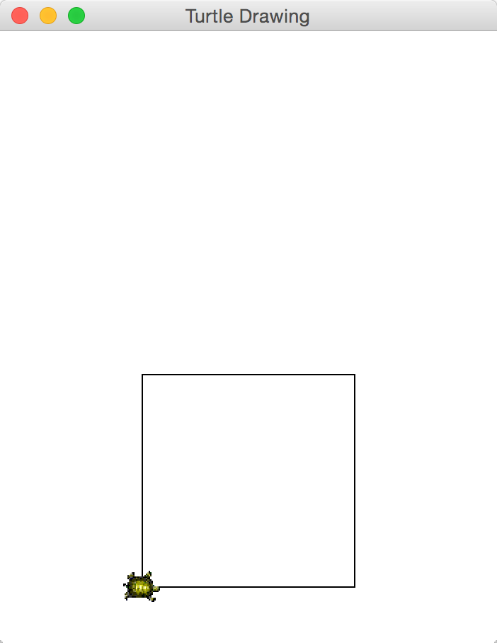
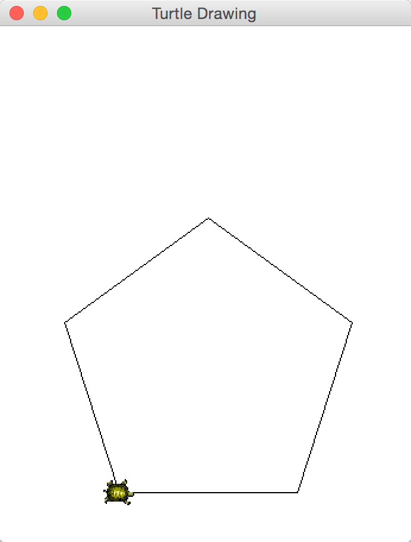
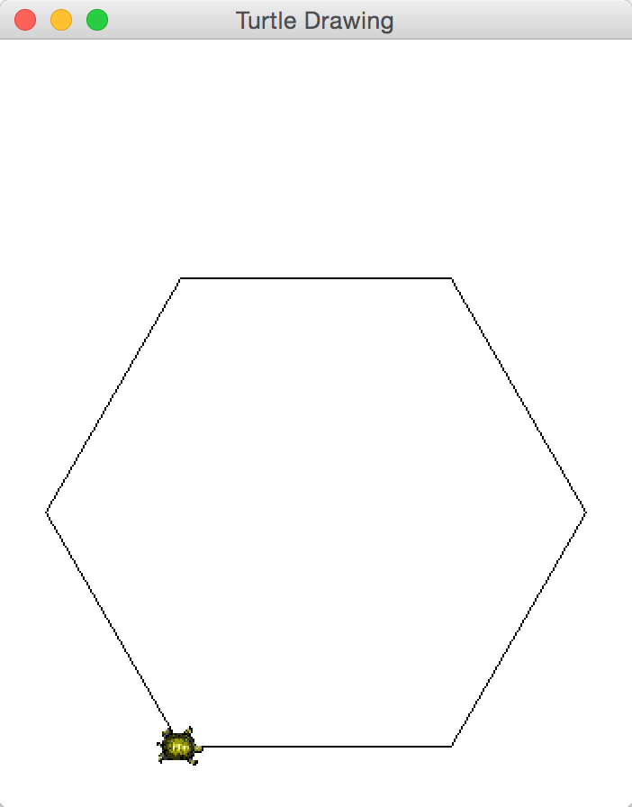

## CS 161 - Intro to Computer Science

### Lab: Turtle Graphics

This lab is based on the iconic [Logo Turtle](https://techcommunity.microsoft.com/t5/small-basic-blog/small-basic-the-history-of-the-logo-turtle/ba-p/337073), which was an early tool for teaching kids how to program. The `Turtle` has a pen that can change colors and be dropped and lifted on/off the ground. It also has a few mobility functions, like crawling forward and turning by a certain angle. Given this small set of functionalities, people can create impressively complex drawings.

In this lab, we'll be using a supplied `Turtle` library to make some drawings, all requiring loops.

#### Student Outcomes

- To practice writing loops and nested loops

<!-- #### Working with Partners (Please Read)

You are required to work _together_ on labs. As I mentioned the first day of class, some of you may have had some prior programming experience, and this lab may come more naturally for you. Please be humble and be supportive to one another, and don't leave your partner behind. Labs are _very_ low-stakes, and you'll get full credit for being here, working through it, and being a good citizen. We'll be around to help.

Here are your assigned partners for today's lab.

```
[Camblin, F, Jones, S]
[Rodriguez, C, Steller, L]
[Jones, B, Murayama, E, Wissing, A]
[Culpepper, A, Roppolo, G]
[Beardsley, M, Murphy, C]
[Brown, A, Grey, E]
[Miller, D, Strash, K]
``` -->

#### Required Files

The following file(s) have been provided for this homework.

- [Lab7_TurtleDrawer.zip](Lab7_TurtleDrawer.zip)

#### Helpful APIs

The API handout that you'll want to have in front of you:

- [Turtle](../api/TurtleAPI.pdf)

#### Preliminary

Download the BlueJ project from the above link. After you unzip it into your working directory, navigate into the project folder. Inside, you will see a `Turtle` class. **You do not need to make changes to this class.** You only need to know its public methods (given in the [Turtle API](TurtleAPI.pdf) hand out).

- All code for this lab should be written in the `TurtleDrawer` class. Again, **do not make changes** to the `Turtle` class. Before we begin, you may want to familiarize yourselves with the `Turtle` class by creating an object on the workbench and playing with its methods.
  Create a new class, called TurtleDrawer, with the following requirements:

  - It has one field: a `Turtle` object named `pen`.
  - It has a default constructor that first instantiates `pen`, then sets the `pen`'s color to black, and lowers the `pen` for drawing.
  - Let's write a quick-and-dirty method to test out the Turtle. Let's name it `drawTriangle`. It returns nothing, but takes a `double sideLength` as input. Your code should navigate the pen to draw an equilateral triangle, i.e., same length on all sides (see below)

    <center></center>

    There are a couple things to consider before you plunge into writing the code:

    - Notice that when the Turtle object (`pen`) is instantiated, it appears on the canvas and initially faces _East_.

    - Observe how the angles are all 60 degrees within an equilateral triangle. Once a side is drawn, you then want to turn your Turtle left to prepare drawing the next side. But how many degrees do you need to turn? (Well, if you turned 180 degrees, the `Turtle` would be facing the opposite direction...)

    - Even better: Is there a relationship between the degrees-turn you always need to make and the number of sides in this shape (three)? Answering this now will makes your life easier later.

    - Because a triangle is easy to draw, it may be tempting to write this method without loops, like the code that's given below. Read through it, and make sure you understand the code!

      ```java
      public void drawTriangle(double sideLength) {
        pen.penDown();
        double degreesTurn = <<FILL ME IN>>;   // angle by which to turn after drawing an edge

        //first edge
        pen.forward(sideLength);
        pen.left(degreesTurn);

        //second edge
        pen.forward(sideLength);
        pen.left(degreesTurn);

       //third edge
        pen.forward(sideLength);
        pen.left(degreesTurn);
      }
      ```

      That's simple, and it reveals the code's repetitive structure. The code segments to draw each of the three edges are always the same, so could be placed in a loop that iterates three times (Hey, that's the number of edges for _-this-_ particular shape...).

- *Your task* is to rewrite this method using a loop to replace the above redundant code segment above. You can use a loop to get the job done. The following code fragment, for example, repeats some segment of code `n` times.

  ```java
  for (int i = 0; i < n; i++) {

    /* statements to repeat in here */

  }
  ```


#### Part 2: Polygons

Okay, `Triangles` are cool and all, but our `TurtleDrawer` class should be made to be more generalized. If we needed to write new methods just to draw a square (4 sides), a pentagon (5 sides), hexagon (6 sides), etc., then when would we ever stop writing methods? A better alternative would be to write a single method that inputs, along with the `sideLength`, the number of sides, `numSides`, and a `pen` color color for the polygon you wish to draw.

- Name this new method `drawPolygon`. If `numSides` is entered as less than 3, then this method should do nothing.

- If you didn't answer the question on the previous section about how many degrees by which to turn the `Turtle` after each edge is drawn, you need to do so now. To help you through this process, draw several polygons on a piece of paper. Start with triangle (3-sides) again, then try a square (4-sides), pentagon (5-sides), and so on, until it becomes obvious what the relationship between the number of sides vs. how much to turn by.

- Now you're ready to write your method. Remember to write-a-little, test, write-a-little-more, test. When you're done, make sure it works on multiple inputs. For instance, here's what the following method calls should draw:

  <table width="100%">
  <tr>
  <td align="center" width="33%">
  (1) <code>drawPolygon(150, 4, "black");</code><br/>
  
  </td>
  <td align="center" width="33%">
  (2) <code>drawPolygon(150, 5, "black");</code><br/>
  
  </td>
  <td align="center" width="33%">
  (3) <code>drawPolygon(150, 6, "black");</code><br/>
  
  </td>
  </tr>
  </table>

- **Important (read this)!** When programmers re-write code to improve the design and functionality of their code for future extension, it is called **_refactoring_**.
  The implementation of `drawPolygon` renders `drawTriangle` a bit useless, doesn't it? Indeed, you could replace the entire body of the `drawTriangle` method with just a call to the new method: `drawPolygon(sideLength, 3, "black")` and you should do so now. Make sure you understand why this works.

  You might wonder why we should even keep `drawTriangle` around, instead of removing it altogether. Consider this real-world scenario: Suppose thousands of users are currently using the old version of your `TurtleDrawer` class. Today, we decide to refactor the code and push a new and improved version to the public. If we removed `drawTriangle` completely, and insisted that everyone switch to using `drawPolygon`, then everyone's code which made calls to `drawTriangle` is now broken. That would not be a wise decision, and you would lose the trust of many customers.

  So, by keeping `drawTriangle` around, we can ensure that our new upgrade is backward-compatible. However, we might warn the user the `drawTriangle` is now "deprecated," and it could be removed in future versions of our code. This makes for a much smoother transition.


#### Part 3: Grids (Nested Loops)

- You can use the method you just implemented to draw a grid. Think of an `H * W` grid as having `W` cells across (number of columns) by
  `H` cells vertically (number of rows).

- Write a method called `drawGrid(int numRows, int numCols, double cellSize, String color)` that inputs the number of rows, columns, a cell size, and a color, respectively.

  - You will need a nested loop of degree 2 (i.e., one loop inside an outer loop) for this exercise.

  - I would first focus on writing the loop to draw just one row: This loop should draw `numCols` cells (of `cellSize` length) adjacent to one another. Try inputting different values for `numCols` and `cellSize` to convince yourself that this loop works as intended.

  - Once that's done, now you just need to focus on stacking `numRows` of these rows on top of one another. You'll therefore need to nest the previous loop you wrote inside of this loop. Every time a row is drawn, you need to reset the turtle's position to draw the next row in place (like a typewriter's head movements)

  - Take a look at the video below, which calls `drawGrid(5,6,40,"blue");`

    <video width="620" controls loop>
      <source src="figures/drawGrid.mp4" type="video/mp4">
      Your browser does not support the video tag.
    </video>

#### Part 4: Create Your Own Drawings

It's amazing how many cool patterns we can now draw with just these method implemented. Your task is to create your very own pattern by combining loops and those previous methods you wrote. Create a method called `drawMyPattern` and try looping while calling the methods that we already wrote to see if you end up with some neat patterns.

Whatever you do, be creative! Use a nested loop (or a triply nested loop)! But here are some ideas you can try.

  - Try drawing a zigzag or a spiral.

  - Try drawing a honeycomb pattern, or try drawing a brick pattern (in which the bricks on the next row up overlap with two bricks on the row below it.)

  - Try making an abyss: This will get you close: Write a method to draw a 10-sided shape. After one is drawn, increase the length of each side, and draw another. Repeat until something of a blackhole emerges. 


#### Grading

```
Attendance is necessary to receive credit for lab.
```

#### Grading

```
This assignment will be graded out of 2 points, provided that:
- You were in attendance and on-time.
- Completed all required methods.
```


#### Submitting Your Assignment
Follow these instructions to submit your work. You may submit as often as you'd like before the deadline. I will grade the most recent copy.

- Navigate to our course page on Canvas and click on the assignment to which you are submitting. Click on "Submit Assignment."

- Upload all files ending in  `.java` from your project folder.

- Click "Submit Assignment" again to upload it.

#### Credits

Written by David Chiu.

#### Lab Attendance Policies

Attendance is required for lab. Unexcused absence = no credit even if you turned in the lab. Unexcused tardiness = half credit.
