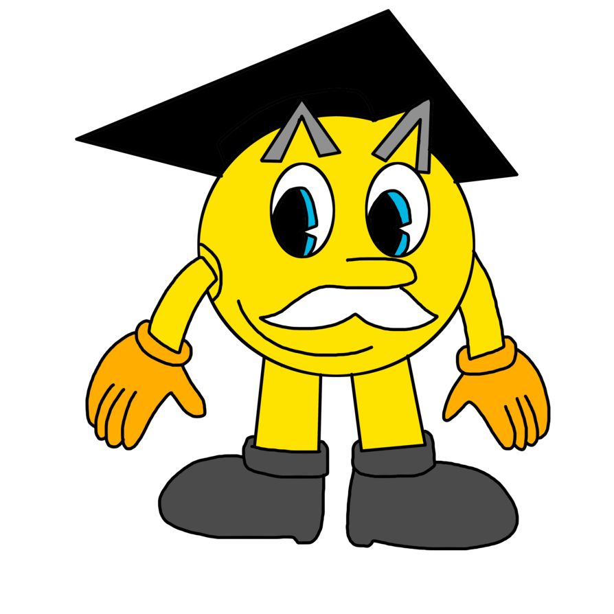

## CS 161 - Intro to Computer Science

### Lab: Super Circle Drawer

At a recent cocktail party, David introduces you to his close friend Professor Pacman, world-renowned eater of ghosts and connoisseur of all things circular. He talked you up, and totally gushed about all the great programs you've written for him this semester. It turns out that Professor Pacman has been looking to hire someone to write a program to help manage their insane Circle collection. It piqued their interest when it was mentioned that you've dabbled with `CircleDrawers` in the past.

Professor Pacman has requested that you implement a new and improved version of `CircleDrawer` that can track an unlimited number of Circles instead of just two. The collection of Circles can be made visible or invisible, moved around the screen as a group, etc. With `ArrayLists` fresh in your head, you agree to the project...



#### Student Outcomes

- To manage objects with `ArrayList`s


#### Required Files

The following file(s) have been provided for this homework.

- [Lab9_SuperCircleDrawer.zip](Lab9_SuperCircleDrawer.zip)

#### Helpful APIs

The API handout that you'll want to have in front of you:

- [ArrayList](../api/ArrayListAPI.pdf)
- [Circle](../api/CircleAPI.pdf)

#### Instructions

I've created a new project to get you started. Please download and modify `SuperCircleDrawer` instead of creating a new project via BlueJ, otherwise you won't be able to submit the assignment when you're finished. Note: The new project contains the Circle class (with the `getDiameter()` getter method), and a version of the canvas with a larger drawing area. Your `SuperCircleDrawer` class should abide by the following:

- It should contain an `ArrayList` collection of `Circles`. Define an instance variable for the `ArrayList` that will be used to hold all of the `Circle` objects.

- A constructor that inputs an integer argument `numCircles`, the number of `Circles` to add to the initial collection. Then instantiate the `ArrayList` and populate it with `numCircles` circles. Each circle you create and insert into the collection should have a random diameter (from 1 to 100) and a random x and y position. The coordinates should be within the dimensions of the canvas, which is 800 (Width) by 600 (Height). Go ahead and make the circle **visible** too. Note the new `moveTo(..)` method that has been provided to circles can be used here. 

- An `addCircle(..)` method that inputs a single `Circle` object, adds the given circle to the collection, and draws it on the canvas. You do not need to _create_ any Circles in this method. Simply assume that a Circle object has already been created, and is being passed to this method. To test this method, create a circle object on the BlueJ workbench, take note of its variable name, make it red, and make it invisible. Then call `addCircle()` and give it the name of this new circle. It should show up on the canvas. Inspect your `SuperCircleDrawer` object to ensure that the last arrow points to this new circle.

- An `eraseCircles()` method that takes no arguments, and erases all of the circles in the collection from the canvas. These circles should not be removed from the list.

- Write a second `eraseCircles(..)` method that inputs a diameter. This method should erase all circles from the canvas that are smaller in size than the given diameter.

- It's be nice to make the circles re-appear after you erased them. Write a `drawCircles()` method that takes no arguments, and causes all of the circles in the ArrayList collection to be drawn on the canvas.

- A method called `removeSmallest()` that takes no inputs. This method identifies the smallest circle in the collection and removes it from the list (don't forget to erase it from the canvas first!). In the case of a tie, just remove either of them.

- A method called `replace(..)` that takes two Circle inputs, `c1` and `c2`. This method should search for `c1` in the existing collection, and replace it with the circle `c2` in its place. Don't forget to erase `c1` off the canvas before replacing it! `c2` should be made visible. If `c1` doesn't exist, then no action shall be taken.

  - You will want to exploit the `indexOf(..)` and the `set(..)` methods for `ArrayLists`. If you do this right, you won't even have to write a single loop.

  - To test, I would create two circles on the BlueJ workbench. Color them differently, and add one of them to the collection. Then you can call `replace()` given the new circle. This should cause the new one to be drawn, and the old one to be removed.

- A method called `replaceLargest(..)` that takes as argument a circle object. This method identifies the largest circle in the collection and replaces it with the given circle in its place. In the event of a tie, you are to only replace any one of them. You are reminded to re-use the previous method to minimize code duplication. 


- A method called `drawExtremes()` that takes no arguments and draws only the largest and smallest circles in the collection (all others should be hidden). In the case of a tie in either extreme case, you must draw all of the ones that are tied. As a hint, I would start by find the biggest and smallest diameters of the circles in your collection by iterating through all your circles. Then run through your circles again, and test each one to see if it matches one of those extreme diameters.


<!-- #### Optional Extensions

Got some extra time? Do the following extensions:

- `drawLargeCircles()` method will draw all Circles in the collection that have a diameter greater than 30, and hide all others.

- A method called `doubleDiameters()` that takes no arguments and causes all circles in the collection to double in size. -->

#### Grading

```
This assignment will be graded out of 2 points, provided that:
- You were in attendance and on-time.
- Completed all required methods.
```


#### Submitting Your Assignment
Follow these instructions to submit your work. You may submit as often as you'd like before the deadline. I will grade the most recent copy.

- Navigate to our course page on Canvas and click on the assignment to which you are submitting. Click on "Submit Assignment."

- Upload all files ending in  `.java` from your project folder.

- Click "Submit Assignment" again to upload it.

#### Credits

Written by Brad Richards.

#### Lab Attendance Policies

Attendance is required for lab. Unexcused absence = no credit even if you turned in the lab. Unexcused tardiness = half credit.
