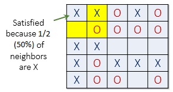
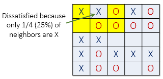
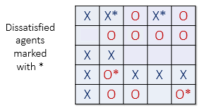
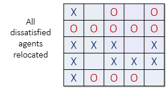

## CS 240 - Software Engineering

### Homework: Schelling's Model of Segregation

Racial segregation has always been a pernicious social problem in the United States. Although much effort has been extended to desegregate our schools, churches, and neighborhoods, the US continues to remain segregated by race and economic lines. Why is segregation such a difficult problem to eradicate?

In 1971, the American economist Thomas Schelling created an agent-based model that might help explain why segregation is so difficult to combat. His model of segregation showed that even when individuals (or "agents") didn't mind being surrounded or living by agents of a different race, they would still choose to segregate themselves from other agents over time! Although the model is quite simple, it gives a fascinating look at how individuals might self-segregate, even when they have no explicit desire to do so.

In this assignment, you will create a simulation of Schelling's model. The user should be able to set a number of parameters of the model and watch it go.

#### Student Outcomes

- To generate HTML content dynamically using JS
- To create and manipulate DOM objects
- To accept input from fields
- To practice using event listeners and callbacks

#### Starter Code and Git

Starter code for this assignment is provided in the github repo [https://github.com/davidtchiu/cs240-hwk-schelling](https://github.com/davidtchiu/cs240-hwk-schelling). Go to my github repo, and _*fork*_ this repository to your github account to obtain your own copy on github. Copy the Github URL to _your_ newly forked project. Then from your local machine, open a terminal, navigate to your directory for this class, and _*clone*_ your forked Github repo down to your local working directory. After you've done this, you can work freely in VS Code. Remember to commit when appropriate with substantive messages. Branch early and often. Push your `main` branch up to your github repo for backing up your work. I also will be checking out your Github's `main` branch for grading!

#### How Schelling's Model Works

Schelling's model will now be explained with some minor changes. Suppose there are two types of agents: X and O. The two types of agents might represent different races, ethnicity, economic status, etc. Two populations of the two agent types are initially placed into random locations of a neighborhood represented by a grid. After placing all the agents in the grid, each cell is either occupied by an agent or is empty as shown below.


Now we must determine if each agent is satisfied with its
current location. A satisfied agent is one that is surrounded
by at least $$t$$ percent of agents that are like itself. This
threshold $$t$$ is one that will apply to all agents in the model,
even though in reality everyone might have a different threshold
they are satisfied with. Note that the higher the threshold, the
higher the likelihood the agents will not be satisfied with their
current location.

For example, if $$t = 30\%$$, agent X is satisfied if at least 30% of
its neighbors are also X. If fewer than 30% are X, then the agent
is not satisfied, and it will want to change its location in the
grid. For the remainder of this explanation, let's assume a
threshold t of 30%. This means every agent is fine with being in
the minority as long as there are at least 30% of similar agents
in adjacent cells.

The picture below (left) shows a satisfied agent because
50% of X's neighbors are also X $$(50\% > t)$$. The next X (right) is
not satisfied because only 25% of its neighbors are X $$(25\% < t)$$.
Notice that in this example empty cells are <b>not</b> counted when
calculating similarity.




When an agent is not satisfied, it should be moved to a vacant
location in the grid. Any algorithm can be used to choose this
new location. For example, a randomly selected cell may be
chosen, or the agent could move to the nearest available location.
(In my implementation, I just chose a random vacant cell to
move to).

In the image below (left), all dissatisfied agents have an asterisk
next to them. The image on the right shows the new configuration
after all the dissatisfied agents have been moved to unoccupied cells
at random. Note that the new configuration may cause some agents
which were previously satisfied to become dissatisfied!




All dissatisfied agents must be moved in the same round or generation. After the
round is complete, a new round begins, and dissatisfied agents are
once again moved to new locations in the grid. These rounds continue
until all agents in the neighborhood are satisfied with their location.

#### Working Solution

[Click here](demo/) for my working solution of this App. (Use FireFox for best results -- a Chrome bug enters infinite loop when you use the color picker.)

#### Program Requirements

For full credit, your project should observe the following requirements.

- Use the file templates that were provided to you. The only file you need to make changes to is `schelling.js`, but you're free to make changes to the CSS file to your liking. **DO NOT** modify `index.html`.

- **Dynamic HTML generation:** Take a closer look inside `index.html`. Notice that the table displaying the population grid is nowhere to be found! In the previous scoreboard assignment, you saw the limitations of start up with a preexisting HTML structure. It made it hard to associate those predefined HTML elements (like a box in the scoreboard) to your JavaScript code. Here we take a different approach (and this is a pattern you should get used to from now on). We instead start only with a minimalist version of the HTML: there might only be some `<div>` or `<p>` tags that your JS code will hook into.

  The basic idea is that, you will use JS to define classes and/or data structures (like a 2D array for the population grid), which makes it easy to access and work with. Then you'll write method(s) to convert those structures into HTML DOM nodes, before appending them to the pages. That way, you won't have to worry about things like first having to create a table in HTML and giving each cell an ID! (That would be an insane amount of meticulous work!)

- When the page loads (or reloads), your app should immediately read in all of the existing values in the `<input>` fields. Use these values to generate an HTML `<table>` element representing the population distribution. Initially, you should get a 20 x 20 table containing ~10% vacant spots. In the remaining spots, you should see a ~60% to ~40% split between population X and Y, respectively. Produce the table using javascript (use a 2D array to represent the board). The table node must be attached as a child to the HTML element with the id: `board`.

  - You may want to refresh yourself on how tables are structured in HTML. Here's a link to [using tables](https://www.w3schools.com/html/html_tables.asp).

- When converting your 2D array to an HTML table, use the `document.createElement()` method, and append or replace the nodes where appropriate. That is, your code should _not_ be building an HTLM string, and modifying the `.innerHTML` field. Manipulate the DOM directly using standard JS functions learned in class.

- Vacant cells should be colored white, and its color cannot be changed. Picking a different color for either of the two populations should immediately cause their colors to change in the table. It should not, however, reset the table or move any elements around.

- When typing in a new dimension, similarity threshold, vacant %, or population split, your table's state should adjust to the new values as-you-type. Randomize/reset the table if the dimension, vacant, or population split changes. Changing the similarity threshold should not cause your table to reset.

- The `Randomize` button should cause the spots to be distributed randomly.

- The `Run!` button should run the simulation algorithm. The button's display and functionality should alternate between "Run!" and "Stop!" When running, iterate through every element and determine, using the rules provided in the description, whether it moves to a random location that is vacant (so, you'll need a way to keep track of all the vacant locations). It follows that the previously occupied cell is now vacant. After each cell in the table has been visited, you will examine whether any moves were made. If so, you'll compute the "next generation" of the table by repeating the above process. If no moves were made, the table is said to have "converged." Stop simulation on convergence --- at which point, your "Stop!" button will display "Run!" again.

- The number of generations should be reflected in the subtitle of your page.

- So that we can actually see the changes happening in real-time, add a 100ms delay between each generation. Here's how you can do it:

  ```js
  await new Promise((resolve) =>
    setTimeout(() => {
      resolve(); // do nothing after waiting 100 ms, just alert the calling thread
    }, 100)
  );
  ```

  You can put that right before or after each iteration of the board is drawn. For this to work, you will need add the `async` keyword to the function you're writing.

- Your program should demonstrate good modularity and abstraction.

#### Optional Extensions

Have some free time? Add the following features:

- Convert the dimension, similarity, and population ratio input fields to slide bars. The ranges should be set to [0,100] for dimension; [0.0,1.0] for similarity; and [0.0,1.0] for population split.

- Keep a counter showing the % of satisfied cells.

- Create a "Set to Default" button such that, when pressed, will return all input values to the original, and updates the table to reflect the default settings.

#### Submission

Assignment submission is simple. Simply make sure that the latest code is committed and pushed into your forked repo on github (before the 12am deadline). Then send me the link to your repository on [canvas](https://canvas.pugetsound.edu).

#### Grading

```
CS 240 Homework (Schelling's Model)


----------------------------------------------------------
[75/75pts] Implementation

> The grid should be drawn on page load with the given
properties from the input fields. Any changes to the form
(dimensions, colors, etc) should be reflected in the grid
immediatedly.

> There is a small delay between each generation of the grid.

> Event handling is properly implemented for all buttons
and text fields.

> Runtime efficiency consideration is emphasized
for this assignment.

> Neighborhood similarity scores are calculated accurately
for each cell.

> Exceptions, if thrown, are handled gracefully.

----------------------------------------------------------
[5/5pts] Comments

> You include sufficient comments describing your work.

----------------------------------------------------------
[0pts] Misc. Deductions
> Late?

----------------------------------------------------------
Suggestions (No Deductions)


Total:  80 / 80
```
