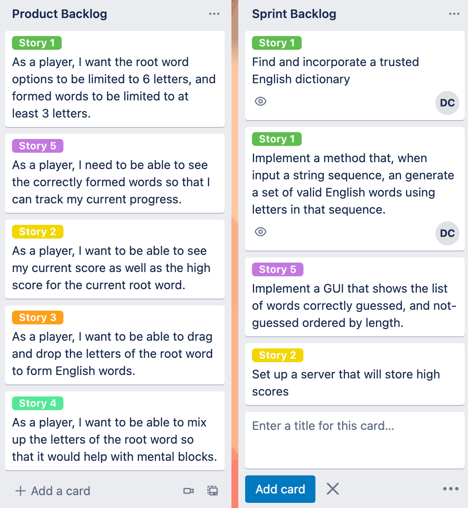

## CS 240 - Software Engineering

### In-Class Exercise: User Stories and Sprint Planning

As your team continues to develop personas and scenarios by which they interact with your software, we can begin refining some user stories for development. This lab is meant to help you jumpstart the requirements needed for Project 1.

#### Student Outcomes

- To identify and write user stories
- To practice the agile design process: sprint planning

#### Preliminary - Trello for Project Management

- Each of you will need to create a [Trello](https://trello.com/). Go ahead and do so now.

- Have one of you create a new Workspace and invite all your teammates to it. The title of this workspace should be the name of your team or software application.

- When creating a new "board," select the `Engineering-IT` category, which will display some templates. Choose the `Agile Spring Board` template to create a new board, but de-select the options to keep all existing cards and card templates. This board is where you will be putting your **product backlog** and **sprint backlog**.

- Invite me to your board, so I can keep track of progress over time. Please use `david.t.chiu@gmail.com`.

#### Part 1 - User Stories

- Refer back to your scenario(s) from the previous lab (and your work outside of class) and begin identifying user stories. Look for action verbs in the scenarios, and highlight where you think it could result in user stories.

- Use the following templates for writing your user stories.

  ```
  As a <role>, I <want|need> to <do something>
  ```

  and

  ```
  As a <role> I <want|need> to <do something> so that <reason>
  ```

  - Keep in mind that scenarios are not the only source for producing user stories, but they should do a good enough job covering the various ways your personas use your system. Stories can also be newly-defined through the personas themselves, and sometimes you might even discover the need for a new kind of user, with a whole new set of scenarios... you get the point: the software-design process is cyclical.

- In Trello, create a new _list_ called `Product Backlog`, and for each user story you write, create a new _card_ for it.

  - Then assign a `Label` to the user story card. You can access the labels by selecting the "edit" button to the right of the list.
  - Give your label a color, and name it `Story <X>` where `X` is just some unique identifier.

- Reorder the cards by priority. I would start by prioritizing the stories that cover software features that are core or essential to your app. **Remember** that your goal in the Agile development process is to create a prototype of the system quickly, so I wouldn't start with tackling auxiliary subsystems (like a login) until much, much later.

- Here's an example of my Product Backlog for the game we wrote earlier in the semester, Wordplay:

  

#### Part 2 - Planning Your First Sprint

Once your product backlog is populated with a good set of user stories, it's time to plan for your team to work on the remaining week.

- Elect your first **project manager**, who will be running daily sprint meetings starting tomorrow! You'll elect a new scrum master on each week.

  - If you want to see what I expect the project manager and the team to be doing on a daily basis, [go here](proj2.sprints/).

- Return to Trello after you've elected the project manager. Create a new list called `Sprint Backlog`.

- Assuming that our _sprints_ are only a week long (they're generally ~4 weeks in real life), try your best to estimate the number of user stories you and your team hope to implement in that time. (Maybe, since this is our first sprint, we should just try to implement 1-2 core stories between the team).

- From the user stories that you've selected for this sprint, talk through all the individual "tasks" that you think are involved in implementing it. Put each **"task"** in the Sprint Backlog.

  - Each sprint task should be a functional unit of work (like writing a method), and may have implementation details associated with it. Or, it may be an administrative task to make life easier for the team (such as setting up a data repository, or taking a tutorial to learn how to do something new).

  - To better organize your sprint backlog, give each sprint task a colored label, so that you can connect it to its corresponding User Story from the product backlog.

  - Assign each sprint task to the team member or members responsible for implementing it in the sprint. You can assign a task by selecting the "edit" button to the right of a task card, and choose `Change members`.

  - The amount of work that everyone takes on should be relatively equal. As tasks vary in size, it's normal for some team members to be assigned more tasks than others. (I know it can be subjective and hard to predict right now, and that's okay -- it's just the first sprint!)

- Here's what my product backlog and sprint backlog looks like for the initial sprint of Wordplay.

  

  - In this example my first user story expanded into two disparate tasks, both assigned to "DC."
  - You can ignore expanding other user stories into tasks for now. Always just focus on the _current_ sprint.
