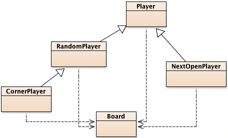

## CS 261 - Computer Science II

### Tic Tac Toe

Inheritance is a good thing. Really. It allows you to create new classes quickly by basing them off of other classes, instead of having to write a new class from scratch. And, as you'll see as you complete this assignment, it allows you to enhance an existing class without having to change the original — which is important if the original class does something useful and we want to keep it as is. For this assignment, you'll write parts of a program to play Tic-Tac-Toe. The project is composed of several classes: There's a class to model the game's board, and classes that model players (and playing styles). You'll create new players by basing them off of the existing Player class, and could pit them against one another or against the "human" player.


#### Required Files

The following file have been provided for testing your assignment.

- [Hwk2_TicTacToe.zip](Hwk2_TicTacToe.zip)

#### Overview
The class diagram below shows the relationship between the classes in the finished version of the project. I'm providing the Board and Player classes and you'll write the rest. The Board class represents a Tic-Tac-Toe board. It stores information about the symbols on the board, and contains methods for filling board spaces with an X or O, detecting when the board's full, and determining whether anyone's won the game. Its toString method returns a representation of the board, with . representing open spaces. The Player class models a Tic-Tac-Toe player, though not a very interesting one — it asks the human user where it should move rather than trying to figure out a move on its own. Player objects are assigned a symbol (X or O) when they're created, and have a makeMove method that, when passed a Board instance, fills in an open position with their symbol after getting input from the user. One could play a game by creating a Board instance and a pair of Player instances, and having the players take turns making moves on the board.



Your task for this assignment is to create several subclasses of the `Player` class that make moves automatically: `RandomPlayer`, `CornerPlayer`, and `NextOpenPlayer`.  The interactions below show the creation of a `Board` object, and invocation of several of its methods. The `fillPosition(int col, int row)` method takes a zero-based column and row number, and the symbol to put in the specified position. Note that, on our board, the column and row start from the bottom left (not the top left, as you'd expect for a 2D array). Note that there are no players involved in the interactions below. It's just highlighting some methods in the `Board` class.

```java
Board b = new Board();
System.out.println(b.toString());
> .  .  .
> .  .  .
> .  .  .

b.fillPosition(1, 2, Board.O);
System.out.println(b.toString());
> .  O  .
> .  .  .
> .  .  .

b.isOpen(1,2)
> false  (boolean)

b.boardFilled()
> false  (boolean)
```

The following interactions show a pair of `Player` instances making moves on the board instance, `b`, from above. The Player constructor takes a constant from the `Board` class describing which symbol they're playing, and a name as a string. I've prefixed the lines requiring user inputs with `>>`:

```java
Player x = new Player(Board.X, "Kasparov");
Player o = new Player(Board.O, "David");
x.makeMove(b);
> The current board:
> .  O  .
> .  .  .
> .  .  .
>
>> Kasparov, enter col: 2
>> Kasparov, enter row: 0

o.makeMove(b);
> The current board:
> .  O  .
> .  .  .
> .  .  X
>
>> David, enter col: 0
>> David, enter row: 1

System.out.println(b.toString());
> .  O  .
> O  .  .
> .  .  X
```


#### Instructions

1. Start by downloading the provided code package, and starting a project in your preferred editor. You don't need to know anything about how these classes work (just which methods they support, which you can get from the documentation), and you should not modify them.

2. The `Player` class has a `makeMove` method that gets advice from the user. It displays the current game board, then asks the user to enter the column and row for the position on the board that they'd like to fill. That's no fun. Define a `NextOpenPlayer` class that makes moves without getting help from the outside world. Your class should extend Player and override the `makeMove` method with a new version that selects the first open space it comes across, starting in the upper-left corner and working left to right. If no open spaces are found on the board, return without making a move. The interactions below show a `NextOpenPlayer` object in action.

    ```java
    Board b = new Board();
    NextOpenPlayer x = new NextOpenPlayer(Board.X, "Spassky");
    b.fillPosition(1, 2, Board.O);
    System.out.println(b.toString());
    > .  O  .
    > .  .  .
    > .  .  .

    x.makeMove(b);
    System.out.println(b.toString());
    > X  O  .
    > .  .  .
    > .  .  .

    x.makeMove(b);
    System.out.println(b.toString());
    > X  O  X
    > .  .  .
    > .  .  .

    x.makeMove(b);
    System.out.println(b.toString());
    > X  O  X
    > X  .  .
    > .  .  .

    x.toString()
    > "Spassky"   (String)
    ```

3. Extend `Player` again to create a `RandomPlayer` class. Objects of this type select from among the open positions on the board randomly. You *could* generate random row and column values until you find a position that's open, but I don't want you to, because the runtime of that loop would be unbounded. (Yeah I know it's unlikely to take more than a few iterations, but it's just bad code design). Instead, keep a list of open cells, and randomly select one of those cells to fill. If the board is already full, your method should return without modifying the board. Here's a couple of random players in action, though you'll obviously get different results:

    ```java
    Board b = new Board();
    RandomPlayer x = new RandomPlayer(Board.X, "I'm X");
    RandomPlayer o = new RandomPlayer(Board.O, "I'm O");
    x.makeMove(b);
    o.makeMove(b);
    System.out.println(b.toString());
    > .  .  O
    > .  X  .
    > .  .  .

    x.makeMove(b);
    o.makeMove(b);
    System.out.println(b.toString());
    > .  .  O
    > X  X  .
    > .  O  .

    x.makeMove(b);
    o.makeMove(b);
    System.out.println(b.toString());
    > .  O  O
    > X  X  X
    > .  O  .

    b.getWinner() == Board.X
    > true  (boolean)
    ```

4. Next, write a third and final player class called `CornerPlayer` that extends `RandomPlayer`. (No, that's not a typo — it extends `RandomPlayer` and not Player.) Objects of type `CornerPlayer` look first to see if any of the corners are open, and fill a corner if they find one. The order in which the corners are inspected isn't important. If none of the corners are available, it should select its move randomly from among the open positions. For full credit, your new `makeMove` method should not generate any random numbers. Instead, it should invoke `makeMove` from the superclass (`RandomPlayer`) if no corners are open.

    ```java
    Board b = new Board();
    CornerPlayer x = new CornerPlayer(Board.X, "Corner X");
    CornerPlayer o = new CornerPlayer(Board.O, "Corner O");
    x.makeMove(b);
    o.makeMove(b);
    System.out.println(b.toString());
    > X  .  .
    > .  .  .
    > O  .  .

    x.makeMove(b);
    o.makeMove(b);
    System.out.println(b.toString());
    > X  .  X
    > .  .  .
    > O  .  O

    x.makeMove(b);
    o.makeMove(b);
    System.out.println(b.toString());
    > X  O  X
    > .  .  X
    > O  .  O
    ```
  
    You can pit competing strategies against each other by creating instances of two different player classes and having them alternate turns on a board. (It would look like the interactions above, but with a CornerPlayer and a RandomPlayer, for example.) It's a bit of a pain to organize this all manually, but we'll write something for the next assignment that automates the process.

5. Custom player: None of the three player classes you created are very smart — there's lots of room for improvement. Write your own class that does a better job of guessing than the other players. Name your new player `F_L_Player`, where `F` and `L` refer to your first and last names. All your code must be contained within this class (i.e., do not introduce more classes and expect me to know to pull those into my editor). I'll run a tournament consisting of all of your custom players, and reward the winner(s) with to-be-determined prizes!

6. Finally, create a new `Tournament` class. In it, define a `playGame` method that takes two player instances and plays a single round of Tic-Tac-Toe between them. You should treat the first argument to `playGame` as the player using `X` and the second as `O`. (You'll want to use the `setSymbol` method to ensure that the players are using the proper symbols too.) Your method should print the output from the winner's celebrate method and the loser's mourn method, then return a reference to the winning player or `null` if the game ends in a draw.


#### Grading

```
CS 261 Homework 2 (TicTacToe)

----------------------------------------------------------
[10/10pts] Completion of NextOpenPlayer


----------------------------------------------------------
[10/10pts] Completion of RandomPlayer. Remember that I do not want you
to repeatedly generate random locations until you find one that is free.


----------------------------------------------------------
[10/10pts] Completion of CornerPlayer


----------------------------------------------------------
[10/10pts] Completion of your custom Player. Reuses code wherever possible.


----------------------------------------------------------
[20/20pts] Completion of the Tournament class.


----------------------------------------------------------
[2/2pts] You include sufficient comments to explain the logic of your methods.


----------------------------------------------------------
[3/3pts] You include sufficient Javadocs comments for each class and method.
```

#### Submitting Your Assignment
Follow these instructions to submit your work. You may submit as often as you'd like before the deadline. I will grade the most recent copy.

- If this is a team assignment, please ensure that you listed all of your team members in a Javadocs comment at the top of each `.java` file.

- Navigate to our course page on Canvas and click on the assignment to which you are submitting. Click on "Submit Assignment."

- Upload all the files ending in `.java` from your project folder.

- Click "Submit Assignment" again to upload it.


#### Credits

Written by Brad Richards.
