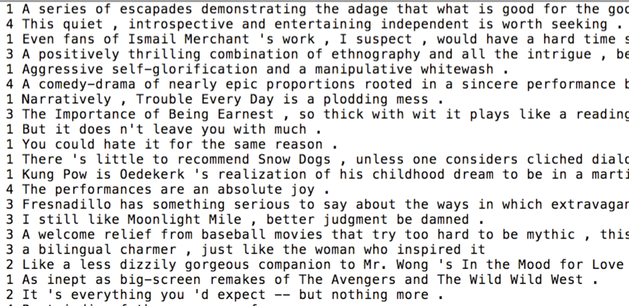
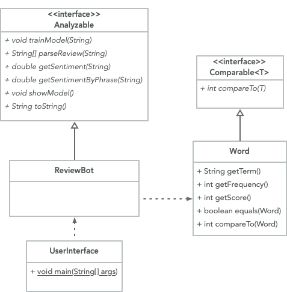

## CS 261 - Computer Science II

### Sentiment Analysis

Sentiment Analysis is a "Big Data" problem which seeks to determine the general attitude of a writer given some text they have written. For instance, we would like to have a program that could look at the text "The film was a breath of fresh air " and realize that it was a positive statement, while "It made me want to poke out my eye balls " is negative. This is just one application of an important class of algorithms called Machine Learning, a branch of CS that explores the construction and study of algorithms that can learn from data. Such algorithms operate by building a model from example inputs and using that model to make predictions or decisions.

```
////////////////////////////////////
//       Predict-O-Matic 2000     //
////////////////////////////////////
Instructions: Type in a movie review, and I'll try to guess your sentiment.

Enter a movie review file for training: movieReviews.txt
Loading file...
Done.

Enter a movie review. Press return to exit:
> A weak script that ends with a quick and boring finale !
>> I think that was a negative review. (1.7717648712136567)

Enter a movie review. Press return to exit:
> Loved every minute of it !!
>> I think that was a positive review. (2.311676336552997)

Enter a movie review. Press return to exit:
>
```

You are going to search through a file containing movie reviews from the Rotten Tomatoes website which have both a numeric score as well as text. Your program will use this to learn which words are positive and which are negative. The data file you're provided contains 8529 movie reviews, in which the sentiment of each review has been manually rated on a scale of 0 to 4 (the number of stars the reviewer rated a particular movie). The sentiment labels are: 0 - negative, 1 - somewhat negative, 2 - neutral, 3 - somewhat positive, and 4 - positive. A snippet of the review file looks like this:




#### Student Objectives
- To practice with object-oriented design.
- To practice with file handling and text processing.
- To practice with exception handling.
- To work with real data and be exposed to elementary machine-learning approaches.
- To practice with Big-O analysis.

#### Required Files

The following file(s) have been provided for this homework.

- [movieReviews.txt](movieReviews.txt) - A dump of Rotten Tomatoes reviews.
- [Analyzable.java](Analyzable.java) - An interface that your "bot" needs to implement.
- [BadReviewFormatException.java](BadReviewFormatException.java) - A checked exception class.


#### Object-Oriented Design
- Download the given files, and examine the class diagram below.

  


- There is an `Analyzable` interface that must be implemented by your `ReviewBot`. Your implementation must follow the documentation given in the interface, so open it up and read it thoroughly. 

- It is important that your `Word` class stores a triplet of data: the word itself, the number of times that it occurred in the whole review file (`frequency`), and its total score, which is described later.

- You are also responsible for writing the `UserInterface` -- This class simply contains the `main()` method, which I will run and expect kind of interaction shown in the beginning of this assignment. You should work this class into your UML diagram.


<!-- #### Object-Oriented Design -->
<!-- In this assignment you'll be mostly responsible for coming up with your own class designs. First things first, though. Read this assignment in entirety to understand the problem you need to solve before even starting to think about what classes and methods you'll need. 

On a whiteboard or sheet of paper, design the UML class diagram. Note that I have given you an interface that must be implemented by your "core" movie review-bot class. What classes do you think you'll need? How do they relate to each other (What are the client classes? Are there opportunities for inheritance?) Do any of them need to implement comparable or any other interface? What methods will you provide in each class, and how are they used by client classes? Projects containing only one or two classes will probably be too hard to manage. Decompose large classes into manageable pieces when possible. It is a very bad idea to start coding before you have class diagram designed.  Feel free to come talk to me or your tutors about your initial design.

-->


#### Instructions

1. Start a new project in your preferred editor, then download a copy of movieReviews.txt. Put it in your project folder. Open the file so that you get a chance to understand its format. Each line contains a movie review, and the sentiment of that review is the first number.

  You might also notice some strange formatting, but that's by design. For instance, there's always a space before a punctuation. This is to make it easier on you when you come across a word that has a punctuation appended. You don't want your program to treat it as a different word.


1. The model: You need to track every word that appears in the review, along with their score (explained below) and occurrences. For instance, let's say there are only two reviews in my movie file:

    ```
    4 I love love love this film !
    2 Had a love - hate relationship with this movie .
    ```

    The word "love" appears 4 times in the file (shows up in both reviews). Notice that, for each time the word love appears, the score of the corresponding movie review is added to "love's" total. Therefore, with respect to this small training file, "love" has a total score of 14 (= 4 + 4 + 4 + 2). The word "hate" appears just once, and has a total score of 2. Ignore all punctuation found in the training file.

2. Training the model: After you've opened the training file, read the file in its entirety. Assign scores and occurrences to each word you encounter in the file as I explained earlier. You should only have one object per unique word in your collection. We'll call the collection of these "word info" objects the model. This training process can take your program a little bit of time (a few seconds).

3. After it's done training, then prompt the users to input a review for which your program will then proceed to predict the sentiment. Just like in the beginning of this homework writeup, you ask users to provide a review (or just press enter to quit). You can assume that what is typed is formatted so that the punctuations are separated by space, and that punctuation should be ignored when scoring. Score the sentiment of the review by computing the average score of all the words in the user input. Any score that is $$2 \pm 0.1$$ is considered neutral. Anything below that threshold is negative, and anything above is positive.

    In my running example, ignoring punctuation, your model would contain the following "word info" objects:

    - "love", occurred: 4, score: 14
    - "I", occurred: 1, score: 4
    - "hate", occurred: 1, score: 2
    - "this", occurred: 2, score: 6
    - "film", occurred: 1, score: 4
    - "a", occurred: 1, score: 2
    - "relationship", occurred: 1, score: 2
    - "with", occurred: 1, score: 2
    - "movie", occurred: 1, score: 2

    If my input was "love and hate", then your program would produce an average score of 
    $$\frac{(14/4) + (2/1)}{2} = 2.75$$, leading your program to claim that it was a positive sentiment. Notice that, the word "and" was ignored in the scoring because it does not appear in my model.

4. A movie review from the file should always be formatted as follows: `[score] <space> [review]`. In one of the methods you need to implement, `parseReview()`, if the given review does not adhere to this format, then your method must throw a `BadReviewFormatException`. That is, if the first character is not a score from 0 to 4, then throw the exception. Likewise, if an empty review follows the space, then throw the exception.

   The caller of `parseReview()` must handle any exceptions gracefully, instead of allowing it to reach the JVM and crash the program. 


<!-- 
#### Big-O Commenting Requirements
Your training and prediction algorithms should observe fast runtimes. Experiment with different kinds of lists to store your data. You can use other data structures too, but that's not necessary for this assignment.

Requirement: In light of what we've been learning in class, in addition to the Javadocs comment that you are obligated to write on top of every method, you must also include its Big-O and a justification. For example...

```java
/**
 * This method inputs a string and determines the number of times that
 * a given character occurs in the string.
 *
 * Complexity: Let input size n be the length of the input string.
 * This algorithm runs in O(n) time because we iterate through each 
 * position of the string.
 *
 * @param str A given string
 * @return something
 */
``` -->
<!-- 
#### Extension
The Predict-O-Matic 2000 isn't perfect. The following extensions can be done for those interested in improving its accuracy, but for no extra credit.

- One problem that Predict-O-Matic 2000 suffers from is that it creates a separate score for same-rooted words. For instance, the words: like, liked, liking would all be scored independently, when they are really the same word. Look into using Porter's Stemming algorithm to find the "root" of any word. Then stem the training data before inputting it, as well as the user's review-input.

- Another problem is that there are a lot of words that really contribute no sentiment. For instance, "a," "the," "he", "she", etc. If you get unlucky with your training file, some of these common words may be assigned non-neutral score and bias your results. These are known as Stop Words. Process the review file and remove the top $$n$$ most frequently occurring words.

- Phrases like "not bad" has a neutral or even positive sentiment. However, because our program scores each word independently, the score of "not" would be averaged with the score for "bad." Independently, these words probably take on a negative sentiment, so Predict-O-Matic 2000 would likely think the review is negative. Modify your program so that it considers 
$$n$$-grams $$(n>1)$$, i.e., score every sequence of $$n$$ consecutive words. -->

#### Grading
```
CS 261 Homework (Sentiment Analysis)


----------------------------------------------------------
[10pts] Class design

> Your class design demonstrates good modularity.

> Demonstrates good use of inheritance and interfaces, if applicable.

> Your program must fully implement the given Analyzable interface.

----------------------------------------------------------
[10pts] Exception handling

> Your program gracefully handles checked exceptions.

> Your program throws the checked exception as specified.

----------------------------------------------------------
[15pts] Accuracy of Model Training

> Your trainer ignores the case of all words from the file.

> Your trainer accurately captures stats for every unique word encountered.


----------------------------------------------------------
[15pts] Predictor

> Your program produces expected predictions (averaged scores) based on
your model.


----------------------------------------------------------
[10pts] UserInterface class

> Your program repeatedly asks user for a review after finishing a prediction.

> Your program exits when no input is given.

----------------------------------------------------------
[5pts] Comments

> You include sufficient Javadocs comments for each class and method.

> You include sufficient inline comments in your methods.


----------------------------------------------------------
[0pts] Misc. Deductions
> Late?

----------------------------------------------------------
Suggestions (No Deductions)


Total: 65

```

#### Submitting Your Assignment
Follow these instructions to submit your work. You may submit as often as you'd like before the deadline. I will grade the most recent copy.

- If this is a team assignment, please ensure that you listed all of your team members in a Javadocs comment at the top of each `.java` file.

- Navigate to our course page on Canvas and click on the assignment to which you are submitting. Click on "Submit Assignment."

- Upload all the files ending in `.java` from your project folder.

- Click "Submit Assignment" again to upload it.
