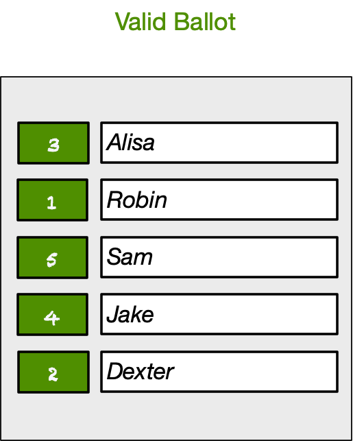
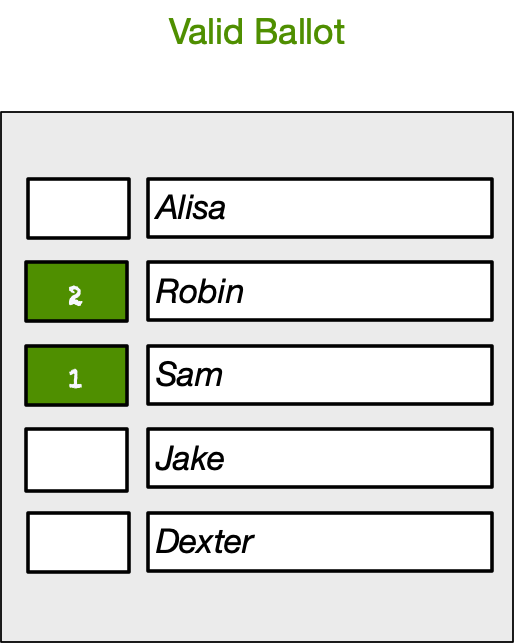
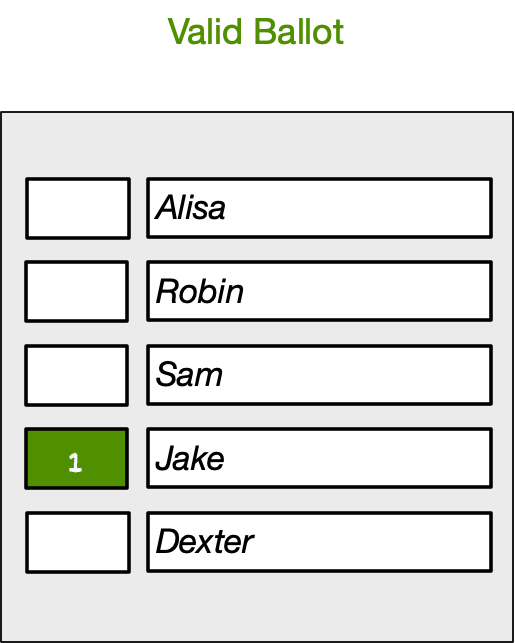
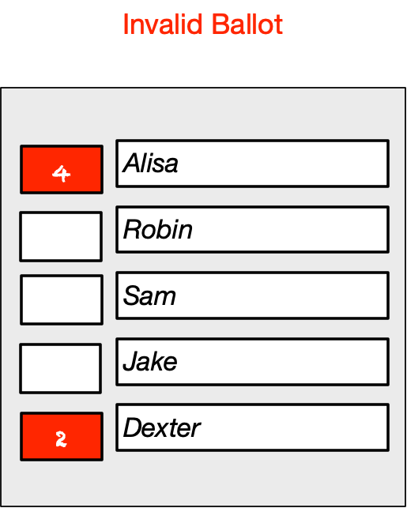
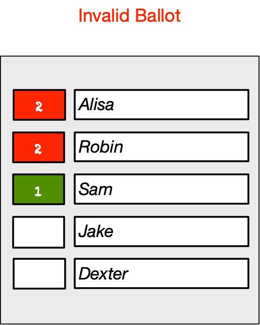
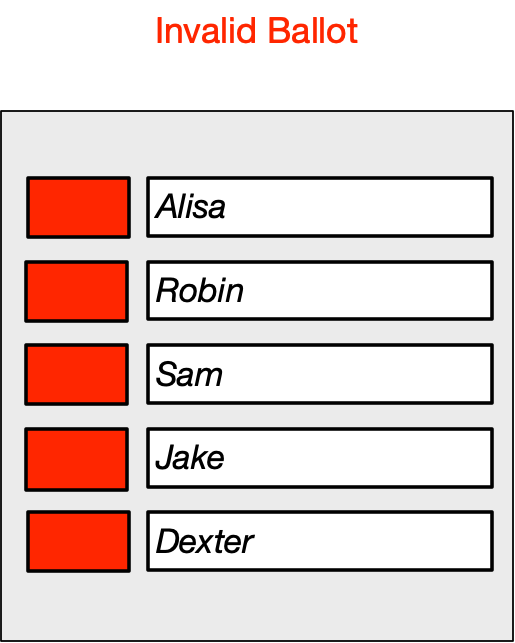
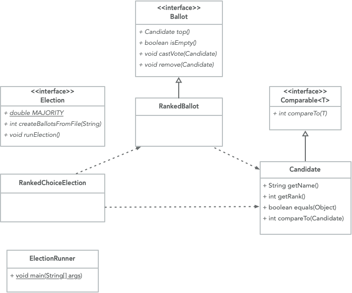

## CS 261 - Computer Science II

### Ranked-Choice Voting

A fair criticism of the electoral system as we know it is "winning by plurality," which may not represent who (or what) voters in general prefer. To demonstrate this, consider an election in which five candidates Alisa, Robin, Sam, Jake, Dexter are running for office. After the tally, the result is: Alisa = 19%, Robin = 28%, Sam = 20%, Jake = 8%, and Dexter = 25%. Robin wins out with highest percentage (28%) of votes, but is that who the voters really prefer? Indeed a vast majority (72%) of voters preferred someone else!


The problem traces back to the fact that voters only get one choice, but how would an election work if we let voters select multiple options? Ranked-Choice Voting (RCV) is one such electoral system that lets voters choose multiple candidates, and it's gaining steam across the country at all levels of government.


#### Student Objectives
- To understand the process of the Ranked Choice Election system.
- To understand the application of priority queues.

#### Teams
You are required to work in teams on this assignment. I've used a sophisticated matching algorithm to produce the groups listed below. (Ok, it's just random, but I did write a program to do it!) Do not start writing any code until you've met with your team member(s) and discussed the assignment and possible approaches. For best results, I expect you to work physically together. I will assume that each member of the team has contributed equally to the project. If that isn't true, please contact me privately.

```txt
[Ashlyne C, Hannah E]
[Noel L, Amanda W]
[Elizabeth B, Bonacic B]
[Ben H, Gemma B]
[Jacob W, Julien W]
[Lily G, Paul M]
[Brendan B, Miles M]
[Kendall P, Gabriel E]
[Maia C, Pallas C]
[Timothy T, Alex W]
```


#### Required Files

The following file(s) have been provided for this homework.

- [Ballot.java](Ballot.java)
- [Election.java](Election.java)
- [ElectionRunner.csv](ElectionRunner.csv)
- [RCVRaw.csv](RCVRaw.csv)


#### How Ranked-Choice Voting (RCV) Works
An RCV ballot has multiple candidates listed, and a voter can rank candidates based on preference on an ordinal scale, starting from 1. It is important to note that, if a voter does not want to potentially cast a vote for a candidate, they must leave that candidate blank. I'll explain what "potentially cast" means later. Example ballots are shown below:

<table>
	<tr>
	<td width="230px" valign="top">
		
		<br/><br/>
		<i>
			All candidates can be ranked in order of preference.
		</i>
	</td>
	<td>
		&nbsp;&nbsp;
	</td>
	<td width="230px" valign="top">
		
		<br/><br/>
		<i>
			Only a subset of candidates can be ranked if
			the voter does not want to potentially cast a vote for anyone
			else.
		</i>
	</td>
	<td>
		&nbsp;&nbsp;
	</td>
	<td width="230px" valign="top">
		
		<br/><br/>
		<i>
			This voter did not
			have a strong preference for anyone else but Jake in the election.
		</i>
	</td>
	</tr>
</table>
<br/><br/>
Here are some invalid ballots that you should discard upon receiving:
<br/><br/>
<table>
	<tr>
	<td width="230px" valign="top">
		
		<br/><br/>
		<i>
		Numbers cannot be skipped, which consequentially means 
		rankings must begin at 1.
		</i>
	</td>
	<td>
		&nbsp;&nbsp;
	</td>
	<td width="230px" valign="top">
		
		<br/><br/>
		<i>
			Ties are not allowed. A tied ranking
			invalidates the whole ballot. (Even though Sam was
			cast correctly, this ballot is tossed out).
		</i>
	</td>
	<td>
		&nbsp;&nbsp;
	</td>
	<td width="230px" valign="top">
		
		<br/><br/>
		<i>
			Empty ballots indicate that a voter showed up
			to the voting booth, but didn't cast a vote
			for anybody...
		</i>
	</td>
	</tr>
</table>

#### Instant Runoff Algorithm
Once all the (valid) ballots have been received, the next step is to process them to determine the candidate garnering the highest preference. Here's how it all works:

- If a candidate receives over 50% of first-place votes, then you have a winner!
- Otherwise:
    - Determine the candidate with the fewest number of votes, and eliminate them from further consideration. Now, there may be multiple candidates that tie for the fewest number of votes. When this is the case, select a random candidate among them to eliminate.

    - Go back through the ballots, and remove all rankings of the eliminated candidate. This may cause rankings to be shifted. For instance, let's say candidate Alisa is eliminated from the previous step. When you come across a ballot [#1: Alisa, #2: Robin, #3: Jake], it will now become just [#1: Robin, #2: Jake]. Similarly, ballots containing only Alisa will now be empty and should be discarded altogether, since they are no longer valid.

    - For each elimination round, you must report the number of votes each candidate received to be the top choice, as well as which candidate was eliminated in that round (see my output below). Repeat this process until a winner is determined.

#### Example
Let's say we have received the following eight RCV ballots for an election among Alisa, Robin, Dexter, Jake, and Sam.

```
B_0: [#1 = Alisa, #2 = Robin, #3 = Dexter]
B_1: [#1 = Sam]
B_2: [#1 = Robin, #2 = Jake]
B_3: [#1 = Alisa, #2 = Jake]
B_4: [#1 = Dexter, #2 = Sam]
B_5: [#1 = Dexter, #2 = Robin]
B_6: [#1 = Robin, #2 = Dexter]
B_7: [#1 = Dexter]
```

Here's the tally for the <b>1st round</b>.
Alisa (2/8 = 25%), Robin (2/8 = 25%), Dexter (3/8 = 37.5%), Jake = (0/8 = 0%), and Sam (1/8 = 12.5%). Because no one achieved over the 50% majority, **we eliminate Jake**, who received the fewest number of votes in this round. The ballots are now modified to become:

```
B_0: [#1 = Alisa, #2 = Robin, #3 = Dexter]
B_1: [#1 = Sam]
B_2: [#1 = Robin]
B_3: [#1 = Alisa]
B_4: [#1 = Dexter, #2 = Sam]
B_5: [#1 = Dexter, #2 = Robin]
B_6: [#1 = Robin, #2 = Dexter]
B_7: [#1 = Dexter]
```

Here's the tally for the <b>2nd round</b>.
Alisa (2/8 = 25%), Robin (2/8 = 25%), Dexter (3/8 = 37.5%), and Sam (1/8 = 12.5%).
Because no one achieved over the 50% majority still, **we eliminate Sam**, who received the fewest number of votes in this round.
The ballots become:

```
B_0: [#1 = Alisa, #3 = Dexter]
B_2: [#1 = Robin]
B_3: [#1 = Alisa]
B_4: [#1 = Dexter]
B_5: [#1 = Dexter]
B_6: [#1 = Robin, #2 Dexter]
B_7: [#1 = Dexter]
```

The tally for the <b>3rd round</b>.
Alisa (2/7 = 28.5%), Robin (2/7 = 28.5%), Dexter (3/7 = 42.7%). <i>Note that the denominator reduced by one, because the ballot that eliminated Sam became empty and is no longer valid!</i>
This time, there's a tie between Robin and Alisa for fewest votes! When this the case, we flip a coin, and let's say that **Robin was eliminated**. The ballots are now:

```
B_0: [#1 = Alisa, #2 = Dexter]
B_3: [#1 = Alisa]
B_4: [#1 = Dexter]
B_5: [#1 = Dexter]
B_6: [#1 = Dexter]
B_7: [#1 = Dexter]
```

The tally for the <b>4th round</b>. 
Alisa (2/6 = 33%) and Dexter (4/6 = 67%). Dexter has reached majority, and is the winner
of the election. The final ballot count after eliminating Alisa, giving Dexter (5/5 = 100%) of the vote, looks like:

```
B_0: [#1 = Dexter]
B_4: [#1 = Dexter]
B_5: [#1 = Dexter]
B_6: [#1 = Dexter]
B_7: [#1 = Dexter]
```
This "instant runoff" algorithm will <i>always</i> produce a winner, and it needs $$O(n)$$ rounds of elimination in the worst-case, where $$n$$ is the number of candidates in the election.

#### The Raw Ballot File
Here's some historical context: An important election among Puget Sound faculty took place back in Fall 2019, and because there were multiple candidates from which to choose, a resolution was made to run an RCV election. At the time I was a part of the committee that conducted the election, but it's not a simple count, so a program had to be written. The file containing the ballots that were cast for the election is provided to you: <a href="RCVRaw.csv">RCVRaw.csv</a>. The only thing I did was to replace the names of the candidates to protect the anonymity of our election. <b>Do not</b> open this file using Excel -- instead, open it with a simple
text editor. The first few lines of this file are shown here:

```
Zebra,Giraffe,Rhino,Lion,Tiger,Bear
Ranked #5,Ranked #1,Ranked #3,Ranked #4,Ranked #2,Ranked #6
Ranked #6,Ranked #1,Ranked #5,Ranked #2,Ranked #4,Ranked #3
No Rank,No Rank,No Rank,No Rank,No Rank,Ranked #1
No Rank,Ranked #1,Ranked #5,Ranked #2,Ranked #4,Ranked #3
No Rank,Ranked #2,No Rank,Ranked #3,Ranked #1,No Rank
```

The first line in the file contains the names of candidates separated by comma.
Each line thereafter represents an RCV ballot. Because this data is in 
its "raw form," I cannot guarantee that all ballots are <i>valid</i>, according
to the definition of validity given in the previous section.

#### Program Requirements

- Download the given files, and examine the class diagram below.

  

- Your program (class names and all) must adhere to those given in the class diagram. If everything is done correctly, you should be able to run `ElectionRunner` and obtain the results that I got below.


- Your `Candidate` class must override the `equals(Object)` method, among other things. You should simply ensure that two candidates are equal if their names are the same. Your `Candidate` class must also implement the `Comparable` interface. I'll leave it up to you to figure out how to order candidates.

- You are required to use a `PriorityQueue<E>` in your `RankedBallot` class for storing candidates. Re-read the runoff elimination process, and see why priority queues are the most appropriate data structure to use here before moving on. Understand how you will leverage the priority queue properties to simplify your election code. **A word on debugging:** You will be tempted to print out the contents of the priority queue to ensure that candidates are in the "right order." However, please note that Java's priority queue is not built on a sorted list. It only ensures that the smallest element it at the head, and it makes no other guarantees. Therefore, when you print out a priority queue, don't be caught off-guard if the elements seem to be in some weird order.

- The list of candidates is always given on the first line of the file. Your code must work for an arbitrary number of candidates, but you can assume that there will always be at least two.


#### Sample Output
If you wrote the program correctly, your output should look exactly like mine when given `RCVRaw.csv` for input.

```
===============================
Rank-Choice Vote Ballot Counter
===============================
188 valid ballots received

--------------------------------Round 1--------------------------------
Rhino:	8 votes	(0.043)
Zebra:	25 votes	(0.133)
Lion:	25 votes	(0.133)
Bear:	47 votes	(0.250)
Sloth:	52 votes	(0.277)
Tiger:	31 votes	(0.165)
Total nonempty ballots: 188

Rhino eliminated.


--------------------------------Round 2--------------------------------
Zebra:	25 votes	(0.133)
Lion:	27 votes	(0.144)
Bear:	50 votes	(0.266)
Sloth:	52 votes	(0.277)
Tiger:	34 votes	(0.181)
Total nonempty ballots: 188

Zebra eliminated.


--------------------------------Round 3--------------------------------
Lion:	31 votes	(0.166)
Bear:	53 votes	(0.283)
Sloth:	57 votes	(0.305)
Tiger:	46 votes	(0.246)
Total nonempty ballots: 187

Lion eliminated.


--------------------------------Round 4--------------------------------
Bear:	72 votes	(0.393)
Sloth:	61 votes	(0.333)
Tiger:	50 votes	(0.273)
Total nonempty ballots: 183

Tiger eliminated.


--------------------------------Round 5--------------------------------
Bear:	89 votes	(0.520)
Sloth:	82 votes	(0.480)
Total nonempty ballots: 171

Sloth eliminated.


--------------------------------RESULTS--------------------------------
WINNER BY MAJORITY: [Bear]
-----------------------------------------------------------------------
Bear:	149 votes	(1.000)
Total nonempty ballots: 149
```


#### Grading
```
CS 261 Homework (Rank Choice Vote)

----------------------------------------------------------
[15/15pts] Class design

> Your class design demonstrates good modularity.

> Demonstrates good use of inheritance and interfaces,
  if applicable.

----------------------------------------------------------
[5/5pts] Exception handling

> Your program gracefully handles all exceptions thrown,
particularly, FileNotFoundException.


----------------------------------------------------------
[60/60pts] Implementation and Efficiency

> The choice of data structures to use for representing
  ballots should be justified based on efficiency.

> Runtime efficiency consideration is highly emphasized
for this assignment.

> Your program discards "invalid" ballots given in the file.

> Following the elimination of candidate C, they must be removed,
and any candidate following C must be "promoted" in all
existing ballots. This process needs to be efficient.

> When two candidates tie for the fewest number of votes in a
round, you should randomly eliminate a candidate.

> Ensure all percentages are calculated correctly in every round.

> Edge: Ensure that program works for any number of candidates (and
thus, rankings) including 1.

> Edge: Ensure that your program works for any number of valid ballots,
including 0.


----------------------------------------------------------
[5/5pts] Comments

> You include sufficient Javadocs comments for each class and method.

> You include sufficient inline comments in your methods.


----------------------------------------------------------
[0pts] Misc. Deductions
> Late?

----------------------------------------------------------
Suggestions (No Deductions)


Total: 85
```

#### Submitting Your Assignment
Follow these instructions to submit your work. You may submit as often as you'd like before the deadline. I will grade the most recent copy.

- If this is a team assignment, please ensure that you listed all of your team members in a Javadocs comment at the top of each `.java` file.

- Navigate to our course page on Canvas and click on the assignment to which you are submitting. Click on "Submit Assignment."

- Upload all the files ending in `.java` from your project folder.

- Click "Submit Assignment" again to upload it.

#### Credits
Written by David Chiu.