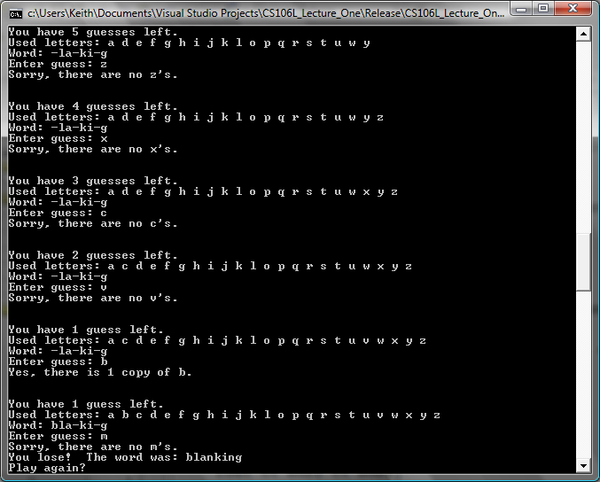

## CS 261 - Computer Science II

### Evil Hangman

Read: Not that I need to worry, but before we get started, a word of caution. This is a popular CS 2 assignment, and I'm totally aware there are lots of implementations out there, and yes, copying/pasting any segment of code from the internet is considered plagiarism.

It's hard to write computer programs to play games. When we as humans sit down to play a game, we can draw on past experience, adapt to our opponents' strategies, and learn from our mistakes. Computers, on the other hand, blindly follow a preset algorithm that (hopefully) causes it to act somewhat intelligently. Though computers have bested their human masters in some games, most notably checkers and chess, the programs that do so often draw on hundreds of years of human game experience and use extraordinarily complex algorithms and optimizations to out-calculate their opponents...




While there are many viable strategies for building competitive computer game players, there is one approach that has been fairly neglected in modern research – cheating. Why spend all the effort trying to teach a computer the nuances of strategy when you can simply write a program to play dirty and win handily all the time? In this assignment, you will build a mischievous program that bends the rules of Hangman to trounce its human opponent time and time again. In doing so, you'll cement your skills with abstract data types and iterators, and will hone your general programming savvy. Plus, you'll end up with a piece of software which will be highly entertaining. At least, from your perspective.


#### Student Objectives
- To practice with file handling and text processing.
- To practice with object-oriented design.
- To select appropriate algorithms and data structures for problem solving.
- To use HashMaps


#### Team Assignments
For this project you'll be working in teams. Please ensure that you listed all of your team members in a Javadocs comment at the top of each `.java` file.

```txt
[Hannah E, Pallas C]
[Amanda W, Gemma B]
[Ashlyne C, Maia C, Kendall P]
[Lily G, Miles M]
[Timothy T, Noel L]
[Bonacic, Alex W]
[Ben H, Gabriel E]
[Elizabeth B, Julien W]
```


#### Required Files

The following file(s) have been provided for this homework.

- [dictionary.txt](dictionary.txt)


#### Overview of Evil Hangman

In case you aren't familiar with the game Hangman, the rules are as follows:

- One player chooses a secret word, then writes out a number of dashes equal to the word length.
- The other player begins guessing letters. Whenever she guesses a letter contained in the hidden word, the first player reveals each instance of that letter in the word. Otherwise, the guess is wrong.
- The game ends either when all the letters in the word have been revealed or when the guesser has run out of guesses.

Fundamental to the game is the fact the first player accurately represents the word she has chosen. That way, when the other players guess letters, she can reveal whether that letter is in the word. But what happens if the player doesn't do this? This gives the player who chooses the hidden word an enormous advantage. For example, suppose that you're the player trying to guess the word, and at some point you end up revealing letters until you arrive at this point with only one guess remaining: `DO_BLE`.

There are only two words in the English language that match this pattern: `"doable"` and `"double"`. If the player who chose the hidden word is playing fairly, then you have a fifty-fifty chance of winning this game if you guess `'A'` or `'U'` as the missing letter. However, if your opponent is cheating and hasn't actually committed to either word, then there is no possible way you can win this game. No matter what letter you guess, your opponent can claim that she had picked the other word, and you will lose the game. That is, if you guess that the word is "doable," she can pretend that she committed to "`double`" the whole time, and vice-versa.

Let's illustrate this technique with an example. Suppose that you are playing Hangman and it's your turn to choose a word, which we'll assume is of length four. Rather than committing to a secret word, you instead compile a list of every four-letter word in the English language. For simplicity, let's assume that English only has a few four-letter words, all of which are reprinted here:

ALLY    BETA    COOL    DEAL    ELSE    FLEW    GOOD    HOPE    IBEX


Now, suppose that your opponent guesses the letter `'E'`. You now need to tell your opponent which letters in the word you've "picked" are E's. Of course, you haven't picked a word, and so you have multiple options about where you reveal the E's. Here's the above word list, with E's highlighted in each word:

ALLY    B**E**TA    COOL    D**E**AL    **E**LS**E**    FL**E**W    GOOD    HOP**E**    IB**E**X

If you'll notice, every word in your word list falls into one of five “word families:”

- `----`, which contains the words ALLY, COOL, and GOOD
- `-E--`, which contains BETA and DEAL
- `--E-`, which contains FLEW and IBEX
- `E--E`, which contains ELSE
- `---E`, which contains HOPE

Since the letters you reveal have to correspond to some word in your word list, you can choose to reveal any one of the above five families. There are many ways to pick which family to reveal – perhaps you want to steer your opponent toward a smaller family with more obscure words, or toward a larger family in the hopes of keeping your options open. In this assignment, in the interests of simplicity, we'll adopt the latter approach and always choose the largest of the remaining word families. In this case, it means that you should pick the family `----`. This reduces your word list down to:

ALLY    COOL    GOOD

and since you didn't reveal any letters, you would tell your opponent that their guess was wrong. Let's see a few more examples of this strategy. Given this three-word word list, if your opponent guesses the letter `O`, then you would break your word list down into two families:

- `-OO-`, which contains COOL and GOOD
- `----`, which contains ALLY

The first of these families is larger than the second, and so you choose it, revealing two `O`'s in the word and reducing your list down to

COOL    GOOD

But what happens if your opponent guesses a letter that doesn't appear anywhere in your word list? For example, what happens if your opponent now guesses `'T'`? This isn't a problem. If you try splitting these words apart into word families, you'll find that there's only one family, the family `----` in which `T` appears nowhere and which contains both `COOL` and `GOOD`. Since there is only one word family here, it's trivially the largest family, and by picking it you'd maintain the word list you already had.

There are two possible outcomes of this game. First, your opponent might be smart enough to pare the word list down to one word and then guess what that word is. In this case, you should congratulate them – that's an impressive feat considering the scheming you were up to! Second, and by far the most common case, your opponent will be completely stumped and will run out of guesses. When this happens, you can pick any word you'd like from your list and say it's the word that you had chosen all along. The beauty of this setup is that your opponent will have no way of knowing that you were dodging guesses the whole time – it looks like you simply picked an unusual word and stuck with it the whole way.

#### Instructions

Your assignment is to write a computer program which plays a game of Hangman using this “Evil Hangman” algorithm. In particular, your program should do the following:

- Read the file `dictionary.txt`, which contains the full contents of the Official Scrabble Player's Dictionary, Second Edition. This word list has over 120,000 words, which should be more than enough for our purposes.

- Prompt the user for a word length, reprompting as necessary until she enters a number such that there's at least one word that's exactly that long. That is, if the user wants to play with words of length -42 or 137, since no English words are that long, you should reprompt her.

- Prompt the user for a number of guesses, which must be an integer greater than zero. Don't worry about unusually large numbers of guesses – after all, having more than 26 guesses is clearly not going to help your opponent! Again, reprompt if necessary.

- Prompt the user for whether she wants to have a running total of the number of words remaining in the word list. This completely ruins the illusion of a fair game that you'll be cultivating, but it's quite useful for testing (and grading!)

- Play a game of Hangman using the Evil Hangman algorithm, as described below:

    - Print out how many guesses the user has remaining, along with any letters the player has guessed and the current blanked-out version of the word. If the user chose earlier to see the number of words remaining, print that out too.

    - Prompt the user for a single letter guess, reprompting until the user enters a letter that she hasn't guessed yet. Make sure that the input is exactly one character long and that it's a letter of the alphabet.

    - Partition the words in the dictionary into groups by word family, described above.

    - Find the most common “word family” in the remaining words, remove all words from the word list that aren't in that family, and report the position of the letters (if any) to the user. If the word family doesn't contain any copies of the letter, subtract a remaining guess from the user.

    - If the player has run out of guesses, pick a random word from the word list and display it as the word that the computer initially “chose.”

    - If the player correctly guesses the word, congratulate them.

- Think about what data structures would be best for tracking word families and the master word list.

    - Tracking the current set of word families makes perfect use of `HashMap`s. You could, for instance, use the word family string pattern (say `"_ _ R _ _"`) to be the key, and it hashes to a list (or set) of words that fall into that family (say, `LORDS`, `DARTS`, `FIRST`, and so on). Your map should store multiple such entries.

    - The master word list also needs to be stored in a data structure for quick access. The dictionary file that's given to you is alphabetized, but is that the optimal ordering for what you're trying to accomplish? Would it make more sense to order the words in terms of their length? What if you alphabetized them *after* you first ordered them by length?

    - The list of guessed letters needs to be output in alphabetical order after each wrong guess. Again, you'll want to avoid using a data structure that would require you to re-sort the list after each guess.

    - You are allowed to use the Java-provided classes that represent these data structures. In other words, you don't have to use the trees, lists, and maps that we wrote in lab/class.

#### Advice
Letter position matters just as much as letter frequency. When computing word families, it's not enough to count the number of times a particular letter appears in a word; you also have to consider their positions. For example, `BEER` and `HERE` are in two different families even though they both have two `E`'s in them. Consequently, representing word families as numbers representing the frequency of the letter in the word will get you into trouble.

Watch out for gaps in the dictionary. When the user specifies a word length, you will need to check that there are indeed words of that length in the dictionary. You might initially assume that if the requested word length is less than the length of the longest word in the dictionary, there must be some word of that length. Unfortunately, the dictionary contains a few gaps. The longest word in the dictionary has length 29, but there are no words of length 27 or 26. Be sure to take this into account when checking if a word length is valid.

Don't explicitly enumerate word families. If you are working with a word of length $$n$$, then there are $$2^n$$ possible word families for each letter. However, most of these families don't actually appear in the English language. For example, no English words contain three consecutive `U`s, and no word matches the pattern `E-EE-EE--E`. Rather than explicitly generating every word family whenever the user enters a guess, see if you can generate word families only for words that actually appear in the word list. One way to do this would be to scan over the word list, storing each word in a table mapping word families to words in that family.

#### Sample Output
Here is a sample run of my program:

```
Currently: ________
Used letters: []
You have 10 guesses remaining.
Input your guess: a

Currently: ________
Used letters: [a]
You have 9 guesses remaining.
Input your guess: e

Currently: ________
Used letters: [a, e]
You have 8 guesses remaining.
Input your guess: s

Currently: ________
Used letters: [a, e, s]
You have 7 guesses remaining.
Input your guess: t

Currently: ________
Used letters: [a, e, s, t]
You have 6 guesses remaining.
Input your guess: n

Currently: ______n_
Used letters: [a, e, n, s, t]
You have 6 guesses remaining.
Input your guess: r

Currently: ______n_
Used letters: [a, e, n, r, s, t]
You have 5 guesses remaining.
Input your guess: l

Currently: ____l_n_
Used letters: [a, e, l, n, r, s, t]
You have 5 guesses remaining.
Input your guess: b

Currently: ____l_n_
Used letters: [a, b, e, l, n, r, s, t]
You have 4 guesses remaining.
Input your guess: p

Currently: ____l_n_
Used letters: [a, b, e, l, n, p, r, s, t]
You have 3 guesses remaining.
Input your guess: q

Currently: ____l_n_
Used letters: [a, b, e, l, n, p, q, r, s, t]
You have 2 guesses remaining.
Input your guess: i

Currently: ____lin_
Used letters: [a, b, e, i, l, n, p, q, r, s, t]
You have 2 guesses remaining.
Input your guess: d

Currently: ____lin_
Used letters: [a, b, d, e, i, l, n, p, q, r, s, t]
You have 1 guesses remaining.
Input your guess: v

You lose!
The secret word is: muzzling
```

#### Grading
```
CS 261 Homework (Evil Hangman)

======================================

[10/10pts] Inputting the dictionary file.

======================================

[10/10pts] Your program prompts the user for a word length, and reprompts the user when given
an invalid input.

======================================

[10/10pts] Your program prompts the user for a number of guesses, and reprompts the user when given
an invalid input.

======================================

[10/10pts] Your program prompts the user she wants to have a running total of the number of words
remaining in the word list, and displays the list after each guess.

======================================

[10/10pts] Your program stores the set of letters already guessed, and does not allow more guesses
on the same letter to be made. The determination of whether a letter is already guessed should be
efficient.

======================================

[10/10pts] Your program stores the number of guesses-made and quits when this number of guesses
has been reached, or congratulates the player if they successfully guessed the secret word.

======================================

[30/30pts] Word family partitioning: Your program identifies the word family and all
words that match the word family, given the current guesses. After each guess, the largest word
family is chosen.

======================================

[10/10pts] Use of hashmaps for storing word families.

======================================

[+5pts bonus] Two methods should be written recursively.

======================================

[-0pts] Misc. deductions
> None.

======================================


Total: 100

```

#### Submitting Your Assignment
Follow these instructions to submit your work. You may submit as often as you'd like before the deadline. I will grade the most recent copy.

- If this is a team assignment, please ensure that you listed all of your team members in a Javadocs comment at the top of each `.java` file.

- Navigate to our course page on Canvas and click on the assignment to which you are submitting. Click on "Submit Assignment."

- Upload all the files ending in `.java` from your project folder.

- Click "Submit Assignment" again to upload it.
