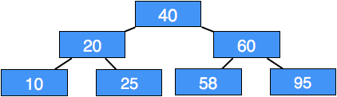
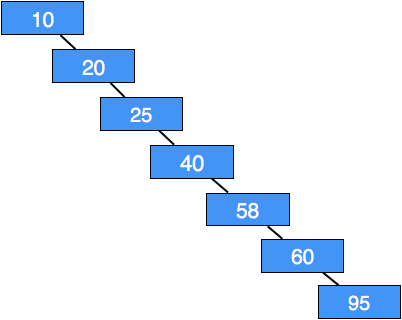
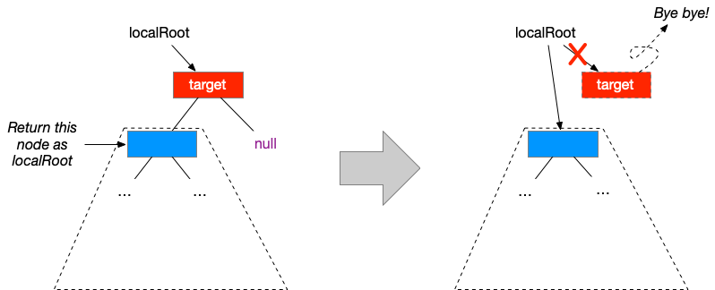
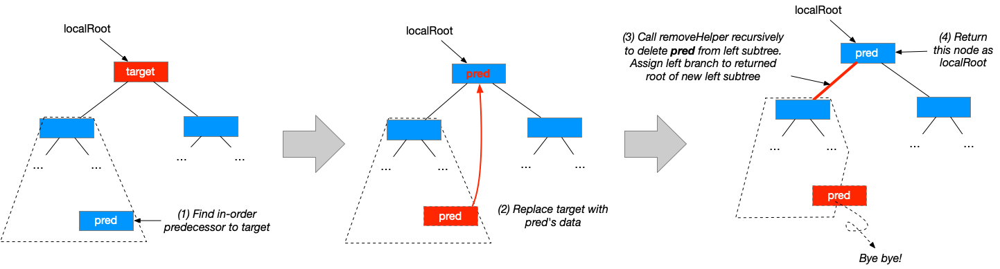

## CS 261 - Computer Science II

### Lab 10: Binary Search Trees

A Binary Search Tree (or BST) is arguably the most important data structure in the field of computer science. They are used to efficiently store a collection of objects in sorted order, which can help simplify searching. We've seen the important methods in class, and in this lab you will be implementing a few more BST methods. Before you get started, you should recall the **BST Properties**:

- Every node has at most 2 children
- Root node is greater than all nodes in the left subtree
- Root node is smaller than all nodes in the right subtree

Here are some examples of valid BSTs:




#### Objectives
- To understand the recursive structure of BSTs
- To implement BST methods recursively
- More practice with recursion and recursive data structures

#### Required Files
The following file(s) have been provided for this lab.
- [Lab_BSTLab.zip](Lab_BSTLab.zip)


#### Part I
I've created a new project to get you started. Please download and open it. First, you'll notice that there's now a `SearchTree<E>` interface that your `BinarySearchTree<E>` class must implement. Browse through the SearchTree interface to read up on the methods' documentations. Follow these instructions.

- Start by browsing through the `BinarySearchTree` class. Have a gander at the inner Node class, and then take some time to trace through the code for `add()` and `contains()` to remind yourself of what they do.

- Run the following code and check out the output:

  ```java
  // Build a balanced tree
  BinarySearchTree<Integer> my_bst = new BinarySearchTree<>();
  my_bst.add(3);
  my_bst.add(4);
  my_bst.add(1);
  my_bst.add(5);
  my_bst.add(2);
  System.out.println(my_bst.toString());
  > 3
  >   1
  >     null
  >     2
  >       null
  >       null
  >   4
  >     null
  >     5
  >       null
  >       null
  ```

  Focus on the "balanced tree" example above. Note that `3` is at the root, so it is printed out first. It has a left child `1` and right child `4`, which are printed out next. The node containing `1` does not have a left child, so `null` is displayed first, but it does have a right child `2`, which is a leaf. Similarly, the node `4` does not have a left child but has a right child `5`, which is also a leaf.

  Now consider this worst-case tree below. Observe how in the worst case tree, built when items are inserted in order, is nothing more than a glorified linked list.

  ```java
  // Build a worst case tree
  BinarySearchTree<Integer> my_bst2 = new BinarySearchTree<>();
  my_bst2.add(1);
  my_bst2.add(2);
  my_bst2.add(3);
  my_bst2.add(4);
  my_bst2.add(5);
  System.out.println(my_bst2.toString());
  > 1
  >   null
  >  2
  >    null
  >    3
  >      null
  >      4
  >        null
  >        5
  >          null
  >          null
  ```

- Take a look at all those BST figures at the top of this lab. Take note of where the largest element must be located in any BST. Implement the `E largest_helper()` method which returns the largest item in the BST rooted by the given node, or `null` if the given root node is `null`. Try implementing this one recursively.

  - **Hint:** Base case: if the `root` has no right child, the largest value is the data at the root. What's the general case?


- Now implement a method `public int numLeaves()` that counts the number of leaves in the tree. Recall that leaf nodes are ones without either child (that is, they both reference `null`). Finish writing the method called `numLeaves` that returns the number of leaf nodes in the BST. Before you look at the hint below, check out the `size()` method, and try to understand what it's doing. It's very close to what `numLeaves` needs to do.

  - **Hint:** I have generously provided the stub of a helper method `private int numLeavesHelper(Node<E> localRoot)` that `numLeaves()` calls. This helper method returns the number of leaves for for any BST rooted at the given `localRoot` node. Base case 1: if the local root is `null` then clearly, the number of leaves is 0. Base case 2: if the local root is not null, check if it's a leaf. If so, then return 1. General case: if the local root is not null and not a leaf, then the number of leaves in its BST is the sum of the number of leaves in both subtrees.

  - Make sure you test it before moving on.

  ```java
  BinarySearchTree<Integer> my_bst = new BinarySearchTree<>();
  my_bst.add(3);
  my_bst.add(4);
  my_bst.add(1);
  my_bst.add(5);
  my_bst.add(2);
  System.out.println(my_bst.toString());
  > 3
  >   1
  >     null
  >     2
  >       null
  >       null
  >   4
  >     null
  >     5
  >       null
  >       null

  System.out.println(my_bst.numLeaves());
  > 2

  BinarySearchTree<Integer> my_bst2 = new BinarySearchTree<>();
  my_bst2.add(1);
  my_bst2.add(2);
  my_bst2.add(3);
  my_bst2.add(4);
  my_bst2.add(5);
  System.out.println(my_bst2.toString());
  > 1
  >   null
  >   2
  >     null
  >     3
  >       null
  >       4
  >         null
  >         5
  >           null
  >           null

  System.out.println(my_bst2.numLeaves());
  > 1
  ```

- Implement the `public int height()` method which returns the height of the current tree. Recall that the *height of a tree* is the longest number of edges from the root to any leaf. Remember when I said in class that the reason you'd use recursion is to simplifying programming? This is one of those algorithms that's notoriously difficult to implement iteratively, but has a very simple recursive solution. Again, you only need to fill in the helper method. Start again by defining your base cases. When does the height become obvious? (There are two base cases.)

  ```java
  BinarySearchTree<Integer> my_bst = new BinarySearchTree<>();
  my_bst.add(3);
  my_bst.add(4);
  my_bst.add(1);
  my_bst.add(5);
  my_bst.add(2);
  System.out.println(my_bst.toString());
  > 3
  >  1
  >    null
  >    2
  >      null
  >      null
  >  4
  >    null
  >    5
  >      null
  >      null

  System.out.println(my_bst.height());
  > 2

  BinarySearchTree<Integer> my_bst2 = new BinarySearchTree<>();
  my_bst2.add(1);
  my_bst2.add(2);
  my_bst2.add(3);
  my_bst2.add(4);
  my_bst2.add(5);
  System.out.println(my_bst2.toString());
  > 1
  >   null
  >  2
  >    null
  >    3
  >      null
  >      4
  >        null
  >        5
  >          null
  >          null

  System.out.println(my_bst2.height());
  > 4
  ```


- Implement the `public boolean isFull()` method which tests to see if the tree is full. Recall that a BST is full if every node has either 0 or 2 children. An empty tree (in which the `localRoot` points to `null`) is not full. Here's what to do if a tree has a root node: It's a leaf, then the tree is full. If the root node has only one child, the tree is not full. Otherwise, the root node must have two children, and it's full if both of its subtrees are also full. You need to create the private helper method.

  ```java
  BinarySearchTree<Integer> my_bst = new BinarySearchTree<>();
  my_bst.add(3);
  my_bst.add(4);
  my_bst.add(1);
  System.out.println(my_bst.toString());
  > 3
  >  1
  >    null
  >    null
  >  4
  >    null
  >    null

  System.out.println(my_bst.isFull());
  > true

  BinarySearchTree<Integer> my_bst2 = new BinarySearchTree<>();
  my_bst2.add(1);
  my_bst2.add(2);
  my_bst2.add(3);
  my_bst2.add(4);
  my_bst2.add(5);
  System.out.println(my_bst2.toString());
  > 1
  >   null
  >  2
  >    null
  >    3
  >      null
  >      4
  >        null
  >        5
  >          null
  >          null

  System.out.println(my_bst2.isFull());
  > false
  ```

- For this last one, I strongly suggest you going back to the notes to remind yourselves how node removal works. The `public void remove(E target)` method attempts to remove the node containing the given key. You need to first find the "victim" node in the tree you wish to remove. Because this is a little more complicated, I'll give you some hints on what you need to do.

  Create a helper method `private Node<E> removeHelper(Node<E> localRoot, E target)`. It removes the `target` value from the subtree that is rooted by `localRoot` and returns the new root of the subtree after the node's removal. That's a super important point to remember, and worth repeating. This method returns the ROOT of the subtree after removal of the target.

  - Base case: if `localRoot` is `null`, then the subtree is empty, and you won't find the target here, so return `null`.

  - Base case: if the `localRoot` holds the target data, you need to deal with three cases:

    - Case 1: `LocalRoot` is a leaf: If the `localRoot` node has neither children, then the root of the subtree after removal of the `localRoot` must be `null`. Simply return `null` to "remove" the current `localRoot`.

      

    - Case 2: `LocalRoot` has one child: If the `localRoot` node has no right child, then the left child of the `localRoot` becomes the new root of this subtree. Therefore, you only need to return the left child of `localRoot`. If the `localRoot` node has no left child, then do the opposite.

      

    - Case 3: `LocalRoot` has both children: Replace the `localRoot`'s data with the data stored in its in-order predecessor (hmm, I _did_ have you write `largestHelper()` moments earlier...) Next, make a recursive call to remove the in-order predecessor from the left subtree of the `localRoot` (yup, just call the same method you're currently writing). Don't forget to join-up the modified left subtree with the current `localRoot` by setting `localRoot.left` to this recursive call. Return `localRoot` when done.

      

    - Recursive case: if data at `localRoot` is smaller than the target data, then the `localRoot`'s right child is set to the root of the right subtree *after* you remove the victim from it. Therefore, you just need to set `localRoot.right` to the recursive call on the right subtree. Return `localRoot`.

    - Recursive case: if data at `localRoot` is smaller than the target data, then the `localRoot`'s right child is set to the root of the right subtree *after* you remove the victim from it. Therefore, you just need to set `localRoot.right` to the recursive call on the right subtree. Return `localRoot`.

  - Here's a sample output:

    ```java
    BinarySearchTree<Integer> my_bst = new BinarySearchTree<>();
    my_bst.add(3);
    my_bst.add(4);
    my_bst.add(1);
    my_bst.add(5);
    my_bst.add(2);
    my_bst.remove(3);
    System.out.println(my_bst.toString());
    > 2
    >   1
    >     null
    >     null
    >   4
    >     null
    >     5
    >       null
    >       null

    my_bst.remove(1);
    System.out.println(my_bst.toString());
    > 2
    >   null
    >   4
    >     null
    >     5
    >       null
    >       null

    my_bst.remove(5);
    System.out.println(my_bst.toString());
    > 2
    >   null
    >   4
    >     null
    >     null
    ```


#### Grading

```
This assignment will be graded out of 2 points, provided that:

- You were in attendance and on-time.
- Your classes are fully implemented.
```

#### Submitting Your Assignment
Follow these instructions to submit your work. You may submit as often as you'd like before the deadline. I will grade the most recent copy.

- Navigate to our course page on Canvas and click on the assignment to which you are submitting. Click on "Submit Assignment."

- Upload all the files ending in `.java` from your project folder.

- Click "Submit Assignment" again to upload it.

#### Credits

Based on a previous lab by Professor Henry Walker, Grinnell College.

#### Lab Attendance Policies

Attendance is required for lab. Unexcused absence = no credit even if you turned in the lab. Unexcused tardiness = half credit.
