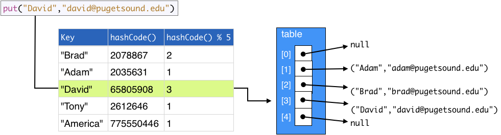
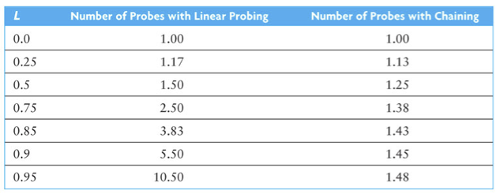

## CS 261 - Computer Science II

### Lab 11: Open-Addressing HashMaps

This week you'll implement the open-addressing version of a `HashMap` from scratch, and testing its performance, verifying that it does indeed support `O(1)`-time search/insert when space is effectively being traded for time. 




#### Required Files
The following file(s) have been provided for this lab.
- [Lab_MapLab.zip](Lab_MapLab.zip)


#### Part I: Open Addressing

- Start by downloading the lab project, extract its contents, and open it in your editor. First, you'll find two interfaces. The `MapInt` interface, which extends the `MapPerf` interface, contains a reduced set of methods that must be implemented (same as we saw in lecture), and the `MapPerf` interface contains methods that will let us evaluate the performance of the HashMap. The `OpenMap` class implements `MapInt`, which by extension means that it must also implement `MapPerf`. There's also an Experiment class that we'll fill out later.

- Look through `OpenMap`, which is supposed to implement the open-addressing map that we've been studying in lecture. Focus on the inner class, `Entry<K,V>`, which encapsulates a key-value pair of type `K` and `V`, respectively. Recall that an inner class' fields are accessible anywhere from the outer class. Now notice that the inner class, as well as both of its instance variables are declared as `protected`. This implies that the inner class and its fields are also accessible from any subclass of `OpenMap` too. (Remember that for later.)

- Read through the two constructors. The default constructor instantiates the table array with the `INITIAL_CAPACITY`. The one-argument constructor allows the user to input the initial capacity. If the argument is not positive, throw an `IllegalArgumentException`.

- Now read through the `get()` method, which implements the so-called Linear Probing algorithm, and make sure you understand it fully. We first calculate the index based on the hash code of the key and (possibly) perform a linear traversal of the array to search for the key. This method then returns the corresponding value when you find the key, or `null` if the key isn't found.

- Now implement the `put()` method, which behaves a lot like `get()`. Recall from lecture that you need to do a couple of things:

  - The index into the array should be calculated the same way as in `get()`: Take the absolute value of the given `key`'s `hashCode()`, and `mod` it by the capacity of the hash table. This will tell you the location in the hash table where the key-value can be found or inserted.

  - Next, check to see if that location is `null`. If it is, then create a new key-value `Entry` and put it there. If not, you need to perform Linear Probing: increment the array index until: (1) you come across a `null`, or (2) you find the given `key`. (You may have to "wrap around" to the beginning of the hash table as you search.) If (1), insert the `Entry` and return `null`. If (2), replace the value, and return the old value. If the table is full, you should throw an `IllegalArgumentException` (just for now).

- Now you can fill in the `values()` and `toString()` methods. Note that `toString()` should return a string containing all the key-value entries stored in the map. Recall that maps do not guarantee a particular order on its entries, so don't be surprised if your output is in a different order than mine, below:

  ```java
  MapInt<String,Double> map = new OpenMap<>(6);
  map.put("David", 4.0);
  map.put("Aaron", 3.2);
  map.put("Brad", 3.9);
  map.put("Adam", 3.2);
  map.put("Tony", 3.0);
  map.put("Jan", 2.7);

  System.out.println(map.toString());
  > [Adam=3.2, Jan=2.7, Tony=3.0, Aaron=3.2, David=4.0, Brad=3.9]

  double x = map.get("Tony");
  double y = map.get("Aaron");
  System.out.println((x+y)/2.0);
  > 3.1

  map.put("Jan", 2.5);
  System.out.println(map.toString());
  > [Adam=3.2, Jan=2.5, Tony=3.0, Aaron=3.2, David=4.0, Brad=3.9]

  map.put("Tina", 4.0);
  > IllegalArgumentException: Hashtable is full!

  System.out.println(map.toString());
  > [Adam=3.2, Jan=2.5, Tony=3.0, Aaron=3.2, David=4.0, Brad=3.9]
  ```

- Implement the `V remove(K key)` method in the `OpenMap` class. It returns `null` if the key is not found, or it returns the removed value. Recall that, if the key is found, you cannot simply set the array entry to `null` because it breaks the linear probing algorithm you use for `get()` and `put()`. Instead, it seems counterintuitive, but you *must* keep the `Entry` in place, but set the key portion of the entry to `null`. 

- After you've implemented and tested `remove(K key)`, you have to go back and update the `put()` method. It needs to check for the sentinel `key` value, and if found, it can place a new entry there. You also need to update the code for both `keySet()`, `values()`, and `toString()` so that entries with `null` keys are not included. You do not have to update the code for `get()` and you should understand why.

  ```java
  MapInt<String,Double> map = new OpenMap<>(6);
  map.put("David", 4.0);
  map.put("Aaron", 3.2);
  map.put("Brad", 3.9);
  map.put("Adam", 3.2);
  map.put("Tony", 3.0);
  map.put("Jan", 2.7);

  map.remove("Brad");
  System.out.println(map.toString());
  > [Adam=3.2, Jan=2.7, Tony=3.0, Aaron=3.2, David=4.0]

  map.put("Jack", 3.0);
  System.out.println(map.toString());
  > [Adam=3.2, Jan=2.7, Tony=3.0, Aaron=3.2, David=4.0, Jack=3.0]
  ```

#### Part II: Understanding Load Factor
- Now let us talk about the `MapPerf` implementations. There's a `getLoadFactor()` method that is intended to return a value between 0 and 1, indicating the ratio between the number of stored entries and the capacity of the underlying array. A load factor of 0 means that the underlying `table[]` array is completely empty, and 1 means it's full. Modify the appropriate methods in `OpenMap` so that the load factor returned correctly by `getLoadFactor()`.

  ```java
  // Just enough capacity to hold all entries..
  MapInt<String,Double> map = new OpenMap<>(6);
  map.put("David", 4.0);
  map.put("Aaron", 3.2);
  map.put("Brad", 3.9);
  map.put("Adam", 3.2);
  System.out.println("Load factor: " + map.getLoadFactor());
  > Load factor: 0.6666666666666666

  map.put("Tony", 3.0);
  map.put("Jan", 2.7);
  System.out.println("Load factor: " + map.getLoadFactor());
  > Load factor: 1.0
  ```

- The `OpenMap` class also has methods that are supposed to track and report how many "probes" have been done. The `getProbes()` and `resetProbes()` methods are provided. We define a probe to be a loop iteration taken to search for the key. In the illustration given in the Overview section above, it takes one probe to lookup `"David."` It would take 4 probes to lookup `"Tony."`

- You need to modify the `get()` and `put()` methods so that it counts the number of probes properly. 

  ```java
  // Just enough capacity to hold all entries..
  MapInt<String,Double> map = new OpenMap<>(6);
  map.put("David", 4.0);
  map.put("Aaron", 3.2);
  map.put("Brad", 3.9);
  map.put("Adam", 3.2);
  map.put("Tony", 3.0);
  map.put("Jan", 2.7);
  System.out.println("Probes: " + map.getProbes() + "\n");
  > Probes: 17

  map.resetProbes();  // reset
  map.put("Adam", 4.0);
  System.out.println("Adam: " + map.get("Adam"));
  > Adam: 4.0

  System.out.println("Tony: " + map.get("Tony"));
  > Tony: 3.0

  System.out.println("Jan: " + map.get("Jan"));
  > Jan: 2.7

  System.out.println("Probes: " + map.getProbes() + "\n");
  > Probes: 16
  ```

  Do some more testing to verify that your load factor and probe-counting code works as expected. (You don't have to write test code — testing via the code pad or point-and-click is enough.)

#### Part III: Experimentation
Now it's time to see how well our implementation works! Famous computer science Donald Knuth came up with a formula to predict the average number of probes needed per operation, as a function of the current load factor of the map, $$L$$:

$$T = \frac{1}{2}\left(1 + \frac{1}{1-L}\right)$$

The table below is lifted from the book, showing some predicted values of 
$$T$$ (ignore the right-hand section of this table).



- Check out the definition of `fillAndTest()` in the `Experiment` class. It takes a `MapInt` object and a target load factor, adds random entries into the map until it reaches the desired load factor, then prints the average number of probes required to do a bunch of `get` calls (this is defaulted to 1000 calls). Notice we're inputting maps that map `Strings` to `Strings` to keep things simple. 

- Now check out `Experiment`'s main method, where I've left some code that creates an `OpenMap` and passes it to `fillAndTest()`. See how many probes are required for a load factor of 0.75. Are your probes a bit higher than the formula predicts? Knuth's formulas predicted that an open-addressing implementation would require 2.5 probes per access, on average, if the load factor was 0.75. After a few runs, mine is reporting 2.498 probes per operation. Knuth's formula is on point!

- Run the experiment again with a load factor of, say, 0.9. My results show 5.368 when Knuth predicted 5.5. Wow! 

#### Part IV: Importance of Rehashing
The last experiment you ran showed that high load factors generally lead to worse performance. One question that remains is how we can keep our `HashMap` performing at a high level. If you guessed that we may need to occasionally increase the size of our underlying table, you guessed right!

- Open up a new class, called `FastOpenMap`, which extends `OpenMap`, so we don't have to rewrite all the methods. This version of the open-addressing HashMap will always keep your load factor at or lower than 0.5. You'll start by providing the same two constructors for this class. They should just call OpenMap's corresponding constructors.

- Write a private method called `rehash()`,  that doubles the capacity of the hash table (array), then it re-puts all the keys into this new table. Since you're calling `OpenMap`'s put method (yes, call `super.put(..)`) to re-insert the entries into the new hash table, make sure you reset the size first!

- Override the `put()` method in the `FastOpenMap` so that every time after it inserts a new entry (ignore the case where it replaces an entry), it checks the current load factor, and if it's greater than `0.5`, it rehashes.

- If you did everything properly, your output should match mine below!
  
  ```java
  // Just enough capacity to hold all entries..
  MapInt<String,Double> map = new FastOpenMap<>(6);
  map.put("David", 4.0);
  map.put("Aaron", 3.2);
  map.put("Brad", 3.9);
  System.out.println("Load factor: " + map.getLoadFactor());
  > Load factor: 0.5

  // Should cause rehash
  map.put("Adam", 3.2);
  System.out.println("Load factor: " + map.getLoadFactor());
  > Load factor: 0.3333333333333333

  map.put("Tony", 3.0);
  map.put("Jan", 2.7);
  System.out.println("Load factor: " + map.getLoadFactor());
  > Load factor: 0.5

  map.resetProbes();  // reset
  map.put("Adam", 4.0);
  System.out.println("Adam: " + map.get("Adam"));
  > Adam: 4.0

  System.out.println("Tony: " + map.get("Tony"));
  > Tony: 3.0

  System.out.println("Jan: " + map.get("Jan"));
  > Jan: 2.7

  System.out.println("Probes: " + map.getProbes() + "\n");
  > Probes: 8
  ```

Notice that, due to rehashing, this sequence only takes 8 probes compared to 16 before on a fuller Hash Map. The tradeoff between time and space is in full action. While the fast Hash Map performs better, its hash table will occupy a lot more space than the original Map that doesn't grow.


#### Grading

```
This assignment will be graded out of 2 points, provided that:

- You were in attendance and on-time.
- Your classes are fully implemented.
```

#### Submitting Your Assignment
Follow these instructions to submit your work. You may submit as often as you'd like before the deadline. I will grade the most recent copy.

- Navigate to our course page on Canvas and click on the assignment to which you are submitting. Click on "Submit Assignment."

- Upload all the files ending in `.java` from your project folder.

- Click "Submit Assignment" again to upload it.

#### Credits

Based on a previous lab by Professor Henry Walker, Grinnell College.

#### Lab Attendance Policies

Attendance is required for lab. Unexcused absence = no credit even if you turned in the lab. Unexcused tardiness = half credit.
