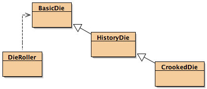

## CS 261 - Computer Science II

### Lab 2: Inheritance

This week you'll reinforce inheritance topics you've learned in class by working with a set of Java classes that inherit from one another. You'll see how one class can build off of another, get practice with constructors, learn about the relationship between types and functionality, and wrap up with an exercise that combines inheritance and parameter types.

Note: I *strongly* suggest that you use BlueJ for this lab. The lab involves lots of interactions with the code — creating instances, inspecting their state, and calling methods on them. BlueJ is a much better tool for that than Eclipse or IntelliJ.


#### Objectives
- To practice with inheritance and subtyping.
- To understand the behavior of `super()` and `this()`

#### Required Files
- [Lab_DieInheritance.zip](Lab_DieInheritance.zip)


#### Part I: Basic Inheritance
Take a moment to familiarize yourself with the three `Die` classes. The `BasicDie` class models a die (the kind you roll) — you can create a `Die` with any number of sides, then `roll()` it to get a random result. The `HistoryDie` class extends `BasicDie` such that it keeps track of how many times each possible result has been rolled. `CrookedDie` cheats: Every third roll, an instance of this class returns the die's maximum value.




- Create instances of each of the three `Die` classes. Look to see which methods can be called on each instance.

  - In case you're using Eclipse or IntelliJ, you'll want to create a new class -- we can just call it `Main`, and write the `public static void main(String[] args)` method, and creating objects, like `BasicDie bd = new BasicDie(6);`. To see what methods are available, type `bd.` and your editor should show you a list of accessible methods.

  - Play around with the classes until you see how each of them works. Can you see when the `CrookedDie` cheats? Does a `CrookedDie` have a history? Does it match the rolled values? Why or why not?

- Add a `getNumRolls()` method to `BasicDie` that returns the number of times the die has been rolled. After compiling and testing this method on a `BasicDie`, do some experiments to see in which other classes the new method is available.

- Add a `printHistory()` method to the `HistoryDie` class. It should loop through the history array and print out its contents. Try to make the printout look pretty and informative, and make sure you include both the face value and the number of times it has been rolled in your output. For example, on a six-sided die that has been rolled 29 times, the output might look like this (where the left hand side is the face value, and the right hand value is the number of times it has landed on the corresponding face value.):

  ```
  1: 5
  2: 3
  3: 4
  4: 5
  5: 7
  6: 5
  ```

  When you've got it working, do some experiments to see in which other classes the new method is available.

- Add a `getNumLies()` method to the `CrookedDie` class that returns the number of times a die "cheated." Do some experiments to see in which other classes this new method is available.


#### Part II: Constructors

- Put print statements at the bottom of each of the constructors in the three Die classes. Make sure that the statements print out the name of the class as well as specifics about the constructor in the cases where a class has more than one. Create an instance of each kind of die and note the output. Make sure you understand the output and what it implies.

- In the `HistoryDie` class, comment out the first line of code in the constructor (the `super()` call). Compile your code and create an instance of `HistoryDie`. What happens? Why? Make sure you understand before moving on. Ask us if you'd like some explanation!

- Leave the `super()` call commented out in `HistoryDie`, and now comment out the default (no-argument) constructor in the BasicDie class. What happens when you compile `HistoryDie`? (This is the case we saw in class — make sure you understand what happens and why before moving on.)

- Uncomment the code from the last two steps. (Put the super call back in `HistoryDie`, and make sure `BasicDie` has its no-argument constructor again.) Now comment out the entire constructor in the `HistoryDie` class. Try to create an instance of `HistoryDie` and see what happens. Can you create one? What sort of output is printed? If you double-click on the instance, what can you learn about its internal state (the contents of its fields)? What happens when you roll it? Why?

- We can create a `CrookedDie` via its one-argument constructor — the one that takes the desired number of sides as a parameter. As shown in the code example below, it's not possible to create a `CrookedDie` using a no-argument (default) constructor. Modify the code so `CrookedDie` has a no-argument constructor that creates a `CrookedDie` with six sides. Feel free to modify other classes as well, but try to accomplish the goal without making `numSides` either `public` or `protected` in the `BasicDie` class.

  You should confirm that this is true. If you're using Eclipse/IntelliJ, in `public static void main(String[] args)` method type in the following code. (Or alternatively, you can type out the following code in BlueJ's codepad, if you're using BlueJ.)

  ```java
  CrookedDie cd = new CrookedDie();
  > Error: cannot find symbol - constructor CrookedDie()

  CrookedDie cd = new CrookedDie(6);
  System.out.println(cd.toString());
  > "This die has 6 sides and has rolled 0 times"
  ```

#### Part III: Types and Variables

Before you start this part, make sure your code compiles and works normally again. Feel free to start with a fresh copy of the project if things have gotten too messy or broken. For the rest of this section, use the codepad in BlueJ rather than the object workbench. (That is, type your code rather than using point-and-click to create objects and run methods.) If not using BlueJ, accomplish the rest of this lab inside a main method.

- Start by typing the code below into the `public static void main(String[] args)` method (or in BlueJ's codepad) to create three variables — one for each type of Die.

  ```java
  BasicDie basic;
  HistoryDie history;
  CrookedDie crooked;
  ```

- Next, create an instance of `BasicDie` and store it in basic as shown below. Run some methods on it to convince yourself that everything's working:

  ```java
  basic = new BasicDie(6);
  System.out.println(basic.roll());
  > 1

  System.out.println(basic.roll());
  > 3

  System.out.println(basic.toString());
  > "Die has 6 sides and has rolled 2 times"
  ```

- Now create a `HistoryDie` instance and try to assign it to `basic`. Does this work? If so, which methods can you invoke? Can you run `roll()`? `toString()`? `printHistory()`?

  ```java
  basic = new HistoryDie(6);
  ```

- Try it again with a `CrookedDie` instance. Does this work? If so, which methods can you invoke?

  ```java
  basic = new CrookedDie(6);
  ```

- Now assign a `CrookedDie` instance to `history`, our variable of type `HistoryDie`. Does this work? If so, which methods can you invoke?

  ```java
  history = new CrookedDie(6);
  ```

- Try some more combinations of variable and object types until a pattern emerges. How would you describe the pattern in a sentence or two?

#### Part IV: Inheritance and Parameters

- Open the `DieRoller` class and take a look at the `rollRepeatedly()` method. It takes a `BasicDie` as its input, rolls it the specified number of times, and returns the sum of the outputs. Test it out on a `BasicDie` instance first, then see what happens if you pass other kinds of dice to the method:

  ```java
  DieRoller roller = new DieRoller();
  System.out.println(roller.rollRepeatedly(new BasicDie(6), 100));
  > 369

  System.out.println(roller.rollRepeatedly(new HistoryDie(6), 100));  //does this work?

  System.out.println(roller.rollRepeatedly(new CrookedDie(6), 100)); //does this work?
  ```

- Edit the code in `rollRepeatedly()` so that it expects a `HistoryDie` instead. Repeat the tests above and see what happens.

- Edit the code in `rollRepeatedly()` so that it expects a `CrookedDie`. Repeat the tests above and see what happens.

- What's the pattern? How would you describe how the type of the parameter in `rollRepeatedly()` influences the kinds of objects that can be passed in?

- Add the line `die.printHistory();` to the `rollRepeatedly()` method, just before the return statement. The code will only compile now if the method's first parameter is of certain types. For which parameter types (`BasicDie`, `HistoryDie`, `CrookedDie`) will the code compile? Why?

#### Part V: Finally...

- Add your own method, `compareDice`, to the `DieRoller` class. It should take two `Die` objects as arguments (any kind of Die!), roll each of them 1000 times, and compare the results. Your method should print out the results, including which die instance "won". In the output below, I'm invoking the `toString()` method on the winning die as part of the output:

  ```java
  DieRoller roller = new DieRoller();
  BasicDie bd = new BasicDie(6);
  CrookedDie cd = new CrookedDie(6);
  roller.compareDice(bd, cd);
  > The score is 3461 to 4338
  > Die 2 wins: Die has 6 sides and has rolled 1000 times

  roller.compareDice(cd, bd);
  > The score is 4286 to 3447
  > Die 1 wins: Die has 6 sides and has rolled 2000 times
  ```


#### Grading

```
This assignment will be graded out of 2 points, provided that:

- You were in attendance and on-time.
- Your classes are fully implemented.
```

#### Submitting Your Assignment
Follow these instructions to submit your work. You may submit as often as you'd like before the deadline. I will grade the most recent copy.

- Navigate to our course page on Canvas and click on the assignment to which you are submitting. Click on "Submit Assignment."

- Upload all the files ending in `.java` from your project folder.

- Click "Submit Assignment" again to upload it.

#### Credits

Written by Brad Richards. 

#### Lab Attendance Policies

Attendance is required for lab. Unexcused absence = no credit even if you turned in the lab. Unexcused tardiness = half credit.
