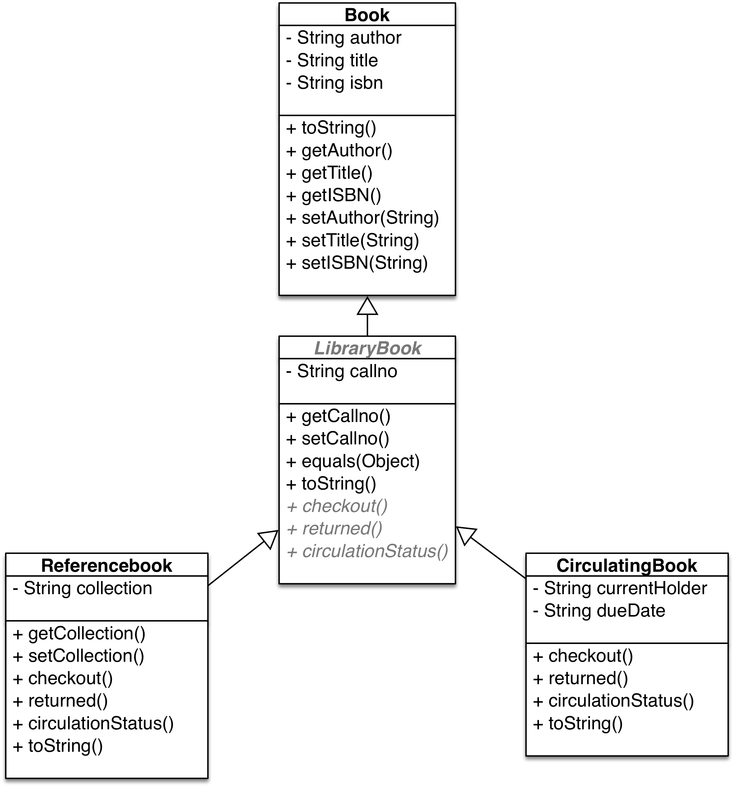

## CS 261 - Computer Science II

### Lab 3: Abstract Classes

This week you'll get some hands-on practice with abstract classes and polymorphism. This lab considers a class hierarchy that models books in a library.


#### Objectives
- Practice with abstract classes and polymorphism.
- Practice with method overriding.


#### Required Files
The following file(s) have been provided for this lab.
- [Lab_LibraryBooks.zip](Lab_LibraryBooks.zip)


#### Preliminary
Before you do anything, study the class diagram given below. You are reminded that elements prefixed with `+` and `-` means they are public and private, respectively. Elements that are *italicized* means they are `abstract`. Also, pay close to attention to which methods are overridden in the subclasses.



Below are detailed instructions for completing this lab. There are a lot of details; be sure and read the instructions carefully, and let us know if anything is unclear!


#### Part I: Finishing the Book Class
- Download the lab file, extract it, and open it up in your preferred editor. Included in the project, here is just a `Book` class, which is nearly complete. Compare the code to the class diagram, and you'll find that the only method not implemented is `toString()`. Don't implement it yet.

- You can use the following code directly in BlueJ's codepad to create a new Book object, and print out a "pretty" String representing its contents.

  ```java
  Book b = new Book("Anthony Burgess", "A Clockwork Orange", "978-0393312836");
  System.out.println(b.toString());
  ```

  It doesn't print out a "pretty" String at all, does it? It prints out something cryptic string instead that reads something like this: `Book@60269693`.

- The reason you see this is because Book actually inherits from the `Object` class (yes that "root" umbrella class from which every other class inherits!), which provides a `toString()` method. Because the returned String is somewhat meaningless, let's go ahead and override it in the `Book` class so that it returns a more meaningful and "prettier" String. Here's what mine might return when run again:

  ```java
  Book b = new Book("Anthony Burgess", "A Clockwork Orange", "978-0393312836");
  System.out.println(b.toString());
  > Title:  A Clockwork Orange
  > Author: Anthony Burgess
  > ISBN: 978-0393312836
  ```

  Don't forget to use the `@Override` annotation when overriding a method!


#### Part II: Abstract Library Books
In addition to author, title, and ISBN, books that appear in a library have call numbers (famously, the dewey-decimal system is generally employed), which is used to organize them on shelves. Further, many library books may be able to circulate.

- Open up the abstract class `LibraryBook`. Notice that it extends from `Book`, so in addition to all the fields and methods it inherits from `Book`, it also has the following field:

  - `String callno` - A call number for the book so that it can be organized on library shelves.

- Fill in the code in the `LibraryBook` constructor that takes four parameters for input: author, title, ISBN number, and call number.

- Override the `toString()` method, which should now return the "pretty" String from `Book` (that is, you should *call* Book's `toString()` method) and concatenate the call number to the end of it.

- Override the `boolean equals(Object other)` method (also inherited from the root `Object` class). This method returns true if the current library book's call number matches the call number of the other library book. You must down-cast other to a `LibraryBook` type before you can access its call number. Keep in mind, for later, that only the call numbers need to match for two books to be equal.

- Now notice that there are three abstract methods without implementations. They are described, as follows:

  - An abstract method `void checkout(String patron, String due)`. This method eventually handles processing for a patron to check out a book. A due date also is recorded.

  - An abstract method, `void returned()`. This method eventually handles processing for when a book is returned after having been checked out.

  - An abstract method `String circulationStatus()`. This method will eventually indicate whether the book is on the shelves, checked, or non-circulating in the reference collection.

- **Note:** You might be anxious to test out all the methods that you wrote for this class, but as you might remember from lecture, you can't instantiate an abstract class! This means you must wait until you've implemented its concrete subclasses...


#### Part III: Reference Books
There are actually two types of library books: `ReferenceBook` and `CirculatingBook`. I'll describe reference books first.

- Create a ReferenceBook class that extends from LibraryBook. It has the following new field:

  - `String collection` - A specific collection to which this book belongs (e.g., the Iowa Room, Burling, or Science).

- Provide a constructor that takes five parameters: author, title, ISBN number, call number, and collection.

- Provide getter and setter methods for `collection`.

- Override the abstract method, `void checkout(String patron, String due)`. Because checking-out is not allowed for reference books, the method should simply print that the patron `"cannot check out a reference book"`.

- Override the abstract method, `void returned()`, which should print `"reference book could not have been checked out -- return impossible"`.

- Override the abstract method, `String circulationStatus()`, which should return `"non-circulating reference book"`.

- Finally, override the `toString()` method, which should now return the "pretty" String from `LibraryBook` augmented with the `collection` information.

- If everything's working properly, your output from the following should match mine:

  ```java
  LibraryBook ref = new ReferenceBook ("Henry M. Walker",
                "Problems for Computer Solution using BASIC",
                "0-87626-717-7", "QA76.73.B3W335", "Iowa Room");

  ref.checkout("David", "March 31, 2002");
  > cannot check out a reference book

  ref.returned();
  > reference book could not have been checked out -- return impossible

  System.out.println(ref.toString());
  > Title:  Problems for Computer Solution using BASIC
  > Author: Henry M. Walker
  > ISBN: 0-87626-717-7
  > Call number: QA76.73.B3W335
  > Collection: Iowa Room
  ```

#### Part IV: Circulating Books
Unlike reference books, circulating books refer to those that patrons can borrow and return. Therefore, its implementation for the abstract methods are going to be different from those in reference books.

- Create a `CirculatingBook` class that also `extends` from `LibraryBook`. It has the following fields:

  - `String currentHolder` - The patron, if any, who checked out the book.
  - `String dueDate` - When the book should be returned, if checked out.

- Provide a constructor that takes 4 parameters for: author, title, ISBN number, and call number. The `currentHolder` and `dueDate` should be initially set to `null`.

- Provide getter and setter methods for the due date, and current holder.

- Override the abstract method, `void checkout(String patron, String due)`, which handles processing when a book is checked out, storing the patron's name as its current holder and the date the book is due to be returned. If the book was already checked out, then print the message `"book unavailable until DD"` (where `DD` is the due date).

- Override the abstract method, `void returned()`, handles processing when a book is returned (currentHolder and dueDate are set to `null`).

- Override the abstract method, `String circulationStatus()`, which should return the `currentHolder`'s name and due date, if the book has been checked out; or `"book available on shelves"` if the book is available.

- Finally, override the `toString()` method, which should now return the "pretty" String from `LibraryBook` augmented with the current holder and due date.

  ```java
  LibraryBook circ = new CirculatingBook("Anthony Burgess",
    "A Clockwork Orange",
    "978-0393312836", "QE.0.W33");

  circ.checkout("David", "March 1, 2002");  // This succeeds
  System.out.println(circ.toString());
  > Title:  A Clockwork Orange
  > Author: Anthony Burgess
  > ISBN: 978-0393312836
  > Call number: QE.0.W33
  > book checked out by David and due back on March 1, 2002

  circ.checkout("Henry", "April 15, 2002");  // This fails
  > book unavailable until March 1, 2002

  circ.returned();  // This succeeds
  System.out.println(circ.toString());
  > Title:  A Clockwork Orange
  > Author: Anthony Burgess
  > ISBN: 978-0393312836
  > Call number: QE.0.W33
  > book available on shelves
  ```

#### Part V: The Library Class

- Create a new class called Library. This class has a single field, which is an `ArrayList` of library books.

- The class has a default constructor that instantiates the `ArrayList`.

- Write a method `void addBook(LibraryBook book)` that adds the given book to the library.

- Write a method `void printLibrary()` that prints out all the books in the library. Here's an example:

  ```java
  Library lib = new Library();

  // add three books
  lib.addBook(new ReferenceBook("Henry M. Walker",
                  "Problems for Computer Solution using BASIC",
                  "0-87626-717-7", "QA76.73.B3W335", "Iowa Room"));
  lib.addBook(new ReferenceBook("Samuel A. Rebelsky",
                  "Experiments in Java",
                  "0201612674", "64.2 R25ex", "Iowa Room"));
  lib.addBook(new CirculatingBook("John David Stone",
                  "Algorithms for functional programming",
                  "in process", "QA76.758.W35"));

  lib.printLibrary();
  ```

  This should output:
  ```
  > Listing of books in the library
  >
  > Title:  Problems for Computer Solution using BASIC
  > Author: Henry M. Walker
  > ISBN: 0-87626-717-7
  > Call number: QA76.73.B3W335
  > Collection: Iowa Room
  >
  > Title:  Experiments in Java
  > Author: Samuel A. Rebelsky
  > ISBN: 0201612674
  > Call number: 64.2 R25ex
  > Collection: Iowa Room
  >
  > Title:  Algorithms for functional programming
  > Author: John David Stone
  > ISBN: in process
  > Call number: QA76.758.W35
  > book available on shelves
  >
  > End of book listing
  ```

- Write a method `LibraryBook findBook(LibraryBook book)` that attempts to locate the given book in the library. If the book exists, return a reference to it, and if not, return the `null` reference.

  ```java
  Library lib = new Library();

  // add a reference book
  lib.addBook(new ReferenceBook("Samuel A. Rebelsky",
                  "Experiments in Java",
                  "0201612674", "64.2 R25ex", "Iowa Room"));

  // Only need to know callno to find a book in the library
  ReferenceBook book1 = new ReferenceBook("","","","64.2 R25ex","");
  System.out.println(lib.findBook(book1));
  ```
  
  This should output:
  ```
  > Title:  Experiments in Java
  > Author: Samuel A. Rebelsky
  > ISBN: 0201612674
  > Call number: 64.2 R25ex
  > Collection: Iowa Room
  ```

  And here's a book that doesn't exist:
  ```java
  CirculatingBook book2 = new CirculatingBook("","","","FFFF.R25ex");
  System.out.println(lib.findBook(book2));

  > null
  ```


- Write a method `void checkout(String patron, String due, String callno)` that performs processing for checking a book out of the library. You should first check to see if a book with the given `callno` even exists in the library (you just wrote a method for that). If it does, check it out for the patron (it may fail, of course, if the book is unavailable). If the book doesn't exist in the library, print out a message `"Book CN not found -- check out impossible"` where `CN` is the `callno`.

- Finally, write a method `void returned(String callno)` that processes checked-out book that is being returned. Again, first check to see if a book with the given `callno` even exists in the library. If it does, check it back in. If not, then print a message `"Book CN not found -- return impossible"` where `CN` is the specified `callno`.

- Look at the sample interaction below, and make sure yours looks the same:

  ```java
  Library lib = new Library();

  // add some books
  lib.addBook(new CirculatingBook("Anthony Burgess",
      "A Clockwork Orange",
      "978-0393312836", "DR.00.G5"));

  lib.addBook(new ReferenceBook ("Samuel A. Rebelsky",
      "Experiments in Java",
      "0201612674", "64.2 R25ex", "Iowa Room"));


  // some users check out and return books
  lib.checkout("Donald Duck", "March 1, 2012", "DR.00.G5");       // This succeeds
  lib.checkout("Donald Duck", "March 12, 2012", "64.2 R25ex");    // This fails
  > cannot check out a reference book


  lib.returned("DR.00.G5");   // This succeeds
  lib.returned("64.2 R25ex"); // This fails
  > reference book could not have been checked out -- return impossible

  lib.checkout("Goofy", "March 28, 2012", "DR.00.G5");    // This succeeds

  // print final status of library
  lib.printLibrary();
  ```

- It should output the following
  ```
  > Listing of books in the library
  >
  > Title:  A Clockwork Orange
  > Author: Anthony Burgess
  > ISBN: 978-0393312836
  > Call number: DR.00.G5
  > book checked out by Goofy and due back on March 28, 2012
  >
  > Title:  Experiments in Java
  > Author: Samuel A. Rebelsky
  > ISBN: 0201612674
  > Call number: 64.2 R25ex
  > Collection: Iowa Room
  >
  > End of book listing
  ```


#### Grading

```
This assignment will be graded out of 2 points, provided that:

- You were in attendance and on-time.
- Your classes are fully implemented.
```

#### Submitting Your Assignment
Follow these instructions to submit your work. You may submit as often as you'd like before the deadline. I will grade the most recent copy.

- Navigate to our course page on Canvas and click on the assignment to which you are submitting. Click on "Submit Assignment."

- Upload all the files ending in `.java` from your project folder.

- Click "Submit Assignment" again to upload it.

#### Credits

Based on a previous lab by Professor Henry Walker, Grinnell College.

#### Lab Attendance Policies

Attendance is required for lab. Unexcused absence = no credit even if you turned in the lab. Unexcused tardiness = half credit.
