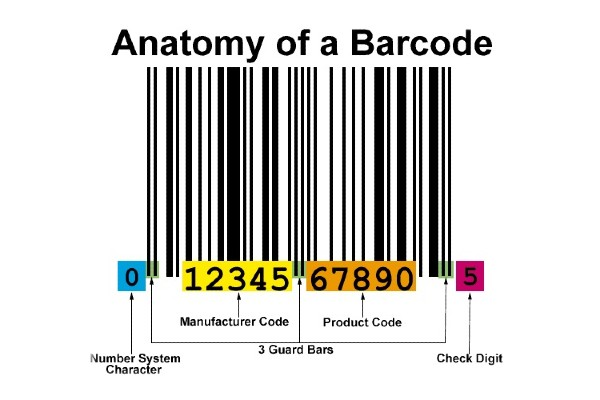
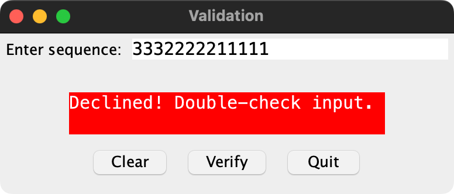
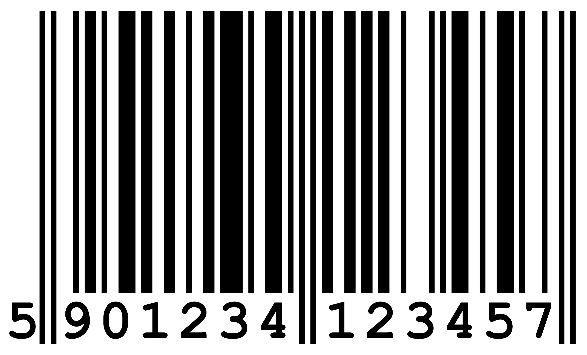
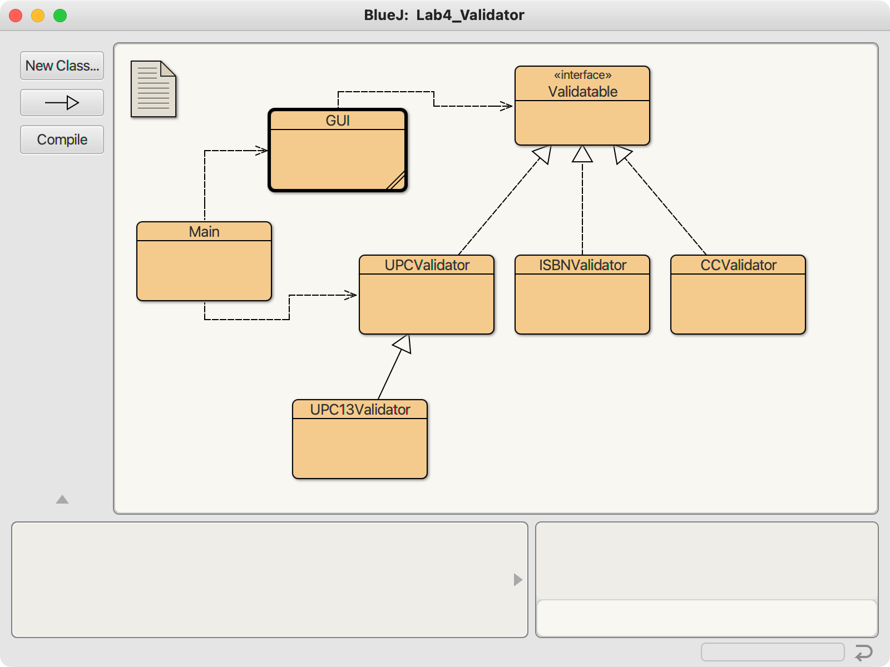

## CS 261 - Computer Science II

### Lab 4: Interfaces

Many things across the world are associated with unique identifiers. For instance, just about every item for sale has a 12 or 13-digit universal product code (UPC barcode) that can be scanned to identify the product being sold. Every car has a unique 17-character vehicle identification number (VIN), and most credit cards have a unique 16-digit number. With the average code length being quite long, it is expected that people might make mistakes when typing them out. (Just think of the number of times you've screwed up typing your credit card number when making an online purchase!) What's worse, even if you typed the code out correctly, it can be corrupted when it's sent over a network and while it's being stored on disk. That's a big problem! How would we efficiently ensure that a given code is correct?



The *data integrity problem* has been around for quite some time, when line-noise would inadvertently flip a few bits that were being transmitted over the network, leading to incomprehensible data on the receiving end. Cleverly, engineers have tackled this problem using what's called a checksum. Here's a basic example of how it might work. Let's say that every Puget Sound professor can be identified with a 4-digit code. Let's assume that my code is `2158`. A naive way to compute a checksum would be to add up all the digits: 
`2 + 1 + 5 + 8 == 16` and then take the modulo-10 of this sum to obtain a single digit, 6 (i.e., 
`16 % 10 == 6`). This "checksum" (or more specifically, check digit) is usually appended to the end of the existing code, thus making my faculty ID `21586`.

Now let's say a student is trying to find me on the faculty directory. However, the student mis-typed my code as `27586` (in haste, they misread the '1' to be a '7'), but this error can be caught immediately without even having to check against a personnel database. Recalling the way to produce the checksum, we simply add up the first four digits (called the payload): 
`2 + 7 + 5 + 8 == 22` and take modulo-10 to produce 2. But when we compare 2 against the check-digit (6), they clearly don't match, and therefore an error has been detected, prompting the student to double-check their input.

Even though this basic method can be quite effective, it is of course, not at all full-proof. For instance, if a student merely flipped a couple digits of my ID, say from `21586` to `25186`, it would not affect the sum due to the commutativity of addition, leading our algorithm to think that the code is valid. Therefore, different checksum algorithms of varying degrees of complexity exist... which leads us into the assignment.

This week you'll explore these algorithms, and get hands-on experience with interfaces.

#### Objectives
- Practice with interfaces and polymorphism
- Exposure to data integrity problems and checksum schemes

#### Required Files
The following file(s) have been provided for this lab.
- [Lab_Validator.zip](Lab_Validator.zip)

#### Part 0: The Validatable Interface
I've created a GUI (graphical user interface) class that can be used to 

#### Part I: Validating UPC's
Take a moment to familiarize yourself with the four classes in the project. There's a `GUI` (graphical user interface) class, and another class that can be controlled by it (`UPCValidator`) which still needs to be completed, and a Main with a main method that starts the GUI. Run the main method to start up the GUI now.

<center></center>

- Take a look inside the `GUI` class. You don't need to understand the code that creates the GUI or handles the buttons as they're pressed, but make an effort to see how the code has been tailored to interact with a `UPCValidator` instance. The hope, by the end of lab, is that this same GUI can be used to support any type of checksum validator.

  - Now open up the `UPCValidator` class. We'll deal with Universal Product Codes (UPC) first, because it's a easy scheme. Most UPC's are 12-digits long, but newer ones may be 13. We'll focus on the 12-digit UPC for this section. (Find a barcode around you and check for yourselves!) In the class, notice that there are 3 instance variables: `int checksum` (the last digit in a UPC), `int[] payload` (the first 11 digits of the UPC) and `int LENGTH `(which is already set to 12, the proper length of a UPC code sequence). There is no constructor, but implement the methods below.

  - `public boolean loadSequence(String sequence)`: This method inputs a 12-digit UPC code as a string, and populates the payload and the checksum. You should read in the first 11-digits into the payload array (remember to first instantiate the array to be size 11, or `LENGTH-1`), and extract the final digit into the `checksum` instance variable. Hints: you can grab a specific character from a string using its `charAt(..)` method, and importantly, you can convert a `char` to an `int` using the static method `Character.getNumericValue(..)`

    **Important:** If the given string is not of size `LENGTH` (i.e., 11 in this particular case), then you should immediately return `false`. We'll see a more elegant way of handling these input errors next week (throwing exceptions).


  - `public boolean validate()`: This method implements the validation algorithm for UPC codes. Add up all the numbers in the even positions of the payload array (starting with position `[0]`). Multiply this sum by 3. Next, add up all the digits in the odd positions of the payload. Add up the two sums and take the modulo-10 result. We'll call this result, `r` (for remainder). If this result is 0, then compare the checksum with 0 for equality. Otherwise, compare the checksum with `(10−r)` to see if they're equal.

    For example, let's say the UPC is `096619194261`. The payload would be `09661919426` and the checksum is `1`. The sum of the even positions of the payload is `0+6+1+1+4+6 == 18`. This value is multiplied by 3 to obtain 54. The sum of the odd positions of the payload is: `9+6+9+9+2 == 35`. Together, the sums produce `54+35 == 89`, which gives us `89%10 == 9 == r`. Because `r` is nonzero, we compare `(10−9)` against our checksum of `1`. This is a valid UPC (Indeed, a bag of Ancient Grains Granola that is sitting next to me as I type this).


- Let's test it out. Go back and run the main method. Note that the GUI takes an instance of `UPCValidator` as input, so its `loadSequence()` and `validate()` methods that you just implemented will be called from within the GUI. Try a few UPC's to test! Look around you (a box of masks, a barcode underneath your water bottle, etc). When entering a UPC, ignore any dashes and spaces. Mix up the numbers to make sure the algorithm is catching errors too! If you're having a hard time finding barcodes, here are some from a few things that I found lying around my office. These should all validate, if your algorithm is working properly.

  - `346581830156` - A box of Salonpas pain-relieving gel patches.
  - `016000487598` - Nature Valley granola bars.
  - `819562022937` - NuTrail glazed pecans.


#### Part II: Mixing in Subclasses (UPC13)
I alluded to the fact that newer UPC's have a longer 13-digit version. The longer version (also called an EAN-13 code) uses an extra digit to specify the country of the product's origin.

<center></center>

Let's go ahead support these longer codes as well. The algorithms are very similar to UPC's, so aspects of the UPC validator algorithms can be reused!

- Create a subclass of `UPCValidator` called `UPC13Validator`. There are no instance variables or constructors for this class;  everything it needs, it's already inheriting from `UPCValidator`!

- Override the `loadSequence()` method first. It should set the `LENGTH` instance variable in the superclass to 13 (you have direct access to it from this class), and then simply call the superclass' `loadSequence()` method, because the `payload` and `checksum` extraction algorithms are exactly the same as before.

- Override the `verify()` method. It does the same thing as `UPCValidator`, except that it multiplies the sum of the odd-positioned digits (instead of the sum of the even positions) by 3. Everything else in the algorithm is the same.

- Update the `Main` class and see if you can control a `UPC13Validator`. Just input a new instance of `UPC13Validator` in the GUI construction call. It should work seamlessly, because `UPC31Validator` is just a specialized `UPCValidator`, and the `GUI` class currently supports `UPCValidator`s.

- Try testing some 13-digit UPC codes I found in my drawer:

  - `0021563106916` - Gear Aid Repair Tape
  - `5060043069636` - Stainless Steel Paris Metro Pocket Map


#### Part III: Validating Book ISBN's
Cool. Another set of items that have unique IDs are books, called ISBNs. You're probably already familiar with ISBNs, because you may have had to look up the ISBNs just to ensure that you're buying the right book for your classes. (You can, for instance, search by ISBN on eBay and Amazon).

- ISBN's are checked quite differently than UPCs, so we'll need a completely new class. Create a new class called `ISBNValidator` and you'll want to include the same three instance variables from before and the same two methods: `loadSequence()` and `validate()`.

- Let's get to the specifics so you can start implementing these methods. ISBNs are 10 digits long (there's also a 13-digit version but we'll ignore that for now). Unlike UPCs, ISBN's payload includes all 10 numbers. Its checksum is the final digit... but there's a catch: occasionally, the final digit is given as the character `"X"`. When this is the case, then the checksum AND the last number in the payload should be set to 10. To validate, you will want to add up each number in the payload multiplied by its position in reverse order, starting with 10, 9, 8, ... down to 1. For instance, the last digit (the checksum) in the payload should be multiplied by 1, then the second-to-last digit should be multiplied by 2, etc. Take the modulo-11 of this sum, and compare it to 0.

- For example, the ISBN of our BlueJ book is  `0134477367`. The payload would be `0134477367` (all ten numbers) and the checksum is `7`. Remember, we want to multiply each digit with their position in the reverse order (starting with 1). The sum of products would be `0*10 + 1*9 + 3*8 + 4*7 + 4*6 + 7*5 + 7*4 + 3*3 + 6*2 + 7*1 == 176`. Take the mod-11 result to obtain `176 % 11 == 0`. Because the result is 0, this ISBN validates.

- Here's an example of an ISBN ending with `X`: `013208516X` (Learning to Program with Alice). The payload would be `013208516X` noting that the `X` should be stored in your payload array as the value 10. The checksum is `10`. The sum of products would be `0*10 + 1*9 + 3*8 + 2*7 + 0*6 + 8*5 + 5*4 + 1*3 + 6*2 + 10*1 == 132`. Take the mod-11 result to obtain `132 % 11 == 0`, and once again, because the result is `0`, this ISBN validates.

- Change the `GUI` code so that instead of working with `UPCValidator`, it now works with the `ISBNValidator` class instead. To do this, you need to change the `GUI` constructor to accept an `ISBNValidator` instance instead, and you'll need to change the validator instance variable to be of the `ISBNValidator` type. (Hmm... that's quite a bit of work just to get things working with a different validator...) Next, go back into the Main method and change the input to the GUI to an instance of `ISBNValidator` also. Run the main method, and now you should be able to use the same GUI that we used before to check ISBN codes.

- Here are a couple more 10-digit ISBN's of books I found lying around my office:

  - `1582881154` - "Chaos" by James Gleick
  - `0486497089` - "A Book of Set Theory" by Charles C. Pinter

An interesting note: You have probably noticed that there also exists (more commonly nowadays) a 13-digit ISBN code for most modern books. The algorithm to validate the ISBN13 codes is actually the same algorithm for checking UPC13 codes. If you're curious to test this claim, grab the nearest book with a 13-digit ISBN code; change the GUI back to using UPCValidator, and test.


#### Part IV: Create and Use an Interface
Okay, great, we got the `GUI` to work with the different "validators," but it's a lot of work just to get the `GUI` to accept different validators! We can't expect people to edit the `GUI` class' code and recompile every time we want to fire up a different validation scheme!

We need to do some work on `GUI` so that it can work with any validator we've created and any future validators we have yet to write! That will require making the `GUI` polymorphic: the constructor should be able to take either kind of validator object and control it.

- Figure out which methods need to be included in a new interface, that you'll call `Validatable`. (What are the methods that the GUI expects all validators to be able to do?) This is an easy one: just the two methods we've been writing over and over.

- Write the `Validatable` interface. Remember that interfaces don't have instance variables or constructors. You can also leave off certain keywords (like `public`). You may want to refer to your notes for the syntax.

- Modify the `UPCValidator` and `ISBNValidator` classes  so that they implement the new interface. Use the `@Override` tag on top of every method implementation. You do not need to specify that `UPC13Validator` also implements `Validatable`, because it is a subclass of `UPCValidator`. It wouldn't be wrong to, just redundant.

- Now go back and edit the GUI class to use the interface. Just so we're on the same page, here's the resulting class diagram.

  

- Go back to the main method in the Main class, and verify that you can startup a GUI for any validator without changing any code in the GUI class. This is power of *interfaces*!


#### Optional: Credit Card Numbers (Luhn's Algorithm)
This is an optional exercise, but good practice. There are several ways to validate credit card numbers, but we'll implement [Luhn's Algorithm](https://en.wikipedia.org/wiki/Luhn_algorithm). Create a new class called CCValidator and once again, you just need the same three instance variables, and the same two methods we've been implementing all along: `loadSequence()` and `validate()`. Luhn's Algorithm is a little more complicated than the previous 3. Here are the specifics. **It gets complicated, so you should read through this whole section before starting to code.**

- **Step 1:** I would start by creating a copy of `payload` array, because you'll be modifying the numbers. Then working off the copy, starting with the right-most digit, double that digit and moving left, double every other digit that you encounter. 

  - For instance, let's say that I entered my 16-digit credit card info manually into an online form: `3979250428219432`. The payload is `397925042821943` and the checksum is `2`. Starting with the right-most digit of the payload, we'll double every other digit (including `3`) to obtain the results for **Step 1** below:

    <table border="1">
      <tr>
        <td>Original Payload</td>
        <td>3</td>
        <td>9</td>
        <td>7</td>
        <td>9</td>
        <td>2</td>
        <td>5</td>
        <td>0</td>
        <td>4</td>
        <td>2</td>
        <td>8</td>
        <td>2</td>
        <td>1</td>
        <td>9</td>
        <td>4</td>
        <td>3</td>
      </tr>
      <tr>
        <td>Step 1: Doubling Every Other Digit</td>
        <td>6</td>
        <td>9</td>
        <td>14</td>
        <td>9</td>
        <td>4</td>
        <td>5</td>
        <td>0</td>
        <td>4</td>
        <td>4</td>
        <td>8</td>
        <td>4</td>
        <td>1</td>
        <td>18</td>
        <td>4</td>
        <td>6</td>
      </tr>
      <tr>
        <td>Step 2: Sum the Digits in Each Position</td>
        <td>6</td>
        <td>9</td>
        <td>5</td>
        <td>9</td>
        <td>4</td>
        <td>5</td>
        <td>0</td>
        <td>4</td>
        <td>4</td>
        <td>8</td>
        <td>4</td>
        <td>1</td>
        <td>9</td>
        <td>4</td>
        <td>6</td>
      </tr>
      </table>


  - **Step 2:** Then add up all the all the digits for any number that we doubled back in **Step 1**. This seems rather difficult, but look for a pattern... Because you're multiplying by 2 on a single digit that ranges from 0 to 9 from **Step 1**, the doubled numbers here can only range from 0, 2, 4, 6, ..., 18. Of those, you only need to worry about half of them, because you just need to be concerned about adding up the two-digit numbers: 10, 12, 14, 16, and 18. These numbers add up to 1, 3, 5, 7, and 9, respectively. Do you recognize what you need to do in order to convert 10 to 1? 12 to 3? Etc.? Once you recognize the pattern, you'll want to write the following method.

    Write a helper method called `twoDigitSum()` that inputs an integer, adds up the digits in the input, and returns this sum. If the number is a single-digit, then just return the number trivially. If you did it properly, you should get outputs like:

      ```java
      twoDigitSum(5)
      > 5

      twoDigitSum(0)
      > 0

      twoDigitSum(12)
      > 3

      twoDigitSum(16)
      > 7
      ```

  - After you've implemented and tested `twoDigitSum()` we can finally finish off **Step 2**. Back inside the `validate()` method, place all the sums in another array of size 15 (because we don't want to overwrite the original `payload`.) To do this, you can just instantiate a local array variable inside the method. Fill this local array with the numbers you obtained. Obviously, you'll need to call your `twoDigitSum()` helper method inside `validate()`.

  - **Step 3:** Finally, you'll need to add up all the values in order to obtain: `6 + 9 + 5 + 9 + 4 + 5 + 0 + 4 + 4 + 8 + 4 + 1 + 9 + 4 + 6 == 78`. Then add in the checksum to obtain `78 + 2 == 80`, and calculate `80 % 10`. Because this result is zero, this credit card number validates!


<!-- - Change the `GUI` code so that it works with `CCValidator`, just like you did before for ISBN's. Test and make sure your `CCValidator` is working.  You may not want to use your own credit card numbers to test, which is understandable, but <a href="https://www.dcode.fr/luhn-algorithm">this link</a> lets you generate valid credit card numbers! How convenient (be ethical please)! -->

<!-- 
#### Part V: Create and Use an Interface
Okay, great, we got the `GUI` to work with the different validators, but it's a lot of work just to get the `GUI` to accept different validators! We can't expect people to edit the `GUI` code and recompile every time we want to fire up a different validation scheme!

We need to do some work on `GUI` so that it can work with any validator we've created and any future validators we have yet to write! That will require making the `GUI` polymorphic: the constructor should be able to take either kind of validator object and control it.

**Important (know this!):** Since the the validator schemes only share methods by name (the bodies of the methods generally have nothing that's similar or reusable), an abstract class wouldn't make a whole lot of sense, as there's no methods that would make sense to inherit from a superclass! Therefore, when all methods are abstract in the superclass, it's a good indication that we need an Interface. We'll use an interface to pull this off.

- Figure out which methods need to be included in a new interface, that you'll call `Validatable`. (What are the methods that the GUI expects all validators to be able to do?) This is an easy one: just the two methods we've been writing over and over.

- Write the `Validatable` interface. Remember that interfaces don't have instance variables or constructors. You can also leave off certain keywords (like `public`). You may want to refer to your notes for the syntax.

- Modify the `UPCValidator`, `ISBNValidator`, and `CCValidator` classes slightly so that they implement the new interface. Use the `@Override` tag on top of every method implementation. You do not need to specify that `UPC13Validator` also implements `Validatable`, because it is a subclass of `UPCValidator`. It wouldn't be wrong to, just redundant.

- Now go back and edit the GUI class to use the interface. Just so we're on the same page, here's the resulting class diagram.

  

- Go back to the main method in the Main class, and verify that you can startup a GUI for any validator without changing any code in the GUI class. This is the beauty and power of *polymorphism*! -->

#### Optional
Make more validators! There are [many different ID sequences](https://en.wikipedia.org/wiki/Check_digit) out there that uses a checksum. Look up how to check vehicle identification numbers (VINs); bank routing numbers, etc.


#### Grading

```
This assignment will be graded out of 2 points, provided that:

- You were in attendance and on-time.
- Your classes are fully implemented.
```

#### Submitting Your Assignment
Follow these instructions to submit your work. You may submit as often as you'd like before the deadline. I will grade the most recent copy.

- Navigate to our course page on Canvas and click on the assignment to which you are submitting. Click on "Submit Assignment."

- Upload all the files ending in `.java` from your project folder.

- Click "Submit Assignment" again to upload it.

#### Credits

Written by David Chiu. 2023.

#### Lab Attendance Policies

Attendance is required for lab. Unexcused absence = no credit even if you turned in the lab. Unexcused tardiness = half credit.
