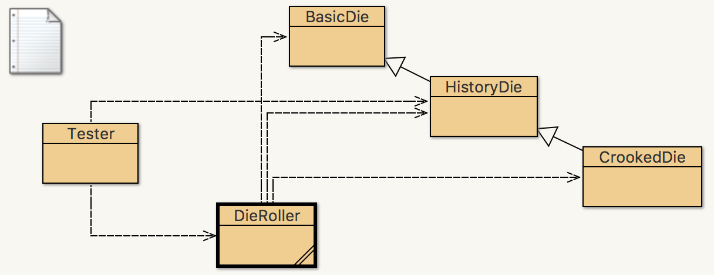
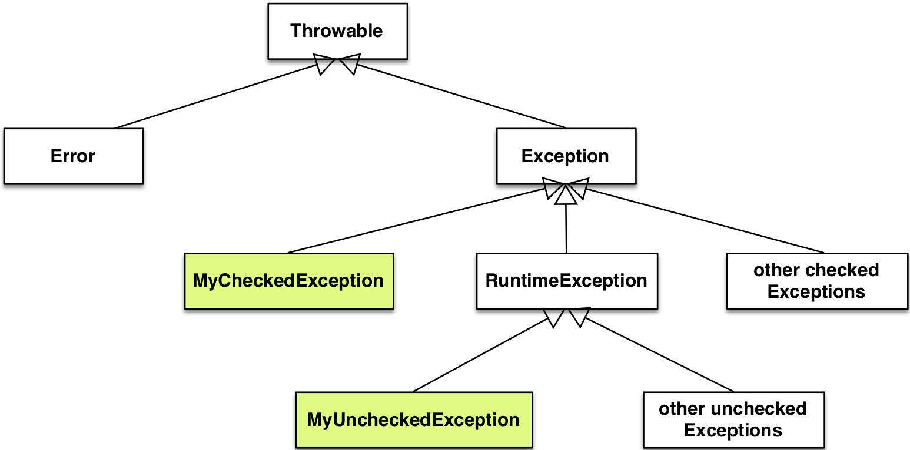

## CS 261 - Computer Science II

### Lab 5: All about Exceptions

This week you'll get some hands-on practice with catching and throwing exceptions.


#### Objectives
- To practice the usage of `throw` statements
- To practice the usage of `throws` statements and `try-catch` blocks
- To create your own exception types

#### Required Files
The following file(s) have been provided for this lab.
- [Lab_ExceptionsLab.zip](Lab_ExceptionsLab.zip)


#### Part I: Basics of Catching Exceptions
Download the project and extract its contents. You'll find our old friends, the `Die` classes, as well as a mildly updated `DieRoller` class. This time around there's also a Tester class, that creates a `HistoryDie` instance and passes it to some `DieRoller` methods. Run its main method to see what it does.

<center></center>

- Next, let's intentionally introduce a bug to the `HistoryDie` constructor: Comment out the line that allocates the array holding the counts, so that the array reference will be `null`. After compiling, create an instance in the codepad and try to roll it. Note that the constructor runs without an error, but we get into trouble once we roll the die instance:

  ```java
  HistoryDie d = new HistoryDie(6);
  d.roll()
  > Exception: java.lang.NullPointerException (null)
  ```

- BlueJ reports the error in the codepad, but it also gives a more complete summary of the error in the terminal window that includes details about where in the program the error occurred:

  ```java
  java.lang.NullPointerException
    at HistoryDie.roll(HistoryDie.java:32)
  ```
  
- Next, run the `Tester` class's main method and look closely at the error report in the terminal window. What do the additional lines mean? What are they telling you?

  ```java
  java.lang.NullPointerException
    at HistoryDie.roll(HistoryDie.java:32)
    at DieRoller.rollRepeatedly(DieRoller.java:23)
    at Tester.main(Tester.java:14)
  ```

  This error report is a stack trace: The exception occurred on the `roll()` call on line 32 in the `HistoryDie` class. (You can click on the link to get taken to that line). That exception was generated by the method that called `roll()`, which was `rollRepeatedly()` on line 23 of the `DieRoller` class. That was in turn called by `main()` on line 14 of the `Tester` class.

- Let's catch that pesky `NullPointerException` we introduced earlier! Edit `Tester`'s main method: put the call to `rollRepeatedly()` inside a try/catch block as shown below. The "risky" part is moved into the try portion, and the "what to do if it blows up" code is in the catch part.

  ```java
  try {
      // Risky part: This code could cause an exception!
      result = DieRoller.rollRepeatedly(d, NUM_ROLLS);
  }
  catch (Exception e) {
      // What to do if the risky code does throw an exception:
      System.out.println("I just caught " + e);
  }
  ```

- After getting it to compile, run it and verify that the exception was caught. Which pieces of code (if any) get executed *after* the code in the `catch` block? Add some print statements after it to check.

- We'll call that a mixed success. We caught the error that occurred in `rollRepeatedly()`, but our broken die blew up again in the `rollUntil()` call below our new try/catch block. Let's move the three lines of code below the catch block up into the `try`-clause and see what happens. In their place, leave a print statement that announces that the program is finished. (Make sure this print statement is outside of the catch block, so that we can tell when something below the `try/catch` block is executed.)

#### Part II: Refining Catches

- Leave the bug you introduced in HistoryDie alone for now, we'll change after a few steps. (That is, keep the commented code in there).

- Check out that `catch` block we wrote inside `main()` previously. It was defined to handle Exception or any of its subclasses. However, we see that the actual exception being thrown is a NullPointerException, which is a lot more specific. So let's write a catch block just to handle errors of this type. Copy the block below and add it to your `main()` code. Try putting the new catch block immediately above and immediately below the existing catch block Does it make a difference where this new block goes?

  ```java
  catch (NullPointerException e) {
    System.out.println("Ooo!  A null pointer error: " + e.toString());
  }
  ```

- Now let's see what happens with a different kind of exception. Go back to the `HistoryDie` code and uncomment the line so that it creates an integer array, but one that's slightly too small:

  ```java
  history = new int[numSides-1];
  ```
  Play around with an instance of the modified class — how many rolls does it take before it blows up? Why?

- What do you think will happen when you run `Tester`'s main method now that you've modified `HistoryDie`? Try it and see if you're right.

- Since the error in `HistoryDie` doesn't happen on every roll, we could try to continue in `rollRepeatedly()` when the exception arises rather than stopping the program. Leave the existing try/catch code in your main method, but add a new try/catch block inside `rollRepeatedly()` so that it's inside the loop and only watches the assignment statement in the loop body for exceptions. Have it catch errors of type `ArrayIndexOutOfBoundsException`, and set up the code such that it keeps a count of how many times the error has been caught. Print this total right before the `return` statement.

- How many times does the `ArrayIndexOutOfBoundsException` get caught and handled? Is it what you'd expect? Does your program run to completion after the call to `rollRepeatedly()`? What happens next? Notice that an `ArrayIndexOutOfBoundsException` was still caught in main. But wait, didn't we just catch this? What's causing this out-of-bounds exception?

- What happens if you add a catch block for `ArrayIndexOutOfBoundsException` to `Tester`'s main method as well? Leave the try/catch in `rollRepeatedly()`, but add a new (third) catch block in main. Where does the indexing exception get caught?

- Comment the line in the `HistoryDie` constructor so that it doesn't create an array at all. What do you think will happen? Check and see. Where did it get caught and why? Uncomment this line when you're done testing.

#### Part III: Learning to Throw and Create Exceptions
So far the lab has focused on catching exceptions — handling error conditions within our code so that the program doesn't terminate. There can be good reasons for generating these errors from within our code as well. For example, in class, we discussed using exceptions when things go wrong in a constructor. You can't just print a message and "refuse" to construct an instance. Once the constructor has started running it's too late — the object already exists. Sometimes the best course of action is to stop the execution by throwing an exception.

- In `BasicDie` (yes, `BasicDie` and not `HistoryDie`) add the following code to the one-argument constructor. The `throw` command in Java is much like a return statement: it leaves the current method and takes a "value" with it — the `Exception` object that's created by the `new` command.

  ```java
  if (numSides < 1) {
      throw(new IllegalArgumentException("Invalid # of sides (" + numSides + ")"));
  }
  ```

- Test it by creating instances of different kinds of `Die` instances and verifying that exceptions are thrown. Because `HistoryDie` and `CrookedDie` inherit from `BasicDie`, their constructors will also be affected! Nice!

- Then change `Tester`'s main method so that it tries to create a `HistoryDie` with negative sides and run the program. What should happen when the `main` method runs?

- Let's say that, instead of an `IllegalArgumentException`, which is pretty generic, you want to throw something more specific to your class. In fact, entering a non-positive number of sides attempts to create an invalid die. Create a new *unchecked* exception, called `InvalidDiceException`. Consider the following figure so you know which superclass to extend from.

  

  Refer to the notes to see what elements you need to provide in your new exception class. (It's really easy).


- Rewrite your code so that it throws your new exception type, instead of the an `IllegalArgumentException`, and try invoking it by creating a bad die in `main()`. Does your code compile without warning?

- Modify `InvalidDiceException` so that it is a *checked* exception instead. Your code should no longer compile. First, you need to indicate in the BasicDie constructor that it possibly throws this exception. (You should also update the Javadocs comment to include a `@throws` tag.)

- What else calls the `BasicDie(int numSides)` constructor? The compiler now tells you, because the caller code must now explicitly deal with this exception. (A *checked* exception puts the onus on the programmer to do something with it).

- Using the compiler as a guide, go through each place that calls the `BasicDie(int numSides)` constructor, and decide whether it's best to play hot potato and just throw an `InvalidDiceException` down to its caller, or if you should try to suppress the exception by catching it instead.

#### Part IV: Odds and Ends
- Note that the `rollAll()` method in DieRoller takes a parameter of type `List`. Look at the Java documentation for `List`. Is it a standard Java class? An interface? An abstract class? What benefit do we get from using a parameter of type `List` instead of `ArrayList`, for example? Add some code to the main method to create an appropriate argument for `rollAll()` and verify that it works when called.

- We're not done with our in-class conversation about estimating complexity, but thinking about some of the methods in this project in terms of their performance is still good practice. How many computational steps are involved in calling `rollUntil()` on a BasicDie, for example? What is the measure of the problem size n? Does it make a difference if we pass in a `HistoryDie` or `CrookedDie` instance rather than `BasicDie`?

- How would you change the code in `rollRepeatedly()` so that it stopped and returned the total rolled so far if an exception arose?

- Estimate the number of computational steps for some of the other methods in the project. Can you find some that are constant time (that is, they don't depend on any n)? What about methods that are proportional to the size of an input?

#### Grading

```
This assignment will be graded out of 2 points, provided that:

- You were in attendance and on-time.
- Your classes are fully implemented.
```

#### Submitting Your Assignment
Follow these instructions to submit your work. You may submit as often as you'd like before the deadline. I will grade the most recent copy.

- Navigate to our course page on Canvas and click on the assignment to which you are submitting. Click on "Submit Assignment."

- Upload all the files ending in `.java` from your project folder.

- Click "Submit Assignment" again to upload it.

#### Credits

Based on a previous lab by Professor Brad Richards.

#### Lab Attendance Policies

Attendance is required for lab. Unexcused absence = no credit even if you turned in the lab. Unexcused tardiness = half credit.
