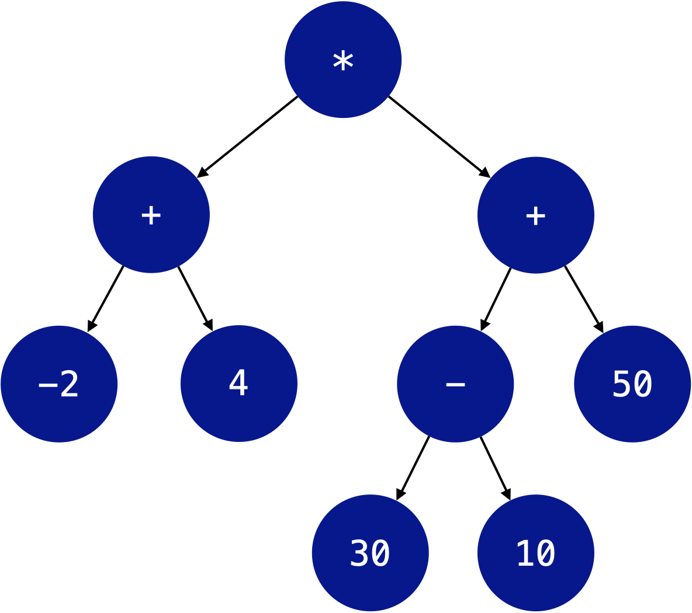
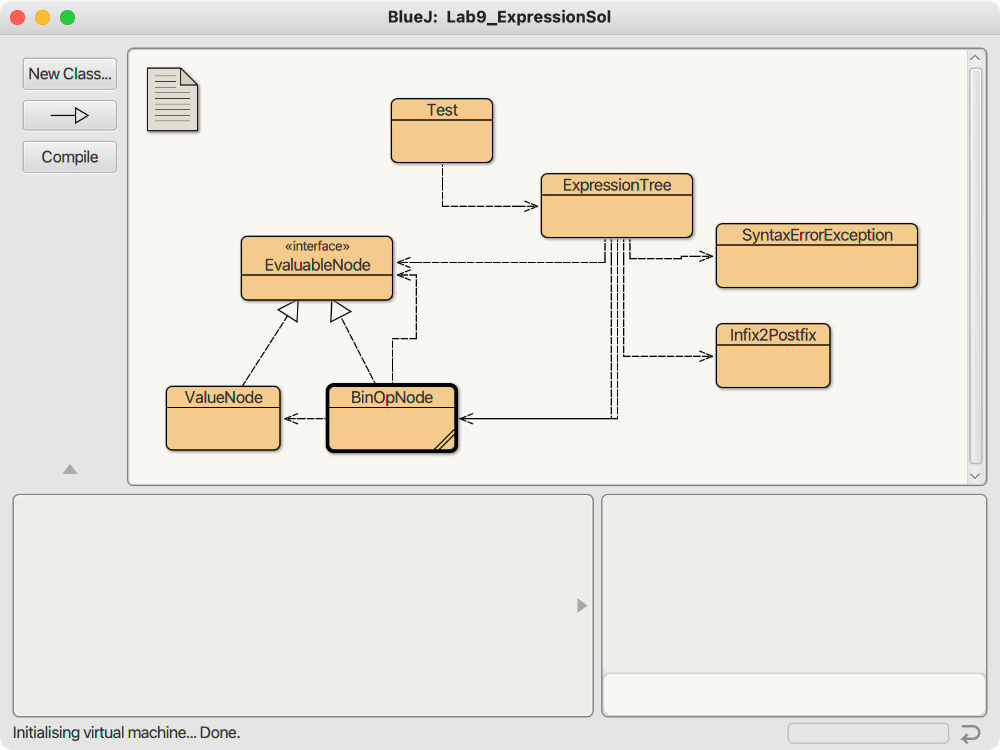

## CS 261 - Computer Science II

### Lab 9: Expression Trees

For this assignment, you'll implement a class for representing and evaluating arithmetic expressions. It's a great excuse to use recursion, recursive structures, and polymorphism all within a single assignment! Even better — it happens to be useful. Make sure you write clean, well-documented code. You should note that you will not be using the `BinaryTree` or `BST` classes that we coded up in class for this assignment. Instead, you'll be writing a customized version of the binary tree as part of this assignment.


#### Objectives
- To practice with recursion, recursive structures, linked structures.
- Evaluation of expression trees

#### Required Files
The following file(s) have been provided for this lab.
- [Lab_Expression.zip](Lab_Expression.zip)


#### Expression
The expressions we'll work with consist of the four binary operators (+, -, *, /), floating-point numeric literals (doubles).  We'll also allow parentheses for grouping terms. Here are some examples:

```
3
( 2.17 + 5.8 )
( x * 3.14159 )
( ( 3.14 - 1 ) * 2.0 )
( (-2 + 4) * ( (30 - 10 ) + 50) )
```



Expressions like these can be represented by expression trees, binary trees in which the internal nodes contain operators, and the operands are at the leaves. The last expression above can be represented by the expression tree to the right.

Expression trees are a convenient way to represent arithmetic expressions since the structure of the tree encodes the order in which the operators should be applied — no parentheses are needed. Operators at higher levels in the tree are applied only after those at lower levels, so the multiplication at the top of the tree above is the last operator to be applied. Note that its right subtree correctly shows that the subtraction should occur before the addition (we take the minus and plus operators from left to right in the original expression).

An expression tree can be evaluated by recursively evaluating its subtrees. For example, the multiplication at the top of the tree would evaluate its left and right subtrees, then multiply the two results and return the product. The process is recursive since the addition in the left subtree similarly asks that its two subtrees be evaluated, then adds the results, etc. An expression string can be produced by an in-order traversal of the tree.


#### Expression Trees
Our expression trees will be built out of three different kinds of nodes: Nodes that represent constant values (e.g., 6), nodes, and nodes representing arithmetic operators (e.g., +). So that we can recursively evaluate (or print) entire trees, each of the three nodes should have the ability to evaluate itself, and to return a String representation of itself. The "node" classes will therefore implement the following interface:

```java
public interface EvaluableNode {
   double evaluate();
   String toString();
}
```

Classes implementing this `EvaluableNode` interface must have an evaluate method, and override the `toString` method. Do not modify the interface above to include any new methods. The different node classes will contain different fields — for example, operator nodes will need to contain references to their left and right subtrees, but value nodes won't since they don't have children. Regardless of the node type, each will have to implement `evaluate()` in the appropriate manner: Value nodes can simply return their value and operator nodes will apply their operator to their subtrees' values. Each will also implement `toString` as appropriate (operator nodes return strings from their left subtree + operator + subtree, etc.). The output from `toString` should be a fully parenthesized expression, formatted such that it could be successfully passed to the constructor described in the next section.

#### The ExpressionTree class
You'll need to fill in an `ExpressionTree` class to encapsulate our expression trees, just like the book writes a `LinkedList` class that's separate from the individual list nodes. The `ExpressionTree` class will contain some methods that involve the entire tree, not just individual nodes, and will have a constructor that produces complete expression trees from arithmetic expressions passed in as strings. (I'll tell you later what methods need to be implemented).

#### Building Trees from `Strings`
The constructor for the ExpressionTree class must build a tree from an infix expression string. This is a challenge, since the operator precedence and parenthesized subexpressions must be handled properly — you can't just process the operators in the order you find them in the input string.

First, within the constructor, you can convert parenthesized infix expressions to postfix (or Reverse Polish) expression strings using the conversion code I already provided. This might not seem like a step in the right direction, but at least the parenthesized subexpressions will be processed away and, more importantly, the operators will now appear in the order in which they need to be applied.

For example, the infix expression `( ( 500 * ( 1 + 2.2 ) ) - 6 )`  would be transformed into the postfix expression `500 1 2.2 + * 6 -`. In the original expression, the parentheses tell us that the `+` should be performed first, precedence says that the `*` is next, followed by the `-`. Lo and behold, that's the order in which they appear in the postfix string! Luckily I have already provided the infix-to-postfix method in the `Infix2Postfix` class.

Now, move on to the `buildTree()` method that you'll need to implement. First, you'll need a stack. Have the stack hold references to the nodes: When you encounter a value, make a new tree node and push it onto the stack. When an operator is encountered, build a larger tree out of the operator and the two subtrees at the top of the stack, then push this new tree onto the stack. A reference to the full expression tree will be on the stack when we're done!

One word of warning: To test your code, I will always input the expressions with a space in between any parenthesis, operand and operator. That way, the infix to postfix converter you wrote for lab will work without too much hassle.


#### Program Requirements
Your project structure will something like this:



- Start by writing the three node classes required to build expression trees. Make sure they implement `EvaluableNode`. Before moving on, it wouldn't hurt to verify that you can stitch nodes together and get the evaluate and toString methods to work.

- Implement the `ExpressionTree` class to encapsulate your expression trees. It has a single field:
  - `private EvaluableNode root`: the root node of the expression tree.

  - It has the constructor:

    - `ExpressionTree(String infix)`: The constructor takes an infix expression as a String, builds and stores a tree to represent it Do not save the expression string as an instance variable. Again, you can expect that a well-formed infix expression will be given.

  - It must support the following methods:
    - `public double evaluate()`: Evaluate the expression and return its value as a double.

    - `public String toString()`: Returns a String containing a fully-parenthesized representation of the expression. Because the infix string was not stored as an instance variable in the constructor, you must build and return this string by traversing the tree.

#### Sample Interactions
Some sample interactions with the `ExpressionTree` class are shown below. Note that the last three demonstrate exceptions being thrown.

```java
ExpressionTree e = new ExpressionTree("5.2");
System.out.println(e.toString());
> 5.2

System.out.println(e.evaluate());
> 5.2

e = new ExpressionTree("( ( 1 + ( 2 * 3 ) ) - 4 )");
System.out.println(e.toString());
> ( ( 1.0 + ( 2.0 * 3.0 ) ) - 4.0 )

System.out.println(e.evaluate());
> 3.0

e = new ExpressionTree("( 1 + ( 2 * ( 3 - 4 ) ) )");
System.out.println(e.toString());
> ( 1.0 + ( 2.0 * ( 3.0 - 4.0 ) ) )

System.out.println(e.evaluate());
> -1.0

e = new ExpressionTree("( 1 + ( 5 / 3 ) )");
System.out.println(e.toString());
> ( 1.0 + ( 5.0 / 3.0 ) )

System.out.println(e.evaluate());
> 2.666666666666667

e = new ExpressionTree("( ( 500 * ( 1 + 2.2 ) ) - 6 )");
System.out.println(e.evaluate());
> 1594.0
```


#### Grading

```
This assignment will be graded out of 2 points, provided that:

- You were in attendance and on-time.
- Your classes are fully implemented.
```

#### Submitting Your Assignment
Follow these instructions to submit your work. You may submit as often as you'd like before the deadline. I will grade the most recent copy.

- Navigate to our course page on Canvas and click on the assignment to which you are submitting. Click on "Submit Assignment."

- Upload all the files ending in `.java` from your project folder.

- Click "Submit Assignment" again to upload it.

#### Credits

Based on a previous lab written by Professor Brad Richards.

#### Lab Attendance Policies

Attendance is required for lab. Unexcused absence = no credit even if you turned in the lab. Unexcused tardiness = half credit.
