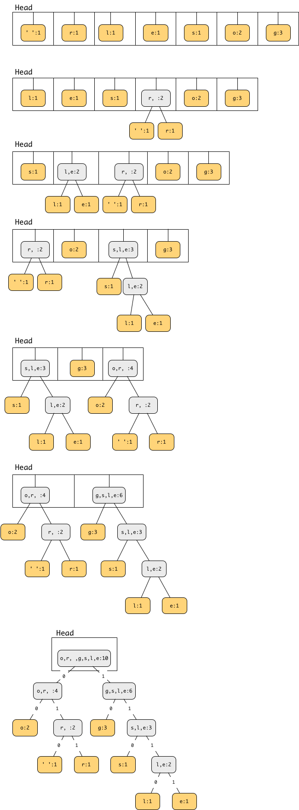

## CS 261 - Computer Science II

### Homework: Data Compression (Huffman's Algorithm)

Lossless compression algorithms are used to shrink data, which can then later be inflated back to its original form. Lossless compression is so useful, in fact, you probably employ it on a regular basis. For instance, any time you had to "zip" up (or "unzip") some files, you have dealt with it. Probably the most widely known general-purpose lossless compression algorithm in use today is zip (and all its variants). You might've also heard of png and gif for compression of images, among many others. Arguably, most of today's lossless compression algorithms owe their existence to the seminal Huffman Coding algorithm, which you will implement in this assignment.

As a side note, "lossy" compression algorithms are no less important and common: they shrink data (often, more aggressively than lossless schemes) without preserving its original form. Examples of lossy compression include mp3 for audio files, jpeg for images, and mpeg for movies.

#### Student Outcomes

- To fully understand and to implement basic elements of Huffman's Algorithm.
- Use of PriorityQueue and BinaryTree.
- Use of recursion for tree traversal.

#### Teams
You are required to work in teams on this assignment. I've used a sophisticated matching algorithm to produce the groups listed below. (Ok, it's just random, but I did write a program to do it!) Do not start writing any code until you've met with your team member(s) and discussed the assignment and possible approaches. For best results, I expect you to work physically together. I will assume that each member of the team has contributed equally to the project. If that assumption isn't true, please contact me privately.

```
[Brendan B, Maia C]
[Paul M, Hannah E]
[Gemma B, Miles M]
[Amanda W, Pallas C]
[Ashlyne C, Lily G]
[Bonacic B, Kendall P]
[Julien W, Gabriel E]
[Ben H, Jacob W]
[Noel L, Elizabeth B]
[Alex W, Timothy T]
```

#### Required Files
Please download the following starter pack:
- [Hwk_Huffman.zip](Hwk_Huffman.zip)

#### Provided Interfaces and Classes
Download the `Huffman` project and open it in your favorite IDE. It contains the following files,

- `data/Loggers.txt` - A short test file used in this write-up.

- `data/AsYouLikeIt_orig.txt` - Contains the full text to Shakespeare's As You Like It. It is 120 KB uncompressed.

- `data/Pride_orig.txt` - Contains the full text to Jane Austen's Pride and Prejudice. It is 681 KB uncompressed.

- `data/Gone_orig.txt` - Contains the full text to Margaret Mitchell's Gone with the Wind. It is 2.4 MB uncompressed.

- `Huffman.java` - This class contains the main driver code. It uses a CodeDictionary that you will later implement to compress and inflate various text files. No changes are to be made to this class.

- `BinaryTree.java` (mind its inner class Node) - You saw these classes earlier in this course. Read through them to remind yourselves what they do. No changes need to be made.

- `CodeDictionary.java` - Provides an interface that you must implement.

- `Compressor.java` - Contains the main method to run.

#### Overview of Huffman's Encoding Algorithm (Read This!)
To understand how text compression is going to work, you have to first grasp how text is represented in its raw, uncompressed state.

##### ASCII Codes for Symbol Representation
For computers to represent and display human-readable symbols, it commonly references the ASCII standard (see here). ASCII represents 256 unique human-readable symbols, which means $$\lceil{\log_2{265}}\rceil = 8$$ bits (equivalent to one byte) of storage is required to store each symbol in a text file. For instance, the symbol `a` is represented by `01100001` in binary (which is `97` in decimal). Let's say a file contains the string, `go loggers`. In ASCII it would be coded as the following 80-bit sequence: `01100111`   `01101111`   `00100000`   `01101100`   `01101111`   `01100111`   `01100111`   `01100101`   `01110010`   `01110011`.


##### Variable Length Codes
However, one could make some observations. First, only seven symbols ('g', 'o', space, 'r', 's', 'e', 'l') ever appear in the file containing `go loggers`, so why use ASCII at all? It's totally overkill, and in this case, we would only need $$\ceil{\log_2{7}} = 3$$ bits to represent every symbol in the string `go loggers`. Now it would only require 30 bits to represent this file, but is that the best we can do? Let's take it a step further. Why limit ourselves to using fixed-length codes (e.g., 3-bit, 8-bit, etc.)? Some symbols appear more often than others. For instance, 'g' occurs three times and 'o' appears twice. All others appear only once. Therefore, it would make sense to represent (or encode) a frequently occurring symbol with a shorter binary sequence, and rarer symbols with a longer sequence to save space. If we exploit this observation effectively, then the file can be represented even more efficiently in terms of space. 

Let's say that we use the following **code dictionary** instead:

|Symbol|Code|
|------|----|
|g|	`10`|
|o|	`00`|
|(space)|`010`|
|r|`011`|
|s|`110`|
|e|`1111`|
|l|`1110`|

Now `go loggers` can be encoded as follows: `10`   `00`   `010`   `1110`   `00`   `10`   `10`   `1111`  `011`   `110`. Say, that's only 27 bits compared to the original 80 bits that ASCII required. That's just 34% of the original size, so we successfully compressed this string down  66%! However, this newly encoded bit string is no longer human-readable since computers only know how to display ASCII. To make this file human-readable again, one would have to lookup these variable-length codes and replace them with their corresponding ASCII code. This process is known as decoding a compressed file. Because the compressed file can be decoded without any loss of original information, this compression scheme is "lossless."

##### Code Ambiguity
Now the obvious question: Is that the best we can do? As it turns out, it is. In fact, the code provided in the above table is provably optimal. For instance, wouldn't the code be even more efficient had we represented 'g' with a `1` instead of `10`? Let's say we're trying to decode a bit sequence that starts with `111`... When you encounter the first 
`1`, is it a 'g', or is it merely the start of 's', 'e', or 'l'? We don't know, so you read the next bit, which is a another `1`. Okay, now `11` could be interpreted as two consecutive 'g's or still merely the start of 's', 'e', or 'l.' Because the code is still ambiguous, we read the next bit, giving us `111`. Finally, 's' is eliminated from consideration, but you still don't know if it's three consecutive 'g's or the start of 'l' or 'e.' You might argue that you'd know if it's an 'e' or an 'l' once you read the next bit, but you'll still never know if it's just a group of four 'g's! Therefore, coding 'g' with a `1` would lead to a ambiguity, which must be avoided for accurate decoding.

Now notice that the codes in the given table are unambiguous! To see this, observe how a code beginning with `111`... can only mean one thing: that it's either an 'e' or an 'l' (to be determined by the next bit). It cannot be interpreted as anything else. And that is the beauty of Huffman's algorithm: it generates the most compact unambiguous code.

Great, but how does one go about generating this new, unambiguous encoding? Huffman's Algorithm (published in an 1952 article titled, [A Method for the Construction of Minimum-Redundancy Codes](huffman.pdf)) devised an approach for generating these unambiguous codes. In this assignment you'll implement the classic lossless compression algorithm, Huffman Coding, named for its inventor [Dr. David A. Huffman](https://en.wikipedia.org/wiki/David_A._Huffman).


#### Huffman Trees and Code Dictionary
You will create two classes: `HuffmanTree.java` and `HuffmanDictionary.java`. This section explains the specifics.


##### Building Huffman Trees
We use a `HuffmanTree` (subclass of the given `BinaryTree`) to generate the code dictionary. A node in the HuffmanTree stores an object that represents a symbol and the number of occurrences of that symbol found in the file. You need to open a text file and read it symbol-by-symbol, including the newline (`\n`) character (look into the `read()` method of `FileInputStream`). For each unique symbol read, create a brand new HuffmanTree containing that only symbol as its root node. Important: The newline and tab characters need to be handled specially or else strange things happen when printing. If you detect that a newline has been read, the Node's symbol should be stored as `"\\n"` and similarly, a tab should be represented as `"\\t"` in the node, and a carriage-return should be stored as `"\\r"`.

Store all these `HuffmanTrees` in a queue, which orders them on the *number of occurrences* of the symbol stored in its root node. Then you dequeue two tree roots (if possible) from the head of this queue, and merge them together as the left and right subtrees of a new root node. The "symbol" in the new root contains all the symbols in its subtrees, and its number of occurrences is the sum of the occurrences stored in its subtrees. Then enqueue this new `HuffmanTree` back into the queue. This process continues until there is only one remaining `HuffmanTree` left in the queue, which is the completed tree.

The following set of images illustrate the HuffmanTree-construction algorithm on the text file containing: `go loggers`.




##### Code Dictionary
Once the final HuffmanTree is constructed, the all the symbols' codes can be generated through a traversal. For all nodes, its left edge has a value of `0` and a right edge has a value of 
`1`. When a leaf node is visited, its symbol's  encoding is the sequence of bits that were encountered in its path from the root. You must create a HuffmanDictionary class, which implements the given CodeDictionary interface. Methods in this class allow you to look-up a given symbol's code, and conversely, to perform a reverse lookup of the symbol when given its Huffman code. Important: In either method, if the given look-up key does not exist, you should throw an `IllegalArgumentException`. Before you do that, don't expect my `decode()` and `encode()` methods to work!

You must also override the `toString()` method to produce a string representing the code table itself. The table should have three columns: `Symbol`, `Frequency`, and `Code`. Each line in this table shows a symbol, its frequency as a ratio of its number of occurrences and the total number of symbols in the file, and its Huffman code. From top to bottom the entries should be sorted in descending order of frequency.

The following is a sample output for some file `Loggers.txt`, which contains the running example, go loggers.

```java
Huffman compressor = new Huffman();
compressor.buildDictionary("data/Loggers.txt");
compressor.printDictionary();   // this prints toString() on the HuffmanDictionary object.

> Term  Freq    Code
> g     0.3     10
> o     0.2     00
>       0.1     010
> r     0.1     011
> s     0.1     110
> e     0.1     1111
> l     0.1     1110
```

#### Sample Output
Here are sample runs of the given text files. You may get different Huffman codes, but their lengths and thus, the compression ratio, should not differ. You can also verify the file sizes in your filesystem.

##### As You Like It
```
Term    Frequency       Code
    0.15839159097324854 110
e   0.08580063433021703 1111
t   0.062121186961358994    1001
o   0.060983710001494496    0111
a   0.04991614220952824 0100
h   0.046802610385081614    0010
n   0.044261968416333175    0001
s   0.04258481260689793 0000
r   0.04246027133392006 11101
i   0.04084953753673968 10111
\n  0.031185134753657362    10001
l   0.030769997177064478    10000
d   0.027025456236196677    01100
u   0.025107520632337555    01010
m   0.01985187891267166 111000
y   0.019503163348333637    101101
w   0.01648926454226931 101010
,   0.016140548977931286    101000
f   0.014446787665432325    011010
c   0.012412613540127198    001111
I   0.012238255757958188    001110
g   0.011158898058816692    1110011
b   0.00978064130452832 1011001
p   0.008817522126832832    1010111
A   0.00826123777419837 1010011
.   0.007987246973647067    0110111
v   0.007729861676159479    0110110
O   0.0076053204031816144   0101111
E   0.006476146194848973    0101101
k   0.005944770096810083    0011011
L   0.005762109563109214    0011010
S   0.005604357284003919    0011001
N   0.005380182992643762    11100101
R   0.0053552747380481895   11100100
T   0.004541605087926138    10110000
D   0.004350641802693412    10101100
'   0.004101559256737683    10100101
C   0.0031882565882333405   01011100
:   0.003105229072914764    01011001
;   0.0030471098121917606   01011000
U   0.0024825227080254395   101100011
?   0.002424403447302436    101100010
W   0.0021504126467511335   101011010
H   0.0020341741253051262   101001001
B   0.0013699540027565136   001100010
-   0.0013201374935653675   001100000
!   0.0010793576991414955   1010110110
M   0.0010710549476096378   1010010001
Y   9.382109230999153E-4    1010010000
F   9.216054200362E-4   0101110111
x   8.883944139087694E-4    0101110110
K   8.053668985901928E-4    0101110100
V   8.053668985901928E-4    0011000111
J   7.472476378671892E-4    0011000110
G   6.891283771441856E-4    0011000011
P   6.642201225486126E-4    0011000010
Q   6.06100861825609E-4 10101101111
q   5.977981102937513E-4    10101101110
j   3.5701831586987926E-4   01011101010
z   2.490825459557297E-4    010111010110
[   7.472476378671891E-5    01011101011110
]   7.472476378671891E-5    01011101011111
&   3.321100612743063E-5    010111010111010
X   3.321100612743063E-5    010111010111011
\t  2.4908254595572973E-5   010111010111001
|   1.6605503063715316E-5   010111010111000

Compressing data/AsYouLikeIt_orig.txt into data/AsYouLikeIt.huff
Complete (compression ratio: 0.5968754670297737)

Inflating data/AsYouLikeIt.huff into data/AsYouLikeIt_inflated.txt
```

##### Pride and Prejudice
```
Term    Frequency       Code
    0.17526847474642218 111
e   0.10074572649259043 001
t   0.06731498835398599 1011
a   0.06050496881921012 1001
o   0.0584942518445026  0111
n   0.05496742491733311 0110
i   0.05174440705130557 0101
h   0.049008657824404236    0100
s   0.04784332258504819 0001
r   0.047250381229003054    11011
d   0.031927837275757355    10100
l   0.030611331344142283    10001
u   0.02196231299965216 110101
m   0.019170792061043607    110100
c   0.018834694114176435    110011
y   0.018133144687964613    110001
f   0.017397838699403683    110000
w   0.0171248508473631  101011
g   0.014466888481527088    100001
,   0.01340282292921836 000011
p   0.0118133291455627  000010
b   0.01175608975723161 000001
.   0.00907024153554199 1100100
v   0.008376030492449537    1010100
"   0.005182366158899478    0000000
k   0.0045688773301201  11001010
I   0.0037807349830997036   10000011
\n  0.003556180459646965    10000001
M   0.002497985613833733    110010111
;   0.002257286647518379    101010111
B   0.001582155400536289    100000000
z   0.001366406936826795    000000110
x   0.0012313806874303772   000000100
T   0.0011418524133740564   1100101100
'   0.0010875483782907145   1010101101
L   0.0010787423185474698   1010101100
E   0.0010728716120519733   1010101011
-   0.0010611301990609806   1010101010
H   9.921493977388975E-4    1010101000
W   9.349100094078072E-4    1000001011
C   9.231685964168143E-4    1000001010
q   9.202332431690661E-4    1000001001
j   8.086898197546338E-4    1000000011
D   8.042867898830115E-4    1000000010
S   7.514504314235436E-4    0000001111
!   7.323706353131802E-4    0000001110
?   6.780666002298381E-4    0000001010
A   6.7513124698209E-4  11001011011
Y   5.151544949798121E-4    10101010011
J   4.7259187288746296E-4   10000010001
N   3.4930703648203786E-4   00000010111
O   2.70052498792836E-4 110010110101
P   2.612464390495913E-4    110010110100
G   2.539080559302208E-4    101010100100
F   2.1428078708561984E-4   100000100001
:   1.9373331435138232E-4   100000100000
R   1.541060455067814E-4    000000101100
K   1.394292792680403E-4    1010101001011
U   3.37565623491045E-5 00000010110100
1   2.788585585360806E-5    101010100101010
V   2.788585585360806E-5    101010100101001
(   2.6418179229733953E-5   000000101101110
)   2.6418179229733953E-5   101010100101000
2   2.6418179229733953E-5   000000101101111
5   2.4950502605859845E-5   000000101101100
3   2.3482825981985736E-5   000000101101010
4   2.3482825981985736E-5   000000101101011
6   1.4676766238741086E-5   0000001011011011
8   1.027373636711876E-5    0000001011011010
0   8.806059743244652E-6    10101010010101101
7   8.806059743244652E-6    10101010010101110
9   8.806059743244652E-6    10101010010101111
Z   7.338383119370543E-6    10101010010101100

Compressing data/Pride_orig.txt into data/Pride.huff
Complete (compression ratio: 0.5536852259268011)

Inflating data/Pride.huff into data/Pride_inflated.txt
```

##### Gone with the Wind
```
Term    Frequency       Code
    0.16707911627146116 110
e   0.09555135970305302 001
t   0.06574328160385509 1001
a   0.05950570477422097 0111
o   0.054478909844443396    0110
n   0.05186907657170494 0101
h   0.050160844886454684    0100
s   0.04494201509419122 0001
r   0.04395380954911135 11111
i   0.04266395447058415 11110
d   0.03593520350465716 10110
l   0.03337724893115236 10101
u   0.021102079289897754    111011

    0.02028331627054072 111001
\n  0.02028331627054072 111010
w   0.018250005961866645    101111
m   0.016565203366592878    101001
g   0.016014201375538606    101000
y   0.015747277100449295    100011
c   0.015602518794523115    100010
f   0.014548628122187724    100001
b   0.010655633796629642    000001
,   0.010562754189937122    000000
p   0.010030160769578666    1110001
.   0.009958618369829022    1110000
k   0.00765127138375134 1000001
v   0.006368528707538435    0000111
"   0.00574180055066729 0000110
'   0.005371118877110658    0000100
I   0.0031959788987574633   10000000
S   0.002871737028547091    00001011
-   0.002597700351143486    101110111
A   0.002205263094037255    101110100
T   0.0019475431042958492   101110001
M   0.0018906438857815128   101110000
H   0.0012973858574482123   1011101101
W   0.0012580584564162445   1011101100
!   0.0011760566414985246   1011101010
B   0.0010522171659084986   1011100110
?   0.0010338085952126838   1011100101
Y   8.798460039385974E-4    1000000101
C   7.551697751351252E-4    1000000100
x   7.112402314292037E-4    0000101011
P   6.794436093182512E-4    0000101010
O   6.342589357921605E-4    0000101000
j   6.271465334778685E-4    10111010111
G   6.212892609837457E-4    10111010110
R   5.96186664580362E-4 10111001111
q   5.313382905382876E-4    10111001110
N   5.116745900223036E-4    10111001001
F   4.606326440020902E-4    10111001000
D   4.5561212472141347E-4   10000001111
E   4.510099820474598E-4    10000001101
z   4.372035540255988E-4    10000001100
L   2.3219901673129887E-4   100000011101
J   2.2048447174305316E-4   100000011100
:   1.98728888193454E-4 000010100110
U   1.1881895630934934E-4   000010100100
K   9.580824293958098E-5    0000101001110
;   6.066460797484385E-5    00001010011111
V   5.020519280676733E-5    00001010011110
X   3.347012853784488E-5    00001010010101
1   2.1755583549599173E-5   000010100101110
6   1.4643181235307137E-5   0000101001011111
8   1.4643181235307137E-5   000010100101000
(   8.785908741184282E-6    0000101001011000
)   8.785908741184282E-6    0000101001011001
Q   7.112402314292038E-6    0000101001010010
Z   6.275649100845916E-6    00001010010111101
2   5.438895887399793E-6    00001010010111100
0   4.6021426739536715E-6   00001010010110110
4   4.6021426739536715E-6   00001010010110100
*   4.18376606723061E-6 00001010010100111
9   3.765389460507549E-6    00001010010100110
3   2.5102596403383664E-6   000010100101101011
_   2.5102596403383664E-6   000010100101101111
/   2.091883033615305E-6    000010100101101010
7   1.6735064268922441E-6   0000101001011011101
5   4.1837660672306103E-7   00001010010110111000
@   4.1837660672306103E-7   00001010010110111001

Compressing data/Gone_orig.txt into data/Gone.huff
Complete (compression ratio: 0.569366684503456)
```

#### Program Defensively

You can't control how another user or program chooses to use your methods. For each method, think critically about all the things that could go wrong and cause an unintended result (e.g., a runtime error, infinite loop/recursion, etc.). Chances are, I'll be trying all kinds of inputs (negative values, zeroes, nulls, empty-strings, etc.) when I grade your program. The mark of a good programmer is one that can anticipate such scenarios ahead of time and ensure that their program handles all sorts of errors gracefully.

#### Commenting

Each and every method should have a "javadoc-style" comment above it (the ones that use `/* ... */`). For full credit, you should use the @param and @return tags as appropriate in these method comments. Each instance variable (field) should have a brief comment as well. Don't forget the main comment at the top of the class either - I'm looking for more than just a sentence or two.

#### Grading

```
HWK: Data Compression (Huffman)

======================================

[10pts] Your file reader is inputting correctly, reading and recording the
frequencies of every unique character, including tabs and newlines.

======================================

[10pts] Your huffman tree is built properly.

======================================

[20pts] Your toString() method produces the term-frequency map, along with each unique
term's Huffman code. The map is to be sorted on descending frequency, and if there are ties,
the code should be increasing in length.

======================================

[20pts] The correct Huffman code is being generated for each term. Your
code may be "flipped" when compared with mine, but the length must be the same. What I mean
by flipped is that 1010 may be otherwise encoded as 0101.

======================================

[20pts] lookup() and reverseLookup() are efficient.


======================================

[20pts] Test files. I use four files to test various scenarios. Two of them contain various
random letters from the alphabet, with both cases. Two of them just contain some random
ASCII art. You will receive 5pts per file.

======================================

[-0pts] Misc. deductions


======================================


Total:  100
```

#### Submitting Your Assignment
Follow these instructions to submit your work. You may submit as often as you'd like before the deadline. I will grade the most recent copy.

- Navigate to our course page on Canvas and click on the assignment to which you are submitting. Click on "Submit Assignment."

- Upload all the files ending in `.java` from your project folder.

- Click "Submit Assignment" again to upload it.

#### Credits

Written by David Chiu.
