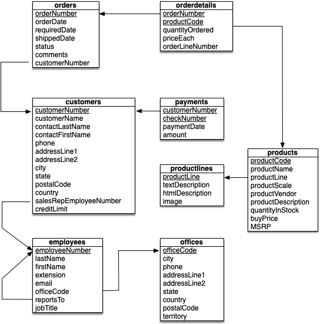

## CS 455 - Principles of Database Systems

### Hwk: Join Processing

This assignment give you some hands-on experience programming several classical implementations of the natural join ($$R\bowtie S$$) operation, one of the key algorithms in relational database systems. You may choose between Java and Python.


#### Student Outcomes
- Gain insight into the performance of several join-processing algorithms.

#### Required Files

The following file(s) have been provided for this assignment.

- [classicmodels.zip](classicmodels.zip)


#### Overview
- Nested-Loop Join: The nested-loop join is the naive approach, and its mechanism follows what you've been taught the $$R \bowtie S$$ relational operator does. It loops through each tuple in $$R$$ and $$S$$ and produces a concatenated tuple if the values of their common attributes are equal. The pseudocode of the nested-loop join is given below.

	```java
	Input: Relation R, Relation S
	Output: Relation T

	// Let c denote the name of the common attribute
	// Let t.c denote the value of attribute c in some tuple t

	T = empty relation
	for each tuple r in R
		for each tuple s in S
				if (r.c == s.c)
					create new tuple (r,s) and add it to T
	return T
	```

- Hash Join: The hash join algorithm has two distinct phases. Phase I builds a hashmap over relation $$R$$. Each map entry is keyed on the value of the common attribute and stores the tuple in $$R$$. Important: It is for this reason that the common attribute $$R.c$$ must have unique values (e.g., be a key) in $$R$$. If $$R.c$$ were not unique, then different tuples would collide (and overwrite each other) in the hashmap. Phase II then iterates through each tuple in $$S$$ and searches for the value of its common attribute in the hash map. If it exists in the map, then there is equivalence on common attributes in both relations, and the concatenated tuple is retained in the result. Otherwise the tuple in $$S$$ is discarded.

	```java
	Precondition: The common attribute in R must be unique
	Input: Relation R, Relation S
	Output: Relation T

	// Let c denote the name of the common attribute
	// Let t.c denote the value of attribute c in some tuple t
	T = empty relation

	// Phase I: Hash every tuple of R by the value 
	// of the common attribute
	map = new hashmap
	for each tuple r in R {
		
		List L = map.get(r.c)
		if (L == null) {
			L = new List()
			map.put(r.c, new List())
		}
		add r to List L
	}

	// Phase II: Join up with S
	for each tuple s in S {
		if (s.c in map) {
			List L = map.get(s.c)
			for each tuple r in L:
				create new tuple (r,s) and add it to T
		}
	}
	return T
	```

- Sort-Merge Join: The sort-merge join assumes that the tuples in both relations are sorted on their common attributes. We use cursors i and j to track the row positions of relation R and S, respectively. We shift the cursors down until we exceed one of the relations. When a match on their common attributes is found, we enter the merge phase, in which we concatenate both tuples, while moving S's cursor down. You can think of the merge phase as a baby nested loop join on the tuples that match. When S's cursor refers to a tuple that is no longer a match, then R's cursor moves increments and S's cursor resets.

	```java
	Input: Relation R, Relation S
	Output: Relation T

	// Let c denote the name of the common attribute
	// Let t.c denote the value of attribute c in some tuple t

	if (R is not sorted on values of c) {
		sort R on R.c
	}
	if (S is not sorted on values of c) {
		sort S on S.c
	}

	T = empty relation
	i = 0
	j = 0
	while (i < R.size() && j < S.size()) {
		// Match found, enter merge phase
		if (R[i].c == S[j].c) {
			while (R[i].c == S[j].c && i < R.size()) {
				k = j
				while (R[i].c == S[k].c && k < S.size()) {
					create new tuple (R[i], S[k]) and add it to T
					k++
				}
				i++
			}
		}
		else if (R[i].c < S[j].c)
			i++
		else
			j++
	}
	return T
	```


#### Database Files
Inside the `data/` directory in the given project starter file, you find a set of files. Each file contains data for a table in the following schema:



The format of these files is as follows, where `attr_i` is the name of the ith attribute and `val_i` is the value of the ith attribute.

```txt
#attr_1|attr_2|...|attr_N
#sorting_attr (possible)
val_1|val_2|...|val_N
val_1|val_2|...|val_N
val_1|val_2|...|val_N
val_1|val_2|...|val_N
val_1|val_2|...|val_N
.
.
.
```

Comments in the files are preceded by a `#` character. The comment on the first line has all the attribute names. The second comment may or may not exist. If it's specified, then it contains the name of the attribute by which all tuples in the file is sorted. If this comment does not exist, then the tuples are not sorted in any way. It's a good idea to open them up just to see what's stored inside before moving on. Here are some characteristics of all the relations, which you will find useful when testing.

- customers: 122 tuples, sorted on `customerNumber`
- orders: 326 tuples, sorted on `orderNumber`
- orderdetails: 2996 tuples, sorted on `orderNubmer`
- payments: 273 tuples, sorted on `customerNumber`
- productlines: 7 tuples, unsorted
- products: 110 tuples, sorted on `productCode`
- employees: 23 tuples, sorted on `employeeNumber`
- offices: 7 tuples, sorted on `officeCode`


#### Program Requirements
You have the choice to write this program in either Python or Java. Just be sure to let me know how to run you program.

1. When the program starts, you should read every file in the `data/` directory into your program. You must use the file name, minus the file extension (`.txt`), to serve as the name of the relation in your program. For grading, I will be using completely different files (with different file names). Your program must work, assuming that my `data/` directory will be placed in your project directory. You should test rigorously with your own toy-files to ensure that your program can accept arbitrary data sets. Assignments that fail to work with my data sets will be returned without a grade.

	 Avoid hardcoding absolute file paths in your code. Points will be deducted if I can't easily run your program with database files on my machine. You must ignore any file whose filename starts with a dot.

2. After all the files have been input, you should prompt the user to enter the names of the relations across which they'd like to perform the natural join. If any relation they entered does not exist (case insensitive), your program should re-prompt. Otherwise, you should present the user with a menu, allowing the user to select from one of the three join algorithms. When the user is done making their choice, the join processing should then output the result; the time elapsed in milliseconds; and the number of rows returned in the result set. When reporting the time, do not include the time elapsed to print out the table -- only include the time taken to perform the join algorithm.

3. If a common attribute does not exist between the tables, you should produce the cartesian product. You may assume that there is **at most** one common attribute between two relations. Even though it holds in this particular data set, do not assume that the common attribute is always the first attribute in the relation. If a common attribute exists then:

		- If nested loop join was selected, it should run without problems.

		- If the hash join was selected, it can only run if its "Phase I" of the algorithm determines that the common attribute values are unique. You should throw an alert/error otherwise.

		- If the sort-merge join was selected, you must sort the tuples on their common attribute, if the tuples are not *already* sorted on the common attribute. 

4. The ordering of attributes must be preserved in the joined result. For instance, when applying $$R(A,B,C)~\bowtie~S(X,C,Y,Z)$$, the resulting relation should have the following attribute ordering: $$(A,B,C,X,Y,Z)$$. This means you should preserve the original attribute ordering of $$R$$ and $$S$$, and remove the common attribute from $$S$$.

5. Other items worth considering:

		- A relation's list of attribute names should NOT be added as a tuple.

		- Style and effective commenting is expected. Please include your name on top of every class file.

		- If your code does not compile/run without error, you will receive a zero for this assignment.

		- Rest assured that my input file will be well-formed (to the above specifications).

		- Please include a `README` file that instructs me on how to run your program.


#### Sample Output
Here is $$offices \bowtie employees$$ over sort-merge join:

```txt
Available relations:

   offices payments orderdetails orders customers productlines employees products

Your selection (separated by space): offices employees
Choose a join algorithm:
1. Nested loop join
2. Hash Join
3. Sort-Merge Join
Your selection: 3

officeCode|city|phone|addressLine1|addressLine2|state|country|postalCode|territory|employeeNumber|lastName|firstName|extension|email|reportsTo|jobTitle|
1|San Francisco|+1 650 219 4782|100 Market Street|Suite 300|CA|USA|94080|NA|1002|Murphy|Diane|x5800|dmurphy@classicmodelcars.com|NULL|President
1|San Francisco|+1 650 219 4782|100 Market Street|Suite 300|CA|USA|94080|NA|1056|Patterson|Mary|x4611|mpatterso@classicmodelcars.com|1002|VP Sales
1|San Francisco|+1 650 219 4782|100 Market Street|Suite 300|CA|USA|94080|NA|1076|Firrelli|Jeff|x9273|jfirrelli@classicmodelcars.com|1002|VP Marketing
1|San Francisco|+1 650 219 4782|100 Market Street|Suite 300|CA|USA|94080|NA|1143|Bow|Anthony|x5428|abow@classicmodelcars.com|1056|Sales Manager (NA)
1|San Francisco|+1 650 219 4782|100 Market Street|Suite 300|CA|USA|94080|NA|1165|Jennings|Leslie|x3291|ljennings@classicmodelcars.com|1143|Sales Rep
1|San Francisco|+1 650 219 4782|100 Market Street|Suite 300|CA|USA|94080|NA|1166|Thompson|Leslie|x4065|lthompson@classicmodelcars.com|1143|Sales Rep
2|Boston|+1 215 837 0825|1550 Court Place|Suite 102|MA|USA|02107|NA|1188|Firrelli|Julie|x2173|jfirrelli@classicmodelcars.com|1143|Sales Rep
2|Boston|+1 215 837 0825|1550 Court Place|Suite 102|MA|USA|02107|NA|1216|Patterson|Steve|x4334|spatterson@classicmodelcars.com|1143|Sales Rep
3|NYC|+1 212 555 3000|523 East 53rd Street|apt. 5A|NY|USA|10022|NA|1286|Tseng|Foon Yue|x2248|ftseng@classicmodelcars.com|1143|Sales Rep
3|NYC|+1 212 555 3000|523 East 53rd Street|apt. 5A|NY|USA|10022|NA|1323|Vanauf|George|x4102|gvanauf@classicmodelcars.com|1143|Sales Rep
4|Paris|+33 14 723 4404|43 Rue Jouffroy Dabbans|NULL|NULL|France|75017|EMEA|1102|Bondur|Gerard|x5408|gbondur@classicmodelcars.com|1056|Sale Manager (EMEA)
4|Paris|+33 14 723 4404|43 Rue Jouffroy Dabbans|NULL|NULL|France|75017|EMEA|1337|Bondur|Loui|x6493|lbondur@classicmodelcars.com|1102|Sales Rep
4|Paris|+33 14 723 4404|43 Rue Jouffroy Dabbans|NULL|NULL|France|75017|EMEA|1370|Hernandez|Gerard|x2028|ghernande@classicmodelcars.com|1102|Sales Rep
4|Paris|+33 14 723 4404|43 Rue Jouffroy Dabbans|NULL|NULL|France|75017|EMEA|1401|Castillo|Pamela|x2759|pcastillo@classicmodelcars.com|1102|Sales Rep
4|Paris|+33 14 723 4404|43 Rue Jouffroy Dabbans|NULL|NULL|France|75017|EMEA|1702|Gerard|Martin|x2312|mgerard@classicmodelcars.com|1102|Sales Rep
5|Tokyo|+81 33 224 5000|4-1 Kioicho|NULL|Chiyoda-Ku|Japan|102-8578|Japan|1621|Nishi|Mami|x101|mnishi@classicmodelcars.com|1056|Sales Rep
5|Tokyo|+81 33 224 5000|4-1 Kioicho|NULL|Chiyoda-Ku|Japan|102-8578|Japan|1625|Kato|Yoshimi|x102|ykato@classicmodelcars.com|1621|Sales Rep
6|Sydney|+61 2 9264 2451|5-11 Wentworth Avenue|Floor #2|NULL|Australia|NSW 2010|APAC|1088|Patterson|William|x4871|wpatterson@classicmodelcars.com|1056|Sales Manager (APAC)
6|Sydney|+61 2 9264 2451|5-11 Wentworth Avenue|Floor #2|NULL|Australia|NSW 2010|APAC|1611|Fixter|Andy|x101|afixter@classicmodelcars.com|1088|Sales Rep
6|Sydney|+61 2 9264 2451|5-11 Wentworth Avenue|Floor #2|NULL|Australia|NSW 2010|APAC|1612|Marsh|Peter|x102|pmarsh@classicmodelcars.com|1088|Sales Rep
6|Sydney|+61 2 9264 2451|5-11 Wentworth Avenue|Floor #2|NULL|Australia|NSW 2010|APAC|1619|King|Tom|x103|tking@classicmodelcars.com|1088|Sales Rep
7|London|+44 20 7877 2041|25 Old Broad Street|Level 7|NULL|UK|EC2N 1HN|EMEA|1501|Bott|Larry|x2311|lbott@classicmodelcars.com|1102|Sales Rep
7|London|+44 20 7877 2041|25 Old Broad Street|Level 7|NULL|UK|EC2N 1HN|EMEA|1504|Jones|Barry|x102|bjones@classicmodelcars.com|1102|Sales Rep

Time = 2.806131 ms
```

Here is $$offices \bowtie employees$$ over hash join:

```txt
Available relations:

   offices payments orderdetails orders customers productlines employees products

Your selection (separated by space): offices employees
Choose a join algorithm:
1. Nested loop join
2. Hash Join
3. Sort-Merge Join
Your selection: 2

officeCode|city|phone|addressLine1|addressLine2|state|country|postalCode|territory|employeeNumber|lastName|firstName|extension|email|reportsTo|jobTitle|
1|San Francisco|+1 650 219 4782|100 Market Street|Suite 300|CA|USA|94080|NA|1002|Murphy|Diane|x5800|dmurphy@classicmodelcars.com|NULL|President
1|San Francisco|+1 650 219 4782|100 Market Street|Suite 300|CA|USA|94080|NA|1056|Patterson|Mary|x4611|mpatterso@classicmodelcars.com|1002|VP Sales
1|San Francisco|+1 650 219 4782|100 Market Street|Suite 300|CA|USA|94080|NA|1076|Firrelli|Jeff|x9273|jfirrelli@classicmodelcars.com|1002|VP Marketing
6|Sydney|+61 2 9264 2451|5-11 Wentworth Avenue|Floor #2|NULL|Australia|NSW 2010|APAC|1088|Patterson|William|x4871|wpatterson@classicmodelcars.com|1056|Sales Manager (APAC)
4|Paris|+33 14 723 4404|43 Rue Jouffroy Dabbans|NULL|NULL|France|75017|EMEA|1102|Bondur|Gerard|x5408|gbondur@classicmodelcars.com|1056|Sale Manager (EMEA)
1|San Francisco|+1 650 219 4782|100 Market Street|Suite 300|CA|USA|94080|NA|1143|Bow|Anthony|x5428|abow@classicmodelcars.com|1056|Sales Manager (NA)
1|San Francisco|+1 650 219 4782|100 Market Street|Suite 300|CA|USA|94080|NA|1165|Jennings|Leslie|x3291|ljennings@classicmodelcars.com|1143|Sales Rep
1|San Francisco|+1 650 219 4782|100 Market Street|Suite 300|CA|USA|94080|NA|1166|Thompson|Leslie|x4065|lthompson@classicmodelcars.com|1143|Sales Rep
2|Boston|+1 215 837 0825|1550 Court Place|Suite 102|MA|USA|02107|NA|1188|Firrelli|Julie|x2173|jfirrelli@classicmodelcars.com|1143|Sales Rep
2|Boston|+1 215 837 0825|1550 Court Place|Suite 102|MA|USA|02107|NA|1216|Patterson|Steve|x4334|spatterson@classicmodelcars.com|1143|Sales Rep
3|NYC|+1 212 555 3000|523 East 53rd Street|apt. 5A|NY|USA|10022|NA|1286|Tseng|Foon Yue|x2248|ftseng@classicmodelcars.com|1143|Sales Rep
3|NYC|+1 212 555 3000|523 East 53rd Street|apt. 5A|NY|USA|10022|NA|1323|Vanauf|George|x4102|gvanauf@classicmodelcars.com|1143|Sales Rep
4|Paris|+33 14 723 4404|43 Rue Jouffroy Dabbans|NULL|NULL|France|75017|EMEA|1337|Bondur|Loui|x6493|lbondur@classicmodelcars.com|1102|Sales Rep
4|Paris|+33 14 723 4404|43 Rue Jouffroy Dabbans|NULL|NULL|France|75017|EMEA|1370|Hernandez|Gerard|x2028|ghernande@classicmodelcars.com|1102|Sales Rep
4|Paris|+33 14 723 4404|43 Rue Jouffroy Dabbans|NULL|NULL|France|75017|EMEA|1401|Castillo|Pamela|x2759|pcastillo@classicmodelcars.com|1102|Sales Rep
7|London|+44 20 7877 2041|25 Old Broad Street|Level 7|NULL|UK|EC2N 1HN|EMEA|1501|Bott|Larry|x2311|lbott@classicmodelcars.com|1102|Sales Rep
7|London|+44 20 7877 2041|25 Old Broad Street|Level 7|NULL|UK|EC2N 1HN|EMEA|1504|Jones|Barry|x102|bjones@classicmodelcars.com|1102|Sales Rep
6|Sydney|+61 2 9264 2451|5-11 Wentworth Avenue|Floor #2|NULL|Australia|NSW 2010|APAC|1611|Fixter|Andy|x101|afixter@classicmodelcars.com|1088|Sales Rep
6|Sydney|+61 2 9264 2451|5-11 Wentworth Avenue|Floor #2|NULL|Australia|NSW 2010|APAC|1612|Marsh|Peter|x102|pmarsh@classicmodelcars.com|1088|Sales Rep
6|Sydney|+61 2 9264 2451|5-11 Wentworth Avenue|Floor #2|NULL|Australia|NSW 2010|APAC|1619|King|Tom|x103|tking@classicmodelcars.com|1088|Sales Rep
5|Tokyo|+81 33 224 5000|4-1 Kioicho|NULL|Chiyoda-Ku|Japan|102-8578|Japan|1621|Nishi|Mami|x101|mnishi@classicmodelcars.com|1056|Sales Rep
5|Tokyo|+81 33 224 5000|4-1 Kioicho|NULL|Chiyoda-Ku|Japan|102-8578|Japan|1625|Kato|Yoshimi|x102|ykato@classicmodelcars.com|1621|Sales Rep
4|Paris|+33 14 723 4404|43 Rue Jouffroy Dabbans|NULL|NULL|France|75017|EMEA|1702|Gerard|Martin|x2312|mgerard@classicmodelcars.com|1102|Sales Rep

Time = 0.781566 ms
```


Here is $$offices \bowtie employees$$ over nested loop join:
```txt
Available relations:

   offices payments orderdetails orders customers productlines employees products

Your selection (separated by space): offices employees
Choose a join algorithm:
1. Nested loop join
2. Hash Join
3. Sort-Merge Join
Your selection: 1

officeCode|city|phone|addressLine1|addressLine2|state|country|postalCode|territory|employeeNumber|lastName|firstName|extension|email|reportsTo|jobTitle|
1|San Francisco|+1 650 219 4782|100 Market Street|Suite 300|CA|USA|94080|NA|1002|Murphy|Diane|x5800|dmurphy@classicmodelcars.com|NULL|President
1|San Francisco|+1 650 219 4782|100 Market Street|Suite 300|CA|USA|94080|NA|1056|Patterson|Mary|x4611|mpatterso@classicmodelcars.com|1002|VP Sales
1|San Francisco|+1 650 219 4782|100 Market Street|Suite 300|CA|USA|94080|NA|1076|Firrelli|Jeff|x9273|jfirrelli@classicmodelcars.com|1002|VP Marketing
1|San Francisco|+1 650 219 4782|100 Market Street|Suite 300|CA|USA|94080|NA|1143|Bow|Anthony|x5428|abow@classicmodelcars.com|1056|Sales Manager (NA)
1|San Francisco|+1 650 219 4782|100 Market Street|Suite 300|CA|USA|94080|NA|1165|Jennings|Leslie|x3291|ljennings@classicmodelcars.com|1143|Sales Rep
1|San Francisco|+1 650 219 4782|100 Market Street|Suite 300|CA|USA|94080|NA|1166|Thompson|Leslie|x4065|lthompson@classicmodelcars.com|1143|Sales Rep
2|Boston|+1 215 837 0825|1550 Court Place|Suite 102|MA|USA|02107|NA|1188|Firrelli|Julie|x2173|jfirrelli@classicmodelcars.com|1143|Sales Rep
2|Boston|+1 215 837 0825|1550 Court Place|Suite 102|MA|USA|02107|NA|1216|Patterson|Steve|x4334|spatterson@classicmodelcars.com|1143|Sales Rep
3|NYC|+1 212 555 3000|523 East 53rd Street|apt. 5A|NY|USA|10022|NA|1286|Tseng|Foon Yue|x2248|ftseng@classicmodelcars.com|1143|Sales Rep
3|NYC|+1 212 555 3000|523 East 53rd Street|apt. 5A|NY|USA|10022|NA|1323|Vanauf|George|x4102|gvanauf@classicmodelcars.com|1143|Sales Rep
4|Paris|+33 14 723 4404|43 Rue Jouffroy Dabbans|NULL|NULL|France|75017|EMEA|1102|Bondur|Gerard|x5408|gbondur@classicmodelcars.com|1056|Sale Manager (EMEA)
4|Paris|+33 14 723 4404|43 Rue Jouffroy Dabbans|NULL|NULL|France|75017|EMEA|1337|Bondur|Loui|x6493|lbondur@classicmodelcars.com|1102|Sales Rep
4|Paris|+33 14 723 4404|43 Rue Jouffroy Dabbans|NULL|NULL|France|75017|EMEA|1370|Hernandez|Gerard|x2028|ghernande@classicmodelcars.com|1102|Sales Rep
4|Paris|+33 14 723 4404|43 Rue Jouffroy Dabbans|NULL|NULL|France|75017|EMEA|1401|Castillo|Pamela|x2759|pcastillo@classicmodelcars.com|1102|Sales Rep
4|Paris|+33 14 723 4404|43 Rue Jouffroy Dabbans|NULL|NULL|France|75017|EMEA|1702|Gerard|Martin|x2312|mgerard@classicmodelcars.com|1102|Sales Rep
5|Tokyo|+81 33 224 5000|4-1 Kioicho|NULL|Chiyoda-Ku|Japan|102-8578|Japan|1621|Nishi|Mami|x101|mnishi@classicmodelcars.com|1056|Sales Rep
5|Tokyo|+81 33 224 5000|4-1 Kioicho|NULL|Chiyoda-Ku|Japan|102-8578|Japan|1625|Kato|Yoshimi|x102|ykato@classicmodelcars.com|1621|Sales Rep
6|Sydney|+61 2 9264 2451|5-11 Wentworth Avenue|Floor #2|NULL|Australia|NSW 2010|APAC|1088|Patterson|William|x4871|wpatterson@classicmodelcars.com|1056|Sales Manager (APAC)
6|Sydney|+61 2 9264 2451|5-11 Wentworth Avenue|Floor #2|NULL|Australia|NSW 2010|APAC|1611|Fixter|Andy|x101|afixter@classicmodelcars.com|1088|Sales Rep
6|Sydney|+61 2 9264 2451|5-11 Wentworth Avenue|Floor #2|NULL|Australia|NSW 2010|APAC|1612|Marsh|Peter|x102|pmarsh@classicmodelcars.com|1088|Sales Rep
6|Sydney|+61 2 9264 2451|5-11 Wentworth Avenue|Floor #2|NULL|Australia|NSW 2010|APAC|1619|King|Tom|x103|tking@classicmodelcars.com|1088|Sales Rep
7|London|+44 20 7877 2041|25 Old Broad Street|Level 7|NULL|UK|EC2N 1HN|EMEA|1501|Bott|Larry|x2311|lbott@classicmodelcars.com|1102|Sales Rep
7|London|+44 20 7877 2041|25 Old Broad Street|Level 7|NULL|UK|EC2N 1HN|EMEA|1504|Jones|Barry|x102|bjones@classicmodelcars.com|1102|Sales Rep

Time = 1.366364 ms
```

Here are my times for $$orders \bowtie orderdetails$$:
```
Time = 105.34427 ms (nested loop join)
Time = 14.707695 ms (hash join)
Time = 19.144208 ms (sort-merge join -- no sorting needed on either relation)
```

Here are my times for $$products \bowtie orderdetails$$:
```
Time = 64.144084 ms (nested loop join)
Time = 18.42204 ms (hash join)
Time = 30.062172 ms (sort-merge join -- must first sort orderdetails)
```

#### Grading

```
This assignment will be graded out of 80 points.

[10pt] All files in the data directory are read into relations on program's start.
[5pt]  The common attribute is projected only once in the natural-join result.
[10pt] Nested loop join is properly implemented.
[15pt] Hash join is properly implemented.
[20pt] Sort-merge join is properly implemented.
[5pt]  When sort-merge is called, the tuples are sorted on-demand only if the
       relations are not already sorted on the common attribute.
[5pt]  Your algorithms are proper timed, and elapsed time should be reported
       in milliseconds (ms).
```

#### Submitting Your Assignment

After you have completed the homework, zip up your files and submit your work on Canvas.

#### Credits

Written by David Chiu.
