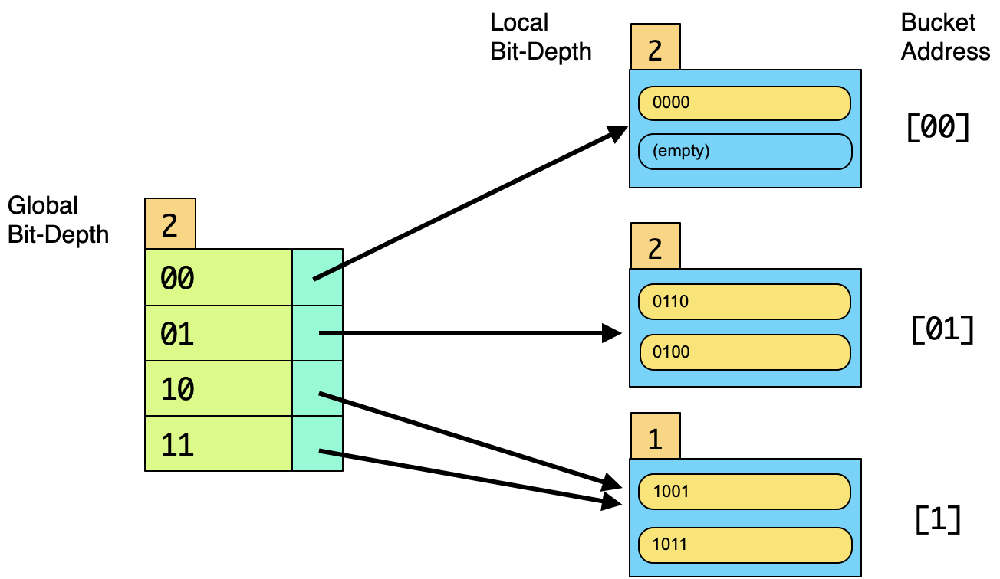

## CS 455 - Principles of Database Systems

### Hwk: Extendible Hashing
In this assignment, you will build a program that simulates the search and insertion of search keys into an extendible hash indexing structure. There are two things that would be different in a real database system: First,  the local buckets would be allocated as blocks on disk. The data stored in those blocks would actually be the tuples that hash into those blocks. Secondly, in a real extendible hash index, actual bits of the key's hash codes would be used (which require heavier usage of bitwise operators), instead of Strings of bits that represent the keys as we see in class. I choose to use strings here for simplicity, but you may implement this program using integers and bitwise operators if you'd prefer a challenge.

You may use Java or Python for this assignment. 


#### Student Outcomes

- To understand the basics of extendible hashing.


#### Program Requirements

1. Upon running your program, your main method must accept a single command-line argument:
    - Local bucket size (integer): This is the maximum number of tuples that can be stored per block.
    - Key length (integer): This is the number of bits that constitute a key.

2. After receiving the above input, create a default extendible hash index, with global index ($$i$$) and local index ($$j$$) initialized to 0, which means you will have $$2^i = 1$$ entry in your global index that points to the sole local bucket, which is empty.

3. Your program should now wait for instructions of the following format:
    - `i <x>` Inserts the key `x` given as a binary string, such as `"i 11010"`, which prints `SUCCESS` or `FAILED`. An insert fails if `x` already exists in the hash index. An error should be printed if the length of this bit-string exceeds the `key length` specified in the command prompt.
    - `s <x>` Searches the index for key `x`, given as a binary string. Prints `x FOUND` or `x NOT FOUND`. An error should be printed if the length of this bit-string exceeds the `key length` specified in the command prompt.
    - `p` Prints out your extendible hash index (you must abide by the format given below.)
    - `q` Exits the program.

4. You may assume that all keys `x` are input as the given key-length. For instance, if the key length was input as 5, then all keys will be input as size three (e.g., `10` would be input as `00010`). As such, any key strings that exceed this length should be ignored (and an error should be printed.)

5. When printing out your hash index, it must follow the format below:

    ```txt
    Global(<i>)
    <B>: Local(j)[<b>] = [key1, key2, ...]
    ...
    ```

    In the format above, `<i>` is the integer bit-depth of the global directory. `<B>` is a bit string representation of a global address. `<j>` is the integer bit-depth of the local directory. `<b>` is the bit string representation of the local bucket's address. Finally, the binary keys that are stored in that bucket are listed in no particular order.

    Here's an example below for a local bucket size of 2 tuples. The global bit-depth is 2, so there are four addresses (entries) in the global directory: `00`, `01`, `10`, and `11` (one listed on per row). The global address `00` points to a local bucket (also addressed `00`) which stores a single key, `0000`. Both global entries `10` and `11` point to the _same_ local bucket. We know they're the same because the local bit-depth in those buckets is only 1 (and also because they store the same keys). If you work this out on paper, you should get this result from inserting `0000`, `1001`, `0110`, `1011`, and `0100`, in that order.

    ```
    Global(2)
    00: Local(2)[00] = [0000, null]
    01: Local(2)[01] = [0110, 0100]
    10: Local(1)[1] = [1001, 1011]
    11: Local(1)[1] = [1001, 1011]
    ```

    The corresponding drawing looks like:

    

6. If taking an object oriented approach, I would have at least 2 classes: a Global Directory, which stores an array of Buckets. In my implementation, I have a third class that simply runs the main method, providing the user interface.


#### Example Output
Bad input:

```txt
$ java ExtHash
Usage: java ExtHash <block size> <key length>
```

```txt
$ java ExtHash 2 0
Error: key length must be postive
```

```txt
$ java ExtHash 0 5
Error: block size must be at least 1
```

In this example, bucket/block size is set to 4, and therefore, the first four keys are inserted trivially. The fifth key `0101` causes a local split, which propagates to a global split. All keys beginning with `1` are transferred over to bucket `[1]`, before the insertion of `0101` can be performed.

```
$ java ExtHash 4 4

> i 1001010
Error: key exceeds length 4

> i 1011
SUCCESS

> i 1010
SUCCESS

> i 0110
SUCCESS

> i 0000
SUCCESS

> p
Global(0)
: Local(0)[] = [1011, 1010, 0110, 0000]

> i 0101
SUCCESS

> p   
Global(1)
0: Local(1)[0] = [0101, null, 0110, 0000]
1: Local(1)[1] = [1011, 1010, null, null]

> s 101010101
Error: key exceeds length 4
```


In this example bucket/block size is set to 2, and `00011`, `00101` are inserted trivially. Then the insertion of `00111` causes two consecutive splits of the local and global directories (due to `00` being the leading bits in all three keys.) Therefore this global directory grows from 1 entry to 8 entries to accommodate the insertion of `00111`. A couple more keys, `01011` and `10001`, are inserted trivially before the final insertion of `11100` causes another local bucket split, but not a global directory split.

```txt

$ java ExtHash 2 5
> i 0000101010101
> Error: key exceeds length 5

> i 00011
SUCCESS

> p
Global(0)
: Local(0)[] = [00011, null]

> i 00101
SUCCESS

> p
Global(0)
: Local(0)[] = [00011, 00101]

> s 00011
00111 FOUND

> i 00111
SUCCESS

> i 00101
FAILED

> p
Global(3)
000: Local(3)[000] = [00011, null]
001: Local(3)[001] = [00101, 00111]
010: Local(2)[01] = [null, null]
011: Local(2)[01] = [null, null]
100: Local(1)[1] = [null, null]
101: Local(1)[1] = [null, null]
110: Local(1)[1] = [null, null]
111: Local(1)[1] = [null, null]

> i 01001
SUCCESS

> p
Global(3)
000: Local(3)[000] = [00011, null]
001: Local(3)[001] = [00101, 00111]
010: Local(2)[01] = [01001, null]
011: Local(2)[01] = [01001, null]
100: Local(1)[1] = [null, null]
101: Local(1)[1] = [null, null]
110: Local(1)[1] = [null, null]
111: Local(1)[1] = [null, null]

> i 01011
SUCCESS

> p
Global(3)
000: Local(3)[000] = [00011, null]
001: Local(3)[001] = [00101, 00111]
010: Local(2)[01] = [01001, 01011]
011: Local(2)[01] = [01001, 01011]
100: Local(1)[1] = [null, null]
101: Local(1)[1] = [null, null]
110: Local(1)[1] = [null, null]
111: Local(1)[1] = [null, null]

> s 01011
01011 FOUND

> i 10001
SUCCESS

> i 11100
SUCCESS

> p
Global(3)
000: Local(3)[000] = [00011, null]
001: Local(3)[001] = [00101, 00111]
010: Local(2)[01] = [01001, 01011]
011: Local(2)[01] = [01001, 01011]
100: Local(1)[1] = [10001, 11100]
101: Local(1)[1] = [10001, 11100]
110: Local(1)[1] = [10001, 11100]
111: Local(1)[1] = [10001, 11100]

> q
```


#### Grading

```
This assignment will be graded out of 90 points.

[10pts] Implementation of the user interface to insert, search, print. Quits on .quit.

[10pts] The search method is properly implemented, and takes O(1) time.

[20pts] The print function prints the global directory and the buckets in the format
given in this assignment.

[50pts] The insert function is properly implemented according to the algorithm given
in lecture. This method only attempts to insert when the key is not already contained
in the index. Splitting of the local directory requires the correct keys from the overflown
bucket to be transferred to the new bucket based on those keys' most significant bits.
Pointers in the global directory need to be updated to point to the new bucket, 
regardless of whether the global directory needs to be doubled in size. 

This method should run in O(1) time if there's no splitting. On a split, this method runs
in O(d) where d is the number of entries in the global directory, since you need to update
pointers.
```

#### Submitting Your Assignment

After you have completed the homework, use the following to submit your work on Canvas. There are two options to submit your work.

1. If you pushed all your code to a Github repository. Make sure your repo is public, and simply submit the URL to your repo on Canvas.
2. Alternatively, you can zip up all your files (minus the `.class` files) and submit the `.zip` file on Canvas.
3. You may submit as often as you'd like before the deadline. I will grade the most recent copy.

#### Credits

Written by David Chiu. 2022.
