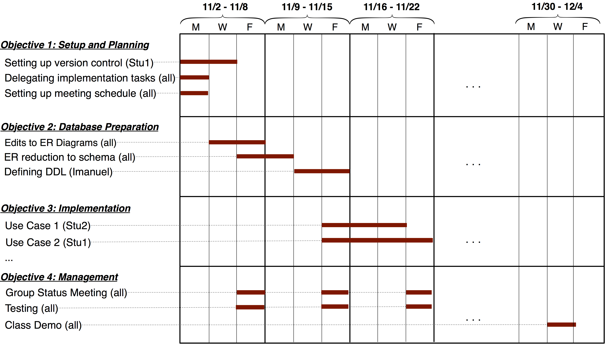

## CS 455 - Principles of Database Systems

### Project 3: Project Planning

#### Overview

By now, you've gotten some practice administering a web server, and you've also had significant experience writing some dynamic database-backed web pages. Now it's time to put these skills to use. In this project, you will be playing a software consulting firm. You will think up a development idea, and then start planning for its implementation.

#### Student Learning Objectives

Students will:

- Prepare design documentation and a project plan

#### Part 1: Planning

If your team would rather work on your own ideas, you're welcome to! Get together with your group and brainstorm over a project you wish to implement. As you do this activity, imagine that you're working for an organization with web-programming needs, which require database support. This could be a real project you create for an organization on campus in need (which has been done several times). In the past, interesting projects included:

    - An **online voting system** for campus-wide elections. Users with accounts can create any election or poll for people to vote on. Once it goes online, any user with an account can make a vote. Users can change their vote as long as the election has not closed. Once the election closes, the votes can no longer be made or changed, and the results are displayed.

    - A **campus bike-sharing and tracking site**. Anyone with a browser can view the available bikes for rent and where they are located. Integration with Google Maps is a requirement (of course, without real GPS, you'll just simulate bikes and their locations). Users can login and check bikes in/out for a fixed cost per hour.

    - A **grocery-delivery company** -- needs to track deliveries, employees, delivery stations, and routes. Users with a tracking ID can get status updates on the location of their groceries. Based on the distances between stations and the availability of delivery vehicles, the organization can provide estimated shipping times.

    - A **music-sharing app** -- allows users to upload and stream MP3s. Users on the website can upvote/downvote songs. They can also tag, search, and comment on various songs.

    - An **online auction house** -- any user can create an account and post items (including descriptions and images) for auction. Every auction has an end-time and end-date, at which the highest bidder wins the coveted item. After winning, the organization must provide secured payment options.

These are just examples from the past couple semesters. You're clearly not bound to any of these, and you are encouraged to be as creative as possible. They give you an idea of the scope and expectations of this project.

Caution: I recommend that the team comes to a consensus on the project vision, so that everyone is bought-in and invested equally. Project visions borne out of one or two students generally doesn't work well. Something like this has happened in the very recent past... A student was really into Pokemon cards. They convinced the rest of their team members to write a web app to organize all the Pokemon cards in the world, and so that users can manage which cards they own and even trade them and _battle_ each other. Other teammates didn't understand how the battles were played out, which was more complicated than they first thought, but went along with it anyway. The other members were never really invested enough to stay motivated to work on the project, and it didn't end well.

#### Part 2: Project Proposal (HTML)

The proposal itself does not have to be long. I'm not expecting 10 pages here. It's more about getting together with your team and thinking through the features you want to support. **Create an HTML page** on your server with following required sections:

- **Section I: Introduction (suggested length: 2-3 paragraphs)** -- Describe your project vision. Explain the problem you're trying to solve, and why you believe a database solution is necessary.

- **Section II: Product Features** -- Next, define _at least two_ significant software features per team member. Here are a few example features for a package-shipping company:

  - _Feature 1:_ Customers can login to our system with a username and password, which are both encrypted in the database. The login form has a checkbox option to "Remember me today." If this option is checked upon a successful login, the website will remember them for a 24-hour period (without requiring login if they leave and return to the site later). If not checked, the site will only remember them for a 1-hour period.
  - _Feature 2:_ To provide added security, we will block out an account after 5 unsuccessful login attempts, after which the user must reset their password by following a link that is emailed to the addressed stored in the database for the given the username.
  - _Feature 3:_ A company rep with proper credentials can manually add a new package by date, and assign that company's container to a specific delivery vehicle.
  - _Feature 4:_ Any user can view the company's shipping routes by date, but a company rep with proper credentials can also adjust (add/delete/update) any shipping routes.
  - _Feature 5:_ A company rep with proper credentials can generate reports on the company's earnings aggregated by day, month, and year.
  - _Feature 6:_ Customers can track the live location of their package on a map.

  As you can see in the examples above, it's important to list the type of user(s) involved in each feature, followed by a concise and independent "unit of work." It's **not** important to ensure that features are of equal "size" and "time commitment." It may take a student, or a couple students, a week to implement _Feature 6_, while _Feature 2_ may only take a day.

  It may also be helpful to remember that this proposal is **not** a contract between you and me, so it's okay to be ambitious and list features that you may not get to implement. It's your job, however, to prioritize the "must-have" features over the "nice-to-have" ones. Your goal is to have a working prototype of the fundamental features by the last week of classes, so prioritize wisely!

  You'll also likely experience that this list of features may change over time, and that's okay. Consider this a living document and make adjustments to it over time.

- **Section III: Database Schema** -- Design a relational database schema to support the set of features you listed. There are lots of tools to draw schema diagrams. For instance, check out [draw.io](https://draw.io). In your schema diagram, underline the primary keys, and don't forget to draw edges for your foreign keys. For each relation, write a brief description of what it stores, and why it's needed.

- **Section IV: Project Management** -- In this section, you will define each team member's role by assigning features to specific team members. As I mentioned earlier, not all features are the same size and time-commitment, so it's common for a team member to be assigned more features than others. And conversely, some complicated features may require multiple students to work on it simultaneously. Some features are also dependent on other features to be implemented first. Therefore, it's important to use software-engineering tools to ensure that everybody's on the same page.

  - Make a list of tools you'll be using to help you manage your project and workflow. List each tool by name, along with their intended purpose (e.g., git, figma, slack, trello, etc.)
    - This is a good time to explore what people use in industry to communicate, or to track bugs, or to design user interfaces, etc.
    <!-- - You should summarize how you intend to communicate to your team members (e.g., meeting frequency).
  - You should use project-management tools like [Trello](https://trello.com) to organize your application's features, notes, and to track overall progress. -->
  - Finally, you must produce a Gantt Chart that communicates your timeline and milestones. Throughout the weeks of your project's implementation, I will hold you accountable based on your proposed timeline, with the understanding that plans and features do change. Here is an example Gantt Chart:

    

#### Miscellanea

- Your project must be hosted on the server to which you have access. Please don't use another 3rd party host. This why, I always have direct access to your server and code.
- If you're interested in trying out another database system like MySQL/MariaDB/PostgreSQL, you're more than welcome to. The only requirement is that the database system you choose must be relational in nature.
  - You cannot use document-object storage systems like MongoDB and CouchDB.
  - You're also reminded that different implementations may support different "flavors" of SQL. That means there may be significant variations to the syntax you're already familiar with.
- Backend programming using PHP and HTML is sufficient for this project.
  - However, if you know JavaScript, you're welcome to integrate that into your code.
    Make sure the language you ultimately choose is one that everyone is comfortable using. This is why a PHP-only option is still recommended for all teams.
  - You have to do the bulk of the work, so heavy reliance on pre-made libraries and other web toolkits are discouraged. If you're not sure, run it past me first.
- Code sharing: I strongly recommend everyone getting onboard with using git and hosting their code on github to manage your source code. It will also make project submission easy!

#### Submission

List the group membership on your proposal page. Go to [Canvas](https://canvas.pugetsound.edu) and submit the URL to your proposal under the `Project 3` Dropbox.

#### Grading

```
This assignment will be graded out of 40 points:
[10pt] You have defined a set of sensible features for your application. There are at least two features per team member.
[10pt] Your project management plan includes a Gantt chart that estimates task delegation, timeline, and milestones.
       A communication plan is also required.
[ 5pt] A list of tools you plan on using for project manage is required.
[15pt] An appropriate relational schema diagram is given to support your project.
```
