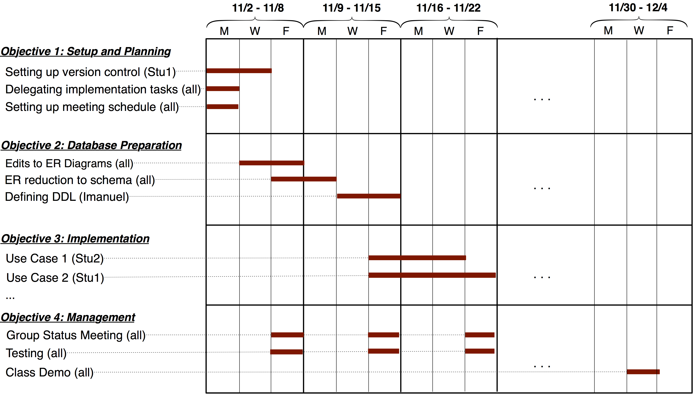

## CS 455 - Principles of Database Systems

### Database Term Project
The term project is open-ended, and you need to write a short proposal (1 page is sufficient) outlining what you and your team are hoping to accomplish. You are given a lot of freedom to work on whatever you wish. The only requirements for the term project are listed as follows:
- Novelty requirement: You are required to learn and apply something new about data management and/or databases that was not covered in class.
- You are required to work in teams of 2-3 students.
- You are required to practice scrum, recording daily progress (this is graded).
- You must prepare a final presentation during the last week of classes.
- Your code is to be managed and submitted via Github, with instructions on how to build and run it for grading.


#### Important Dates
- Team preferences due via email to David: Friday, Oct 27, 2023
- 1-page proposal deadline: Friday, Nov 3, 2023
- Presentation / demo: Wednesday, Dec 13, 2023 (finals week)
- Code submission: Friday, Dec 15, 2023
- Scrum logs and check-ins: weekly, ongoing


##### Importance of Team Buy-in
I strongly recommend that the team comes to a consensus on the project vision, so that everyone is equally invested in taking ownership. Project visions borne out of one or two students generally doesn't work well. Something like this has happened in the very recent past... A student was really into Pokemon cards. They convinced the rest of their team members to write a web app to organize all the Pokemon cards in the world, and so that users can manage which cards they own and even trade them and battle each other. Other teammates didn't understand how the battles were played out (which was far more complicated than they thought) but went along with it anyway. The other members were never invested enough in the project to stay motivated. 

Here are just some ideas on what you and your team can do:

- Build a web application (like the kind of work you might've done for *Software Engineering*) that requires database back-end support. The novelty will be the need to learn back-end programming to get SQLite or some other database system integrated into your application. It is essential that you learn some security/privacy measures, such as SQL Injection and secured password storage. I would prefer that you do not simply update a previous project.

  - *Novelty:* It requires you to learn how to use Node.js libraries for backend programming and database APIs. It requires you understand how to prevent SQL injection attacks.

- You could also try building a web application, but instead of a relational database, use a NoSQL database such as MongoDB that are becoming increasingly common.

  - *Novelty:* Be able to rationalize why one would choose a NoSQL model over the relational model and vice versa. It also requires you to know how to integrate an existing NoSQL database into your web app.

- Learn to deploy parallel/distributed processing tools like Hadoop and/or Spark. You must use it to solve a real-world problem that requires crunching massive amounts of data (i.e., it is not sufficient to process a toy example.) You must also demonstrate that the Hadoop-based implementation is faster than a single-threaded implementation. For instance, you can use Hadoop to implement Google's PageRank algorithm over the Wikipedia data set.

  - *Novelty:* Learning to program using the Map-Reduce paradigm for big-data processing.

- You could learn, implement, and visualize a new indexing method, such as an R-Tree for indexing geospatial data, or linear hashing.

- And more! You have a high degree of freedom to propose anything, as long as it's related to databases and data management. It just needs to satisfy the *novelty* requirement.


[prop](#prop)
#### Project Proposal Requirements
A short proposal outlining your project should be submitted to me before the proposal deadline. One page ought to suffice, but there's no page limit. There are required sections of the proposal that you have to write:

- *Title and members:* Give a title to your project, and list the names of your group members on your proposal.
 
- *Section I:* Explain you're hoping to accomplish, addressing all the points below, if applicable:

  - What problem are you trying to solve? Why is the project interesting to you?
  - Provide original diagrams and figures to help you explain your application.
  - Address the *novelty* of the project. Explain what this project will teach you beyond what you'll take away from this course.
  - List the expected challenges. How do you expect the project will push you and your team? In what areas do you expect to face challenges? (The challenges may not be technical.)

- *Section II:* Tentative Grading Rubric

  How do you measure the success of your project? This also gives you a chance to think a little bit more about the details of the project. Work with your team and distribute 100 points across different item. You can model your rubric off of the ones I give you for your assignments. This rubric is only tentative, because we might expect plans to change as time passes. I will be using the finalized version to assign a final grade to your project.
  
  Here's a sample rubric:

  ```
  [5pts] A schema with primary keys foreign keys have been defined for SQLite.
  
  [30pts] Implementation of a working account-management system. Users are prompted for 
  credentials if they are not yet logged in. They also have the option of creating a 
  new account.
  
  [15pts] There is a page for the signed-in user to access their play history via the 
  database, viewing the number of guesses it took them for all previous games, among 
  other stats.
  
   ...
  ```

<!-- - *Section II:  Features* -- Next, define _at least two_ significant software features per team member. Here are a few example features for, say, an app for a package-shipping company. (Obviously, the features will vary wildly depending on the kind of project you're doing.)

  - _Feature 1:_ Customers can login to our system with a username and password, which are both encrypted in the database. The login form has a checkbox option to "Remember me today." If this option is checked upon a successful login, the website will remember them for a 24-hour period (without requiring login if they leave and return to the site later). If not checked, the site will only remember them for a 1-hour period.
  - _Feature 2:_ To provide added security, we will block out an account after 5 unsuccessful login attempts, after which the user must reset their password by following a link that is emailed to the addressed stored in the database for the given the username.
  - _Feature 3:_ A company rep with proper credentials can manually add a new package by date, and assign that company's container to a specific delivery vehicle.
  - _Feature 4:_ Any user can view the company's shipping routes by date, but a company rep with proper credentials can also adjust (add/delete/update) any shipping routes.
  - _Feature 5:_ A company rep with proper credentials can generate reports on the company's earnings aggregated by day, month, and year.
  - _Feature 6:_ Customers can track the live location of their package on a map.

  As you can see in the examples above, it's important to list the type of user(s) involved in each feature, followed by a concise and independent "unit of work." It's **not** important to ensure that features are of equal "size" and "time commitment." It may take a student, or a couple students, a week to implement _Feature 6_, while _Feature 2_ may only take a day.

  It may also be helpful to remember that this proposal is **not** a contract between you and me, so it's okay to be ambitious and list features that you may not get to implement. It's your job, however, to prioritize the "must-have" features over the "nice-to-have" ones. Your goal is to have a working prototype of the fundamental features by the last week of classes, so prioritize wisely!

  You'll also likely experience that this list of features may change over time, and that's okay. Consider this a living document and make adjustments to it over time. -->

<!-- In this section, you will define each team member's role by assigning features to specific team members. As I mentioned earlier, not all features are the same size and time-commitment, so it's common for a team member to be assigned more features than others. And conversely, some complicated features may require multiple students to work on it simultaneously. Some features are also dependent on other features to be implemented first. Therefore, it's important to use software-engineering tools to ensure that everybody's on the same page. -->


<!-- - **Section II: Project Management** -- 
Make a list of tools you'll be using to help you manage your project and workflow. List each tool by name, along with their intended purpose (e.g., git, Figma, slack, trello, etc.) 

Finally, you must produce a Gantt Chart that communicates your timeline and milestones. Throughout the weeks of your project's implementation, I will hold you accountable based on your proposed timeline, with the understanding that plans and features do change. Here is an example Gantt Chart:

     -->

- **Submission:** The proposal should be in PDF format and uploaded to a github account. Go to [Canvas](https://canvas.pugetsound.edu) and submit the URL to your proposal under the `Project` Dropbox.

[github](#github)
#### Project Code Repository
You are required to manage your code on github. As soon as you are able, please share with me the URL to your code repository. Finalize and push your code by 11:59pm on day of our exams. You *must* include a `readme.md` file that includes some basic instructions on how to deploy your code (with examples, if applicable.)

[scrum](#scrum)
#### Scrum Records
As a way to keep everyone accountable, you must share a Google Document/Sheet that records your scrum activities. I assume that you and your group will be meeting regularly, but please reserve a weekly meeting to run scrum. At the beginning of each week, everyone must answer these questions:

1. What did I accomplish since our last meeting?
2. What do I hope to have done by the end of the week?
3. What elements might impede me from accomplishing my goals for the week?

Please have someone record everyone's responses to these questions. I will check in regularly to ensure good progress is being made by all team members.** Your scrum log figures into your final grade.**

[demo](#demo)
#### Presentation/Demo Requirements 
Be prepared to give a ~15 minute presentation to the class, allowing a ~3 minutes for question and answer. The demo should showcase your application, and every team member must have equal participation in the demo (you will be graded on balance). At minimum, your presentation should show:

  - A quick introduction to your project.
  - If applicable, include the DB schema which should be normalized to at least 3NF.
  - List technical (and other) challenges that you had to overcome.
  - List lessons-learned and reflections.

Good presentations usually consists of a light use of slides and a live demonstration of the unique features of your project. (Think about what you had to do for CS 240.) The presentation must be organized, which means you should prepare a "script," with fluid transitions from one team member to another. It is recommended that you do a few dry-runs to iron out all the wrinkles before the class demo.

- **Submission:** Your slides should also be uploaded to a github account, unless you used Google Slides. In either case, go to [Canvas](https://canvas.pugetsound.edu) and submit the URL to your proposal under the `Project - Presentation` Dropbox.


<!-- 
#### Grading

```
The proposal itself will not be graded, but you will receive feedback from me.
``` -->
<!-- 
#### Credits

Written by David Chiu. 2022. -->
