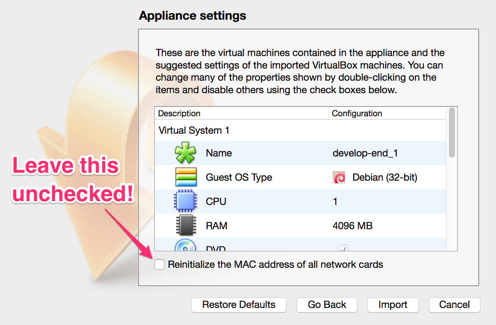
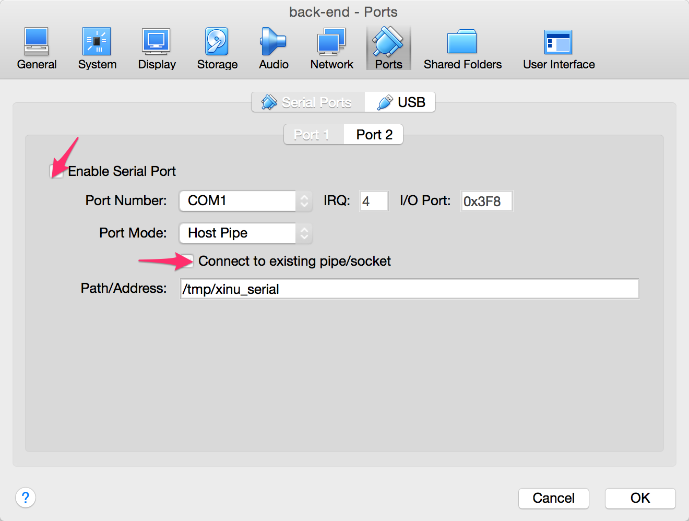
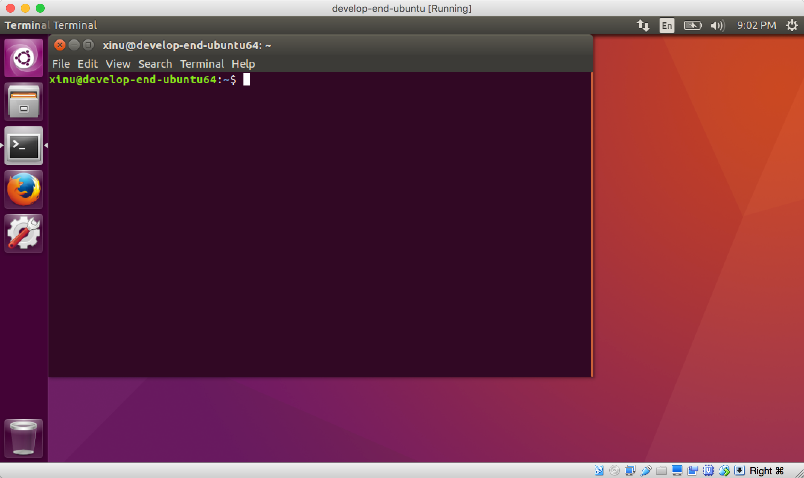
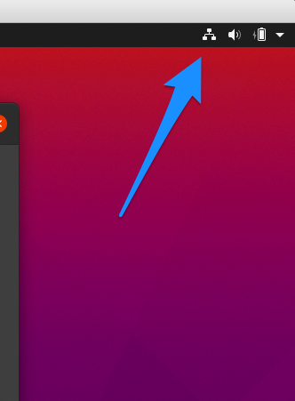
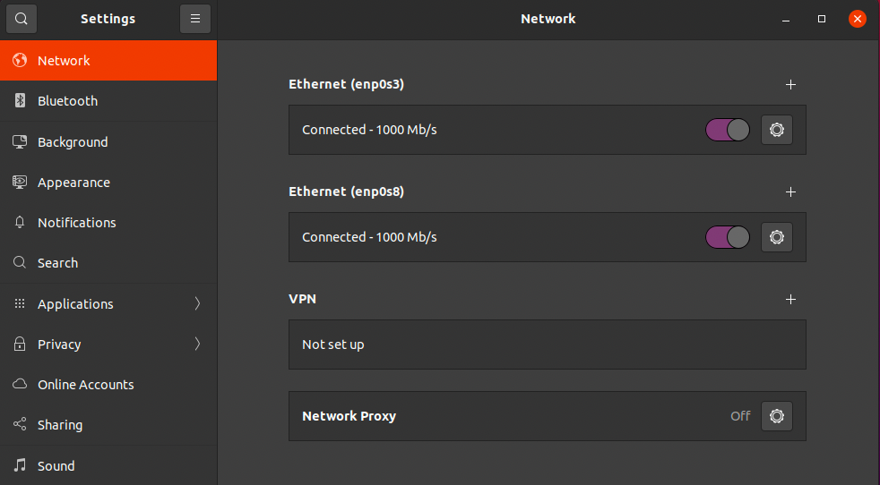

## CS 475 - Operating Systems

### Hwk: Using the Virtual Machine

In this ungraded "preliminary assignment," we will set up your virtual machine. C is highly dependent on the compute environment on which it compiles and executes. This is everybody's worst nightmare: turning in an assignment you spent hours on, only to have it not compile or execute on your instructor's machine. In fact, having a common runtime environment was what made Java so successful when it was introduced in the mid-90s.

It's therefore important that we all share a common environment, so I've prepared a virtual machine (think: another operating system that runs as a separate process on your machine). Important: all programming assignments should be written and submitted from this virtual machine (VM).

<!-- #### Student Outcomes? -->

#### Instructions

- Download and install [Oracle VirtualBox](https://www.virtualbox.org/). Note: the current version at the time of writing is version 6.1.

- Download the following VirtualBox image. It is a LARGE file, so be patient while it downloads!

  - [Ubuntu_20.04.3_VB_LinuxVMImages.COM.ova](https://mathcs.pugetsound.edu/~dchiu/CS475/Ubuntu_20.04.3_VB_LinuxVMImages.COM.ova)

- Open up VirtualBox. Then click on the File > Import Appliance menu. Browse and find the **Ubuntu_20.04.3_VB_LinuxVMImages.COM.ova** file you just downloaded. Then click Continue. Don't change anything on the window that pops up, and click "Import."

  - Some students reported seeing an error, like `NS_ERROR_INVALID_ARG` or `E_INVALID_ARG` when trying to import. As far as I can gather, these error concern insufficient disk space. Are there some large files you can remove to free up a few GBs on your machine? Do so now if you see this error.
  - Even if your disk _does_ show that you have enough space, it might be that the disk partition that's storing most of your files is full. Therefore, you should still free up as much space as possible, and retry.

<!-- - This brings up the Appliance Settings window. **Important:** Do not click to enable "Reinitialize the MAC address of all network cards." Click Import. This will take a little bit of time to finish.
   -->

- Highlight `Ubuntu_20.04.3_VB_LinuxVMImages.COM` from the side menu, and click on `Settings`. From the Settings menu, navigate to `Ports`. Make sure that `Enable Serial Port` and is checked. **IMPORTANT:** Do _not_ check `Connect to Existing Pipe/Socket`. Under Path/address:

  - If you're on a Linux or Mac: type in `/tmp/xinu_serial`
  - If you're on Windows: type in `\\.\pipe\xinu_com1`
    <!--  -->

  Click OK to exit Settings.

- Double-click on **Ubuntu_20.04.3_VB_LinuxVMImages.COM**. This will start a virtual machine (VM) running Ubuntu Linux. Think of a VM as being a program on your machine that can run a separate isolated instance of another operating system! This VM serves several important purposes for this class and for your education:. You will program all your assignments and projects within this VM.

- **Important for Windows Users:** There is a known issue on some Windows machines that does not allow the VM to boot up or import properly. The error you receive from VirtualBox reads, "VT-X is not enabled in BIOS" or something to the effect of "virtualization is disabled". If you are experiencing this, then you need to enable virtualization in your BIOS, which is possible upon a reboot of your computer. I can help you with this, or you can Google how.

- **Important for Mac Users:** Some people have reported sluggishness of the virtual machine, to a point where the delay and lack of responsiveness makes it nearly unusable. Go to the Apple App Store and download **ResolutionTab**. Once installed, it puts a new icon on your top menu. Take note of your current resolution. If you're on a newer Mac, it should be HiDPI (for instance, mine is 1650x1050 HiDIP). Hover over the drop-down menu and choose the same resolution that is **NOT** HiDPI. I used something like 1650 x 1050, and it worked great. I think the important thing is to disable HiDPI when you're using VirtualBox -- the responsiveness should improve immediately.

  - When you're ready to go back to using your Mac, change it back to HiDPI for cleaner screen resolution.

- Once the Ubuntu starts up, you can login with the following credentials:

  - Username: `ubuntu`
  - Password: `ubuntu`
  - Note: This user has sudo (or administrator) access.

  After you log in, make sure you have network access to the outside world. You can open the Firefox browser from the sidebar menu. If you don't have access, let me know.
  

- You can test out a couple nice features. They've been finicky for me in the past though, but are huge time-savers if you get them to work.

  - Shared clipboard: Click on the Devices menu and select Shared Clipboard. Then select bi-directional. Test this out. It will save you hours of time in this course. Copy some text from your host machine, then try pasting it into this VM, and then vice-versa.
  <!-- - Drag and Drop: Click on the Devices menu and select Drag and Drop. Then select bi-directional. This has been finicky for me in the past, but mostly works. Pick a file from your host machine and drag it anywhere on your VM. The file ends up in a folder inside `/tmp/VirtualBox Dropped Files` directory. -->

- Internet access is important. Open Firefox to check if you're connected. If it doesn't connect, you may need to disable and reenable your networks.

  - Go to the top right corner, then click `Settings` to access your network settings.
    
  - That should bring up your network configuration. You should see two network interfaces: `enp0s3` and `enp0s8`.
    

    - Switch them both off.
    - **Important**: Then enable the `enp0s8` first (the bottom one). Give it a few seconds, and try accessing a webpage using Firefox again. It should come up now.
    - Now enable `enp0s3` (the top one). Verify that Firefox is still working.

  - You may have to do this every time Ubuntu starts up, so some people just leave it running in the background.

- Next, there's been reported issues with keys "sticking" when you're typing, which is super irritating when you're programming. Let's either turn off the "Repeat Keys" setting, at least slow it down some.

  - Go into `Settings` again.
  - Scroll down until you see `Universal Access`.
  - Click on `Repeat Keys` and either turn it off, or slow down the speed. (It's sort of a trial and error on everyone's machines to get it just right.)

- While you're still in settings, you might try going into `Mouse and Touchpad`. Some people have suggested that the touchpad scrolling is "backwards." Turn off `Natural Scrolling` if this is the case for you.

- Open up the Terminal. The terminal gives you a shell (most likely the Bourne Again Shell, or bash), which is a command-line environment to interact directly with the operating system (Ubuntu Linux, in our case). Recall the following useful shell commands (Note: in the following listing, parameters enclosed in diamond brackets `<...>` are required and those enclosed in square brackets `[...]` are optional).

  - `pwd`: returns your current (or present) working directory
  - `cd [path]`: changes your current working directory to path. If path is not given, then it (usually) defaults to your home directory. Note the following two special paths:
    - `.` returns the current directory
    - `..` returns the parent directory
    - Paths can be chained. For instance, cd `../../a/` will navigate you up two parent directories, then into `a/`
  - `ls -l [path]`: lists files and directories in the optional given path. If path is not given, then it defaults to your current working directory
  - `mkdir <name>`: creates directory called name in current working directory
  - `code [name]`: opens the VS Code editor on the given file name

- Here's a [command-line cheat sheet](https://commons.wikimedia.org/wiki/File:Unix_command_cheatsheet.pdf) you can download.

- Here's a [bootcamp](https://davidtchiu.github.io/teaching/cs240/lab.cmd/) from my other course you can try out.

#### Credits

Written by David Chiu. 2015.
