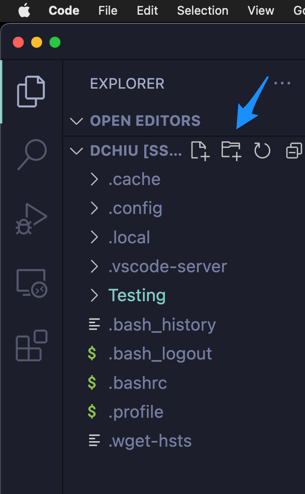

## CS 475 - Operating Systems

### Hwk: Remote Development

In this ungraded "preliminary assignment," we will set you up to develop on a remote server. Here's why we must do this, instead of developing on your own machines. C is highly dependent on the  environment on which it compiles and executes. This is everybody's worst nightmare: turning in an assignment you spent hours on, only to have it not compile or execute on your instructor's machine. In fact, having a common runtime environment was what made Java (and the Java Virtual Machine, JVM) so successful when it was introduced in the mid-90s.

It's therefore important that we all code a common environment, so I've prepared a remote server for everyone to log into.

#### Student Outcomes
- Setting up VS code for remote development on a Linux server
- Learning the basics on how to navigate Linux using the command line
- Compiling and running your first C program

#### Installing Development Tools

- Download and install [VS Code](https://code.visualstudio.com/) if you don't already have it installed on your computers. This is what we'll be using for writing all our assignments for this class.

- Open VS Code and click on the **"Extensions"** tab on the left hand side. You'll want to search for and install the following packages:
  - **C/C++** by Microsoft
  - **C/C++ Themes** by Microsoft
  - **Remote Development** by Microsoft

- You may have to restart VS Code after installing each of those extensions. Go ahead and do so.

#### Getting Connected to the Remote Server

- I've set up a Linux server for you to connect to and develop on. Make a note of the following information:
  ```
  Server IP Address: 149.165.174.87
  Your Username: yourPugetSoundUsername
  Your Password: yourPugetSoundID
  ```
  The IP address and your username will not change during this class, but  you *can* change your password later. 

- Back in VS Code, check out the menu up on top, and click on `View -> Command Palette`. Then type: `Remote-SSH: Connect to Host`. It should autocomplete after typing the first few letters. Choose to run this command. In the box that pop up, enter:
  ```
  yourPugetSoundUsername@IPAddress
  ```
  For example, mine would look something like:
  ```
  dchiu@149.165.174.87
  ```
  You'll next be prompted for your password.

  - Next, VS Code may ask you what platform the remote server is using. Select `Linux` in the option menu. Then it's going to take a bit of time to install the necessary files to get you set up.

  - Once everything is set up, you should see an empty VS Code editor. On the left-side panel, click on the button called `Open Folder`. Choose `/home/yourUsername` (which should be the default option). Important: This "path" `/home/yourUsername` is known as your **home directory** on the server. Only you (and I) have access to it. Think of it as your private, personal folder on the server. This is where all your code will go.
  
  -  You may be prompted for your password again, followed by a prompt to trust and accept the secure certificate. Click yes on this screen.

  - If you did all the steps correctly, you should see the contents of your home directory on the left-side panel. Here's what mine looks like:
  


  - `pwd`: returns your current (or present) working directory
  - `cd [path]`: changes your current working directory to path. If path is not given, then it (usually) defaults to your home directory. Note the following two special paths:
    - `.` returns the current directory
    - `..` returns the parent directory
    - Paths can be chained. For instance, cd `../../a/` will navigate you up two parent directories, then into `a/`
  - `ls -l [path]`: lists files and directories in the optional given path. If path is not given, then it defaults to your current working directory
  - `mkdir <name>`: creates directory called name in current working directory
  - `code [name]`: opens the VS Code editor on the given file name

- Here's a [command-line cheat sheet](https://commons.wikimedia.org/wiki/File:Unix_command_cheatsheet.pdf) you can download.

- Here's a [bootcamp](https://davidtchiu.github.io/teaching/cs240/lab.cmd/) from my other course you can try out.

#### Credits

Written by David Chiu. 2022.
