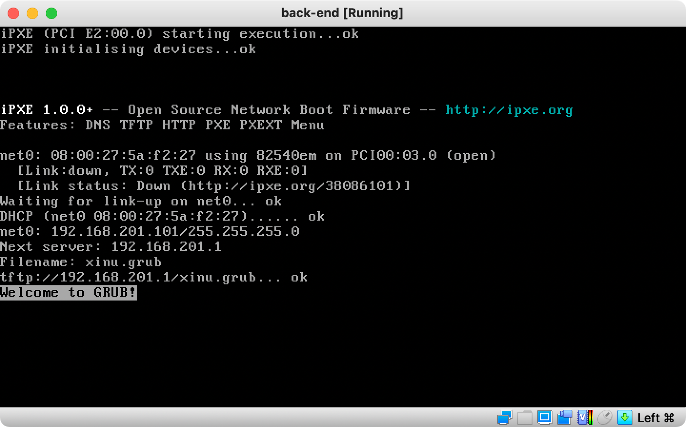
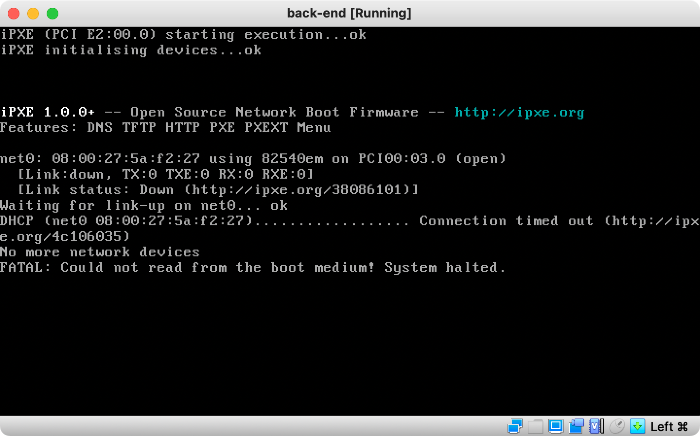
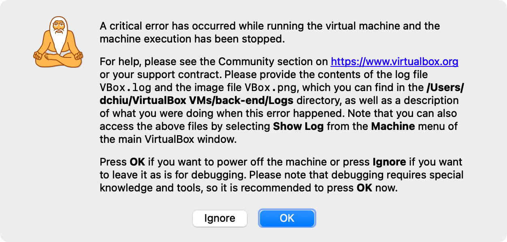

## CS 475 - Operating Systems

### Project 1: Xinu Ready Queue

This project assumes you have a good handle on C (particularly, pointers and dynamic allocation) and basic shell commands. Make sure you have completed the C primer homework assignments before you tackle this project.

Xinu is an operating system developed by [Prof. Douglas Comer](http://www.xinu.cs.purdue.edu/author.html)'s group at Purdue University. Xinu is used in an impressive number of real computer systems (e.g., embedded controllers and an [IBM mainframe computer](https://en.wikipedia.org/wiki/IBM_System_z9), among others). The description of Xinu from its website:

```
"XINU stands for Xinu Is Not Unix -- although it shares concepts and even names with Unix,
the internal design differs completely. Xinu is a small, elegant operating system that
supports dynamic process creation, dynamic memory allocation, network communication, local
and remote file systems, a shell, and device-independent I/O functions. The small size
makes Xinu suitable for embedded environments."
```

In this project, you will be implementing an essential data structure, which pervades most OS kernels including Xinu: a (dynamically allocated) queue of processes, known as the Ready Queue. It stores pointers to process control blocks (called "process entries" in Xinu), providing a set of processes for the CPU scheduler to choose from for execution. This project assumes that you have already completed the earlier C primer-assignments.

You are required to work in pairs.

#### ZyBooks References

- String processing
- Dynamic allocation

#### Student Outcomes

- To become familiar with the Xinu development and runtime environment
- To become familiar with the Xinu kernel codebase
- To provide more experience with pointers and dynamically-allocated structures

#### Pair Assignments

You will be working with the following students. Just one submission per group is sufficient.

```
[R Weaver, L Aron]
[K Schuh, J Ota, A Tinkham]
[M Sanchez-Forman, B McAuliffe]
[R Mathur, R Pietenpol]
[A Vermeulen, E Shimanski]
[B Williams, C Hong]
[B Gamble, T Gaeta]
[F Godfrey-Link, J Kaeppel]
[E Markewitz, S Park]
[C Brace, L Leary]
```

#### Starter Code

Starter code for this assignment is provided on the github repo. You are not required to submit your code to me on Github, but it's strongly recommended that you do.

- If you want to submit your code on Github, do this step. If not, you may skip this step. Make sure you already have a Github account. Login to github, and go here: [https://github.com/davidtchiu/cs475-proj1](https://github.com/davidtchiu/cs475-proj1). Choose to _*fork*_ this repository over to your github account to obtain your own copy. Copy the Github URL to _your_ newly forked project. Then follow the rest of the instructions below. From your Ubuntu virtual machine, open a terminal, and _*clone*_ your forked Github repo down to your local working directory using:

  ```
  git clone <your-github-url-for-this-project>
  ```

- If you aren't planning to submit your assignment via a Github link, then you can simply download the starter files onto your Ubuntu virtual machine using:

  ```
  git clone https://github.com/davidtchiu/cs475-proj1
  ```

#### Part 1: Setting up Xinu

In this section, we'll get Xinu up and running on a virtual machine.

1.  Download the following VirtualBox image, that have been prepared to get Xinu up and running:

    - [xinu-back-end.ova](xinu-back-end.ova) (10.8 KB)

2.  Open up VirtualBox. Then click on the File > Import Appliance... menu. Browse and find the xinu-back-end.ova file you just downloaded, then click Continue.

3.  Import `xinu-back-end.ova`. **Do not** click to enable "Reinitialize the MAC address of all network cards." Afterwards, you should see the new virtual machine image on the left-hand panel of the VM Manager window.

4.  Highlight `xinu-back-end` in the left-hand menu, and click on Settings. From the Settings menu, navigate to `Ports`. Make sure that `Enable Serial Port` and `Connect to Existing Pipe/Socket` are **both checked**. Under Path/address:

    - If you're on a Linux or Mac: type in `/tmp/xinu_serial`
    - If you're on Windows: type in `\\.\pipe\xinu_com1`

    Click OK to exit Settings.

5.  Go back in the Ubuntu VM in which you've been doing all your homework. Download the starter code for this project, and navigate into the `proj1` directory. You'll see the following subdirectories:

    - `compile/` - contains the Makefile and scripts to upload the kernel to the back-end.
    - `config/` - contains device configurations (do not touch files in this directory).
    - `device/` - contains device files (do not touch files in this directory).
    - `include/` - contains header files, which define constants and function prototypes.
    - `lib/` - contains a small library of standard C functions. The UNIX system libraries are not available.
    - `system/` - contains the source code for the Xinu kernel.

Most of your time in development will be spent in the `include/` and `system/` directories.

#### Part 2: Compiling and Running Xinu

You will be coding and compiling Xinu on the Ubuntu machine as you did for your homework.

1. First, let's make sure our Ubuntu machine is configured to serve up the Xinu OS file. Open a Terminal, and run:

   ```
   sudo service isc-dhcp-server stop
   sudo service isc-dhcp-server start
   ```

2. Navigate into the `compile/` directory. You can type make to compile the kernel, but you'll soon be inundated with compile errors. This is because there are several important functions that you need to implement for this project. Let's clean up the mess by running `make clean`.

3. Normally, if the compilation was successful, it will create a binary file called `xinu` in the `compile` directory. Now you need to run `./upload.sh` to prepare it for upload onto the back-end VM. Don't worry about this step just yet, because things aren't going to compile.

4. However, I've provided you with a precompiled solution called `xinuSol`, so let's run that for now so you can see what to expect for this assignment. Run `./uploadSol.sh` to upload my precompiled kernel to the back-end VM.

5. Now in the Terminal, create a new "tab." Then in the new tab, type `sudo minicom`. You'll be prompted for the password. This turns the Terminal window into a serial console that is connected to the back-end VM, effectively emulating a terminal for the back-end VM. Speaking of the back-end...

6. At this point, start the `xinu-back-end` virtual machine from VirtualBox. It should take a few seconds for it to automatically retrieve the kernel binary you just "uploaded" from Ubuntu VM and boot it. Because `minicom` turned the Terminal into the screen that's "attached" to the `xinu-back-end` VM, you can see Xinu boot up and run right on the Terminal.

   - As the `xinu-back-end` boots up in virtual box, there are 3 things that could happen (hopefully it always succeeds):

     - A **successful boot** of Xinu should show this screen in Virtual Box:

       

       If you see this, then head back over to your Ubuntu machine and check out the the `minicom`. You should see some output from Xinu!

     - A **failed boot** could be because you don't have the DHCP server running on the Ubuntu machine. This happens when your network is working, but Ubuntu is not configured to serve up the xinu OS.

       

       If you see this, then head back over to your Ubuntu machine and open a Terminal. Run:

       ```
       sudo service isc-dhcp-server stop
       sudo service isc-dhcp-server start
       ```

     - Another time **failed boot** happens has something to do with your networking setup. When you see the following:

       

       All I can say is, head back to your Ubuntu and turn off both network interfaces `enp0s3` (Xinu) and `enp0s8` (Your Wifi). Turn just `enp0s3` back on and try booting Xinu again. You may need to toggle it a few times before it finally works. (It took me a couple of times.) Once Xinu finally boots, then try re-enabling `enp0s8` so you can have wifi again. When in doubt, leave wifi off until you need it to submit.

     - Finally, you might also see this:

       

       This is actually "good" news, because it means your Xinu booted. However, the code you wrote crashed! This is usually caused by a segmentation fault because you're deferencing a bad pointer.

   - Once you manage to get Xinu booted, you should get this output in the `minicom`:

   ```
   Hello XINU WORLD!
   This is process 2
   This is process 2
   This is process 2
   This is process 2
   This is process 2
   This is process 2
   This is process 2
   This is process 2
   This is process 2
   This is process 2
   Hello XINU WORLD!
   This is process 3
   This is process 3
   This is process 3
   This is process 3
   This is process 3
   This is process 3
   This is process 3
   This is process 3
   This is process 3
   This is process 3
   Hello XINU WORLD!
   This is process 4
   This is process 4
   This is process 4
   This is process 4
   This is process 4
   This is process 4
   This is process 4
   This is process 4
   This is process 4
   This is process 4
   Hello XINU WORLD!
   This is process 5
   This is process 5
   This is process 5
   This is process 5
   This is process 5
   This is process 5
   This is process 5
   This is process 5
   This is process 5
   This is process 5
   1
   2
   3

   Hello XINU WORLD!
   This is process 6
   This is process 6
   This is process 6
   This is process 6
   This is process 6
   This is process 6
   This is process 6
   This is process 6
   This is process 6
   This is process 6
   10
   20
   30
   40
   50
   60

   All user processes have completed.
   ```

   Afterwards, Xinu is still running over on the back-end VM, but it's in an infinite loop called the `null-process`, and not accepting any other commands (there's no shell). We'll see what this output means later.

<!-- 7. To exit `minicom`, press and hold `ctrl` then hit `a` followed by pressing `q`. This brings the Terminal back. -->

7. Shutdown the back-end VM from VirtualBox to terminate Xinu.

8. From here on out, remember this workflow as you proceed with development:

   - Write your code on Ubuntu VM
   - Navigate into the `compile/` subdirectory
   - Type: `make clean`
   - Type: `make` to compile the Xinu kernel
   - Type: `./upload.sh` to upload the kernel
   - Create a new tab in the Terminal, then type: `sudo minicom` to turn your terminal to a screen for Xinu
   - Start up the `xinu-back-end` VM (and troubleshoot if necessary if it doesn't start)

#### Part 3: Quick Tour of Xinu Structures and Types

You need to spend some time exploring Xinu's codebase, specifically, the files in `include/` and `system/`. I don't expect you to understand everything, but it would be to your benefit to obtain even a high-level understanding of the kernel's structures. I will point out a few important items to spend some time on:

##### Types and Constants

- `include/xinu.h`: unifies the inclusion of all necessary header files. This makes it convenient for when we're developing; we only have to place a single line `#include <xinu.h>` at the top of our files to gain access to all constants and functions.

- `include/prototypes.h`: most system-call signatures are declared here, but implemented elsewhere in `.c` files.

- `include/kernel.h`: contains definition of some important constants, typedefs, and function prototypes.

  - Types: data types in Xinu are renamed to be more convenient and specific. Notably, you'll see these often:

    | Type Name in Xinu | Really just a...                                                            |
    | ----------------- | --------------------------------------------------------------------------- |
    | `byte`            | 8-bit `char`                                                                |
    | `bool8`           | `byte`                                                                      |
    | `int32`           | 32-bit `int`                                                                |
    | `uint32`          | 32-bit `unsigned int`                                                       |
    | `pid32`           | `int32` (a process ID)                                                      |
    | `sid32`           | `int32` (a semaphore ID)                                                    |
    | `status`          | `int32` (return status of system call: `OK`, `SYSERR`, `TIMEOUT` see below) |

  - Constants: the list of typedefs are followed by constants. You should commit these to memory, but here are some important ones.

    | Name of Constant | Value (Description)                                      |
    | ---------------- | -------------------------------------------------------- |
    | `NULL`           | 0 (this is the NULL you worked with for pointers)        |
    | `OK`             | 1 (used as normal return-status for a system call)       |
    | `SYSERR`         | -1 (used as error return-status for a system call)       |
    | `EOF`            | -2 (end of file)                                         |
    | `TIMEOUT`        | -3 (used as the timeout return-status for a system call) |

##### For Debugging

- `system/kprintf.c`: defines `kprintf()`, which is a system call you can use to ask the the kernel to print something to the console. Used just like regular `printf()`.

##### Process Structures

Xinu processes have a unique identifier of type `pid32`, and are defined by a process control block (PCB) structure, called `struct procent` (process entry).

- `include/process.h`: defines constants (such as process states) and structures (like the PCB) relating to the process. Read through this file and be able to answer the questions below. **Know this:** Toward the end of the file, there are three important global variables (accessible from anywhere) that pertain to processes in Xinu.

  | `pid32 currpid` | The PID of the currently-running process.|
  | `int32 prcount` | The number of processes in the system.|
  | `struct procent proctab[]` | The process table. An array of PCBs, indexed by PID.|

- `system/create.c`: defines the system call to create a new process.

- `system/kill.c`: defines the system call to kill a process.

- `system/ready.c`: defines the system call to put process on the ready queue.

- `system/resched.c`: pulls the next process off of the ready queue, and schedules it for CPU execution.

- `system/suspend.c` and `system/resume.c`: defines the system call to suspend and resume a process.

- `system/yield.c`: defines the system call to cause the currently running process to voluntarily yield the CPU to next process on the ready queue.

##### Answer these questions (not graded):

- What is the maximum number of processes accepted by Xinu? Where is it defined?

- What does Xinu define as a "illegal PID"? Find and check out the `isbadpid()` inline function. (Aside: What's an inline function in C?)

- Name all the states in which a Xinu process can be.

- What is the default stack size Xinu assigns each process? Where is it defined? (Recall from the previous assignment that this is called `RLIMIT_STACK` in Linux)

#### Part 4: How Does Xinu Run (and What Is the Null Process)?

When Xinu boots up, the `nulluser()` system call is invoked by the bootstrap, which in turn invokes `sysinit()`. To see what they do, open up this file: `system/initialize.c`

- Inside this file, scroll down to take a look at the `sysinit()` function.

- This function starts out with some code to initialize interrupt vectors and a free-list for memory allocation. About half-way down, it initializes the PCB table:

  ```c
  static  void    sysinit(void)
  {
      //(code omitted)

      /* Initialize process table entries free */
      for (i = 0; i < NPROC; i++) {
          prptr = &proctab[i];
          prptr->prstate = PR_FREE;
          prptr->prname[0] = NULLCH;
          prptr->prstkbase = NULL;
      }

      //(code omitted)
  }
  ```

- On Lines 6-11: all entries in the PCB table are initialized. Initially, every slot is free (i.e., in the `PR_FREE` state), the name of each process, `prname` is an empty string, and the stack base pointer `prstkbase` refers to `NULL`.

- The loop implies that there can only be `NPROC` processes existing in the table, and that the array index from 0 to `NPROC-1` serves as the process ID.

Now find the `nulluser()` function, which is the first process (known as Xinu's **null process**) that Xinu runs after it boots.

- The first thing it does is invoke `sysinit()`, which sets up important data structures (see above).

- The code will then print out address-space information (sizes of text, data, heap segments) and enable interrupts.

- Just after the interrupts are enabled, we see the creation of a process named `MAIN1`, running a function called `main()` with various arguments.

  ```c
  void    nulluser(void)
  {
      sysinit();

      //(code omitted)

      //spawn a process running main() from main.c
      ready(create((void*) main, INITSTK, "MAIN1", 2, 0, NULL), FALSE);

      //schedule the above process
      while (TRUE)
      {
          if (nonempty(readyqueue))
          {
              //everytime resched() is called, it pulls the next process off the ready queue
              resched();
          }
      }
  }
  ```

- On **Line 8**: A call to `create()` will create a process in Xinu. Remember from your exploration earlier that this function takes as argument:

  1. A function pointer to the code that the process will run (`main()`)
  2. The stack size in words (`INITSTK`)
  3. A name for the process (`MAIN1`)
  4. The number of arguments given to the function referred to (2 here because `main()` takes two arguments)
  5. List of arguments given to the function referred (0 followed by `NULL`)

  The `create()` function returns the PID that was assigned to this new process, which is in turn input into `ready()`.

  The `ready()` function inputs two arguments. The first is the PID. It will place the given PID on the ready queue. The second argument, `FALSE`, tells Xinu that it should not run the scheduler to schedule another process for execution after this process was introduced to the ready queue.

- On **Line 11-18**: This infinite loop examines the ready queue, and schedules the next process as long as it is non-empty. Notice how, when there are no processes to execute, this portion of the code essentially turns into an infinite no-op loop, waiting for the next process to enter the ready queue.

This gives us a clue as to what this **null process** actually is: when there's no other processes for the CPU to execute, _something_ has to run, to keep the kernel active. (Remember how I said I class that an OS is essentially just sitting around waiting for events to occur?)

#### Part 5: The main() Function

Okay, so the `nulluser()` function created five processes, all executing a function called `main()` with various arguments.

- Let's take a look at this function, which is defined in `system/main.c`:

  ```c
  #include <xinu.h>
  #include <stdio.h>

  void printpid()
  {
    int i;
    kprintf("Hello XINU WORLD!\r\n");

    for (i=0; i<10; i++)
    {
          kprintf("This is process %d\r\n", currpid);

          //uncomment the line below to see cooperative scheduling
          //resched();
    }

  }

  void printargs(uint32 argc, uint32 *argv)
  {
    printpid();

      int i;
      if (argc > 0)
      {
          for (i=0; i<argc; i++)
              kprintf("%d\n", argv[i]);
          kprintf("\r\n");
      }

  }

  int main(uint32 argc, uint32 *argv)
  {
      static uint32 main2args[] = {1, 2, 3};
      static uint32 main3args[] = {10, 20, 30, 40, 50, 60};

      // Create 5 processes
      ready(create((void*) printpid, INITSTK, "MAIN1", 2, 0, NULL), FALSE);
      ready(create((void*) printpid, INITSTK, "MAIN2", 2, 0, NULL), FALSE);
      ready(create((void*) printpid, INITSTK, "MAIN3", 2, 0, NULL), FALSE);
      ready(create((void*) printargs, INITSTK, "MAIN4", 2, 3, main2args), FALSE);
      ready(create((void*) printargs, INITSTK, "MAIN5", 2, 6, main3args), FALSE);

      return 0;
  }
  ```

- On **Lines 4-16**: the function `printpid()` is defined. It loops and prints out the PID ten times. Remember that currpid is a global variable that always holds the currently running PID.

- On **Lines 18-29**: the function `printargs()` is defined. It takes two arguments as input. They will be passed in from `main()`. This function loops through each argument and prints them out to the console.

- On **Line 31**: Notice that `main()` takes as input two arguments:

  - `uint32 argc`: the number of arguments in argv
  - `uint32 *argv`: a pointer to the input arguments
  - These were passed in from `nulluser()` as 0 and `NULL`, respectively.

- On **Lines 33-34**: arguments are defined for the processes created to execute the `printArgs()` function on Line 40 and 41, respectively.

- On **Lines 37-39**: Creates three processes, each of which will run `printpid()`, and places them on the ready queue.

- On **Line 40**: A fourth process is created to run `main()`, but this time, we want to input an array of three integers as arguments to `main()`. We're passing two arguments to `printargs()`, but this time, 3 and an array of three ints main2args.

- On **Line 41**: A fifth process is created to run `main()`, but we're passing this time, 6 and an array of six ints main3args.

- When run, the null process first gains control, and runs `main()` as a process. Then `main()` creates and puts five processes on the ready queue. Because the ready queue is not a priority queue (yet), we'd expect the processes to be run in FIFO scheduling order:

  ```
  Hello XINU WORLD!
  This is process 2
  This is process 2
  This is process 2
  This is process 2
  This is process 2
  This is process 2
  This is process 2
  This is process 2
  This is process 2
  This is process 2
  Hello XINU WORLD!
  This is process 3
  This is process 3
  This is process 3
  This is process 3
  This is process 3
  This is process 3
  This is process 3
  This is process 3
  This is process 3
  This is process 3
  Hello XINU WORLD!
  This is process 4
  This is process 4
  This is process 4
  This is process 4
  This is process 4
  This is process 4
  This is process 4
  This is process 4
  This is process 4
  This is process 4
  Hello XINU WORLD!
  This is process 5
  This is process 5
  This is process 5
  This is process 5
  This is process 5
  This is process 5
  This is process 5
  This is process 5
  This is process 5
  This is process 5
  1
  2
  3

  Hello XINU WORLD!
  This is process 6
  This is process 6
  This is process 6
  This is process 6
  This is process 6
  This is process 6
  This is process 6
  This is process 6
  This is process 6
  This is process 6
  10
  20
  30
  40
  50
  60


  All user processes have completed.
  ```

- If we uncomment **Line 14** so that `resched()` is called in `printpid()`, then a process yields itself and calls the scheduler to run the next process on the ready queue for cooperative scheduling. Check out the difference in the output below.

  ```
  Hello XINU WORLD!
  This is process 2
  Hello XINU WORLD!
  This is process 3
  Hello XINU WORLD!
  This is process 4
  Hello XINU WORLD!
  This is process 5
  Hello XINU WORLD!
  This is process 6
  This is process 2
  This is process 3
  This is process 4
  This is process 5
  This is process 6
  This is process 2
  This is process 3
  This is process 4
  This is process 5
  This is process 6
  This is process 2
  This is process 3
  This is process 4
  This is process 5
  This is process 6
  This is process 2
  This is process 3
  This is process 4
  This is process 5
  This is process 6
  This is process 2
  This is process 3
  This is process 4
  This is process 5
  This is process 6
  This is process 2
  This is process 3
  This is process 4
  This is process 5
  This is process 6
  This is process 2
  This is process 3
  This is process 4
  This is process 5
  This is process 6
  This is process 2
  This is process 3
  This is process 4
  This is process 5
  This is process 6
  This is process 2
  This is process 3
  This is process 4
  This is process 5
  This is process 6
  1
  2
  3

  10
  20
  30
  40
  50
  60


  All user processes have completed.
  ```

#### Part 6: Queues in Xinu (Graded)

Queues are essential data structures for operating systems, and Xinu is no exception. The ready queue is used to order processes for CPU scheduling, the sleep queue holds a number of processes that are sleeping and waiting on the timer, other wait queues hold processes that are waiting for I/O to return, and each semaphore has a queue of processes waiting on it. The codebase you have did not come with queues. Your objective is to implement it in Xinu.

You need to make changes to the following files. I marked everywhere that you need to make changes with //TODO comments. Open the following files, find those comments, and add your code.

1. In `include/queue.h`:

- Find `struct queue` and finish declaring its data members. Examples might be a pointer to the `head`, pointer to `tail`, and the queue's `size`.

- Find `struct qentry` and finish declaring its data members also. Each entry must hold a `pid` of the process (recall that pids are of type `pid32`), and pointers to the _previous_ and _next_ queue entries.
  

2. In the following `.c` files, I've provided you with the stubs and all you need to do is complete the implementation guided by the `//TODO` comments. The queue must be dynamically allocated (malloc'd and freed) on the heap. Make the changes in the following files:

   - `system/queue.c` - this file contains queue access and manipulation functions.
   - `system/newqueue.c` - this file contains the `newqueue()` function, which is used to create and initialize a new queue structure.

   Xinu's supported C libraries differ ever so slightly from the standard C libraries that you used for your homeworks. The dynamic allocation functions are as follows:

   - `void* malloc(uint32 nbytes)` -- this is just like what you've used before. Inputs the number of bytes to allocate on the heap, and returns a pointer to the first byte.

   - `void free(void *memblk, uint32 nbytes)` -- this is a tiny bit different from the `free()` you're used to seeing, in that you must supply it with the number of bytes you'd like to free up.

   It goes without saying that your queue must be free of memory leaks.

3. After you've completed the implementation of the queue structure, we need to add some code to get it working with the Xinu kernel's CPU scheduler. Again, open up and find the `//TODO` comments in the following files:

   - `system/ready.c` - this file contains the `ready()` function, which is used to put an already-created process on the ready queue.
   - `system/resched.c` - this file contains the `resched()` method, which schedules the next process on the ready queue for execution, while placing the process currently running at the tail of the ready queue.

4. Remember that you can use `kprintf()` to print messages to the console (useful when debugging).

5. On success, your output should match those shown to you earlier in my precompiled solution. If you uncomment `resched()` in `main.c`, you should get the cooperative version of the output, also shown earlier.

6. Please provide a README file in the proj1/ directory that contains your names.

#### Grading

```
This assignment will be graded out of 75 points:

[5pt] isfull(), isempty(), nonempty() are properly implemented.

[5pt] printqueue() is properly implemented. The output format
      should be [(pid=<p1>), (pid=<p2>), ...], where <pi> refers
      to a process id.

[25pt] newqueue(), enqueue(), dequeue(), getbypid(), and remove()
      are all properly implemented and are free from memory leaks

[35pt] interaction with the ready queue have been properly
       implemented for resched() and ready()

[5pt] The README has your name(s) on it.
      Your program observes good style and commenting.
```

#### Submitting Your Assignment

After you have completed the assignment, use the following to submit your work on Canvas. I assume you wrote your program inside your virtual machine. There are two options to submit your work.

1. If you pushed all your code to a Github repository: Make sure your Github repo is public, and simply submit the URL to your repo to me on Canvas.

2. If you'd rather submit a "zipped" file on Canvas, do the following .

   - Open the Terminal, navigate into your project's `compile/` directory. Run `make clean` to remove the binaries.

   - Zip up your project directory: `tar -czvf proj1_name1_name2.tar.gz proj1/` where name1 and name2 refer to your last names.

3. Go into canvas and click on `Submit Assignment`, and you should be able to "browse" for your file.

4. When you've selected the proper file, click Submit Assignment again to upload it.

5. You may submit as often as you'd like before the deadline. I will grade the most recent copy.

6. I do not need separate submissions from your partner!

#### Credits

Written by David Chiu. 2022.
