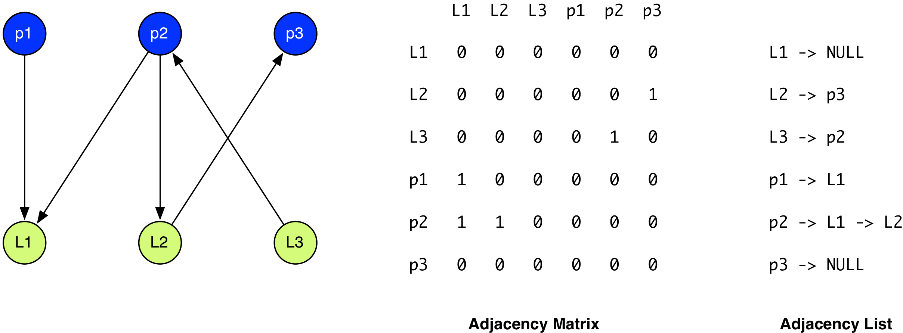

## CS 475 - Operating Systems

### Project 4: Deadlock Detection

At this point, your version of Xinu should be a preemptive, time sharing, environment. To coordinate access to shared resources between multiple processes, we implemented a simple spinlock. As you learned in class, however, using synchronization mechanisms can lead into deadlocks, in which a set of processes is waiting on each other in a cyclical manner, resulting in starvation for all involved processes.

You probably didn't see a deadlock in your Dining Philosophers implementation because it's a very specific situation to observe: it is possible for deadlock to occur when every philosopher reaches for their left (or right) forks. Well, to prevent that from happening in the previous project, I did something sneaky in my instructions: I called for the philosophers to release one of their forks if the other fork cannot be acquired. Go back to the 4 deadlock conditions that we went over in class, and figure out which of these conditions is not met by dropping the forks.

Even with prevention in place, there was a still a small chance that a deadlock could have occurred in your Dining Philosopher's solution. Ask yourselves what would happen if a process locks the left-fork, then proceeds to check whether the right-fork is taken. Seeing that it's not taken, the philosopher reaches for the fork. However, at this moment, a context switch to the adjacent Philosopher occurs, who grabs the fork. Now this exact situation happens for all remaining Philosophers, resulting in a deadlock. The probability of this situation occurring is vastly limited with five philosophers (you might see it with only two), and I surmise that you probably never saw it happen.

In this final project, you will implement a deadlock detection and recovery algorithm based on single-instance resource allocation graphs (RAG) in Xinu.

#### Student Outcomes

- To experience applying graph structures and algorithms to a real-world problem
- To extend Xinu with support for deadlock detection and recovery

#### Pair Assignments

You will be working with the following students. Just one submission per group is sufficient.

```
[L Leary, T Gaeta]
[S Park, M Sanchez-Forman]
[K Schuh, E Shimanski]
[J Ota, R Mathur, F Godfrey-Link]
[C Hong, B Williams]
[B Gamble, B McAuliffe]
[R Weaver, E Markewitz]
[A Vermeulen, J Kaeppel]
[C Brace, R Pietenpol]
```

#### Starter Code

Starter code for this assignment is provided on the github repo. You are not required to submit your code to me on Github, but it's strongly recommended that you do.

- If you want to submit your code on Github, do this step. If not, you may skip this step. Make sure you already have a Github account. Login to github, and go here: [https://github.com/davidtchiu/cs475-proj4](https://github.com/davidtchiu/cs475-proj4). Choose to _*fork*_ this repository over to your github account to obtain your own copy. Copy the Github URL to _your_ newly forked project. Then follow the rest of the instructions below. From your Ubuntu virtual machine, open a terminal, and _*clone*_ your forked Github repo down to your local working directory using:

  ```
  git clone <your-github-url-for-this-project>
  ```

- If you aren't planning to submit your assignment via a Github link, then you can simply download the starter files onto your Ubuntu virtual machine using:

  ```
  git clone https://github.com/davidtchiu/cs475-proj4
  ```

#### Solution Executable

I've provided you with **TWO** precompiled solution called `xinuSol` and `xinuPhilSol` in the `compile/` directory. If you're interested to see the proper behavior, navigate to `compile/` and run `./uploadSol.sh` to upload my precompiled kernel to the back-end VM running the 2 deadlocked worker processes. You can run `./uploadPhilSol.sh` to upload my solution for dining philosophers (N=3). Then start up the back-end VM and run `minicom`.

#### Part 1: Deadlock Detection (Off-Xinu)

Usually, we plow right into Xinu development, but this project's a bit more involved. I'd prefer a better environment for debugging, so it is therefore strongly recommended that you build the deadlock detection algorithm off of the Xinu code base. Don't worry, we'll integrate it into Xinu later.

1.  Let's start by defining some constants:

    - `#define NLOCK 10` - the maximum number of locks that your OS can support.
    - `#define NPROC 20` - the maximum number of processes that your OS can have.

2.  Your implementation will be based on cycle detection in a single-instance resource allocation graph (RAG). Recall that a (directed) graph can be represented an adjacency list, or an adjacency matrix. Consider the graph below and its corresponding adjacency matrix and adjacency lists.

    

    There is an important space-time tradeoff between the two representations. If space is a constraint, or if the graph is expected to be sparse (i.e., containing few edges), then an adjacency list is used. Conversely, if you have space or if the graph is expected to be dense, then an adjacency matrix is preferred, because updating it can be done in O(1)-time. A RAG is normally sparse, but an OS always tries to minimize overheads. As a system designer, which representation would you prefer? I'll leave you with that decision. Either way will receive full credit.

3.  Define the following functions.

    - `void rag_request(int pid, int lockid)` - adds a request edge to the RAG from `pid` to `lockid`.

    - `void rag_alloc(int pid, int lockid)` - adds an allocation edge to the RAG from `lockid` to `pid`. Removes the request edge from `pid` to `lockid`.

    - `void rag_dealloc(int pid, int lockid)` - removes the request or allocation edge from `lockid` to `pid`.

    - `void rag_print()` - prints the adjacency matrix or list representing the current RAG.

    - `void deadlock_detect()` - checks the RAG for cycle(s). For each cycle found, print out DEADLOCK followed by the nodes involved in the cycle. If no cycles are found, then the system is deadlock-free. You should produce no output in this case. You may again recall that cycle-detection is an application of depth-first search (DFS).

4.  Now we want to simulate locks being acquired and released by various processes to make sure your implementation is working.

    Your program should input a file containing lock request and deallocation sequences. Each line in this file is a 3-tuple (tab separated) event that has occurred: `pid event lockid`, where: `pid` is the ID of the requesting process, `lockid` is ID of the lock, and `event` can be:

    - `R (request)` The request has been made by process `pid` for the lock identified by `lockid` (add request edge)
    - `A (allocation)` The OS allocates the lock identified by `lockid` to the requesting process (convert request edge to allocation edge)
    - `D (deallocation)` If the process has requested, but not yet been allocated, the given `lockid`, then its request is canceled (remove request edge). If the process has been allocated the lock identified by `lockid`, then the OS deallocates the lock identified by `lockid` (remove allocation edge).

    For instance, the following file sequence:

    ```
    1  R  1
    1  A  1
    0  R  1
    1  D  1
    0  A  1
    0  D  1
    ```

    means:

    ```
    pid=1 requests lockid=1
    pid=1 acquires lockid=1
    pid=0 requests lockid=1
    pid=1 releases lockid=1
    pid=0 acquires lockid=1
    pid=0 releases lockid=1
    ```

    For each line, you will update the (de)allocation request in the RAG. When the end-of-file is reached, call `deadlock_detect()` to check for deadlocks.

#### Example Scenarios:

- Input file: `input_file2`

  ```
  1   R  1
  1   A  1
  0   R  1
  0   R  2
  0   A  2
  1   R  2
  ```

  Output:

  ```
  # ./Deadlock < input_file2
  DEADLOCK        pid=0 lockid=2 pid=1 lockid=1
  ```

- Input file: `input_file3`

  ```
  0   R  1
  0   A  1
  1   R  1
  0   R  2
  0   A  2
  1   R  2
  0   D  2
  1   A  2
  1   D  1
  0   D  1
  ```

  Output:

  ```
  # ./Deadlock < input_file3
  ```

- Input file: `input_file4`

  ```
  0   R  3
  0   A  3
  1   R  2
  1   A  2
  2   R  1
  2   A  1
  3   R  0
  3   A  0
  1   R  3
  2   R  2
  3   R  1
  0   R  1
  ```

  Output:

  ```
  ./Deadlock < input_file4
  DEADLOCK    pid=0 lockid=3 pid=1 lockid=2 pid=2 lockid=1
  ```

Make sure your implementation is working on multiple examples before moving on. Create your own test cases, and draw the single-instance RAGs on a piece of paper to verify!! It is critical that these functions are rigorously tested before Xinu integration.

#### Part 2: Xinu Lock Manager

Before we get started, open `include/xinu.h`, and add `#include `directives for `lock.h` and `deadlock.h`. Next, to make debugging easier (so that your RAG can be printed), let's reduce the number of processes allowed. Change `NPROC` to `20` in both of the following files: `config/Configuration` and `include/process.h`.

In the deadlock detection algorithm you just implemented, there was a finite number of locks (i.e., `NLOCK` was set to 10) and each lock had a corresponding `lockid`. However, in the previous project, you were asked to create a `mutex_t` type, and a programmer can create as many `mutex_t` locks as they like. There's no current way for Xinu to know how many `mutex_t` locks currently exist!

How are you supposed to update the RAG in such an environment, when you don't even know the size of the RAG? In this section, you will build a lock management subsystem, in which you supply users with system calls to create, acquire, release, and destroy locks.

1.  Open up `include/lock.h`:

    ```c
    /* lock.h */
    #define NLOCK   10

    /* Lock state definitions */
    #define LOCK_FREE  0               /* lock table entry is available   */
    #define LOCK_USED  1               /* lock table entry is in use      */

    /* Lock table entry */
    struct  lockentry
    {
        byte    state;          /* whether entry is LOCK_FREE or LOCK_USED    */
        mutex_t lock;           /* lock */
        struct  queue   *wait_queue;    /* queue of waiting processes */
    };

    extern  struct  lockentry locktab[];

    #define isbadlock(m)     ((int32)(m) < 0 || (m) >= NLOCK)
    ```

    - On Line 2: the NLOCK constant is defined, imposing a hard limit of 10 locks to be in existence. Along with NPROC being earlier set to 20, these two constants will help you define the size of the RAG.

    - On Lines 9-14: the `lockentry` structure is defined. It has the following data members:

    - `byte state` is assigned either `LOCK_FREE` or `LOCK_USED`. This is to indicate whether the lock has been created or not. Important: this field not used to indicate whether the lock has been acquired or released (see next member)! Initially, this field should be set to LOCK_FREE
    - `mutex_t lock` is an instance of the mutex lock you created in the previous project, assigned either a `TRUE` or `FALSE` indicating whether the lock has been acquired or not. Initially, this field should be set to `FALSE`.
    - `struct queue *wait_queue` is a pointer to a queue of processes that are waiting on the lock, including the process that currently owns it.

    - On Line 16: we specify that an array of `lockentry`s is defined in an external file. We'll define this array later.

    - On Line 18: this is a so-called inline function. Basically, anywhere that the symbol `isbadlock(m)` appears in your code, the compiler will replace it with the expression `((int32)(m) < 0 || (m) >= NLOCK)`. This function simply returns whether `m` is a valid `lockid`.

2.  Now, we need to define and initialize an array of size `NLOCK` containing `struct lockentry` objects. Open the file called `system/initialize.c`, and under "Declarations of Major Kernel Variables," declare an array named `locktab` (short for lock table) that stores `NLOCK` `lockentry` objects.

3.  Now we need to initialize the lock table. In the same file, find the `sysinit()` function, and locate the semaphore initialization. Directly below, loop through each element in the lock table, and initialize all data members. The state should be `LOCK_FREE`, the mutex should start off as `FALSE`, and the queue should point to a new empty queue, not `NULL`.

4.  The index for the lock table also serves as a lock's ID. Although we know it's an integer, would be wise to give it a proper name. Open the include/kernel.h file, and under "Xinu-specific Types" add an alias to `int32` from `lid32`. From here on, `lid32` is the data type of the `lockid`.

##### Lock Management Functions

At this point, we have the lock wrapper structures in place, and now we need to the lock management functions.

1. Open up `system/lock.c`. I've given you the code skeletons, and it's your job to fill in the `TODO` comments. You can ignore all the `TODO (RAG)` comments for now, but leave them in place for later. **Important:** it's helpful to remember that the currently-running process is stored in a global variable, `currpid`.

2. It's finally time to test out this new locking system. The code in `system/main.c` should have the Dining Philosophers implementation from the previous project. Modify the code so that you only use the new system calls we provided in `lock.c`, instead of using `mutex_t` directly. That is, you should remove any code that creates a` mutex_t` variable, as well as any calls to `mutex_lock()` and `mutex_unlock()`. Instead, you should replace them with `lock_create()`, `acquire()`, and `release()` respectively.

3. Until you get Dining Philosophers working just as before, do not move on. Unless you get _real_ lucky, there _should_ be no deadlocks here. (But yes, it is possible).

#### Part 3: Deadlock Detection

The lock subsystem you just built now lets the Xinu kernel track how many locks are active in the system. Through each lock's queues, it also knows which processes have acquired (or are waiting for) a particular lock. That's all the information we need to get your deadlock detection algorithm integrated!

1. Before we start, I bet you're interested to see what a deadlock looks like. I gave you a file called `system/main.dl.c`. Replace `system/main.c` with this file (but rename the current `main.c` file as `system/main_phil.c` for later testing). Let's take a look at what's inside:

   ```c
   /*  main.c  - main */

   #include <xinu.h>
   #include <stdio.h>
   #include <stdlib.h>

   #define N 2

   lid32   printer_lock;
   lid32   mylock[N];


   /**
   * Delay for a random amount of time
   * @param alpha delay factor
   */
   void    holdup(int32 alpha)
   {
       long delay = rand() * alpha;
       while (delay-- > 0)
           ;   //no op
   }

   /**
   * Work for a random amount of time
   * @param id ID of worker
   */
   void    work(uint32 id)
   {
       acquire(printer_lock);
       kprintf("Worker %d: Buzz buzz buzz\n", id);
       release(printer_lock);
       holdup(10000);
   }


   /**
   * Worker code
   * @param id ID of worker
   */
   void    worker(uint32 id)
   {
       if (id == 0)
       {
           acquire(mylock[0]);
           work(id);
           acquire(mylock[1]);
           work(id);
           release(mylock[1]);
           release(mylock[0]);
       }
       else
       {
           acquire(mylock[1]);
           work(id);
           acquire(mylock[0]);
           work(id);
           release(mylock[0]);
           release(mylock[1]);
       }
   }

   int main(uint32 argc, uint32 *argv)
   {
       int i;
       printer_lock = lock_create();
       for (i=0; i<N; i++)
           mylock[i] = lock_create();

       ready(create((void*) worker, INITSTK, 15, "Worker 0", 1, 0), FALSE);
       ready(create((void*) worker, INITSTK, 15, "Worker 1", 1, 1), FALSE);

       return 0;
   }
   ```

2. Note that this file is already set up to use your locking API (that is, no refactoring needed as was the case for `main_phil.c`)

3. As you can see, two processes are created, and both call `work()`, which essentially pauses awhile before printing a message. The first process attempts to acquire lock0 initially, then does some work, then tries to acquire lock1 before working again, and releasing both locks afterwards. The second process attempts to acquire the locks in reverse order, which creates a simple cycle.

   If you run this code, chances are, each process will get to a bit of work, but then deadlock, which prevents them from never being able to work a second time. The processes will remain running, but they make no progress. Because the locks are implemented using busy-wait loops, both processes are now simply eating up CPU cycles and causing it to heat up, at which point your computer's fan will be going at full-speed. Unfortunately, there's no way out, except to reset Xinu. Go ahead and close the back-end VM.

4. We want Xinu to run your deadlock detection algorithm every once in a while. If a deadlock is present, it should recover by killing one or more of the deadlocked processes (called a victim) to release its hold on a lock.

5. Back in `system/initialize.c`, declare your RAG, and then initialize it with no edges.

6. Open up the `include/deadlock.h` file. Add in any constants and typedefs you defined for your code. Then add the function prototypes. Important: because the RAG must be accessible everywhere, redeclare extern a version of your RAG in here.

7. Now open the `system/deadlock.c` file, and place your deadlock detection functions in it. Once in place, return to `system/lock.c` and fill in the calls to your functions to update the RAGs (guided by the` TODO (RAG)` labels).

   - When to Call Detection: Without preemption, Xinu would never get a chance to run in the presence of a deadlock between user processes. So it's a good thing that the previous project implemented the timer interrupt. Recall that we give control back to Xinu every once in a while (defined by QUANTUM), and when Xinu regains control, it calls `resched()`. Therefore, we can call `deadlock_detect()` inside `resched()`, but it would introduce quite a large overhead to run it each time the scheduler runs.

   - Instead, add some code so that `deadlock_detect()` is called once every **50 times** that `resched()` is called. Because we can't allow deadlock detection to be interrupted, you (the OS) must disable interrupts before calling `deadlock_detect()`, and reenable it after the call is made:

   ```c
   intmask mask = disable(); //disable interrupts
   deadlock_detect();
   //other code with interrupt disabled
   restore(mask); //reenable interrupts
   ```

8. Phew, that's a lot of work! Let's test your deadlock detection algorithm! Return to `compile/`, then recompile and run Xinu. If things are working, it should now catch the deadlock (by printing out the cycle). Because detection is run repeatedly, you should get something close to the following:

   ```
   Worker 0: Buzz buzz buzz
   Worker 1: Buzz buzz buzz
   DEADLOCK DETECTED       pid=3 lockid=2 pid=2 lockid=1
   DEADLOCK DETECTED       pid=3 lockid=2 pid=2 lockid=1
   DEADLOCK DETECTED       pid=3 lockid=2 pid=2 lockid=1
   DEADLOCK DETECTED       pid=3 lockid=2 pid=2 lockid=1
   DEADLOCK DETECTED       pid=3 lockid=2 pid=2 lockid=1
   DEADLOCK DETECTED       pid=3 lockid=2 pid=2 lockid=1
   DEADLOCK DETECTED       pid=3 lockid=2 pid=2 lockid=1
   DEADLOCK DETECTED       pid=3 lockid=2 pid=2 lockid=1
   DEADLOCK DETECTED       pid=3 lockid=2 pid=2 lockid=1
   DEADLOCK DETECTED       pid=3 lockid=2 pid=2 lockid=1
   ...
   ```

#### Part 4: Deadlock Recovery

Unless we're satisfied with just notifying the users that a deadlock has occurred, it does us no good if we can only detect a deadlock's presence. For the final step, you need to implement a recovery mechanism.

1. Because you were required to print out nodes involved in the deadlock, your code is perfectly capable of identifying all the locks involved, identified by `lockid`.

2. Go back into `system/deadlock.c` and implement a new function named `deadlock_recover()`. I'll leave the choice of parameters (if any) entirely up to you. This function must:

   - Grab the `lockentry` using any `lockid` that is involved in the deadlock.
   - Dequeue all processes in that lock's wait queue and add them to the ready queue.
   - Find the ID of the process that currently holds this lock. Kill that process.
   - Was the victim process waiting on other locks? (Probably). Remove the process from those locks' wait queues.
   - Call `mutex_unlock()` on the lock that was held by the victim process.
   - Update the RAG and zero out all the allocation and request edges associated with the victim process, as it has been vanquished from the system.
   - Print out a message: `"DEADLOCK RECOVER"` followed by the victim's `pid` and `lockid`.

3. Make sure you add this new function's prototype in `include/deadlock.h`.

4. Finally, call this function when a deadlock has been detected.

5. If everything's working properly, you'll get something that looks similar to the following:

   ```
    Worker 0 (pid=2): Buzz buzz buzz
    Worker 1 (pid=3): Buzz buzz buzz
    DEADLOCK DETECTED       pid=3 rid=2 pid=2 rid=1
    DEADLOCK RECOVER        killing pid=3 to release lockid=2
    Worker 0 (pid=2): Buzz buzz buzz
    Worker 0 (pid=2): Buzz buzz buzz
    Worker 0 (pid=2): Buzz buzz buzz
    Worker 0 (pid=2): Buzz buzz buzz
    Worker 0 (pid=2): Buzz buzz buzz
    Worker 0 (pid=2): Buzz buzz buzz
    Worker 0 (pid=2): Buzz buzz buzz
    Worker 0 (pid=2): Buzz buzz buzz
   ```

   Notice that Worker 1 (pid 3) was selected and killed. Worker 0 continues to work forever.

6. Now let's try to run the dining philosophers solution by renaming it back to `main.c`. It may take some time for the deadlock to occur (okay, it may never happen). So, if you're tired of waiting to see if a deadlock ever happens, you could cheat and add a `holdup(10000)` between the two `release()` calls when a philosopher is finished eating. Here's one successful output from my end:

   ```
   Philosopher 0 (pid=2) thinking: zzzzzzzzzzzzZZZzz
   Philosopher 2 (pid=4) thinking: zzzzzzzzzzzzZZZzz
   DEADLOCK DETECTED       pid=3 rid=2 pid=4 rid=3 pid=2 rid=1
   DEADLOCK RECOVER        killing pid=3 to release lockid=2
   Philosopher 2 (pid=4) eating: nom nom nom nom
   Philosopher 2 (pid=4) eating: nom nom nom nom
   Philosopher 2 (pid=4) thinking: zzzzzzzzzzzzZZZzz
   Philosopher 2 (pid=4) thinking: zzzzzzzzzzzzZZZzz
   Philosopher 0 (pid=2) eating: nom nom nom nom
   Philosopher 2 (pid=4) eating: nom nom nom nom
   Philosopher 2 (pid=4) eating: nom nom nom nom
   Philosopher 0 (pid=2) thinking: zzzzzzzzzzzzZZZzz
   Philosopher 2 (pid=4) eating: nom nom nom nom
   Philosopher 2 (pid=4) eating: nom nom nom nom
   Philosopher 2 (pid=4) eating: nom nom nom nom
   Philosopher 2 (pid=4) eating: nom nom nom nom
   Philosopher 2 (pid=4) eating: nom nom nom nom
   Philosopher 2 (pid=4) eating: nom nom nom nom
   Philosopher 2 (pid=4) eating: nom nom nom nom
   Philosopher 2 (pid=4) eating: nom nom nom nom
   Philosopher 2 (pid=4) thinking: zzzzzzzzzzzzZZZzz
   ```

#### Grading

```
This assignment will be graded out of 100 points:

[10pt] Your adjacency list/matrix has been integrated into
      xinu. The functions rag_dealloc(), rag_alloc(), and
      rag_request() and rag_print() are all implemented
      correctly.

[25pt] The lock manager subsystem has been implemented. New system
      calls, acquire() and release() updates the state of the given
      lock, and updates the RAG.

[35pt] The cycle (deadlock) detection algorithm is working properly.

[15pt] All nodes involved in the deadlock are clearly indicated.

[15pt] Deadlock recovery is working properly. A deadlocked
      process is chosen and terminated, releasing the lock
      to others.
```

#### Submitting Your Assignment

After you have completed the assignment, use the following to submit your work on Canvas. I assume you wrote your program inside your virtual machine. There are two options to submit your work.

1. If you pushed all your code to a Github repository: Make sure your Github repo is public, and simply submit the URL to your repo to me on Canvas.

2. If you'd rather submit a "zipped" file on Canvas, do the following .

   - Open the Terminal, navigate into your project's `compile/` directory. Run `make clean` to remove the binaries.

   - Zip up your project directory: `tar -czvf proj4_name1_name2.tar.gz proj4/` where name1 and name2 refer to your last names.

3. Go into canvas and click on `Submit Assignment`, and you should be able to "browse" for your file.

4. When you've selected the proper file, click Submit Assignment again to upload it.

5. You may submit as often as you'd like before the deadline. I will grade the most recent copy.

6. I do not need separate submissions from your partner!

#### Credits

Written by David Chiu. 2015.
