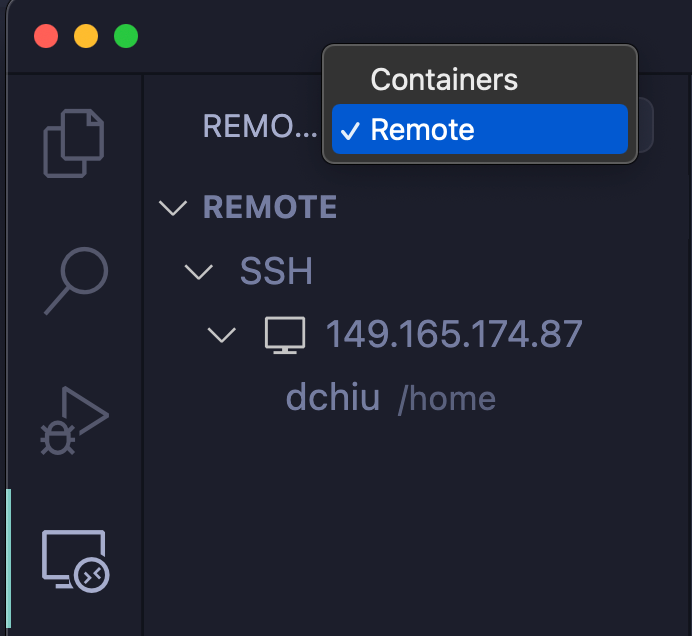
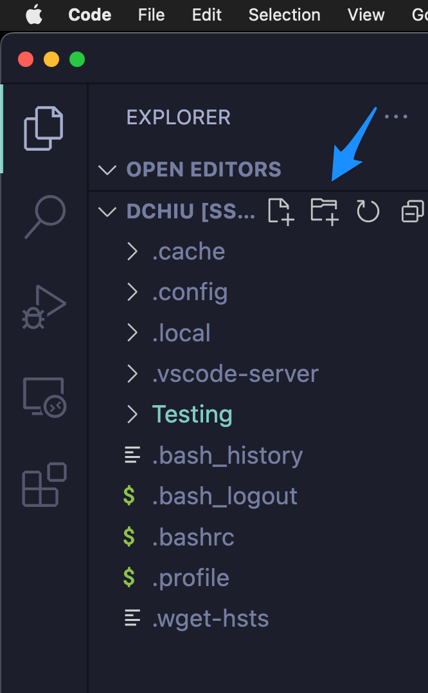
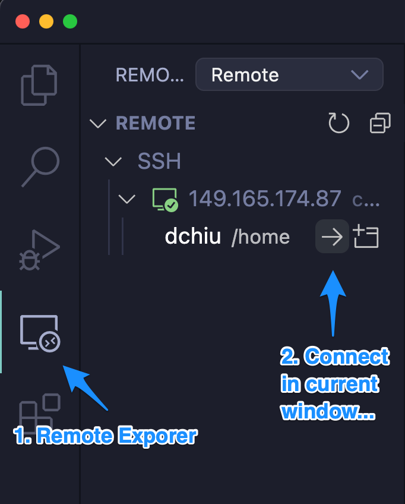
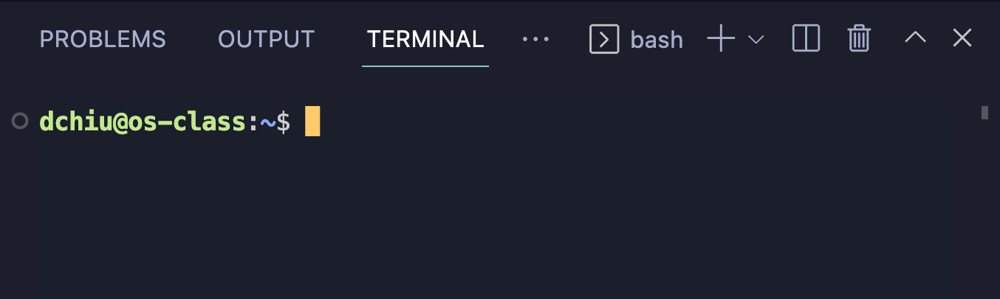

## CS 475 - Operating Systems

### Hwk 0: Remote C Development in VS Code

In this ungraded tutorial, we will set you up to develop on a remote server. Here's why we must do this, instead of developing on your own machines. C is a very finicky language, and is highly dependent on the  environment on which it compiles and executes. This is everybody's worst nightmare: turning in an assignment you spent hours on, only to have it not compile or execute on your instructor's machine. Indeed, having a common compiling and runtime environment was what made Java (and the Java Virtual Machine  JVM) so successful when it was introduced in the mid-90s. Today, most languages have a common runtime environment, and C has certainly made significant efforts to being more portable across systems, but alas I find that it's still very system dependent.

It's therefore important that we all code in a common environment, so I've prepared a remote server for everyone to log into, including myself. This means we're all coding and running on the same machine, which leads to more predictable and repeatable results!

#### Student Outcomes
- Setting up VS code for remote development on a Linux server
- Compiling and running your first C program for this class
- Understand Makefiles and the Make utility

#### Installing C Development Tools

- Download and install [VS Code](https://code.visualstudio.com/) if you don't already have it installed on your computers. This is what we'll be using for writing all our assignments for this class.

- Open VS Code and click on the **"Extensions"** tab on the left hand side. You'll want to search for and install the following packages:
  - **C/C++** by Microsoft
  - **C/C++ Themes** by Microsoft
  - **Remote Development** by Microsoft

- You may have to restart VS Code after installing those extensions. Go ahead and do so.

#### Getting Connected to the Remote Server

- I've set up a Linux server for you to connect to and develop on. Make a note of the following information:
  ```
  Server IP Address: 149.165.174.87
  Your Username: yourPugetSoundUsername
  Your Password: yourPugetSoundID
  ```
  The IP address and your username will not change during this class, but  you *can* change your password later. Your initial password is your UPS ID (usually a long sequence of integers starting with 5.)


- Open up VS Code, then click on the `View` menu and select `Command Palette`. Then type: `Remote-SSH: Add New SSH Host...`. It should auto-complete after typing the first few letters. Choose to run this command. In the box that pops up, enter:
  ```
  ssh yourPugetSoundUsername@IPAddress
  ```
  For example, mine would look like:
  ```
  ssh dchiu@149.165.174.87
  ```

- Next, VS Code may ask you to choose an SSH configuration file. If it asks, just select the one that's already selected. 

- Now click on the "Remote Explorer" button the left-hand panel, shown below. Near the top left, select the `Remote` (or `SSH Target` on older versions) option from the pull-down menu that may have "Container" selected currently. Now you should see the `149.165.174.87` and your username below it. Click on the arrow next to your username to connect.

  

- You'll be prompted for your password in a box at the top. Enter the one that I assigned you. (Your Puget Sound ID starting with 5)

- VS Code might then ask you what platform the remote server is using. If it asks, select `Linux` in the option menu. Then it's going to take a bit of time to install the necessary files to get you set up.

- Once everything is set up, you should see a front page with some information and options on it. Go ahead and exit out of this page to show an empty VS Code editor. 
  - From the left-side panel, click on the top button called "Explorer" that looks like like two sheets of paper. Then click on the button called `Open Folder`. Choose `/home/yourUsername` (which should be the default option). Important: This "path" `/home/yourUsername` is known as your **home directory** on the server. Only you (and I) have access to it, so don't worry about the privacy of your code. Think of it as your private, personal folder on the server. This is where all your code will go for this class.

-  You may be prompted for your password again, followed by a prompt to trust and accept the secure certificate. Click the checkbox then select `yes` on this dialog box.

- If you did all the steps correctly, you should see the contents of your home directory on the left-side panel. Here's what mine looks like:

  

  If you see this, congrats, you're all set up! If not, let me know.

#### Using the Terminal (Shell) and VS Code Editor
- You only have to do the steps listed in the previous section that one time. Let's get a feel for how to start up the coding environment from this point forward. So go ahead and quit VS Code. 

- Before getting started again, keep in mind that, because we're coding on a remote server, a stable internet connection is essential. This means it will not be possible to develop while you're offline or only have an intermittent Wifi connection (e.g., on a plane), so plan wisely throughout the semester.

  - **Pro Tip: Save Often** Anytime you lose Wifi connection or close down your computer, you *will* sever your connection to the remote server and lose any unsaved work! As you're developing, save often!

  - I installed the `git` command-line utility on this server, so you should also take advantage of that and backup your code using git (and github).

- Okay let's get started back in. Open VS Code back up. If you don't see a new, blank window, then choose `File` menu and select `New Window`. In the blank editor window, look to the on the left-hand panel with the vertical bar of icons. There's an icon called **Remote Explorer**. Click on it, then choose the profile you want to connect. It should simply be called `/home/yourUserName`.

  

- You will be prompted for your password (can be hard to miss) near the top of the editor, and afterwards, you should see the contents of your home directory once again. If you do, then you're connected back to the server! Happy programming!

- **Accessing the Terminal** The command-line terminal (also called a _shell_) should show up on the bottom of your VS Code editor. If it's not there, go up to the `Terminal` menu and select `New Terminal`. Here's what mine looks like:

  

  Before graphical user interfaces (GUIs) were possible, the shell was the _only_ user interface to operating systems. We use it to do everything that you can do with GUIs: accessing your files and folders, running and quitting programs, editing files, etc. Because the Linux server that I provided is "headless" (i.e., a stripped-down OS that doesn't support GUIs), you will need to know how to work inside the shell.
  
- **Pro Tips:** I assume you have a working knowledge of the command-line shell, but here are some time-saving tips. 

  | Tip |  |
  | :--- | :--- |
  | `[tab]` and `[tab-tab]`| Type the first few letters of a file or directory, and hit `[tab]` to auto-complete. When the result is ambiguous, hit `[tab]` twice in quick succession to reveal all the matches. |
  | `up` and `down` keys | Hitting the `up` key will display the most recently-run command. You can hit `up` continuously to scroll through your command history. |
  | `history` | Shows you a list of recently-run commands. |
  | `ctrl + c` | Will interrupt the currently-running command, and return the shell prompt. I suspect you'll be using this one a lot! You use it to terminate a process that you ran.|
  | `ctrl + u` | Will reset your cursor (deletes everything you've typed on the same line.) |
  | `ctrl + l` | Will clear the terminal window. |


- If you need a refresher on how to work on the shell, here are some resources (Strongly recommended)
  - [Linux Command Cheatsheet](https://www.guru99.com/linux-commands-cheat-sheet.html)
  - [The Linux command line for beginners](https://ubuntu.com/tutorials/command-line-for-beginners#1-overview)


#### Our First C Program

1. From your home directory, create a new directory called `hwk0`, navigate into it, and create a new file called `hwk0.c`.

    ```bash
    $ cd ~
    $ mkdir hwk0
    $ cd hwk0
    $ touch hwk0.c
    ```

    - The first command `cd ~` changes your working directory to your "home directory" (yes `~` is just a shortcut to your home directory... which is nice because you can't ever get lost if you remember that simple fact!)

    - The 2nd command `mkdir hwk0` creates a new directory (folder) within your home directory named `hwk0`.

    - The 3rd command `cd hwk0` now changes your working directory to within the `hwk0` directory you just created.

    - Finally, `touch hwk0.c` creates a new file called `hwk0.c` within the current working directory. 

    - Of course, you could've done all that using VS Code's file explorer on the left-hand panel, but what's the fun in that? Plus, this puts your navigates your Terminal to the same directory as your new project folder.

2. You should see the `hwk0.c` file show up on the left-hand panel of VS Code. Clicking on it will open it up in the editor. Type in the following "hello world program."

    ```c
    #include <stdio.h>

    int main(int argc, char *argv[]) {
      const int n = 10;
      int x;
      for (x = 0; x < n; x++) {
        printf("Hello world %d of %d!\n", x, n);
      }
      return 0;
    }
    ```

3. Save it and go back down to the terminal window to compile and run it:

    ```bash
    $ gcc -Wall -g hwk0.c
    ```
    Here, `gcc` is the name of the C compiler (gnu c compiler). The `-Wall` flag instructs the compiler to display warnings (even if the code compiles.) The `-g` flag generates debugging information for debuggers that we'll use later on.

    The executable file that is produced is called `a.out`. Type `ls` on the terminal to make sure it's there. If you don't see `a.out`, that means the compilation failed and there was a syntax error that need to fix. To run it, use the command `./<executable-file>`:

    ```bash
    $ ./a.out
    Hello world 0 of 10!
    Hello world 1 of 10!
    Hello world 2 of 10!
    Hello world 3 of 10!
    Hello world 4 of 10!
    Hello world 5 of 10!
    Hello world 6 of 10!
    Hello world 7 of 10!
    Hello world 8 of 10!
    Hello world 9 of 10!
    ```

4. It seems a bit odd that your executable file would be named `a.out`. To instruct the compiler to output the executable under a different name, you can use the `-o <name>` flag. 

    ```bash
    $ gcc -Wall -g -o helloworld hwk0.c
    ```

    This would output the binary as `helloworld`, and you can run it using `./helloworld` on the command-line.


#### Make Utility and Makefiles: Multi-File Compiling


1. As your programs grow in complexity, good programming practice teaches us to split the program into multiple files (as you do in Java). The problem is that, unlike Java,  `gcc` does not automatically resolve file dependencies. If a file `AAA.c` uses functions that are defined  in `BBB.c`, then `BBB.c` must be compiled first into an object file (ends with `.o`) before `AAA.c` can be compiled.
  - That means you may need to run gcc multiple times, and in the right order, just to compile the program! What a pain!

2. To manage dependencies, you can create a file called `Makefile` and it's usually put in the same directory as all your source code. A `Makefile` contains rules and allows you to determine the order in which files are compiled. They are absolutely imperative for managing larger C projects. 


3. Let's see an example. Suppose we're writing a project that contains the following files (no, I did not provide these files to you -- it's just an example for this narrative):
  - `queue.h` -- contains the shared variables, constants, and function declarations of queues
  - `queue.c` -- contains the implementation of queue functions
  - `defs.h` -- contains some other declarations, like structs and other constants unrelated to the queue
  - `main.c`-- contains the `main()` method and uses the things declared in `queue.h` and `defs.h`
  
4. Here's an example `Makefile`, with 3 rules (`all`, `queue.o`, and `clean`). Each rule has the following syntax:
  
    ```makefile
    <ruleName>: <list of dependencies>
        command
    ```
  
    Let's take a look at the following `Makefile`, which is used to compile this program:
  
    ```makefile
    all: main.c queue.h defs.h queue.o
          gcc -Wall -o simu main.c queue.o

    queue.o: queue.h queue.c
          gcc -Wall -c queue.c

    clean:
          rm -f simu *.o
    ```

5. **Important** If the `Makefile` is present, then running the command `make [rule]` in the same directory will attempt to compile the program. If the rule is not given, then the first rule will be run.

6. Back in the `Makefile`, the `all` rule says that, for it to run, it must first check for the existence of `main.c`, `queue.h`, `defs.h`, and `queue.o`. If all these files exist, then it will run the associated command below it to produce the `simu`  file. However, if any of those files are missing, then the `make` utility will search for a rule that produces the missing dependency.

7. In this case, the `queue.o` is missing, so `make` searches for the `queue.o` rule and tries to resolve that first. The `queue.o` rule requires the `queue.h` and `queue.c` files (which are both present in the current working directory). Thus, it runs:

    ```bash
    gcc -Wall -c queue.c
    ```

    The `-c` flag produces a corresponding object file, `queue.o`. This file is not executable, but contains the compiled binary for the code found in `queue.h` and `queue.c`.

8. If your queue files compile, then `queue.o` will be generated by the compiler. Now that `queue.o` is present, the `make` utility will now return to the `all` rule. This time, it will have all the necessary dependencies resolved for compiling `main.c` into the `simu` executable.

    Here's what it would look like if they were all successfully compiled:

    ```bash
    $ make
    gcc -Wall -c queue.c
    gcc -Wall -o simu main.c queue.o
    ```

9. You might have noticed the unused rule `clean` on the bottom of the `Makefile`. Notice that it has no dependencies, and is basically a shortcut for deleting any file ending in `.o` and the file named `simu`. In other words, `make clean` would remove all the binary files. This is usually done right before a submission, or before uploading to github. Those `.o` files take up space, and no one really wants those temporary files anyway.

    ```bash
    $ make clean
    rm -f simu *.o
    ```


10. Here's the good and bad news. Good: I will provide you with a `Makefile` for every assignment, so that you can just type `make` to compile your program. The bad: You need to follow my file structure, or learn how to edit your `Makefile` to include your own files. This leads to less flexibility, and, not everyone agrees with my way of splitting the files apart. All in all, and I would say that it's good form to learn how to write `Makefile`s if you're a serious C programmer, but I'll leave it to be an external exercise.


#### Submission
There is no submission for this tutorial.


#### Credits

Written by David Chiu. 2022.
