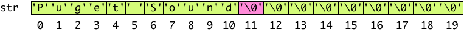
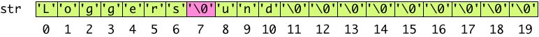

## CS 161 - Intro to Computer Science

### Hwk: Getting Started with C

This is the first part of a multi-part primer on C. You will be programming a simple interactive program in C, and getting familiarized with your programming environment on Linux.

#### ZyBooks Reading

- Chap 3: data types and variables
- Chap 6: arrays
- Chap 7: strings
- Chap 8: functions
- Chap 9: structs

#### Student Outcomes

- To become familiar with the programming environment
- To become familiar with compiling single-source C programs.
- To become familiar with C's supported data types, arrays (and strings), function writing, structs, and input/output functions.

#### Instructions

Open your virtual machine, and log in. Open up a Terminal window to the shell. If you don't know what I'm referring to, complete [Hwk 0](../hwk0.vb).

##### Part I: The Basics

- From your shell, create a directory to store your first program. Let's call this directory `learningTypes/`.
  ```bash
  mkdir learningTypes
  ```
- Now navigate inside this directory:
  ```bash
  cd learningTypes
  ```
- Now let's create a new file using the VSCode editor.

  ```bash
  code types.c
  ```

  Paste in the following code, and we'll discuss what each line means later in this assignment.

  ```c
  /**
   * A simple C program
   *
   * @author David
   */

  #include <stdio.h>

  #define VAL 0
  #define PI 3.14

  int main(int argc, char *argv[])
  {
      char a = 'X';
      int b = 9;
      float c = 6;
      double d = 0;
      char str[] = "Hello world!";

      if (VAL == d)
      {
          printf("Value of a is %c\n", a);
          printf("Value of b is %d\n", b);
          printf("Value of c is %f\n", c);
          printf("Value of d is %f\n", d);
          printf("Value of str is %s\n", str);

          //printf can input varying amounts of arguments
          printf("Values of a, b, and c are %c, %d, and %f\n", a, b, c);

          //controlling floating point output
          printf("c/b is: %f\n", c/b);
          printf("c/b is: %0.0f\n", c/b);
          printf("c/b is: %25.3f\n", c/b);
          printf("c/b is: %0.9f\n", c/b);

          //obtaining input
          printf("Enter a character: ");
          scanf("%c", &a);
          printf("Enter an integer: ");
          scanf("%d", &b);
          printf("You entered %c and %d\n", a, b);
          printf("Enter an float: ");
          scanf("%f", &c);
          printf("You entered %f\n", c);
      }
      return 0;
  }
  ```

- Save this file, and return to the Terminal.

- **Compiling and Execution**: We'll compile this program using the GNU C compiler, gcc. From the Terminal, run:

  ```bash
  gcc -Wall -o types types.c
  ```

  In the above command, the `-Wall` flag tells the compiler to display warnings, `-o types` names the compiled executable file to `types`, and `types.c` is the source file.

- If compilation was successful, you should now get a new file named `types` in your current directory (run `ls` to verify that it is there). To run this program, you need to invoke it from the shell: use `path/to/binaryName`. In our case, since the binary file is in our current working directory, we can simply run

  ```bash
  ./types
  ```

  which prints this to the screen:

  ```bash
  $ ./hello
  Value of a is X
  Value of b is 9
  Value of c is 6.000000
  Value of d is 0.000000
  Value of str is Hello world!
  Values of a, b, and c are X, 9, and 6.000000
  c/b is: 0.666667
  c/b is: 1
  c/b is:                     0.667
  c/b is: 0.666666687
  Enter a character: h
  Enter an integer: 8
  You entered h and 8
  Enter a float: 30
  You entered 30.000000
  ```

- Referring back to the `types.c` source code:

  - Lines 7-10: are called preprocessor directives. The `#include <header.h>` is like an `import` in Java. The `stdio.h` library provides many useful functions for input/output. The `#define <name> [value]` directive defines constant with an optional value.
  - Line 12: begins definition of the main function. Its functionality is the same as Java's `main()` method. Studying its signature, it returns an `int` and like Java, it allows arguments to be input from the command-line (more on this later).
  - Lines 14 to 18: defines some variables. Not including derived data types, C supports: `char` (8-bits), `int` (32-bits), `float` (32-bits), and `double` (64-bits). Finally, note that strings in C are simply char arrays (a lot more on C strings later).
  - Line 20: shows that if-then-else statements share the same syntax as Java. **Important:** In C, any value other than 0 evaluates to `true`.
  - Lines 22-26: uses the `printf()` function (provided in `stdio.h`) to print to the standard output stream (STDOUT), which is connected to your Terminal. The first argument is a formatted string, followed by any number of values to be evaluated and inserted into the formatted string. It is worth spending some time understanding C's **format specifiers** (those `%` sequences). Here are some common format specifiers:
    - `%c` - a character
    - `%d` - a signed integer
    - `%u` - an unsigned integer
    - `%f` - a floating point number
    - `%s` - a C string
  - Lines 32-35: shows that you can further format these format specifiers by prefixing it with width.precision modifier. For example, if left without a modifier (Line 32) `printf()` by default displays up to six places after the floating point (rounded up). Line 33 tells `printf()` to display 0 left-margin and display no values after the decimal, causing it to round 0.6666... up to 1. Line 34 specifies a width, which left-justifies the output to begin on the 25th place, rounded up to the third decimal place. Finally, Line 35 tries to output out to the ninth decimal place, but here, we're presented with the precision error of floats, which can only be trusted up to six decimal places.
  - Lines 38-41: shows you how we might obtain user-input with `scanf()`, which inputs a format string, and a reference to the variable where the input should be stored. Let's study Line 39 in particular. The first argument, `%c` tells `scanf()` to read in the next `char` from the standard input stream (stdin). It will ignore white-spaces until it reaches a character, then reads until the next white-space is encountered. The data is then stored in the variable `a`. (Hey, that sounds a lot like what Java's Scanner class provides!)
    - Important: In C the `&` operator is known as the address-of operator when it prefixes a variable var. It give the variable's location in memory (what data type do you think `&var` is?)
  - Line 44: returns `0` before exiting the program. This value is not arbitrary -- the `0` signifies a normal exit, while a non-zero value indicates an error.

- **Do these exercises (not graded, but highly recommended):**

  - Edit the `types.c` program so that you input a string from the user, and read it into str using `scanf()`. What happens when there's a white-space in your input? What happens when you try to read a string whose length is longer than 12? (Hint: The original string is length 12).

  - Write a program `temperature.c` that prompts the user for a temperature in Fahrenheit, and converts it to Celsius. Round temperatures off to the nearest hundredth degree.

  - Update `temperature.c` so that it asks the user whether they'd like to do another conversion after each conversion. If the user enters 'y' then perform another conversion, exit the program if the user enters `'n'`, and if the user enters neither of those options, inform the user, and ask again. (Hint: C's loop syntax is exactly the same as in Java)

##### About That `char` Data Type...

It is worth giving special attention to the char data type. In C, a char is essentially an 8-bit integer. That means chars can represent
$$2^8 = 256$$ numbers, and each map to a unique character under the ASCII standard. Below I list a few notable mappings, but click here to see the [full list of ASCII codes](https://www.asciitable.com/).

- Do not confuse the character, `'0'` with the integer `0` (indeed, `'0'` has an integer value of `48`!), and similarly for `'1'`, ..., `'9'`. Note that `'\0'` (known as the null character) has an ASCII integer value of 0. This null character plays a big role with C strings, which we'll look at soon.

- To see that chars are really stored as integers, you can print them out using the %d formatter. You can also cast ints into chars, and vice versa.

  ```c
  printf("%c = %d\n", 'A', 'A');  //prints A = 65
  printf("%c = %d\n", 'a', 'a');  //prints a = 97

  //casting an int to a char
  int x = 33;
  char c = (char) x;
  printf("%c\n", c);  //prints !

  //casting char to an int
  c = '#';
  x = (int) c;
  printf("%d\n", x);  //prints 35
  ```

- Therefore, it is possible to do some arithmetics directly on chars, which looks a bit wonky, but can be useful in certain situations. For instance, we could do the following to convert any letter to upper case by subtracting an offset of 32:

  ```c
  //make sure c is a lower-case letter in the alphabet
  if (c >= 'a' && c <= 'z') {
      c -= 32;
  }
  ```

- Check out the [ctype](https://www.cplusplus.com/reference/cctype/) library for useful functions on chars.

##### Array Basics

C has array support, but unlike Java, arrays in C are not considered objects. That means we don't have that nice `array.length` field, for instance, to tell us the length of an array, so it is the programmer who must always keep track of, and pass along, each array's size.

- The syntax to create an array is:

  ```c
  dataType arrayName[size];
  ```

  where `size` is a constant. Alternatively, you can also create an array with known values:

- The syntax to create an array is:

  ```c
  dataType arrayName[] = {val1, val2, ...};
  ```

- Now create the following program, called `array.c`:

  ```c
  #include <stdio.h>
  #include <stdlib.h>
  #include <time.h>

  #define MAX_VALS 5

  int main()
  {
      int A[] = {4,3,2,1};
      double B[MAX_VALS];

      //print out contents of A
      int i;
      for (i=0; i<4; i++)
          printf("%d ", A[i]);
      printf("\n");

      //seed the random number generator
      srand(time(NULL));

      //fill B[..] with random numbers
      for (i=0; i<MAX_VALS; i++)
          B[i] = rand() % 100;    //get a number from 0 (inclusive) to 100 (exclusive)

      //print out contents of B
      for (i=0; i<MAX_VALS; i++)
          printf("%.2f ", B[i]);
      printf("\n");

      return 0;
  }
  ```

- Once you compile and run it, you should get something like:

  ```c
  4 3 2 1
  50.00 95.00 79.00 37.00 92.00
  ```

- Note a few important differences from Java's arrays:

  - The size of the array must be a constant. That is, you cannot input the size of the array from the user, then create the array later. There will be a workaround for this later.

  - There is no easy way to determine the size of the array (i.e., no equivalent of `arrayName.length` in Java). This shouldn't be a problem, since arrays must've had a known, constant size when created.

- Referring back to the source file:

  - Lines 2-3: the random number generator functions `srand()` and `rand()` are imported from stdlib.h. We also include time.h to gain access to the `time()` function, which returns the number of seconds since 00:00 Jan 1, 1970 (known as Unix Time).

  - Lines 9-10: declare and/or initialize two arrays. Notice that, either the values are known a priori and are initialized (Line 9), or the size of the array is given as a constant (Line 10).

  - Lines 13-16: shows the common for-loop to access array elements. One thing to point out is that the indexing variable cannot be declared in the for-loop in C.

  - Lines 19: to use the random number generator, we need to first seed it with an unsigned integer. It is common to the current time as the seed.

  - Lines 23: after seeding, we can call `rand()` return a number in the range of [0, RAND_MAX].

- Do these exercises (not graded):

  - What is the value of `RAND_MAX` on your machine?

  - What happens if you use `rand()` without seeding it first? Try pulling the call to `srand()` out, and run the program a few times.

  - Set a value at an out-of-bounds index for one of the arrays (e.g.,` B[6] = 10;`), and then print out the array element at that index. Do you get runtime errors?

##### Strings

A string in C is essentially an array of `chars`, with one important caveat: The character sequence must be terminated with the null character `'\0'`, which has an integer value of 0. Therefore, C strings are often called "null-terminated strings" in literature.

- The following code creates a character array of size 20, and is initialized with a string of length 11, `"Puget Sound"`. Even though the string is only 11 characters long, it actually occupies 12 elements to store the terminating null character.

  ```c
  char str[20];
  str[0] = 'P';
  str[1] = 'u';
  str[2] = 'g';
  str[3] = 'e';
  str[4] = 't';
  str[5] = ' ';
  str[6] = 'S';
  str[7] = 'o';
  str[8] = 'u';
  str[9] = 'n';
  str[10] = 'd';
  str[11] = '\0';
  ```

- Like Java, a literal in C is enclosed in double-quotes. When assigned as follows, it has the same effect as the code above. The null character is hidden when using this format.

  ```c
  char str[20] = "Puget Sound";
  ```

- After this initalization, the contents of str are shown below. The null character is appended at `str[11]` automatically. Although the remaining unused characters (`str[12]`, ..., `str[19]`) are shown in the figure as having `'\0'`, C may not make any guarantee of this.
  

- Caveat: Just like with other arrays, the only time you can use the assignment operator is during initialization (above). Let's suppose we want to reassign `str` to `"Loggers"`. Unfortunately, unlike Java, the assignment operator will not work here:

  ```c
  #include <stdio.h>
  #define MAX_LEN 20

  int main() {
      char str[MAX_LEN] = "Puget Sound";
      char str2[MAX_LEN] = "Loggers";

      str = str2;     //won't compile!!
      str = "Loggers";    //won't compile!!

      printf("%s ", str);
      return 0;
  }
  ```

- Instead, we need to write this cumbersome code to do the assignment:

  ```c
  #include <stdio.h>
  #define MAX_LEN 20

  int main() {
      char str[MAX_LEN] = "Puget Sound";
      char str2[MAX_LEN] = "Loggers";

      //assign str2 to str by copying str2 over
      int i;
      for (i=0; i < MAX_LEN && str2[i] != '\0'; i++)
          str[i] = str2[i];
      str[i] = '\0';  //don't forget to terminate str!

      printf("%s ", str);
      return 0;
  }
  ```

  After the code runs, `str` would contain:
  

- Important! You need to be sure that `str` was declared with enough storage to hold the newly assigned string _plus_ the terminating null character!

- As you can imagine, manipulating strings in C can be a pain because you need to handle everything at the array level. Forgetting something as simple as terminating the string could have dire consequences. Fortunately, C provides a standard string library `string.h` to help us out. Here are a few useful functions:

  - You should check out [string.h](http://www.cplusplus.com/reference/cstring/) library for the full list of functions.
  - `char *strcpy(char *dest, const char *src)`: copies src to dest, and null-terminates.
  - `char *strcat(char *dest, const char *src)`: concatenates src to dest, and null terminates.
  - `size_t strlen(const char *str)`: returns the length of string str. size_t is an unsigned int.
  - `int strcmp(const char *str1, const char *str2)`: compares the given strings and returns 0 if equal, a positive int if `str1` is lexicographically greater than `str2`, and a negative integer otherwise.

- Instead of writing our own, we could therefore use `strcpy()` to assign strings.

  ```c
  #include <stdio.h>
  #include <string.h> //import the string library
  #define MAX_LEN 20

  int main() {
      char str[MAX_LEN] = "Puget Sound";
      char str2[MAX_LEN] = "Loggers";

      strcpy(str, str2);
      printf("%s\n", str);        //prints "Loggers"

      strcat(str, " Rule");
      printf("%s\n", str);    //prints "Loggers Rule"

      int x = 0, y = 1;
      sprintf(str, "x is %d, y is %d", x, y);
      printf("%s\n", str);    //prints "x is 0, y is 1"

      return 0;
  }
  ```

- Referring back to the source file:

  - Line 2: Imports the string library.

  - Line 9: copies all 7 characters from str2 to str. The function automatically appends the terminating null character at `str[7]`.

  - Line 10: when `printf()` is called to print str, it prints every character up to, and not including `'\0'`.

  - Lines 12: concatenates " Rule" to the end of str, and appends terminating character.

  - Lines 15-16: The `strcpy()` function is only good for assigning a string. However, we often need to mix types. The `stdio.h` library includes a `sprintf()` that is used like `printf()`.

  Warning: On Lines 9, 12, and 16, it is assumed that the programmer had allocated enough space in str to hold the new string.

- Do these exercises (not graded):

  - Java provides the `split()` method in its `String` class to tokenize strings by a delimiter. Look into C's `strtok()` function. Test it out - you will need to use it later.

  - You've seen how to get individual integers and doubles from users using `scanf()`. Check out C's `fgets()` function to read entire line of input from user into a string. Caveat: using `scanf()` to input a numeric value will leave the trailing white-space in the input buffer. This screws up subsequent inputs if you're reading in a string. This problem should already be known to you, if you've ever worked with Java's Scanner class.

  - Java provides the useful `Integer.parseInt(String x)` to convert a string `x` into an int. What's the equivalent in C? What about converting strings to floats?

##### Writing Functions

As good programmers, we know that we should promote reuse and modularity by writing functions. In C, function definitions follow this syntax:

```c
returnType funcName(param1, param2, ...) {
    //body
}
```

- Initially, we need to assume that in C, all function definitions must precede its usages.

- Let's write the function `void my_strcat(char s[], char t[])`, which appends string `t` to the end of string `s` (basically, performs the function as `strcat()` from the `string.h` library).

  ```c
  #include <stdio.h>

  /**
  * Concatenates two strings
  * @param s The destination string, with enough space for t[] and null-character
  * @param t The source string to be appended
  */
  void my_strcat(char s[], char t[]) {
      int i = 0, j = 0;

      // assign i to the position immediately following the existing string s
      while (s[i] != '\0') {
          i++;
      }

      // i now at NULL character position of s
      // now append string t to the end of s
      while (t[j] != '\0') {
          s[i] = t[j];
          i++;
          j++;
      }
      s[i] = '\0';    // don't forget to NULL-terminate string s
  }

  int main() {
      char str[20] = "Hello";
      my_strcat(str, " World!!");
      printf("%s", str);
      return 0;
  }
  ```

- Let's check out the code:

  - First, note that the function is defined before it is called in `main()`.

  - Lines 12-13: We want `i` be the length of string `s`, and to do that, we simply traverse all characters of `s` until we encounter the NULL terminating character `'\0'`.

  - Lines 17-20: The second loop will copy into `s` all elements of `t` until `t`'s NULL character is encountered.

  - Lastly, and importantly, we must insert a NULL terminating character to the end of `s`.

  - Note: As is true in Java, any changes made to an array passed as a parameter will persist beyond the scope of the function call! Therefore, we do not need to return `s` in `my_strcat()`.

- Defining all of our functions in the same file before each is used can be a bit of a hassle, and complicated programs can become hard to manage. Like Java's class structure, it would be ideal to split related functions into different files. [Go here to learn more about organizing multi-file programs](http://www.cs.cf.ac.uk/Dave/C/node35.html). I usually give you the starter files, but you may want to add some of your own files later on.

- Do these exercises (not graded):

  - Using some char-arithmetic tricks, write a function that inputs a string, and converts it to upper-case.

  - Using more arithmetic tricks, can you figure out how a Java function like `Integer.parseInt()` might be implemented in C?

  - Write a function `merge(int A[], int B[], int C[], int sizeA, int sizeB, int sizeC)` that inputs 2 sorted int arrays `A` and `B`, and an "output" array `C`. The function merges `A` and `B` into a sorted sequence in array `C`. Because the function doesn't know the arrays' lengths, you must also input those as params.

##### Structs

C is not an object-oriented language, so the classic definitions of classes and objects do not apply. However, it does support derived (or complex) data types with the `struct` keyword. I like to think of structs as classes with only public fields and no methods. Let's see how it's used.

- To create a struct, you can use the following syntax:

  ```c
  struct structName {
      type0 var0;
      type1 var1;
      ...
      typeN varN;
  };
  ```

  Usually, this declaration appears at the same scope as `main()`, so that other functions can declare variables of this type.

- Once a `struct` has been declared you can use it as a "cookie-cutter" to create instances of that type. For example, the following code uses a `struct` to store two points:

  ```c
  #include <stdio.h>
  #include <math.h>

  /**
   * Define a Point struct
   */
  struct Point {
      double xCoord;
      double yCoord;
  };


  /**
  * Finds distance between two points
  * @param u one point
  * @param v another point
  * @return distance between points u and v
  */
  double getDistance(struct Point u, struct Point v) {
      return sqrt(pow(u.xCoord-v.xCoord, 2) + pow(u.yCoord-v.yCoord, 2));
  }


  int main(int argc, char *argv[]) {
      struct Point p, q;  //declare two Points

      //set Points' location
      p.xCoord = 0;
      p.yCoord = 0;
      q.xCoord = 5.1;
      q.yCoord = 10.75;

      printf("The distance from p to q is: %.3f\n", getDistance(p,q));
      return 0;
  }
  ```

- **Important notes**

  - All of a `struct`'s data members are `public`. There is no such thing as `private` or `protected` in C.
  - Like Java, data members are accessed using dot-notation. (You'll see a different notation once we start pointers).
  - Unlike Java, only data is encapsulated: Constructors, functions, or methods cannot be defined within a C `struct`.

##### Aliasing Type Names with `typedef`

As you know from Java, maintaining code can get confusing without proper names for types. For instance, let's say that an employee's ID must be an integer in the range of 1 to 65000 in my company. Being space-conscious, I know that I don't need a 32-bit `int` to hold this value, and that a 16-bit `short int` would be enough, as long as it's unsigned -- that is, the most-significant bit is used to represent the integer, not to denote positive/negative. So if I had all 16 bits to my disposal, it is capable of representing up to the number 65533, which is more than enough to represent a valid `employeeID`. Everywhere in my company's codebase, I would have to declare `employeeID` as follows,

```c
unsigned short int employeeID;
```

Any function I write that returns or inputs an employee's ID would also be declared `unsigned short int`. Yuck, right? Not only is it messy, it becomes very easy to lose track of what the `unsigned short` is even representing once your code gets more complicated. As you can see, things in your code start getting confusing fast.

To avoid this problem, C allows us to alias a data type to a new name, using the following syntax:

```c
typedef <data type> <alias>;
```

- Let's alias `emp_t` to represent an `unsigned short int`. This makes for much more readable and manageable code:

  ```c
  #include <stdio.h>

  typedef unsigned short int emp_t;   //alias emp_t to unsigned short int

  /**
  * Returns a pointer to a string containing an employee's name
  */
  int getSalary(emp_t id) {
      //(code omitted)
  }

  /**
  * Main function
  */
  int main() {
      emp_t employeeID;
      printf("Enter an employee id: ");
      scanf("%u", &employeeID);   // read input as unsigned int (%u) into employeeID.

      int salary = getSalary(employeeID);

      // (code omitted)

      return 0;
  }
  ```

- Typedefs are often used in conjunction with `structs`. For example, it's mildly annoying that we have to declare a `Point` object named `p` using `struct Point p;` syntax. Using `typedef` totally optional, but it will make the syntax a little more familiar to what we're used to seeing in Java:

  ```c
  typedef struct <structName> {
      //members
  } <structName>;
  ```

  We could therefore declare the `Point` struct as follows,

  ```c
  typedef struct Point {
      double xCoord;
      double yCoord;
  } Point;
  ```

  and now we can declare using `Point p;` and access its elements just like before: `p.xCoord` and `p.yCoord`.

#### Assignment: Word Stats (Graded)

Hop onto your Ubuntu virtual machine - you're ready to write your first C program in this class! This assignment tries to incorporate almost all of the concepts you learned in this tutorial to make sure you start with strong footing.

You are to create a program generates some basics statistics given user-input strings. When your program begins, it should ask the user to enter a string. Once it is entered, your program should parse all words out of this string, and update the following stats:

- Word count
- Vowel count
- Consonant count
- A histogram of letter-use frequency
- Update these stats for each word that is read, and continue asking for more input until the user enters #, at which point your program outputs a menu with the following options:

  - Enter 1 to print vowel and consonant frequency.
  - Enter 2 to print word count.
  - Enter 3 to print histogram.
  - Enter 4 to return to inputting more strings.
  - Enter 5 to quit.

##### Starter Code

Starter code for this assignment is provided on the github repo. You are not required to submit your code to me on Github, but it's strongly recommended that you do.

- If you want to submit your code on Github, do this step. If not, you may skip this step. Make sure you already have a Github account. Login to github, and go here: [https://github.com/davidtchiu/cs475-hwk1-wordstat](https://github.com/davidtchiu/cs475-hwk1-wordstat). Choose to _*fork*_ this repository over to your github account to obtain your own copy. Copy the Github URL to _your_ newly forked project. Then follow the rest of the instructions below. From your Ubuntu virtual machine, open a terminal, and _*clone*_ your forked Github repo down to your local working directory using:

  ```
  git clone <your-github-url-for-this-project>
  ```

- If you aren't planning to submit your assignment via a Github link, then you can simply download the starter files onto your Ubuntu virtual machine using:

  ```
  git clone https://github.com/davidtchiu/cs475-hwk1-wordstat
  ```

- This should download the starter code to your virtual machine, in a directory called `cs475-hwk1-wordstat`. After you've done this, you can work freely from VS Code or any other editor. You should see these files inside your new homework directory:

- `Makefile` - Do not make changes to this file. It is used for compiling.
- `menu.h` - This file should contain menu-option constants, function declarations
- `menu.c` - You will implement the functions declared in `menu.h` in this file
- `stats.h` - This file should contain constants, `WordStats` struct declaration, function declarations
- `stats.c` - You will implement the functions declared in `stats.h` in this file
- `main.c` - This file will contain the `main()` function, and other related helper functions

##### Working Solution

I have included a working solution of my program along with the starter code. The binary executable file is called `wordstatSol`. You can run it from the terminal by first navigating in to the Hwk1 directory and typing the command `./wordstatSol`. This is how your solution should behave when it's done.

##### `make`: Compiling Your Code and Cleaning Your Codebase

Compiling a multi-file C program can be tricky, and requires multiple steps and careful sequencing. To simplify the compilation process, I have provided a _script_ for you to run. As long as the `Makefile` is found in your project directory, you can run the command `make`, and it will resolve the rules inside the `Makefile` and compile your project (hopefully). The name of the binary executable has been configured to be called `wordstat`, so if all goes well, you should be able to run `./wordstat` after compiling.

- One related matter is the `make clean` command. This command will remove all intermediate files and binaries, but it will leave your source code alone. Use this command right before you submit the homework, for instance.

##### Program Requirements

1. All programming is to be done on the given Virtual Box environment. The entire program must be written and compiled in C.

2. Display any floating-point number to the hundredth place.

3. If an unknown menu option is entered, print an error informing the user.

4. You may not assume that a user always enters a single word per input. If the user enters multiple words, you should parse out each one, and determine its length. You may, however, assume that the entire user-input string cannot exceed 128 characters. I have defined a global constant `MAX_INPUT_LEN` to store this value in `main.c`. Ignore any characters that is input beyond this limit. You can use `fgets()` to obtain a line of input from the user.

5. To split a string into tokens, you should look into using the `strtok()` function.

6. To simplify things, you may assume that words are delimited by any whitespace, and must begin with an alphabetical character.

7. Your program must contain several well-defined functions.

8. Your stats must be stored in the struct given in `stat.h`:

   ```c
   typedef struct WordStats {
       int histo[ALPHABET_SIZE];
       int wordCount;
       int vowelCount;
       int consonantCount;
   } WordStats;
   ```

9. The bars in the histogram that you print must be vertical (see below). Point deductions will be taken if you print horizontal bars.

##### Sample Output

```
Enter strings (# to stop):
APPle caT
orangE goat
greenish blue fish
#
*** WORD STATS MENU ***
Enter 1 to print vowel and consonant frequency.
Enter 2 to print word count.
Enter 3 to print histogram.
Enter 4 to return to inputting more strings.
Enter 5 to quit.
> 1
Vowels = 14 (41.18%), Consonants = 20 (58.82%), Total= 34

*** WORD STATS MENU ***
Enter 1 to print vowel and consonant frequency.
Enter 2 to print word count.
Enter 3 to print histogram.
Enter 4 to return to inputting more strings.
Enter 5 to quit.
> 2
Words: 7

*** WORD STATS MENU ***
Enter 1 to print vowel and consonant frequency.
Enter 2 to print word count.
Enter 3 to print histogram.
Enter 4 to return to inputting more strings.
Enter 5 to quit.
> 3
        *
*       *
*       *   *
*       *   * * *     *   * * *   * * *
* * *   * * * * *     *   * * *   * * * *
a b c d e f g h i j k l m n o p q r s t u v w x y z
4 1 1 0 5 1 3 2 2 0 0 2 0 2 2 2 0 2 2 2 1 0 0 0 0 0

*** WORD STATS MENU ***
Enter 1 to print vowel and consonant frequency.
Enter 2 to print word count.
Enter 3 to print histogram.
Enter 4 to return to inputting more strings.
Enter 5 to quit.
> 4
Enter strings (# to stop):
> grey SHARK
> !!!!!!!!
> @#$@#$@#$
> #

*** WORD STATS MENU ***
Enter 1 to print vowel and consonant frequency.
Enter 2 to print word count.
Enter 3 to print histogram.
Enter 4 to return to inputting more strings.
Enter 5 to quit.
> 1
Vowels = 16 (37.21%), Consonants = 27 (62.79%), Total= 43

*** WORD STATS MENU ***
Enter 1 to print vowel and consonant frequency.
Enter 2 to print word count.
Enter 3 to print histogram.
Enter 4 to return to inputting more strings.
Enter 5 to quit.
> 2
Words: 9

*** WORD STATS MENU ***
Enter 1 to print vowel and consonant frequency.
Enter 2 to print word count.
Enter 3 to print histogram.
Enter 4 to return to inputting more strings.
Enter 5 to quit.
> 3
        *
*       *
*       *   *                     *
*       *   * *                   * *
*       *   * * *     *   * * *   * * *
* * *   * * * * *   * *   * * *   * * * *       *
a b c d e f g h i j k l m n o p q r s t u v w x y z
5 1 1 0 6 1 4 3 2 0 1 2 0 2 2 2 0 4 3 2 1 0 0 0 1 0

*** WORD STATS MENU ***
Enter 1 to print vowel and consonant frequency.
Enter 2 to print word count.
Enter 3 to print histogram.
Enter 4 to return to inputting more strings.
Enter 5 to quit.
> 19
Error: Unknown option 19. Try again.

*** WORD STATS MENU ***
Enter 1 to print vowel and consonant frequency.
Enter 2 to print word count.
Enter 3 to print histogram.
Enter 4 to return to inputting more strings.
Enter 5 to quit.
> 5
Exiting...
```

#### Grading

```
This assignment will be graded out of 20 points:

[1pt] Appropriate constants have been defined

[1pt] Array(s) and strings are created using a constant size

[6pt] Your program handles multiple-word inputs

[4pt] Your program updates counts and histogram appropriately

[5pt] Your program prints a vertical (not horizontal) histogram

[1pt] Basic error checking is handled, such as entering invalid menu options.

[1pt] Your program runs repeatedly until sentinel inputs are entered

[1pt] Your program observes good style and commenting.
```

#### Submitting Your Assignment

After you have completed the homework, use the following to submit your work on Canvas. I assume you wrote your program inside your virtual machine. There are two options to submit your work.

1. If you pushed all your code to a Github repository. Make sure your repo is public, and simply submit the URL to your repo on Canvas.
2. If you'd rather submit a "zipped" file on Canvas, do the following:

   - From the Terminal in your virtual machine,
   - Navigate to the directory that contains your homework directory.
   - Zip up your homework directory: `tar -czvf <file_name>.tar.gz <homework_dir>`

     - For example, if my homework directory is called `hwk1/`, and I want the zipped file to be called `hwk1.tar.gz`, use: `tar -czvf hwk1.tar.gz hwk1/`
     - You can un-zip this file later using: `tar -xzvf <file_name>.tar.gz`

   - Navigate to our course on Canvas, and find the assignment submission box.

   - Click on Submit Assignment, and you should be able to "browse" for your file

   - When you've selected the proper file, click Submit Assignment again to upload it.

3. You may submit as often as you'd like before the deadline. I will grade the most recent copy.

#### Credits

Written by David Chiu. 2022.
