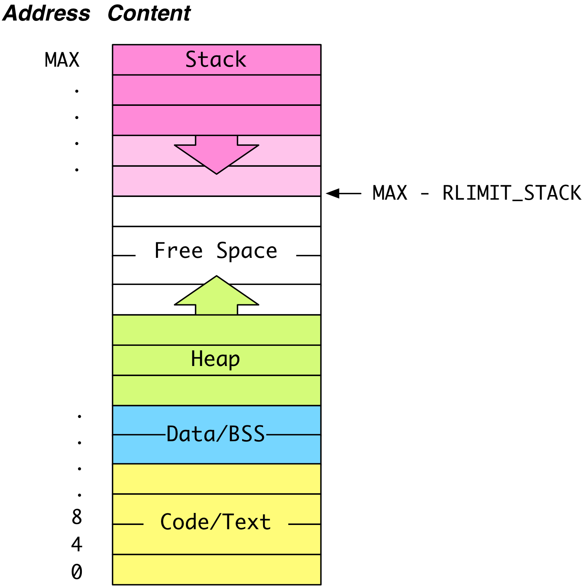

## CS 475 - Operating Systems

### Hwk: Dynamic Memory Allocation

Pointers are still a bit mysterious, because we still haven't seen a real need for them yet. Sure, it was cool to know that they are intrinsically connected to arrays, but still, with exception to `swap()`, all the code examples shown in the previous tutorial can be done easily without pointers. In this section, we introduce the prevailing motivation for pointers: heap memory allocation.

#### ZyBooks Reading

- Chap 10.5 - 10.12: pointers

#### Student Outcomes

- To understand the motivation for dynamic memory allocation.
- To become familiar with memory management functions:`malloc()`, `realloc()`, and `free()`.
- To learn how to debug heap memory access using valgrind.
- To make system calls.

#### Instructions

Open your VS Code and get connected to your Remote Development environment. 

  - Once you're logged in, you can open a terminal from the `Terminal` menu.

##### Part 1: Motivation

Using the last homework as a motivating example, recall that we stored an array of Employees, whose information was entered by the user. But in general, the number of employees we need to store is *not known* until runtime. To deal with this issue, we define the max number of employees `MAX` as a constant, and then we ask the user for the number of employees they expect to have in this particular run:

```c
#include <stdio.h>
#include "employee.h"

#define MAX 100000

int getNumEmployees() {
    int num;
    do {
        printf("Number of employees you need to store: ");
        scanf("%d", &num);
    } while (num > MAX || num <= 0);
    return num;
}

int main(int argc, char *argv[]) {
    int i;
    Employee my_employees[MAX];             // create array that can hold up to 100,000 employees
    int num_employees = getNumEmployees();  // how many does the user *really* need?

    // fill employee info
    for (i = 0; i < num_employees; i++) {
        //(code omitted)
    }
}
```

**The code above is undesirable for several reasons.** First, `MAX` is entirely arbitrary and defined at the programmer's discretion. Secondly, for the runs that do not require anywhere close to
`MAX` employees, this program ends up wasting quite a bit of space.

Okay. You might think the above example seems contrived. After all, why didn't we ask the user for the number of employees first, and then create the array using that size. Consider the following code that *would* work in Java (but not C!):

```c
#include <stdio.h>
#include "employee.h"

int getNumEmployees() {
    int num;
    do {
        printf("Number of employees you need to store: ");
        scanf("%d", &num);
    } while (num <= 0);
    return num;
}


int main(int argc, char *argv[]) {
    // Just ask for the array size first
    int num_employees = getNumEmployees();
    Employee my_employees[num_employees]; // just create an array that holds num_employees

    // (code omitted)
}
```

While it's true that this code works in Java, **this code is even less desirable than the one before it!** It may crash the C program at unexpected times! It's really important to understand why (stack overflow), so we need to have a handle on how the OS manages a process' memory during execution.

##### Part 2: Address Spaces

When your program is in execution (known as a **process**), the OS gives it a virtual address space. Think of this space as the process' very own sandbox. It's where all its resources (variables, open files, etc.) will live. We'll assume that the OS organizes each process' address space in the following **segments**:



- **Code (Text) Segment** stores the binary (executable file) currently running. It is placed near the lowest address.

- **Data Segment** stores global and static variables that have been initialized with a non-zero or non-NULL value. The related BSS segment stores uninitialized global and static variables.

- **Heap** stores data allocated by the process during runtime. When arbitrary amounts of memory are allocated during runtime, we all this process *dynamic memory allocation*. You'll learn how to do this in a bit!

- **Program Stack** stores data (e.g., local variables, function parameters, return addresses) needed to keep track of program execution and scope of function calls. As your program makes a function call, your stack *grows* by pushing input parameters, local variables declared within that function, and a return address. Collectively, the set of these values make up the function's **frame**. As the function returns, all values in its frame are popped off the stack, causing the stack to *shrink*, and returning the stack's frame to the caller function's scope.

###### How the Program Stack Works (And What Is a Stack Overflow?)

When a process starts running, the OS allocates `RLIMIT_STACK` bytes for that process' stack. A user cannot increase this stack size, but can decrease it. Here's how the stack is used:

- From `main(int argc, char *argv[])`, where the program starts running, its command-line arguments `argc` and `argc[]` and any local variables are pushed onto the stack, which grows  towards  address `MAX - RLIMIT_STACK`. When `main()` calls another function, a new stack frame is for the function is created by pushing any return address, arguments, and local variables onto the stack. When a function returns, all the values in its frame are popped off, and control jumps back to the return address that was also pushed on, thus restoring the caller function's **scope**.

- **Stack Overflow**: The stack is allowed to grow and shrink so as long as it stays within the bounds imposed by `RLIMIT_STACK`. Unfortunately, violating this threshold is easy. Take a look at the following example, which contains an infinite recursion:

  ```c
  #include <stdio.h>

  void f(int depth) {
      printf("depth = %d\n", depth);
      f(depth+1);
  }

  int main(int argc, char* argv[]) {
      f(1);
      return 0;
  }
  ```

- Unlike a program that gets stuck in an infinite loop, programs infinite recursions _will_ eventually crash. Let's see the output of a run of this program:

  ```c
  ...
  depth = 393031
  depth = 393032
  depth = 393033
  depth = 393034
  depth = 393035
  Segmentation fault
  ```

- The dreaded **segmentation fault**, a historical umbrella term that means your program tried to access an invalid memory location in its address space. In this particular example, each recursive call to `f(..)` involves pushing the return address followed by pushing a new value for `int depth` onto  the stack. The stack breaches the `RLIMIT_STACK` limit on the *393036th* recursive call to `f(..)`. When the program tries to push a frame beyond that threshold, the memory-management unit of the OS detects this violation and throws a segmentation fault and terminates the offending process.

  - Indeed, an infinite recursion always crashes the program because the program continues to gobble up space on the stack. Because each of the recursive calls is still waiting for the next one to return, no frames are ever popped off. In contrast, you've probably rarely seen an infinite loop be terminated by the OS, and now the reason is clear. 
<!-- 
- What's my machine's `RLIMIT_STACK` you ask? This value varies across systems. To find out what this value is on your machine, you can use the shell command `ulimit`. The `-a` option shows all resource limits defined by your OS. If you're only interested in the stack size, you can specify the `-s` flag.

  ```
  $ ulimit -s
  10240
  ```

- The number reported by `ulimit` is in KB ($$2^{10}$$ bytes), so my machine gives each running process a 10 MB stack. -->

##### Part 3: Revisiting the Problem of Unknown Array Sizes at Runtime

Now that we understand how the program stack works, we return to the original problem of dealing with array sizes that are unknown until runtime. Here's the problematic code we saw earlier:

- The problem is on **Line 19**:

    ```c
    Employee my_employees[num_employees];
    ```

  If the user entered a large enough number for `num_employees`, a segmentation fault can occur when the runtime tries to push an `Employee` array of that size onto the stack.

- Check out the output for the following two runs:

  ```
  $ ./employees
  Number of employees you need to store: 2
  Enter a name: David
  Enter salary: 30000

  Enter a name: Michelle
  Enter salary: 40000

  [name=Michelle, sal=40000], [name=David, sal=30000]
  ```

  Okay that succeeded because only needed to store 2 employees on the stack. But what about... 2000000?

  ```
  $ ./employees
  Number of employees you need to store: 2000000
  Segmentation fault
  ```

- Clearly, a program that crashes depending on the magnitude of a user's input is troubling, and is why you should avoid creating unknown-sized arrays on the _stack_. That foreshadows a different location that can store arbitrarily-sized structures.

##### Part 4: Heap to the Rescue!!

- To deal with the stack-overflow problem, we need to allocate unknown-sized memory in some large area of the address space. The **Heap** segment serves this  purpose. So, whenever we need a new array, struct, string, etc., during runtime, we'll create a pointer on the stack to refer to some location on the **heap** where this potentially large structure will live.

- In fact, allocating memory on the heap is  what Java does every time the `new` keyword is used to construct an Object. In this section, we'll see how C supports memory allocation (and deallocation) on the heap.

- There are four important memory allocation functions you should know. To gain access to them, we need to  `#include <stdlib.h>`. These functions are:

  1.  `void* malloc(size_t size)`: allocates `size` contiguous bytes on the heap, and returns a pointer to the first byte. Note that `size_t` is just a `typedef` alias to `unsigned int`. Importantly, because the returned pointer is `void *`, the programmer must cast it to the desired data type before dereferencing (think the generic `Object` type in Java). On failure, `NULL` is returned. (Why might `malloc` fail?)

  2.  `void* calloc(size_t num, size_t size)`: is an alternative function to  `malloc()`. It takes as input an unsigned integer `num` (number of elements) and `size` (number of bytes per element). It attempts to allocate `num * size` bytes on the heap. One difference from `malloc()` is that it will also initialize the entire allocated block to zeroes. On success, it returns a `void*` pointer to the first byte of the newly allocated block. On failure, `NULL` is returned.

  3.  `void* realloc(void *ptr, size_t size)`: is used to change the size of an already-allocated block of memory on the heap. It takes as input a pointer to an existing block of memory on the heap, and a new `size`, which may be smaller or larger than the current allocation. On failure, `NULL` is returned. Caveat: the location of the allocated block might change, which is why a `void*` pointer to a potentially different starting address is returned.

  4.  `void free(void *ptr)`: is used to deallocate, or free-up, the space that was previously allocated on the heap. It takes as input a pointer to the already-allocated memory block, and returns nothing. **Important!** It is crucial that you free up memory as soon as it is no longer being used (Unlike Java, C does not garbage collect user-allocated memory automatically). When a user fails to free up un-used space, it leads to **memory leaks**, which can cause your process to bloat and take up massive amounts of resources over its lifetime.

      - Have you ever suspected that an app you use suffers from memory leaks? This is a very common problem in games and other memory-intensive applications. Next time an app that you use seems to be growing in memory usage in uncontrolled ways, it may be a memory leak that needs to be fixed.

- Let's see how I could refactor the problematic employee code so that it allocates the array on the heap instead of on the stack.

  ```c
  #include <stdio.h>
  #include <string.h>
  #include <stdlib.h> //for malloc(), free(), ...
  #include "employee.h"

  int getNumEmployees() {
    int num;
    do {
       printf("Number of employees you need to store: ");
       scanf("%d", &num);
    } while (num <= 0);
    return num;
  }

  int main(int argc, char *argv[]) {
    int num_employees = getNumEmployees();
    Employee *my_employees = (Employee*) malloc(num_employees * sizeof(Employee));  // on the heap!

    //fill employee info
    int i;
    for (i = 0; i < num_employees; i++) {
        strcpy(my_employees[i].name, getName());
        my_employees[i].salary = getSalary();
    }

    //(code omitted)

    free(my_employees); // deallocate space after we're done!
    my_employees = NULL; // defensive programming
    return 0;
  }
  ```

- In the code:

  - On **Line 17:** there's a lot of information on this line. Let's break it down into pieces and talk about each one separately.

      ```c
      Employee *my_employees = (Employee*) malloc(num_employees * sizeof(Employee));  // on the heap!
      ```

    Remember the goal is to create an array on the *heap* that contains `num_employees` elements of type `Employee`. Therefore, we need to use `malloc()` to request `num_employees * sizeof(Employee)` bytes on the heap.

    - For example, assume that the `Employee` struct is declared as follows:

      ```c
      #define MAX_NAME_LEN 16

      typedef struct Employee {
          char name[MAX_NAME_LEN];
          int salary;
      } Employee;
      ```

    - Then `sizeof(Employee) == 20` because `name` is a char array of length 16 and `salary` is an 4-byte integer. So `malloc()` will to try to allocate a block of `num_employees * 20` bytes on the heap, and return the address of the first byte of this block.

    - Remember that `malloc()` is type-agnostic; it doesn't care about what kind of data you intend to store in the newly allocated memory. Therefore, it returns a `void*` pointer, which means we need to cast this pointer into the desired pointer type. Without the cast, C wouldn't know what the byte-boundaries are for each `Employee` object to do pointer-arithmetic! Furthermore, it wouldn't be able to associate `.name` with the first 16 bytes, and `.salary` with the last four bytes.

  - On **Line 21-25**:

    ```c
    //fill employee info
    int i;
    for (i = 0; i < num_employees; i++) {
        strcpy(my_employees[i].name, getName());  // assign the name using strcpy()
        my_employees[i].salary = getSalary(); // assign the salary
    }
    ```

    Remember from the previous primer that we learned the array-index syntax `my_employees[i]` is really a short-hand for `*(my_employees+i)`? Because of the earlier cast to `Employee*`, C now knows to skip `sizeof(Employee)` bytes every time `i` is incremented. How convenient that we can use the array-index syntax in this context to dereference each 20-byte block as an `Employee`!!

  - On **Line 30 (important word on Garbage Collection)**: This line _frees_ up the `num_employees * sizeof(Employee)` bytes off the heap, so that the space can be reclaimed and used by another part of the process. Be careful! After freeing it, `my_employees` now points to an *invalid* address. If you try to dereference `my_employees` now (as in Lines 21-25), you'll receive a **segmentation fault**!

    - If your program doesn't free up memory that's no longer being used, then the memory remains allocated on the heap! You can never be able to reclaim this memory because there are no longer any pointers referencing its location. This is called a **memory leak**, which will cause your program to eat up increasing amounts of memory, until it exits.

    - While "garbage collection" is automatically handled by many modern languages like Java and Python, we don't have that luxury in C. It is completely up to the programmer to decide when free memory from the heap. Be sensitive to this when programming!

  - On **Line 31 (avoiding dangling pointers)**: It is good defensive practice to set pointers to `NULL` immediately after freeing -- here's why. After freeing, the pointer is *still* pointing at that location (i.e. it's dangling). However, once heap memory has been freed, that chunk of memory can be re-used by another call to `malloc` elsewhere in your program! This leads to two potential problems:

    1. If you re-use the pointer and assign something new to it, then it will corrupt the memory that is in use by the other part of your program! This is the primary problem!

    2. If you `free()` that pointer again (say you have multiple `free()` statements in different functions), then it will deallocate the memory that was in use by the other part of your program!


##### Part 5: Dynamic Memory Allocation
<!-- 
So we've seen how to create an array on the heap, but `malloc()` is more general than that. It can be used to allocate _any_ amount of memory on the heap, even a single `int`, `double`, or just a `struct`. 

In the code below, we use `malloc()` to create just a single integer on the heap. `malloc()`, as always, will return the address of the first byte. We then tell C to interpret the 4 bytes as an `int` by simply casting the address into an `int*` pointer, which is then stored in `p`.

  ```c
  int *p = (int*) malloc(sizeof(int));
  *p = 0; // initialize the content referred by p to 0
  ```

You should understand that pointer `p` exists on the stack (in main's frame), and it's pointing at value 0, which is on the heap. -->

###### Part 5a: Creating Strings (Know this!)
Pay attention here, because you'll be doing this a lot! We can now use `malloc()` to create *just enough* space for new strings. For instance, suppose I wanted to write a function `createEmail()` that accepts two strings `user` and `domain`, and returns the string `user@domain`.

  ```c
  char* createEmail(char* user, char* domain) {
    // create a new string buffer (it may not be an empty string)
    char *email = (char*) malloc(strlen(user) + strlen(domain) + 2);    
    email[0] = '\0';  //empty the string

    strcpy(email, user); // copy user over
    strcat(email, "@"); // append @
    strcat(email, domain);  // append domain
    return email;
  }
  ```

In the above code:
  - On **Line 2** we `malloc()` just the right amount of space for the email string. The size is the length of the `user` + `domain` + `2`. Hmm, why add `2`? (1 is for the `@` symbol. 1 for the terminating `\0` character) 

  - On **Line 3** here we're presented with a rather annoying thing with `malloc()`. It does not clear out the contents after it allocates the space (that's actually a feature, because it's faster to leave the memory as-is). All `malloc()` does is return the pointer to the first byte it allocated back to you. That means there could be existing garbage stored in the memory that was allocated! Therefore, we need to set the string to an empty string (which is equivalent to setting a string's 0th position to the `\0` character.)

    - If you would rather that C clears out the contents of newly-allocated memory, you should use `calloc()` instead.

  - With enough storage on hand now, the subsequent `strcpy()` and `strcat()` calls have enough space to concatenate and build up this string. (`strcat()` automatically terminates the string.)

  - On **Last Line** we return the address to the `email`, or rather, to the first byte of the allocated memory. Because the memory to store `email` is created on the heap, it does not disappear after the return statement.

**Check-In Exercise** Doing the exercise below will be fruitful, because you'll likely use it for this assignment and others.

  - Write a function `char* strrepeat(char *str, unsigned int nrepeat)` to return a newly allocated string `nrepeat` copies of `str` concatenated together. For instance, `strrepeat("hi", 3)` returns a pointer to `hihihi`, and `strrepeat("hi", 0)` returns simply an empty string (that is, a char array of size 1, which contains just the null character `\0`).


###### Part 5b: Instantiating Structs (Know this also!!!)
A great strength of `malloc()` lies in allowing us to create and manage dynamic data structures that are unbounded in size, like linked lists and trees. Assume we've declared the following `struct` for a Linked List node:

```c
/** Here's a node for a linked list, say */
typedef struct Node {
    int data;
    struct Node *next;
} Node;
```

We can also use `malloc()` to create a single `struct` element, as follows.

```c
// here's how to construct a Node element
Node *newNode = (Node*) malloc(sizeof(Node));

// here's how to initialize it (note the '->' operator!!!!)
newNode->data = 0;
newNode->next = NULL;
```

Notice the new operator `->` that can be used to access pointers to `struct`s. It automatically dereferences the pointer. The alternative way to access `data` and `next` was to use the dereferencing operator and dot-notation, as follows:

```c
(*newNode).data = 0;
(*newNode).next = NULL;
```

The arrow operator `->` provides a cleaner syntax to deference a pointer to a struct field!!

#### Important: Debugging with valgrind
Valgrind is a tool to help you debug access errors for memory that you allocated on the heap. Believe me, it will save you a bunch of time. To use valgrind, you just have to first compile your C code using the `-g` (as you'd been instructed to do all along). Then run your program like this:

```bash
$ valgrind --leak-check=full ./<your executable file>
```

Valgrind will print out a full summary after your program terminates, reporting any memory access errors or memory leaks. Let's see an example here:

```c
#include <stdio.h>
#include <stdlib.h>
#include <string.h>

int main(int argc, char *argv[]) {
  int *buf1 = (int*) malloc(sizeof(int) * 20);

  for (int i = 0; i < 20; i++) {
    buf1[i] = 0;
  }
  buf1[20] = 0;

  return 0;
}
```

When I compile this code and run the program through valgrind, it will generate some output. I'm using the `--leak-check=full` flag to instruct valgrind to report detailed memory leak information.
```bash
$ gcc -Wall -g memtest.c -o memtest
$ valgrind --leak-check=full ./memtest 
```

Here's a breakdown of what it says:
```
==359874== Invalid write of size 4
==359874==    at 0x10919F: main (memtest.c:11)
==359874==  Address 0x523e094 is 4 bytes after a block of size 80 alloc'd
==359874==    at 0x4E050C5: malloc (vg_replace_malloc.c:393)
==359874==    by 0x109165: main (memtest.c:6)
```
This error is an "invalid write" on **line 11**, `buf1[20] = 0;` Valgrind is warning that you had malloc'd only 20 ints, but you're attempting to write to the 21st spot. Therefore, it spotted a 1-off error, and at this point you should go back to fix the error.

Further down the report, you'll see another segment:
```
==359874== HEAP SUMMARY:
==359874==     in use at exit: 80 bytes in 1 blocks
==359874==   total heap usage: 1 allocs, 0 frees, 80 bytes allocated
==359874== 
==359874== 80 bytes in 1 blocks are definitely lost in loss record 1 of 1
==359874==    at 0x4E050C5: malloc (vg_replace_malloc.c:393)
==359874==    by 0x109165: main (memtest.c:6)
==359874== 
==359874== LEAK SUMMARY:
==359874==    definitely lost: 80 bytes in 1 blocks
==359874==    indirectly lost: 0 bytes in 0 blocks
==359874==      possibly lost: 0 bytes in 0 blocks
==359874==    still reachable: 0 bytes in 0 blocks
==359874==         suppressed: 0 bytes in 0 blocks
```
Here valgrind *suspects* that it has detected a memory leak. Reading the report can be a bit misleading though. It appears the problem occurred inside the `malloc()` function on line 393 of `vg_replace_malloc.c`, but that's highly doubtful. So you'll have to look to the next line, indicating that leak originates on the call to `malloc()` on Line 6 of *our* program. It says that 80 bytes (indeed `sizeof(int) * 20` == 80) were malloc'd, but never freed before the program terminated. Adding a call to `free(buf1)` before the program exits would have solved this leak.

**Important** For all programs (starting from this assignment) that you write from now on, valgrind should absolutely be a part of your debugging workflow to save you hours of time.

#### Assignment: `ls2` A Suped-Up `ls` (Graded)
As you know,  the `ls` UNIX command lists all files and directories in a given directory. Your task is to write a recursive version of the `ls` command so that it not only lists all files/directories in the current working directory, but also traverses all subdirectories. On top of the recursive descent into subdirectories, your version of `ls` can also perform a search.

###### Starter Code

Starter code for this assignment is provided on the github repo. You are not required to submit your code to me on Github, but it's strongly recommended that you do.

- **This step is imperative:** Login to github, and go here: [https://github.com/davidtchiu/cs475-hwk3-ls2](https://github.com/davidtchiu/cs475-hwk3-ls2). Choose to _*fork*_ this repository over to your github account to obtain your own copy. Copy the Github URL to _your_ newly forked project. Then follow the rest of the instructions below. From your VS Code remote development environment, open a terminal, and _*clone*_ your forked Github repo down to your local working directory using:

  ```
  git clone <your-github-url-for-this-project>
  ```

- This should download the starter code in a directory called `cs475-hwk3-ls2`. After you've done this, you can work freely from VS Code or any other editor. You should see these files inside your new homework directory:

###### Working Solution

I have included a working solution of my program along with the starter code. The binary executable file is called `ls2Sol`. 


###### Detailed Instructions

1. Your program should accept up to 2 arguments on the command line:
    ```bash
    $ ./ls2 <path> [optional-file]
    ```
   Only the `<path>` argument is required, and your program should re-prompt the command if no arguments are given, or if more than 2 are given. Here's an example:
    ```bash
    $ ./ls2 
    Usage: ./ls2 <path> [optional-file]

    $ ./ls2 . hello.c hello.o
    Usage: ./ls2 <path> [optional-file]
    ```

   You need to look into how to handle command-line arguments in `main(int argc, char *argv[])`.
    - `int argc` gives a count of the number of terms given on the command line (including `./ls2` as a term)
    - `char *argv[]` is an array of strings, with `argv[i]` being the ith term given on the command line

2. Your program will run in one of *two modes*:

    - **Mode 1:** The first mode runs when the user only passes the `path`. Your program should attempt to open the directory given by `path` and recursively show all files' name and size (in bytes). You do not need to worry about displaying anything other than regular files and directories (ignore anything that isn't a directory or a regular file).

      Here's me running `ls2` on the `.git/logs` directory, which is inside my current working directory:
      ```bash
      $ ./ls2 .git/logs
      HEAD (691 bytes)
      refs/ (directory)
          heads/ (directory)
              main (503 bytes)
          remotes/ (directory)
              origin/ (directory)
                  main (154 bytes)
      ```

      Here's me running `ls2` just on my current working directory `.`:
      ```bash
      $ ./ls2 .
      main.c (387 bytes)
      Makefile (182 bytes)
      ls2.h (173 bytes)
      .git/ (directory)
          description (73 bytes)
          HEAD (21 bytes)
          COMMIT_EDITMSG (6 bytes)
          hooks/ (directory)
              prepare-commit-msg.sample (1492 bytes)
              update.sample (3650 bytes)
              fsmonitor-watchman.sample (4655 bytes)
              pre-applypatch.sample (424 bytes)
              pre-rebase.sample (4898 bytes)
              pre-commit.sample (1643 bytes)
              pre-push.sample (1374 bytes)
              commit-msg.sample (896 bytes)
              applypatch-msg.sample (478 bytes)
              pre-merge-commit.sample (416 bytes)
              pre-receive.sample (544 bytes)
              push-to-checkout.sample (2783 bytes)
              post-update.sample (189 bytes)
          info/ (directory)
              exclude (240 bytes)
          objects/ (directory)
              ad/ (directory)
                  927129ffd942e63b356db9b811e0444a84b11f (223 bytes)
              15/ (directory)
                  6fe5a856f0ed83ddae54f2d4f235b03d07f21f (258 bytes)
              d5/ (directory)
                  626a4f84a73f58f39d63e07443a50b69041570 (111 bytes)
              24/ (directory)
                  537710b1c7599c061928d6f89bbf938b7c7d8a (590 bytes)
              2c/ (directory)
                  048c6621060d8242659e595220f8ec9da228f4 (4250 bytes)
              0b/ (directory)
                  738a7918e62ea8552a7997abd81c831304b846 (35 bytes)
              13/ (directory)
                  d87d094f4135b4c4199a9dfd901439288492c2 (155 bytes)
              cc/ (directory)
                  c1cb19b88b7163654e765a8bf552c6274b6b0c (53 bytes)
              f7/ (directory)
                  d900f3c17317cb30529d11dde2ed673eb29f69 (130 bytes)
              7b/ (directory)
                  2d469eb73ea748e5dacd44cda5071144fa6c7b (143 bytes)
              85/ (directory)
                  6bfad918cfaabf4db52fd50240934cd31e9b28 (121 bytes)
              16/ (directory)
                  3eff427411413e9b4b83a19dc20bb87d9f4814 (246 bytes)
          config (269 bytes)
          logs/ (directory)
              HEAD (691 bytes)
              refs/ (directory)
                  heads/ (directory)
                      main (503 bytes)
                  remotes/ (directory)
                      origin/ (directory)
                          main (300 bytes)
          refs/ (directory)
              heads/ (directory)
                  main (41 bytes)
              remotes/ (directory)
                  origin/ (directory)
                      main (41 bytes)
          index (641 bytes)
      stack.h (438 bytes)
      ls2.c (183 bytes)
      stack.c (1428 bytes)
      ls2Sol (16792 bytes)
      README.md (34 bytes)
      ```
    
    - **Mode 2:** The second mode runs when the user passes both `path` and the `optional-file` arguments. When this is the case, your program should only show files with names exactly matching the given `optional-file`. It should only include all the directories (and subdirectories) that contain files with names matching the given argument and ignore all the others in the print-out. The program should avoid showing the directory chain if the file is not found in its subdirectory.

      ```bash
      $ ./ls2 . main
      .git/ (directory)
          logs/ (directory)
              refs/ (directory)
                  heads/ (directory)
                      main (503 bytes)
                  remotes/ (directory)
                      origin/ (directory)
                          main (154 bytes)
          refs/ (directory)
              heads/ (directory)
                  main (41 bytes)
              remotes/ (directory)
                  origin/ (directory)
                      main (41 bytes)     
      ```

      In this run, I only want to find the file `main` inside the `.git/refs` directory:
      ```bash
      ./ls2 .git/refs main
      heads/ (directory)
          main (41 bytes)
      remotes/ (directory)
          origin/ (directory)
              main (41 bytes)
      ```

3. **What's the stack library for?** You'll notice that I prepared you with the `stack.h` and `stack.c` files, which is a fully implemented stack. You should study `stack.c` to see how I use `malloc()` in various spots and `free()` up the resources too.
    - When designing this program, you'll notice that your algorithm can't simply print every file or directory as soon as you encounter them. You might get away with it in Mode 1, but Mode 2 requires that you keep a collection of directories and files you actually want to print at the end.
    - You can use the stack to store a list of files/directories that you wish to print.

4. **UNIX system calls**

    - To open up directories and check what's inside, you will want to check out the following system calls through `#include <unistd.h>`:`opendir()`, `readdir()`, `closedir()`.
      - When you read the contents of a directory, ignore any references to `.` and `..`
      - Why? Remember that `.` means the current directory, and `..` means the parent directory. These references exist in *every* directory you open. So if you recursively open those up, then you'll just end up in an infinite recursion/loop!

    - You should be able to traverse the contents of a directory using `readdir()`. Once you have a name of a file or directory, you need to to test if it's actually a regular file? A link? A directory? To get information on the file (how big is it?) you'll want to look into using the important `lstat(..)` system call provided in `#include <sys/stat.h>` 
      - [sys/stat.h](https://pubs.opengroup.org/onlinepubs/007908799/xsh/sysstat.h.html)
      - Note that the second parameter of `lstat(..)` accepts an *output parameter* (remember what those are from the previous assignment?), where it will store a `struct` with the file/directory's information.
      - One of the fields in the output struct is a `mode_t st_mode`. You can run the following tests on this field to check if the file that you `lstat(..)`ed is a *regular file* or a *directory* using `S_ISREG(mode_t m)` and `S_ISDIR(mode_t m)` functions respectively. As mentioned earlier, you should ignore all other types of files.

5. Other header files you may want to look into before getting started on this assignment:
    - [dirent.h](https://pubs.opengroup.org/onlinepubs/7908799/xsh/dirent.h.html) for `DIR` type for representing a directory stream. This is to be used in conjunction with `opendir()` system call.
    - [sys/types.h](https://pubs.opengroup.org/onlinepubs/009695399/basedefs/sys/types.h.html) for `mode_t`.

6.  **Output formatting:** The names of *directories* must be followed with the suffix `"/ (directory)"`. Names of *regular files* must be followed by the suffix `"(nnn bytes)"` where `nnn` is the number of bytes occupied by that file. If a file or directory is found within a subdirectory, its name must be indented by four spaces to signify that it is enclosed within the above directory.
    - Luckily, the listing does not needed to sorted in any particular order.

7. Although the `.git/` directory exists (as it did in my sample output), it still may be wise to create your own "test-dummy" directory structure so that you test your program. 


#### Grading

```
This assignment will be graded out of 25 points:
[2pt] Your program recursively descends all subdirectories.
[3pt] Implementation of Mode 1.
[10pt] Implementation of Mode 2.
[3pt] Your output of files and directories conforms to the specified format.
[2pt] Your program properly resolves command line arguments.
[5pt] Your program is free of memory leaks and dangling pointers.
```

#### Submitting Your Assignment

1. Commit and push your code to your Github repo. Make sure your repo is public (or private and accessible by me).

2. On canvas, simply submit the URL to your Github repo. No other form of submission is accepted.


#### Credits

Written by David Chiu. 2022.
