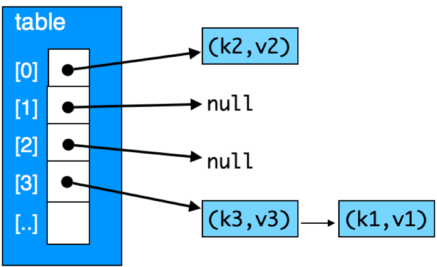

## CS 475 - Operating Systems

### Hwk: Thread-Safe HashMap

HashMaps (also called Hash Tables or Dictionaries) are one of the most versatile and powerful data structures due to its support of O(1) operations. Besides arrays, they are quite possibly the most ubiquitous data structures in use today.

But have you ever wondered why Java offers both a `Hashtable<K,V>` class and a `HashMap<K,V>` class? If you compare their interfaces and behaviors, they have the same functionality. When would you prefer one over another? This choice, it turns out, has everything to do with synchronization and multithreading. A `HashMap<K,V>` cannot be *safely*  accessed by multiple threads. It has  no built-in synchronization mechanisms that avoid race conditions when many threads are concurrently calling `put`, `get`, and `delete` on it. If you're ever writing a multithreaded program, you must use its thread-safe counterpart, `Hashtable<K,V>`.

When programming, you should always check the documentation to ensure that the data structure is thread safe. (For instance, another thread-safe approach includes using `Vector<E>` instead of `ArrayList<E>`.) On the other hand, if you know that your program will always be single-threaded, then a `HashMap<K,V>` would not only suffice, but it would even be faster to use, because it has been implemented without any synchronization considerations. Same goes for `ArrayLists`.

#### Thread Safety 
A data structure is called *thread-safe* if it can be accessed by multiple threads concurrently without risking losing data. Take an unsafe linked list, for instance. Assume that a node in a linked list has a `data` and `next` fields. The `LinkedList` structure itself only stores a pointer to the head node. The code to remove the head element may look something like the following:

   ```c
   void* removeHead(LinkedList *list) {
      if (list->head == NULL) {
         return NULL;   // do nothing!
      }
      Node *oldHead = list->head;
      void* retval = oldHead->data; // save for return
      list->head = oldHead->next;   // update the head
      free(oldHead);  // deallocate old head node
      return retval;
   }
   ```

If no provision has been made to make access to the list thread safe, when two (or more) threads seek to remove the head element simultaneously, they may end up in a race condition. Suppose the linked list currently stores `[A,B,C,D,E]`, then two calls to `removeHead()` should yield `A` and `B` respectively (we don't care whether `A` and `B` ends up in T1's hands or T2's), but it should leave `[C,D,E]` remaining in the list. However, consider the following scenario:

   ```
   Thread T1 and T2 concurrently call removeHead(list)
   T1 sees that there's a head element, with data A
   T1 saves an oldHead pointer to the current head
   T1 saves A for later return
   T2 sees that there's a head element, with data A (!! Race Here !!)
   T2 saves an oldHead pointer to the current head (oldHead still gets A.)
   T2 saves A for later return (Nope. Should've gotten B.)
   T1 updates the head element to B
   T2 updates the head element to B (Nope.)
   T1 frees oldHead
   T1 returns A
   T2 frees oldHead (Double-free Error.)
   T2 returns A
   ``` 

In this scenario, `A` is incorrectly returned by both threads, and the list is still `[B,C,D,E]`. And that's just *one* way (among many) that things could go wrong. (Honestly, most incorrect runs would probably seg-fault.) To make this linked list thread-safe, each thread *should have* locked out access to the list so that another thread can't enter and make progress in the critical section. In other words, something to this effect:

   ```c
   void* removeHead(LinkedList *list) {
      lock();

      // <<entering critial section>>
      if (list->head == NULL) {
         return NULL;   // do nothing!
      }
      Node *oldHead = list->head;
      void* retval = oldHead->data; // save for return
      list->head = oldHead->next;   // update the head
      free(oldHead);  // deallocate old head node
      // <<leaving critial section>>

      release();
      return retval;
   }
   ```

In this assignment, you are to provide a thread-safe hashmap library for C.


#### Student Outcomes

- To implement a classic dynamically allocated hashmap in C.
- To understand the concept of thread safe structures.
- To be exposed to synchronization of threads using mutex locks.

#### Starter Code

Starter code for this assignment is provided on the github repo. You are not required to submit your code to me on Github, but it's strongly recommended that you do.

- **This step is imperative:** Login to github, and go here: [https://github.com/davidtchiu/cs475-hwk6-ts_hashmap](https://github.com/davidtchiu/cs475-hwk6-ts_hashmap). Choose to _*fork*_ this repository over to your github account to obtain your own copy. Copy the Github URL to _your_ newly forked project. Then follow the rest of the instructions below. From VS Code, open a terminal, and _*clone*_ your forked Github repo down to your local working directory using:

   ```
   git clone <your-github-url-for-this-project>
   ```

#### Working Solution

I have included a working solution of my program along with the starter code. The binary executable file is called `hashtestSol`. You can run it from the terminal by first navigating in to the Hwk directory and typing the command `./hashtestSol`. 

#### Introduction: HashMap Structure and Functions

In this assignment you are to create a thread-safe (ts) hashmap library `ts_hashmap_t`. A hashmap can be implemented using an array of linked-lists of key-value entries, as follows:



Here are some properties you should keep in mind while programming:

   - **Entries** Each key-value pair must be encapsulated in a `ts_entry_t` struct. Besides the key and value, the struct also stores a pointer to the next struct, allowing us to form a linked list of entries. The struct is declared in `ts_hashmap.h`:

      ```c
      // A hashmap entry stores the key, value
      // and a pointer to the next entry
      typedef struct ts_entry_t {
         int key;
         int value;
         struct ts_entry_t *next;   // pointer to next entry
      } ts_entry_t;
      ```

   - **HashMap Structure** There are two basic hashmap implementations: open-addressing vs. chaining. You will consider the chaining approach for this assignment. In this approach (which is pictured above), you will allocate a fixed array (`table`) of pointers to a list of key-value entries. The size of this array (i.e., the maximum number of lists you can have) is given as the `capacity` of your hashmap. The `size` refers to the number of entries stored in the map.

      ```c
      // A hashmap contains an array of pointers to entries,
      // the capacity of the array, and the size (number of entries stored)
      typedef struct ts_hashmap_t {
         ts_entry_t **table;  // pointer to an array of entry pointers
         int capacity;  // size of the table (table[] array length)
         int size;      // number of entries currently stored
      } ts_hashmap_t;
      ```


   
      - While a true hashmap allows for any type of data to serve as both key and value, to simplify our implementation, we will assume that all keys and values are `int`s.

      - If you have time, you should look into how to support arbitrary key and value types.

   - **Index Calculation** In the example above, to calculate the array index, you take the `key` of the entry and (1) cast it into an `unsigned int`, then (2) modulo by the size of the array. That should tell you which array position to hone in on. Because the array element points to the head of the entry list (or `NULL`), you can then walk the list of entries to search for a key.


#### Program Requirements

1. Your program should accept exactly 2 arguments on the command line:
    ```bash
    $ ./hashtest <num threads> <hashmap capacity>
    ```
   - The `num threads` argument tells your program how many threads it must create to randomly get/put/del keys.
   - The `hashmap capacity` argument is the size of the table array that your hashmap should initialize.

2. You must provide the following thread-safe functions:

   - `ts_hashmap_t *initmap(capacity)`: returns a pointer to a new thread-safe hashmap. The initial  size of the array should be allocated to `capacity`. This function **does not** need to be thread-safe.

   - `int get(ts_hashmap_t *map, int key)`: searches for the given `key` and returns the associated value if found. Otherwise, return constant `INT_MAX`.

   - `int put(ts_hashmap_t *map, int key, int value)`: inserts a new entry that contains the given `key` and `value` and return constant `INT_MAX`. If the `key` already exists, then its associated value is replaced with the given `value` and the old value is returned. 

   - `int del(ts_hashmap_t *map, int key)`: deletes an entry that contains the given `key` and return the previously associated value. If the `key` did not exist, return the constant `INT_MAX`. 


3. **Thread-Safety Considerations** I would start by writing the above functions without considering thread safety at all. Just get them to work first, before you worry about threads and mutual exclusion. Next, I would play around with locks  in C  just to get used to them. To explore locks, you'll need to `#include <pthread.h>`. A lock is of the type `pthread_mutex_t`, and you can use the constructor `pthread_mutex_init(..)` to initialize it. Once initialized, you can use `pthread_mutex_lock(..)` and `pthread_mutex_unlock(..)`. 

   Once you feel pretty good about how to create and use locks, you'll want  determine how you'll enforce mutual exclusion in the hashmap functions. Should you introduce one lock for each map? Multiple locks? How would this decision affect the parallel performance of your hashmap? Where do you declare the lock(s) to ensure that all threads can access them?   Once you have your locks declared in initialized in the right place, you'll just have to go back into the hashmap functions and add in the lock/unlock calls to enforce mutual exclusion. 

   **Important** Users of your library must not be burdened with the creation and management of any locks. That is, they should be oblivious to the fact that locks even exist. Therefore, all of the management of your locks should all be done in above functions, hidden  from users.


4. **Writing a Good Tester (main)** Testing the correctness of your implementation takes a bit of effort. I would write a main function to create any number of threads, and each thread continuously puts/gets/dels 1000s of keys into the same shared hashmap. Use the `printmap()` function that I provided to print out the contents of the map after the threads join back up.

   - You may want to figure out how to "control" the randomness your tests so that you can repeat the same test on a single-threaded version vs. a multi-threaded version and produce the same output. Hint: Look into what it means to "seed" a random number generator, and play with `srand()` and `rand()`.

   - You won't be graded on this, because I'll use my own tester. So, I'll leave it up to you on how to systematically test the correctness of your hashmap, but it should be rigorous and revealing.


#### Example Output
In the output below, my tester spawns the given number of threads from the command line. Each thread has a 33% chance of doing either a `del`, `get`, or `put`. Then a random key between 0 and 99 is generated for that chosen operation. Each thread runs this in a loop 100 times. Obviously, due to the randomness of the tests I'm running, the outputs below are mine alone. If race conditions were present, however, you would likely expect a segmentation fault and/or duplicated keys during the test. 

Here's a run with 2 threads on a capacity of 1
```
$ ./hashtest 2 1
[0] -> (9,9) -> (10,10) -> (13,13) -> (14,14) -> (18,18) -> (21,21) -> (22,22) -> (24,24) -> (29,29) -> (31,31) -> (35,35) -> (39,39) -> (41,41) -> (46,46) -> (50,50) -> (51,51) -> (58,58) -> (67,67) -> (68,68) -> (74,74) -> (78,78) -> (76,76) -> (77,77) -> (84,84) -> (90,90) -> (85,85) -> (86,86) -> (87,87) -> (88,88) -> (97,97)
```

Here's a run with 40 threads on a capacity of 1
```
$ ./hashtest 40 1
[0] -> (63,63) -> (36,36) -> (37,37) -> (38,38) -> (45,45) -> (49,49) -> (4,4) -> (6,6) -> (8,8) -> (56,56) -> (57,57) -> (66,66) -> (50,50) -> (76,76) -> (84,84) -> (17,17) -> (29,29) -> (9,9) -> (30,30) -> (33,33) -> (34,34) -> (41,41) -> (74,74) -> (77,77) -> (48,48) -> (52,52) -> (53,53) -> (78,78) -> (82,82) -> (83,83) -> (85,85) -> (89,89) -> (92,92) -> (93,93) -> (97,97)
```

Here's a run with 400 threads on a capacity of 13.
```
$ ./hashtest 400 13
[0] -> (13,13) -> (39,39) -> (78,78) -> (65,65)
[1] -> (27,27) -> (53,53) -> (79,79) -> (92,92)
[2] -> (28,28) -> (54,54) -> (15,15) -> (41,41)
[3] -> (16,16) -> (94,94) -> (29,29) -> (81,81)
[4] -> (69,69) -> (17,17) -> (30,30) -> (43,43)
[5] -> (5,5) -> (18,18) -> (83,83) -> (96,96)
[6] -> (58,58) -> (71,71) -> (84,84)
[7] -> (98,98)
[8] -> (34,34)
[9] -> (61,61) -> (87,87)
[10] -> 
[11] -> (50,50) -> (24,24)
[12] -> (64,64) -> (77,77)
```

#### Grading

```
This assignment will be graded out of 85 points:

[5pt] User input is properly handled, and invalid commands generates an error.

[10pt] initmap() dynamically allocates a new thread-safe map on the heap. All 
fields are initialized.

[15pt] A thread-safe version of get() is implemented. 

[20pt] A thread-safe version of put() is implemented. 

[20pt] A thread-safe version of del() is implemented. 

[5pt] The creation and management of locks should be hidden from users.

[5pt] All locks should be hidden from users.

[5pt] Your program is free of memory leaks and dangling pointers.
```

#### Submitting Your Assignment
1. Commit and push your code to your Github repo. Make sure your repo is public (or private and accessible by me).

2. On canvas, simply submit the URL to your Github repo. No other form of submission is accepted.

#### Credits

Written by David Chiu. 2022.
